<h1>HTB: Craft</h1>


| Field      | Details                                                          |
|------------|------------------------------------------------------------------|
| Platform   | [Hack The Box](https://app.hackthebox.com/machines/Craft)        |
| Difficulty | Medium                                                           |
| OS         | Linux                                                            |
| Author     | ByteFragment                                                     |
| Date       | July 23rd 2026                                                   |

--- 

<h2>Enumeration</h2>

Before we do anything lets create three files:

1. <b>credentials.txt</b> where we will store valid username/passwd combinations
2. <b>users.txt</b> where we will store all usernames we come across
3. <b>pass.txt</b> where we will store all passwords we come across

Having separate files for usernames and passwords in addition to a valid credentials file helps us enumerate for things like password reuse if applicable.


<h3>NMAP</h3>

Let's start off by port scanning the target using nmap via the command:

```
sudo nmap -sC -sV -T4 -p- 10.129.229.45 -oN nmap
```

This gives us the open TCP ports running on the target machine as well as the services running on those ports. The `-oN nmap` flag and argument means that the output will also be written to a file titled `nmap` so we can reference it later if needed without running a whole new scan.

From the nmap results, we can see that the target machine is running an ssh server on port 22 running `OpenSSH 7.4p1`, an http server on port 443 running `nginx 1.15.8` and another ssh server on port on port 6022 but it is running ` Golang x/crypto/ssh server (protocol 2.0)`. 

We can also see that the common name of the ssl cert for the http server is `craft.htb` so lets add that to our /etc/hosts file.

```
Nmap scan report for 10.129.229.45
Host is up (0.092s latency).
Not shown: 65532 closed tcp ports (reset)
PORT     STATE SERVICE  VERSION
22/tcp   open  ssh      OpenSSH 7.4p1 Debian 10+deb9u6 (protocol 2.0)
| ssh-hostkey: 
|   2048 bd:e7:6c:22:81:7a:db:3e:c0:f0:73:1d:f3:af:77:65 (RSA)
|   256 82:b5:f9:d1:95:3b:6d:80:0f:35:91:86:2d:b3:d7:66 (ECDSA)
|_  256 28:3b:26:18:ec:df:b3:36:85:9c:27:54:8d:8c:e1:33 (ED25519)
443/tcp  open  ssl/http nginx 1.15.8
| tls-nextprotoneg: 
|_  http/1.1
|_ssl-date: TLS randomness does not represent time
| tls-alpn: 
|_  http/1.1
|_http-title: About
|_http-server-header: nginx/1.15.8
| ssl-cert: Subject: commonName=craft.htb/organizationName=Craft/stateOrProvinceName=NY/countryName=US
| Not valid before: 2019-02-06T02:25:47
|_Not valid after:  2020-06-20T02:25:47
6022/tcp open  ssh      Golang x/crypto/ssh server (protocol 2.0)
| ssh-hostkey: 
|_  2048 5b:cc:bf:f1:a1:8f:72:b0:c0:fb:df:a3:01:dc:a6:fb (RSA)
Service Info: OS: Linux; CPE: cpe:/o:linux:linux_kernel
```

<h3>Web Enumeration</h3>

Visiting the webpage on port 443 we are greeted with a homepage for a craft brew `REST api`:

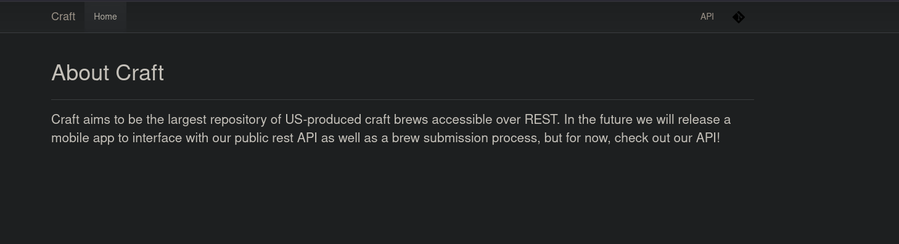

The `API` and `gitlab logo` buttons in the top right link to `api.craft.htb/api` and `gogs.craft.htb` respectively, so lets also add those pages to our /etc/hosts file.

The `api.craft.htb/api` page contains all the different operations that the api can perform:

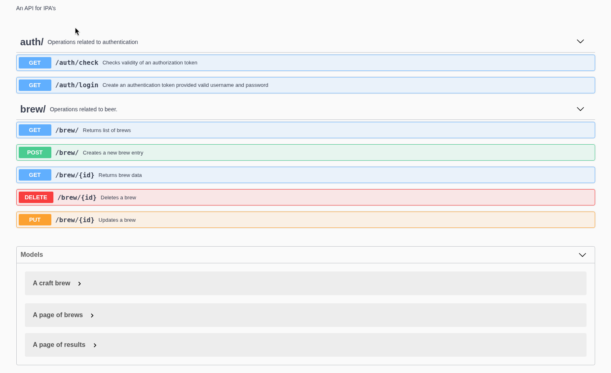

The `gogs.craft.htb` return a Gogs homepage whish is a self hosted gitlab instance written in Go:


Clicking the `Explore` tab at the top of the page we see that we can explore even as an unauthenticated user:

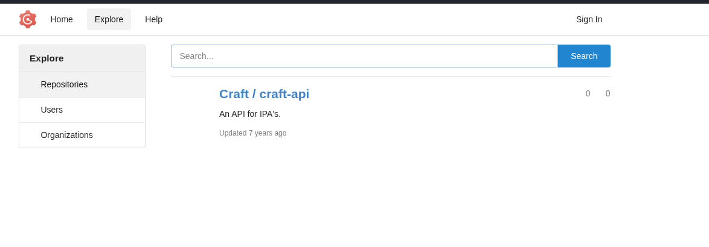

Clicking on the `Users` menu we see a list of users on the Gogs instance:

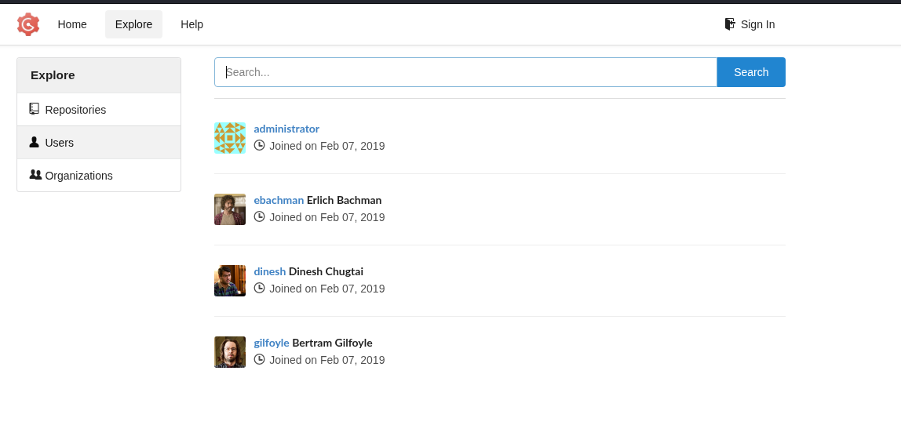

Let's add these users to our users.txt file.

Clicking in each user we see that each has a profile page with a `Public Activities` section:

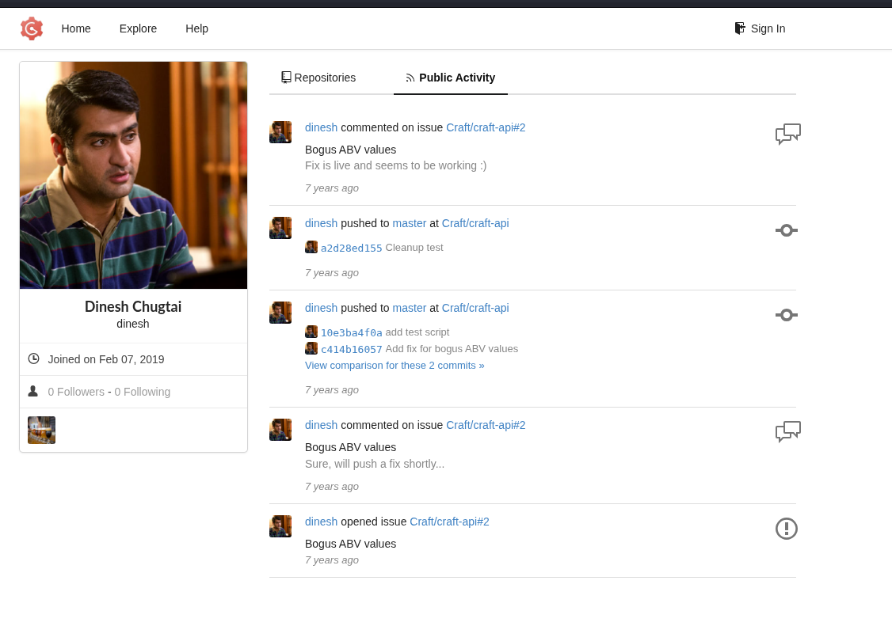

Moving to the craft-api repository we can see that there have been a total of 6 commits:

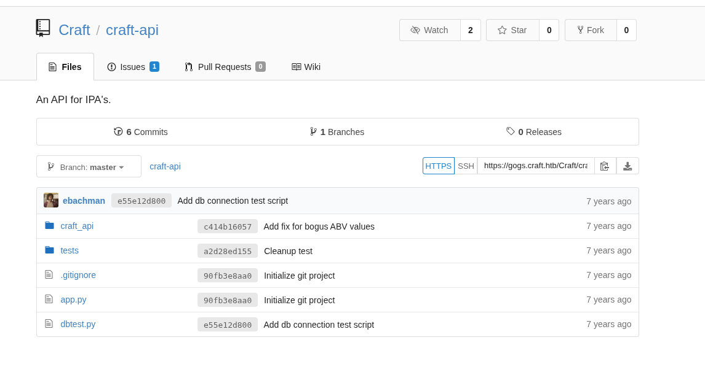

In the commit titled `add test script` we see that the `dinesh` user committed login credentials:

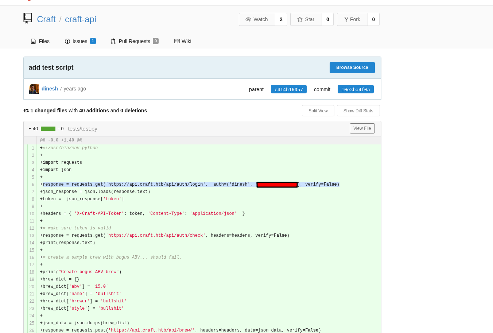

Lets add these to our credentials.txt file.

Going back to the `api.craft.htb` page we can see that the `/auth/login` method allows us to create an authentication token:

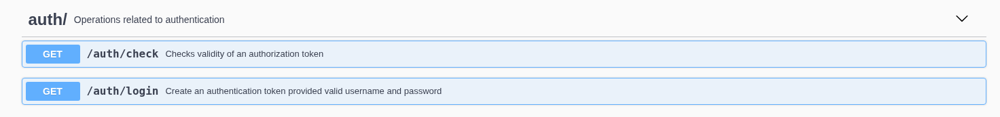

The page also lets us test out the methods so lets try out the /auth/login

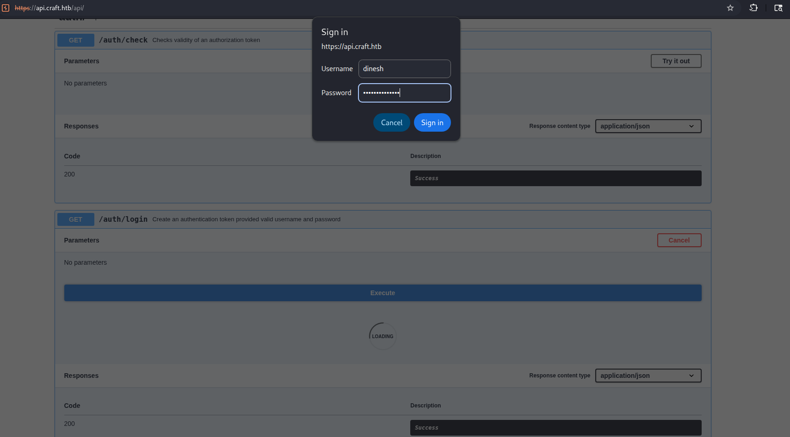

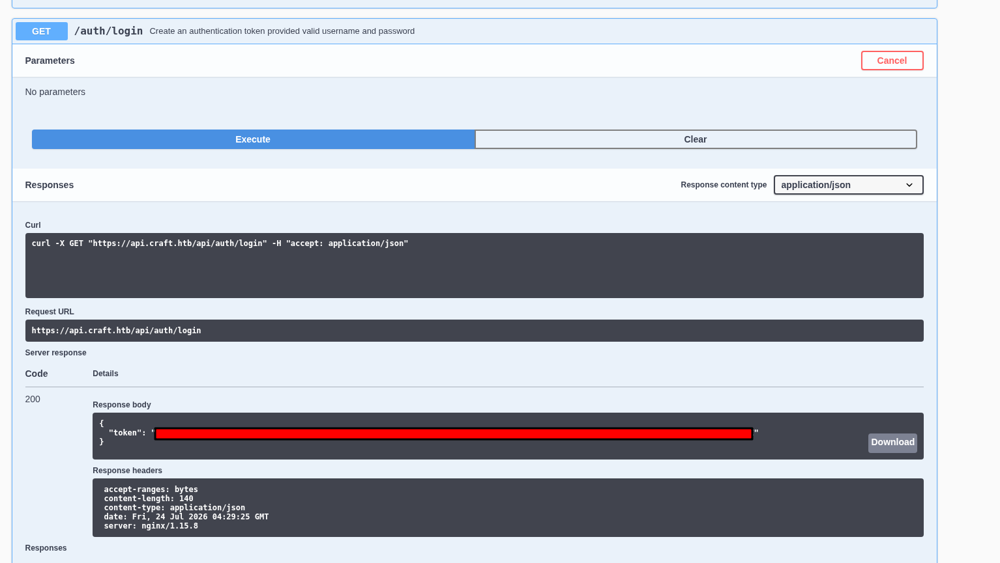

The test generates an api key like we expected!

The repository has a single open issue `Bogus ABV Values`:

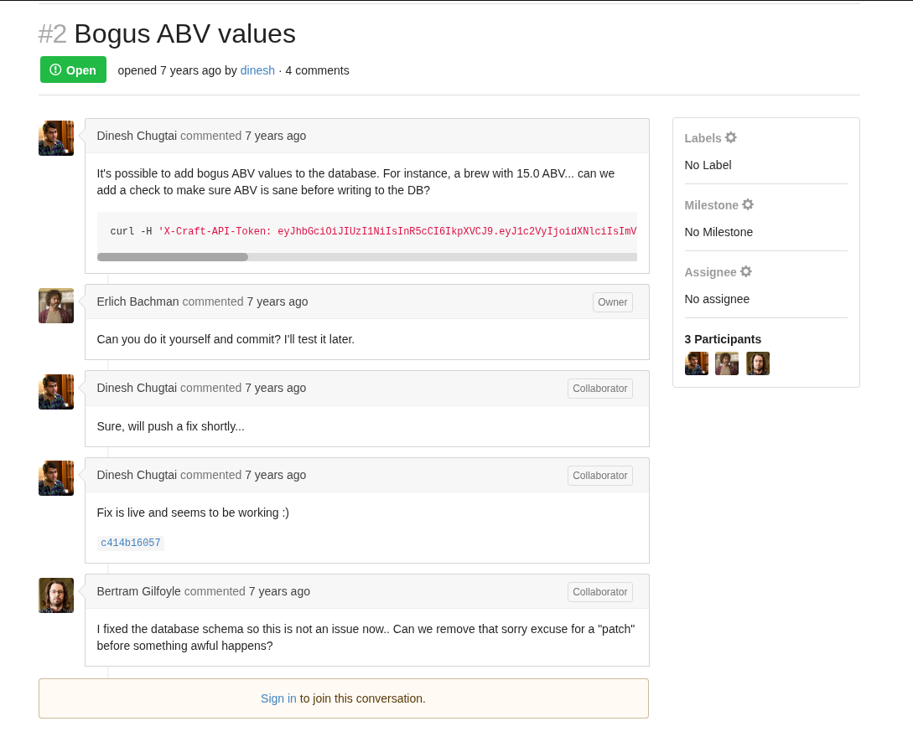

Dinesh states it is possible to add a bogus ABV value into the database and provides a curl request as an example, let's try that request but with our newly generated API Token:

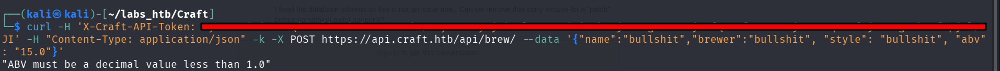

This returns `"ABV must be a decimal value less than 1.0"` which makes sense from what we can see in the `Add fix for bogus ABV values` commit:

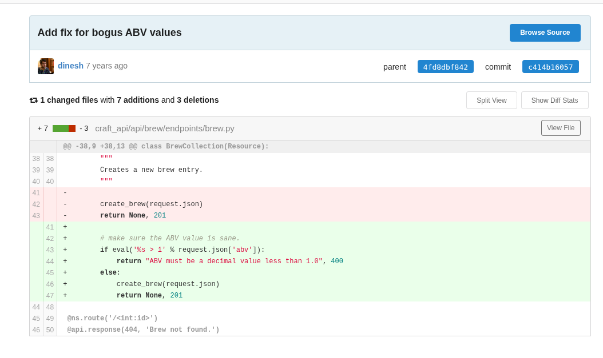

The last comment on the issue from the user `Bertram Gilfoyle` warns that the patch should be removed before something bad happens, but as we saw from the reply it is still active. 

Looking more closely at the patch code we can see why. The user input is passed directly into the python `eval()` function:

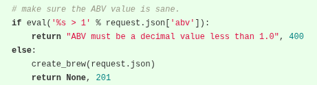

Let's try and exploit this for a reverse shell!

<h2>Exploitation</h2>

Now we can go through all the effort of creating our own script or we can just modify the `test.py` script where we found the credentials.

After downloading the script:

```
wget --no-check-certificate https://gogs.craft.htb/Craft/craft-api/raw/10e3ba4f0a09c778d7cec673f28d410b73455a86/tests/test.py
```

We cal alter the portion of the script that defines the ABV to contain code to execute a python reverse shell. Vickie Li has a great [blog](https://vickieli.dev/hacking/hack-python/) about this topic.

Lets first get our rev shell command from [Rev Shells](http://revshells.com):

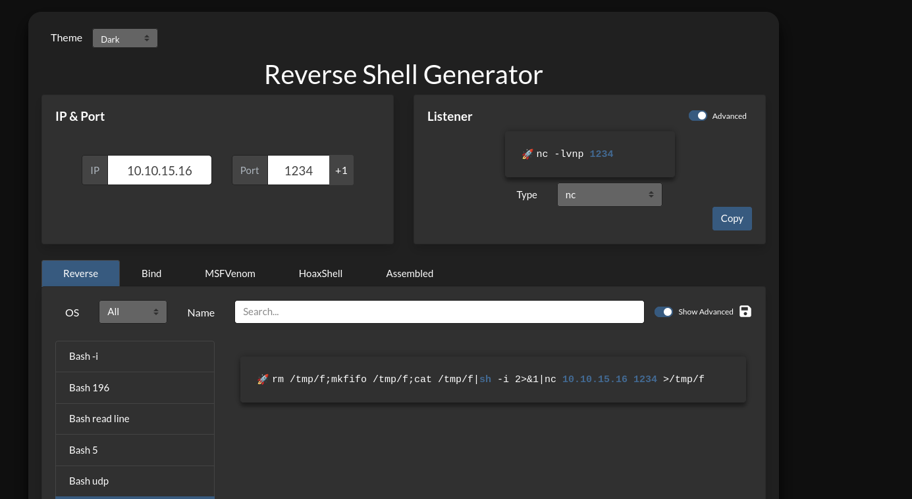

Our edited ABV value should look something like this:

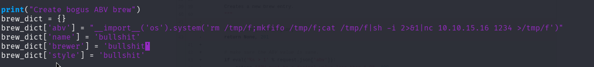

Before we run our test script we need to set up al `netcat` listener:

```
nc -lvnp 1234
```

Running our test script we get:

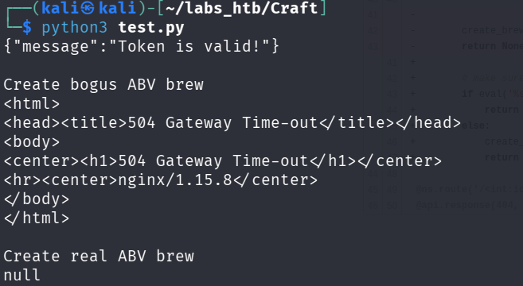

But when we check out listener we see we have a reverse shell!

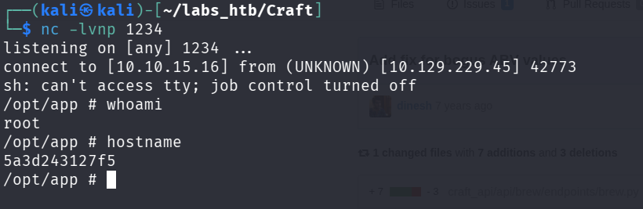

However it appears to be in a container as the name is a series of alphanumeric characters in the format associated with container id's.

Listing the contents of the `/` directory confirms this as there is a `.dockerenv` file indicating we are in a docker container.

Going back to the /opt/app folder we see it contains a file called `dbtest.py` which contains the following:

```
#!/usr/bin/env python

import pymysql
from craft_api import settings

# test connection to mysql database

connection = pymysql.connect(host=settings.MYSQL_DATABASE_HOST,
                             user=settings.MYSQL_DATABASE_USER,
                             password=settings.MYSQL_DATABASE_PASSWORD,
                             db=settings.MYSQL_DATABASE_DB,
                             cursorclass=pymysql.cursors.DictCursor)

try: 
    with connection.cursor() as cursor:
        sql = "SELECT `id`, `brewer`, `name`, `abv` FROM `brew` LIMIT 1"
        cursor.execute(sql)
        result = cursor.fetchone()
        print(result)

finally:
    connection.close()
```

Running the script returns a single entry from the `brew` database:

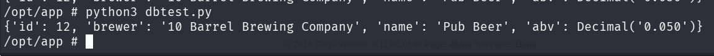

Similarly to the `test.py` script from before we can use this db script as a template for our own more malicious script. Lets copy and past this code into a file on our attack machine called tables.py where we will alter the sql statement:

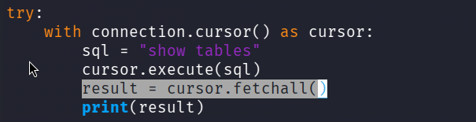

Additionally we need to alter the results line as it the base script only retrieves one using the `cursor.fetchone()` call which we change to   cursor.fetchall()`.

Then we need to transfer it to the target machine so let's start a python we server:

```
python -m http.server 8080
```
Then we can retrieve it from the target machine using `wget`:

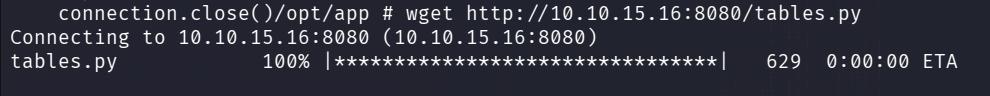

Now lets run it:

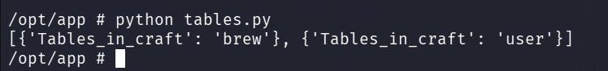

This shows there are two tables: `brew` and `user`, let's see what the user table contains by uploading another script but this time altering the sql statement to `SELECT * FROM user`:

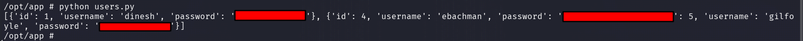

The table contains what looks to be the usernames and passwords for the Gogs instance so let's attempt to login using one of these credentials.

We find that the `Gilfoyle` credentials are valid:

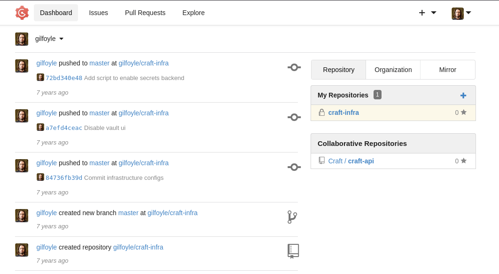

Now that we are logged in we can see that theres is an additional repository called `craft-infra`. Looking at the Commits we can see that there have been three commits, the first one `Commit infrastructure configs` contains a private ssh key:

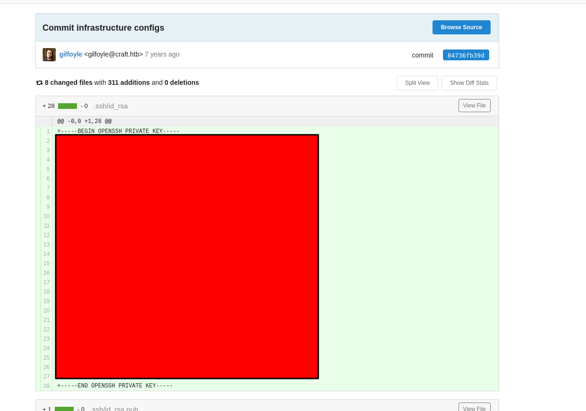


We can potentially use that to ssh into the target as the nmap scan shows there is an ssh server running.

To do this we need to copy this key to a file on our attack machine and then change the permissions on the file using `chmod 600`:

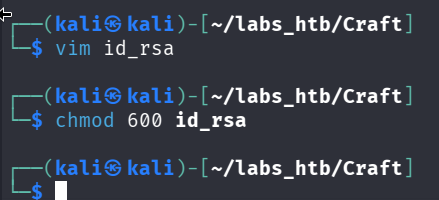

Attempting to use this key we find that it is password protected however the password we obtained from the database is valid:

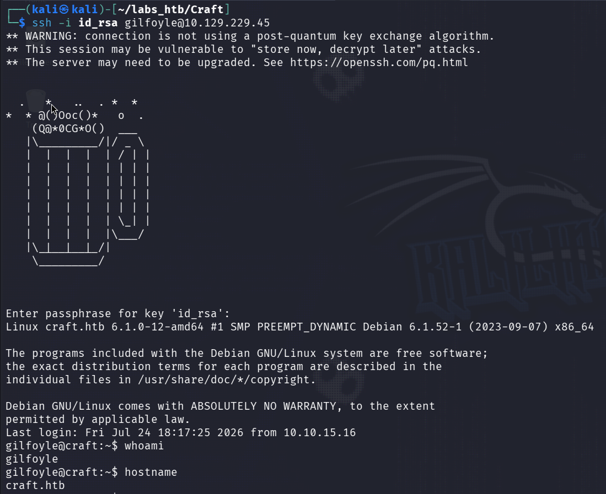

The user.txt flag can ve found in Gilfoyle's home dir.

<h2>Privilege Escalation</h3>

Going back to the commits we can see another one titled `Add script to enable secrets backend` :

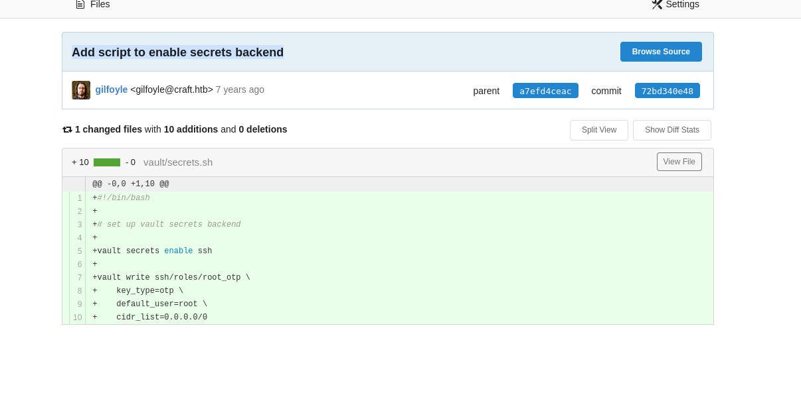

This appears to be referencing a `HashiCorp Vault`. The script itself appears to enable ssh logins.

Searching online for `vault secrets enable ssh` we find the documentation page from [Hashicorp](https://developer.hashicorp.com/vault/docs/secrets/ssh/one-time-ssh-passwords).

Additionally we see that the default user is set to root!

The Hashicorp documentation says that we can ssh using the following template:

```
vault ssh -role otp_key_role -mode otp username@x.x.x.x
```

So lets use that template but fill in the role `root_otp` and username `root` as specified in the Gogs commit:

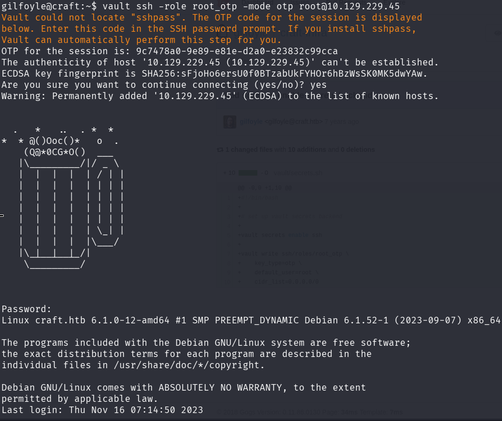

The password it asks for is the OTP it specifies when the login begins:

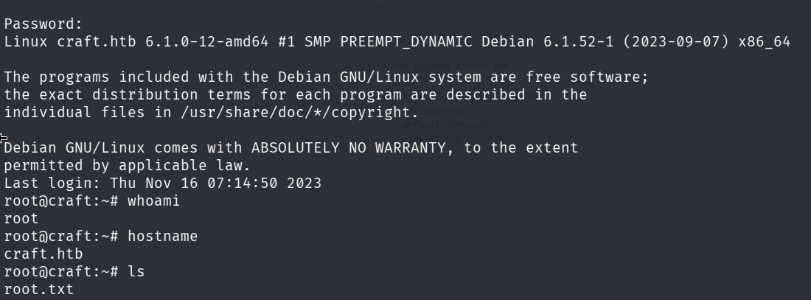

We have obtained root access and the root flag can be found in the immediate directory thus solving the challenge!

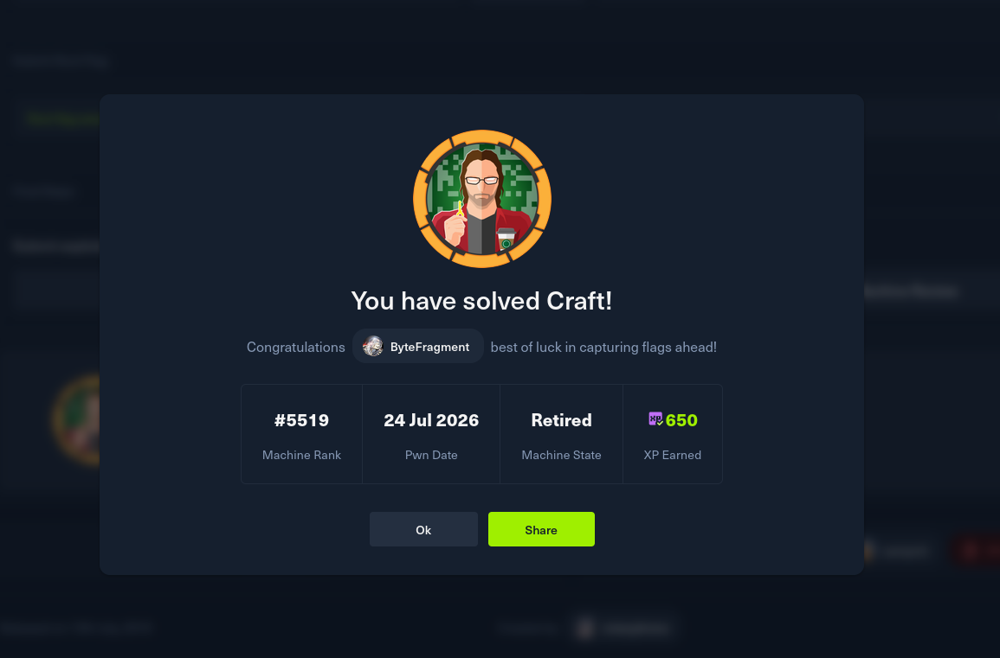