<h1>HTB: Cap</h1>


| Field      | Details                                                          |
|------------|------------------------------------------------------------------|
| Platform   | [Hack The Box](https://app.hackthebox.com/machines/Cap)          |
| Difficulty | Easy                                                             |
| OS         | Linux                                                            |
| Author     | ByteFragment                                                     |
| Date       | August 2nd 2026                                                  |

--- 

<h2>Enumeration</h2>

Before we do anything lets create three files:

1. <b>credentials.txt</b> where we will store valid username/passwd combinations
2. <b>users.txt</b> where we will store all usernames we come across
3. <b>pass.txt</b> where we will store all passwords we come across

Having separate files for usernames and passwords in addition to a valid credentials file helps us enumerate for things like password reuse if applicable.


<h3>NMAP</h3>

Let's start off by port scanning the target using nmap via the command:

```
sudo nmap -sC -sV -T4 -p- 10.129.46.255 -oN nmap
```

This gives us the open TCP ports running on the target machine as well as the services running on those ports. The `-oN nmap` flag and argument means that the output will also be written to a file titled `nmap` so we can reference it later if needed without running a whole new scan.

From the nmap results, we can see that the target machine is running an FTP server on port 21, SSH server on port 22 and an HTTP server on port 80 running `Gunicorn`.

```
PORT   STATE SERVICE VERSION
21/tcp open  ftp     vsftpd 3.0.3
22/tcp open  ssh     OpenSSH 8.2p1 Ubuntu 4ubuntu0.2 (Ubuntu Linux; protocol 2.0)
| ssh-hostkey: 
|   3072 fa:80:a9:b2:ca:3b:88:69:a4:28:9e:39:0d:27:d5:75 (RSA)
|   256 96:d8:f8:e3:e8:f7:71:36:c5:49:d5:9d:b6:a4:c9:0c (ECDSA)
|_  256 3f:d0:ff:91:eb:3b:f6:e1:9f:2e:8d:de:b3:de:b2:18 (ED25519)
80/tcp open  http    Gunicorn
|_http-title: Security Dashboard
|_http-server-header: gunicorn
Service Info: OSs: Unix, Linux; CPE: cpe:/o:linux:linux_kernel
```

<h3>Web Recon</h3>

After adding `craft.htb` to our /etc/hosts file we can visit the url using Firefox:

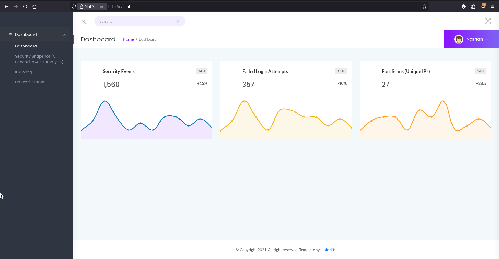

Here we are greeted with a `Security Dashboard` where we are logged in as the user `Nathan`.

The menu on the left side has three options besides the dashboard:

1. Security Snapshot (5 Second PCAP + Analysis)
2. IP Config
3. Network status

The `Security Snapshot` page allows you to download a .pcap file and lists metrics like the number of packets etc :

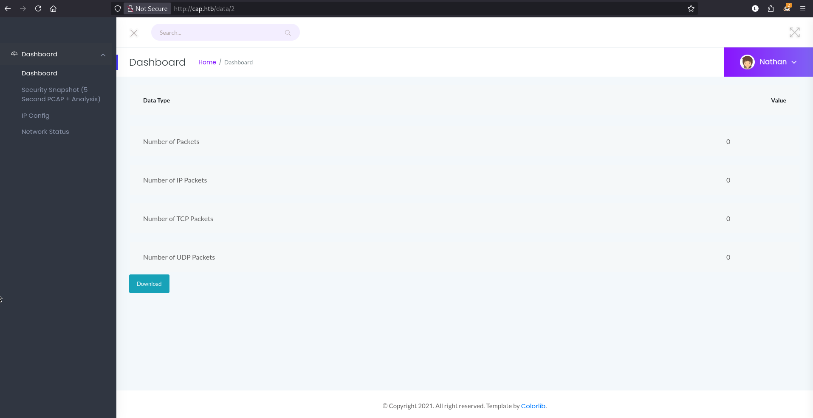

The `IP Config` page returns the results of the `ifconfig` command:

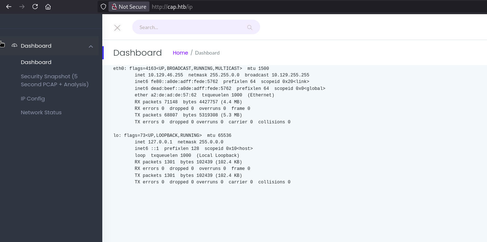

The `Network Status Page` page returns the results of the `netstat` command:

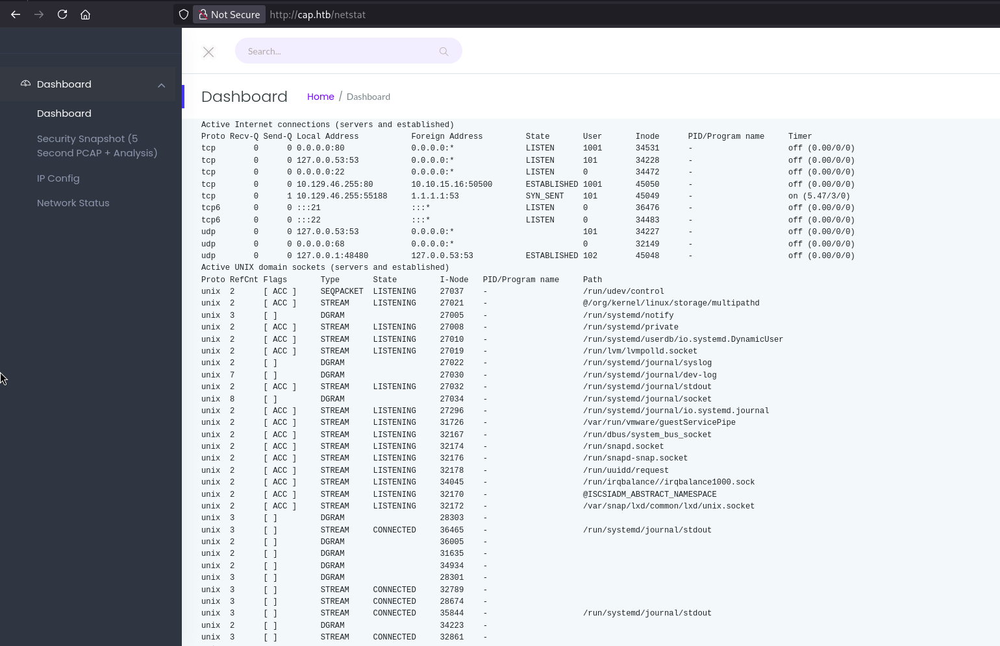

In the URL of the `Security Snapshots` page we notice that it takes the form of `cap.htb/data/<Number>`, additionally clicking on the Security Snapshots link in the menu gives us a different number each time:

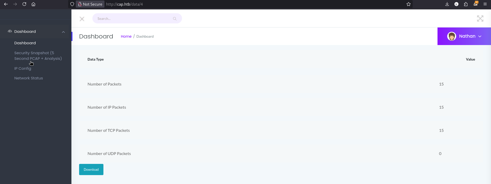

The pcap files associated with the numbers 1-6 do not seem to have any useful information as they just show our connection to the webpage:

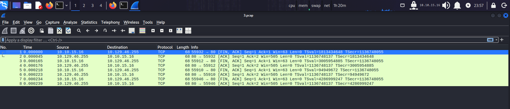

We are able to alter the number in the URL and have the results successfully returned back to us indicating that this webpage may be vulnerable to [Insecure direct object references (IDOR)](https://portswigger.net/web-security/access-control/idor).

After trying different numbers by directly altering the URL we find that the id number `0` returns a .pcap file with a significantly larger number of packets than we saw in the others:

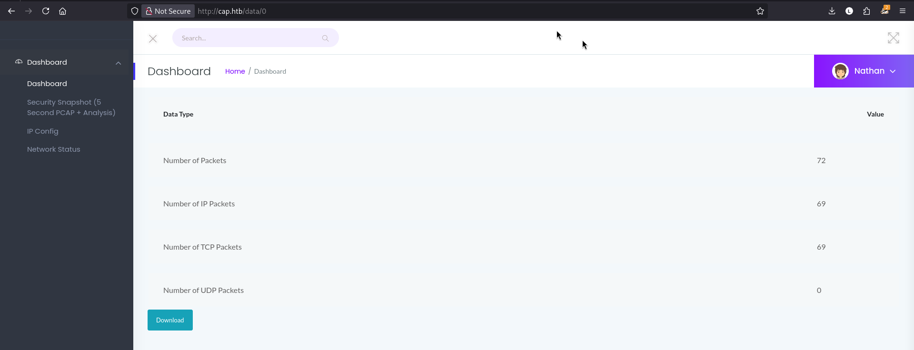

So let's download the pcap file and open it using `Wireshark`.

<h3>WireShark</h3>

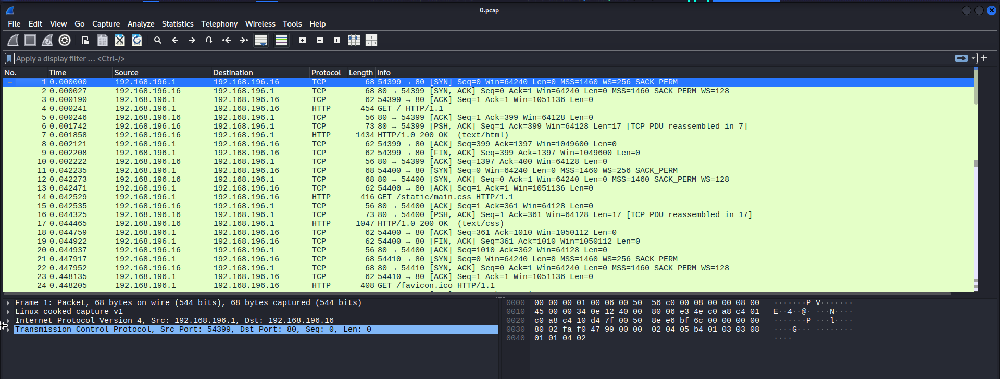

Looking at the IP addresses we do not see ours so it is not just showing our connection to the webserver indicating that this is not our .pcap file. 

Scrolling down a bit we see there is FTP traffic which makes sense given our nmap scan showed a FTP server running on the target machine. Instead of searching through each packet individually trying to find something of note we can simply right-click on one of the ftp packets and select `follow -> TCP Stream`:

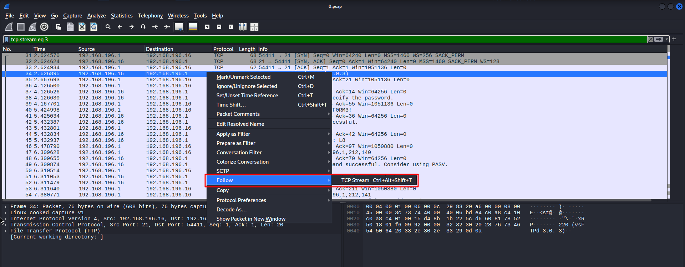

Viewing the TCP stream we see the transcript of a FTP session by the `nathan` user that includes their credentials:

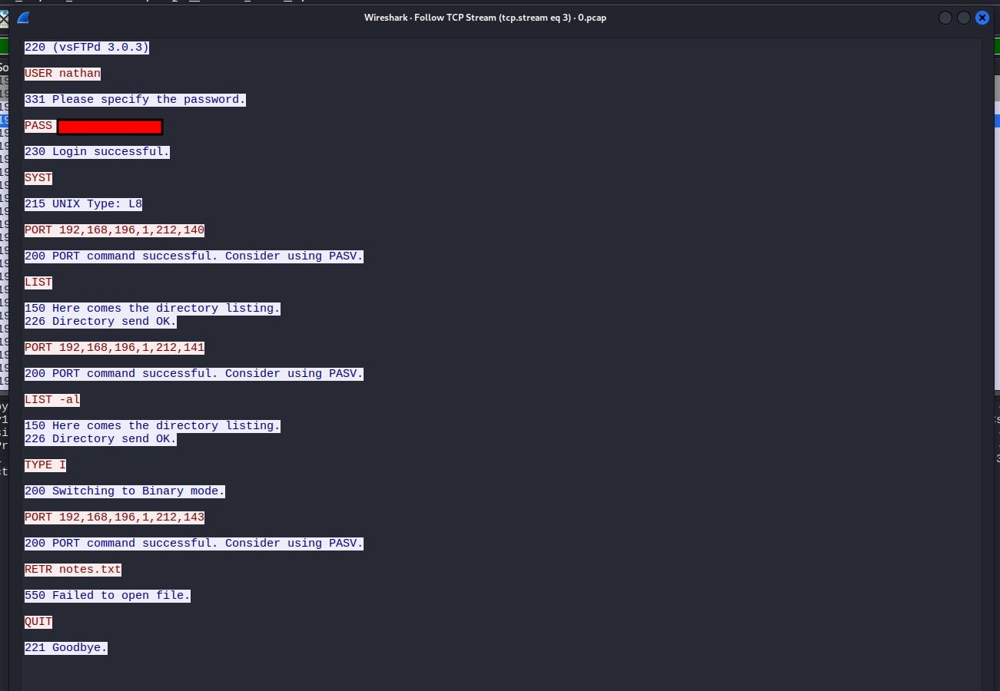

Let's add these credentials to our creds file.

<h3>FTP</h3>

We can now attempt to authenticate to the FTP server using these newfound credentials:

```
ftp cap.htb
Connected to cap.htb.
220 (vsFTPd 3.0.3)
Name (cap.htb:kali): nathan
331 Please specify the password.
Password: 
230 Login successful.
Remote system type is UNIX.
Using binary mode to transfer files.
ftp> ls
229 Entering Extended Passive Mode (|||65098|)
150 Here comes the directory listing.
-r--------    1 1001     1001           33 Aug 02 05:41 user.txt
226 Directory send OK.
```

Success! Here we find the user.txt flag.


<h3>Credential Spraying</h3>

The only other service running on the target that we have not looked at is the SSH server so let's try and use these nathan credentials to ssh into the machine:

```
ssh nathan@cap.htb
** WARNING: connection is not using a post-quantum key exchange algorithm.
** This session may be vulnerable to "store now, decrypt later" attacks.
** The server may need to be upgraded. See https://openssh.com/pq.html
nathan@cap.htb's password: 
Welcome to Ubuntu 20.04.2 LTS (GNU/Linux 5.4.0-80-generic x86_64)

 * Documentation:  https://help.ubuntu.com
 * Management:     https://landscape.canonical.com
 * Support:        https://ubuntu.com/advantage

  System information as of Sun Aug  2 07:20:24 UTC 2026

  System load:           0.0
  Usage of /:            36.7% of 8.73GB
  Memory usage:          22%
  Swap usage:            0%
  Processes:             227
  Users logged in:       0
  IPv4 address for eth0: 10.129.46.255
  IPv6 address for eth0: dead:beef::a0de:adff:fede:5762

```

The credentials also work for the SSH server.

<h2>Privilege Escalation</h2>

<h3>linPEAS</h3>

We can transfer the linPEAS.sh enumeration script onto the target machine using `scp` and give it exec permissions using `chmod`:

```
scp linpeas.sh nathan@cap.htb:/home/nathan

chmod +x linpeas.sh
```

Running the script reveals that the target has the `SUID` bit set for `/usr/bin/pkexec` and is potentially vulnerable to `CVE-2021-4034 (PwnKit)`.

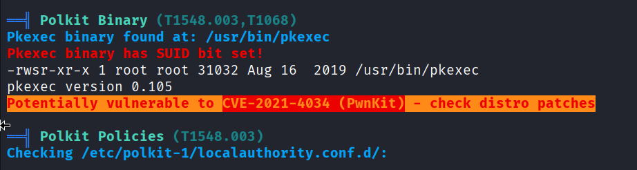

We can obtain the Pwnkit exploit from this [github repo](https://github.com/ly4k/PwnKit) from user `ly4k` and transfer it to the target machine using the same scp method as before:

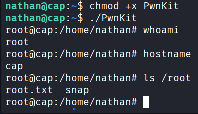

Running the exploit gives us a root shell and access to the root.txt flag in the /root directory, thus solving the challenge!

